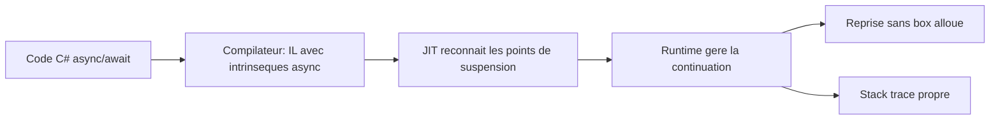
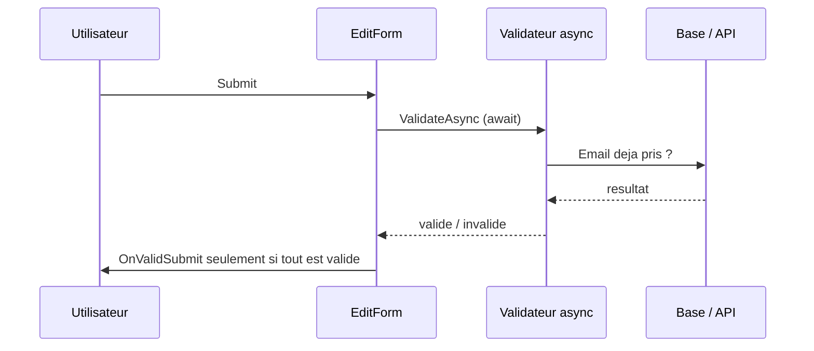

# CSharp — Détail du mardi 14 juillet 2026

## 1. Runtime Async (.NET 11) — la machine à états `async` descend dans le CLR

**Source :** Microsoft Learn — https://learn.microsoft.com/en-us/dotnet/core/whats-new/dotnet-11/overview
**Date :** .NET 11 Preview 6 — juillet 2026

### Contexte

Depuis C# 5, `async`/`await` est une pure invention du **compilateur**. Chaque méthode `async` est réécrite en une machine à états (`IAsyncStateMachine`) : une `struct`/classe générée qui capture les variables locales, un `MoveNext()`, un `AsyncTaskMethodBuilder`. Ça marche, mais ça a un coût : allocations sur le tas quand la machine est boxée, indirection à chaque `await`, et surtout des **stack traces illisibles** où tu vois `MoveNext` au lieu de ta vraie pile d'appels.

Runtime Async change la stratégie : la logique de suspension/reprise **descend dans le runtime** (le CLR). En .NET 11, la fonctionnalité ne demande plus `<EnablePreviewFeatures>` pour un projet qui cible `net11.0` — elle devient un chemin d'exécution standard.

### Comment ça marche

Le principe pas à pas :

1. Le compilateur C# n'émet plus une machine à états complète. Il émet des appels à des **intrinsèques async** du runtime (des points de suspension explicites dans l'IL).
2. Au JIT, le runtime reconnaît ces points et génère lui-même le code de **continuation** : sauvegarde de l'état, retour au thread, reprise quand la `Task` se complète.
3. Le runtime gère l'ordonnancement des continuations directement, sans passer par un `AsyncStateMachineBox` alloué. Résultat : moins d'allocations, et une **pile d'appels reconstruite** proprement.

Jusqu'ici, chaque `await` non terminé synchroniquement forçait le boxing de la machine à états sur le tas, plus une allocation de délégué pour la continuation. Sur un contrôleur qui enchaîne cinq `await`, ça fait autant d'objets courts-lived qui nourrissent le GC de génération 0. Avec Runtime Async, le CLR connaît la sémantique de suspension et peut mutualiser ces structures, voire les garder sur la pile quand le chemin reste synchrone. C'est aussi ce qui rend la stack trace fidèle : le runtime sait relier une continuation à son appelant d'origine.



Ton code C# ne change pas. Ce qui change, c'est ce que le compilateur produit dessous. La bascule est **transparente** au niveau source : tu gardes tes `async Task<T>`, tes `await`, tes `ConfigureAwait`. Seule la représentation IL et la gestion runtime diffèrent.

### En pratique — exemple de code

Le code applicatif est identique ; seule la cible du projet bascule le comportement.

```xml
<!-- Avant — .NET 10 : machine à états générée par le compilateur -->
<!-- Après — .NET 11 : Runtime Async actif, plus besoin d'EnablePreviewFeatures -->
<PropertyGroup>
  <TargetFramework>net11.0</TargetFramework>
</PropertyGroup>
```

```csharp
// Ce handler ASP.NET Core ne génère plus de IAsyncStateMachine boxée.
// Le runtime porte la continuation → moins de GC, trace d'appel lisible.
app.MapGet("/orders/{id}", async (int id, AppDb db) =>
{
    var order = await db.Orders.FindAsync(id);   // point de suspension géré par le CLR
    if (order is null) return Results.NotFound();
    await db.Entry(order).Collection(o => o.Lines).LoadAsync();
    return Results.Ok(order);
});
```

### Pourquoi ça compte pour toi

Tes API .NET sont massivement `async`. Runtime Async te donne des **stack traces exploitables** quand un `await` explose en prod, et réduit la pression GC sur les chemins chauds (contrôleurs, handlers EF Core). Tu ne réécris rien : tu recompiles en `net11.0`. Surveille quand même les libs qui inspectent la machine à états par réflexion — elles peuvent voir une forme différente.

### Pour aller plus loin | Pièges

Le gain se mesure surtout sous charge : profile avec `dotnet-counters` sur les compteurs GC gen-0 avant/après bascule, pas sur un micro-bench mono-appel. Les profileurs et outils d'APM (Application Insights, OpenTelemetry) qui s'accrochent aux hooks de la machine à états doivent être à jour pour rester compatibles. Enfin, `EnablePreviewFeatures` n'est plus requis pour `net11.0`, mais reste nécessaire si tu combines Runtime Async avec d'autres `preview features` explicites — vérifie tes warnings de build.

---

## 2. Blazor (.NET 11) — validation asynchrone de bout en bout dans `EditForm`

**Source :** C# Corner — https://www.c-sharpcorner.com/article/net-11-preview-6-new-features-every-c-sharp-developer-should-know/
**Date :** .NET 11 Preview 6 — juillet 2026

### Contexte

La validation Blazor était historiquement **synchrone**. `EditForm` déclenchait `OnValidSubmit` après avoir évalué des `ValidationAttribute` qui retournent immédiatement. Dès que tu voulais une règle **asynchrone** — vérifier l'unicité d'un email en base, appeler une API d'éligibilité — tu bricolais : validation manuelle avant submit, `EditContext.Validate()` qui n'attendait pas ta tâche, `race conditions` où le formulaire se soumettait avant la fin du contrôle.

.NET 11 Preview 6 corrige la racine : Blazor supporte des **règles de validation asynchrones**, et la soumission de `EditForm` **attend** ces validateurs de bout en bout avant d'appeler `OnValidSubmit`.

### Comment ça marche

Le flux de soumission attend désormais chaque validateur asynchrone :



Concrètement : `EditForm` collecte les messages d'un `ValidationMessageStore`, mais n'invoque plus `OnValidSubmit` tant que les tâches de validation ne sont pas résolues. Fini le submit qui part trop tôt.

Le point d'accroche reste l'événement `OnValidationRequested` de l'`EditContext`, déclenché à la soumission et à chaque changement de champ. La nouveauté, c'est que Blazor **attend** désormais un handler asynchrone branché sur cet événement avant de décider si le formulaire est valide. Tu peux donc y lancer un appel réseau (`await`) sans que le pipeline ne considère le champ comme valide par défaut le temps que la tâche tourne. Côté rendu, `NotifyValidationStateChanged()` rafraîchit l'UI pour afficher les messages une fois la vérification revenue.

### En pratique — exemple de code

Un validateur asynchrone qui interroge un service, branché sur l'`EditContext`.

```csharp
// Vérifie l'unicité de l'email côté serveur, sans bloquer le thread UI.
public sealed class AsyncEmailValidator : ComponentBase, IDisposable
{
    [CascadingParameter] EditContext Ctx { get; set; } = default!;
    [Inject] IUserService Users { get; set; } = default!;
    ValidationMessageStore _store = default!;

    protected override void OnInitialized()
    {
        _store = new(Ctx);
        Ctx.OnValidationRequested += async (_, _) =>   // désormais awaité par EditForm
        {
            _store.Clear();
            var email = ((RegisterModel)Ctx.Model).Email;
            if (await Users.EmailExistsAsync(email))    // appel réseau/DB attendu
                _store.Add(Ctx.Field(nameof(RegisterModel.Email)), "Email déjà utilisé");
            Ctx.NotifyValidationStateChanged();
        };
    }
    public void Dispose() { }
}
```

### Pourquoi ça compte pour toi

Tes back-offices Blazor Server ont besoin de règles qui touchent la base : unicité, quotas, éligibilité métier. Tu peux enfin les exprimer proprement, sans hack de pré-submit ni double-clic qui passe entre les mailles. Attention : une validation async ajoute une latence perçue — mets un état de chargement sur le bouton et `debounce` les validations `on-change` pour ne pas marteler ta base.

### Pour aller plus loin | Pièges | Limites

Ne fais jamais confiance à la seule validation client : une règle async côté Blazor améliore l'UX, mais la vérification d'unicité doit **aussi** exister au niveau base (contrainte `UNIQUE`) pour couvrir la fenêtre de course entre le contrôle et l'`INSERT`. Sur Blazor Server, chaque validation async est un aller-retour SignalR : groupe tes contrôles et évite de valider un champ à chaque frappe. Enfin, gère l'échec réseau du validateur (timeout, exception) explicitement, sinon un formulaire peut rester bloqué en état « en validation ».
