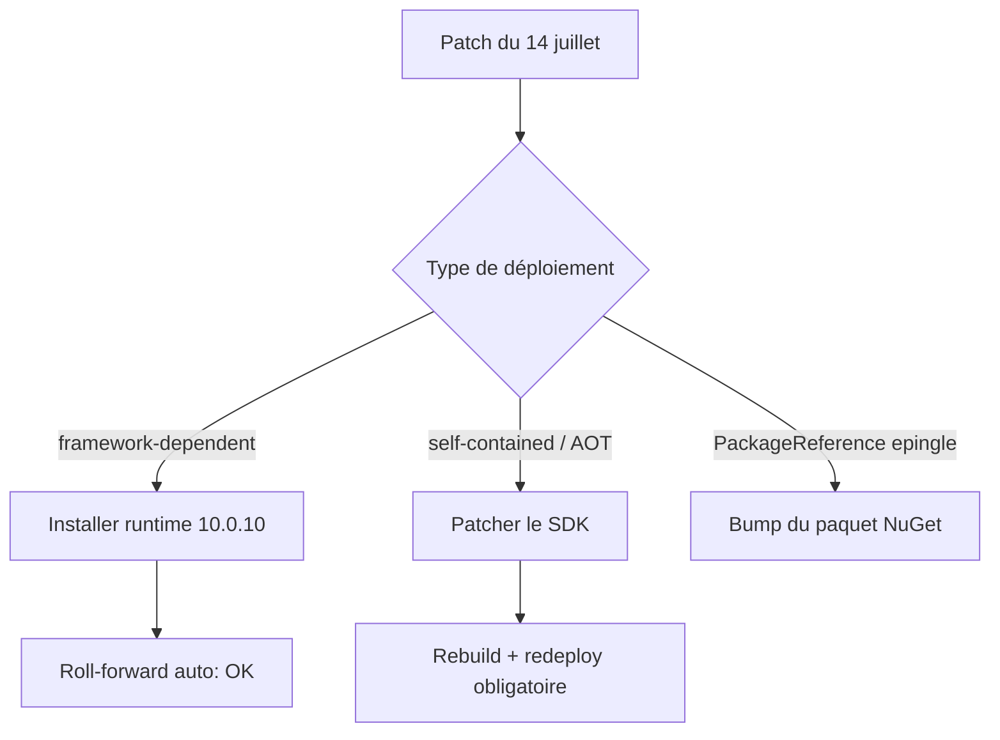
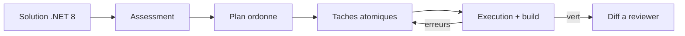

# CSharp — Détail du mercredi 15 juillet 2026

## 1. .NET 10.0.10 / 9.0.18 / 8.0.29 — 17 CVE corrigées, zéro détail publié

**Source :** .NET Blog (Microsoft) — https://devblogs.microsoft.com/dotnet/dotnet-and-dotnet-framework-july-2026-servicing-updates/
**Date :** 14 juillet 2026

### Contexte

Microsoft publie chaque mois un train de servicing pour les versions supportées de .NET. Celui du 14 juillet 2026 est inhabituellement lourd : dix-sept CVE listées, toutes marquées « applies to .NET 10.0, .NET 9.0, .NET 8.0 ». Les numéros s'étalent de CVE-2026-47300 à CVE-2026-57108, ce qui trahit plusieurs vagues de reporting agrégées dans une seule sortie.

Le point notable n'est pas le volume, c'est l'opacité. Les advisories MSRC portent toutes le même titre générique, « .NET Security Vulnerability », sans catégorie, sans vecteur, sans score CVSS renseigné publiquement au moment de la publication. Tu ne peux pas savoir si CVE-2026-50649 touche le parseur JSON, le pipeline Kestrel ou la couche crypto. Microsoft applique ici sa politique d'embargo : les détails arrivent parfois des semaines plus tard, une fois le patch largement déployé.

Conséquence pratique : l'arbitrage habituel « est-ce que je suis exposé ? » devient impossible. Tu ne peux pas raisonner par surface d'attaque puisque la surface n'est pas décrite. La seule stratégie rationnelle est de traiter le lot comme critique par défaut et de patcher.

### Comment ça marche

Il faut comprendre comment .NET résout les versions à l'exécution, sinon tu patcheras le SDK en croyant avoir patché tes applis. Deux modèles cohabitent.

Le premier est le **framework-dependent deployment**. Ton appli déclare `<TargetFramework>net10.0</TargetFramework>` et ne transporte pas le runtime. À l'exécution, le host (`dotnet`) lit le `runtimeconfig.json`, y trouve un `framework` avec une version minimale, puis applique le **roll-forward** : par défaut il prend la plus haute version de patch installée dans la même bande de feature. Une appli compilée contre 10.0.0 tournera donc sur 10.0.10 dès que tu installes le runtime. Un seul patch machine couvre toutes les applis.

Le second est le **self-contained deployment**, incluant les publications AOT et les conteneurs `runtime-deps`. Là, le runtime est copié dans le dossier de sortie. Aucun patch machine ne l'atteint. La seule façon de corriger est de **recompiler et redéployer** avec un SDK à jour. C'est le piège classique : ton serveur affiche `dotnet --list-runtimes` en 10.0.10, et tes trois microservices AOT tournent toujours sur du 10.0.4 vulnérable.

Troisième chemin souvent oublié : les **paquets NuGet**. Certaines corrections .NET vivent dans des paquets comme `System.Text.Json` ou `System.Net.Http` référencés transitivement. Si ton projet les épingle explicitement, le roll-forward runtime ne s'applique pas — c'est la résolution NuGet qui gagne.



### En pratique — exemple de code

Le réflexe utile est d'auditer ton parc avant de conclure que tu es couvert. Ces commandes distinguent les trois cas ci-dessus.

```bash
# 1. Ce que la machine a réellement d'installé (couvre le framework-dependent)
dotnet --list-runtimes | grep Microsoft.NETCore.App
# Attendu : Microsoft.NETCore.App 10.0.10 / 9.0.18 / 8.0.29

# 2. Détecter les self-contained : ils embarquent leur propre hostpolicy
find /opt/apps -name 'hostpolicy.dll' -o -name 'libhostpolicy.so' 2>/dev/null
# Chaque hit = une appli que le patch machine NE corrige PAS

# 3. Version runtime embarquée dans un self-contained
grep -o '"version": "[0-9.]*"' /opt/apps/monsvc/monsvc.runtimeconfig.json

# 4. Paquets vulnérables épinglés dans la solution (transitifs inclus)
dotnet list package --vulnerable --include-transitive
```

Et pour forcer explicitement le roll-forward si tu veux verrouiller le comportement plutôt que le subir :

```json
// runtimeconfig.template.json — latestPatch : toujours le dernier patch installé
{
  "configProperties": {
    "System.GC.Server": true
  },
  "rollForward": "latestPatch"
}
```

### Pourquoi ça compte pour toi

Si tu publies en self-contained ou en AOT — fréquent sur tes conteneurs — le patch machine ne te protège pas. Tu dois rebuilder. Lance `dotnet list package --vulnerable --include-transitive` sur toutes tes solutions aujourd'hui, pas la semaine prochaine : sans détail MSRC, tu n'as aucun moyen d'estimer ton exposition réelle. Et .NET 8 et 9 sortent de support le 10 novembre 2026 : ces trains de servicing sont comptés.

### Points de vigilance

Le changelog runtime lié par le billet pointe vers un filtre par milestone GitHub, peu fiable — l'équipe runtime n'assigne pas systématiquement les milestones. Un commentateur du billet suggère à raison de comparer directement les tags : `https://github.com/dotnet/runtime/compare/v10.0.9...v10.0.10`. Côté .NET Framework, KB5100998 corrige en prime un bug non-sécurité où un `HttpWebRequest` synchrone pouvait se bloquer indéfiniment sur certaines configurations serveur TLS.

---

## 2. Upgrade canvas — l'agent de modernisation .NET entre dans l'app GitHub Copilot

**Source :** .NET Blog (Microsoft) — https://devblogs.microsoft.com/dotnet/modernize-dotnet-in-github-copilot-app/
**Date :** 9 juillet 2026

### Contexte

Microsoft pousse depuis Build 2026 l'idée que la migration de legacy .NET est un travail d'agent, pas de développeur. Les briques existaient déjà — l'agent `Modernize` dans Visual Studio, l'extension VS Code, le plugin CLI — mais l'expérience restait éclatée : une conversation dans le chat, des artefacts Markdown générés à côté, des diffs dans un troisième endroit. Impossible de savoir où en était l'agent sans reconstituer mentalement le fil.

L'upgrade canvas répond à ce problème d'observabilité. C'est une vue dédiée dans l'app GitHub Copilot qui matérialise le workflow de modernisation comme un objet de première classe : l'évaluation, le plan, les tâches, l'exécution et les échecs de build vivent dans une surface unique qui se met à jour en direct.

Le périmètre couvre deux scénarios : monter de version .NET (net8.0 → net10.0 par exemple) et migrer une application vers Azure. Le rappel de fin de support de .NET 8 et 9 au 10 novembre 2026 n'est évidemment pas étranger au timing.

### Comment ça marche

L'agent suit un pipeline en quatre temps, et le canvas est simplement la projection de l'état de ce pipeline.

**Assessment.** L'agent scanne la solution : TFM cibles, `PackageReference`, APIs supprimées entre versions, patterns spécifiques d'hébergement. Il produit un inventaire des points de friction plutôt qu'une liste de fichiers.

**Plan.** À partir de l'inventaire, il génère un plan structuré et ordonné — quels projets migrer en premier, quelles dépendances remplacer, dans quel ordre pour que la solution reste compilable à chaque étape. C'est la partie qui a le plus de valeur : l'ordre de migration d'une solution multi-projets est exactement ce qui prend du temps à un humain.

**Tâches.** Le plan est décomposé en tâches d'implémentation atomiques et traçables.

**Exécution.** L'agent applique les changements, lance le build, lit les erreurs et itère. Le canvas reflète en direct chaque transition, y compris les échecs de build — qui sont des données d'entrée pour l'agent, pas des exceptions.



Le point d'architecture à retenir : la boucle build-erreur-correction est interne à l'agent. Tu n'interviens qu'aux frontières — valider le plan, reviewer le diff final.

### En pratique — exemple de code

Trois surfaces, même agent. La CLI est la plus intéressante parce qu'elle est scriptable et donc intégrable en CI.

```bash
# Installer le plugin d'upgrade pour la CLI Copilot
copilot extension install upgrade

# Assessment seul : inventaire des frictions, sans toucher au code
copilot upgrade assess --target net10.0 ./MaSolution.sln

# Plan + exécution, en s'arrêtant pour validation avant d'écrire
copilot upgrade run --target net10.0 --interactive ./MaSolution.sln
```

Le changement concret est côté projet. Avant, la montée de version se faisait à la main, TFM par TFM :

```xml
<!-- Avant — .csproj figé sur net8.0, paquets épinglés à la main -->
<PropertyGroup>
  <TargetFramework>net8.0</TargetFramework>
</PropertyGroup>
<ItemGroup>
  <PackageReference Include="Microsoft.EntityFrameworkCore" Version="8.0.11" />
</ItemGroup>
```

```xml
<!-- Après — l'agent aligne TFM et paquets, et corrige les APIs cassées -->
<PropertyGroup>
  <TargetFramework>net10.0</TargetFramework>
</PropertyGroup>
<ItemGroup>
  <PackageReference Include="Microsoft.EntityFrameworkCore" Version="10.0.10" />
</ItemGroup>
```

### Pourquoi ça compte pour toi

Tu as jusqu'au 10 novembre 2026 pour sortir tes applis de .NET 8 et 9. Sur une solution à trente projets, l'ordre de migration est le vrai coût, et c'est précisément ce que l'agent calcule. Commence par un `copilot upgrade assess` : l'assessment ne touche pas à ton code et te donne l'inventaire des frictions en quelques minutes. Le plan reste à reviewer — c'est un accélérateur, pas une délégation.

### Limites

Le canvas est une surface de visualisation, pas une garantie de correction. L'agent boucle sur les erreurs de build, ce qui ne dit rien de la justesse fonctionnelle : un code qui compile après migration peut avoir changé de comportement. Tes tests restent le seul filet. Sur des solutions avec beaucoup de réflexion, de génération de code ou d'APIs internes non documentées, l'assessment sous-estimera le travail.
