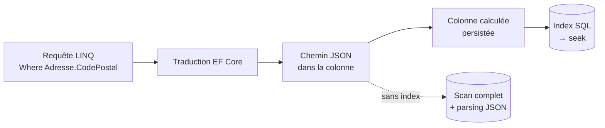
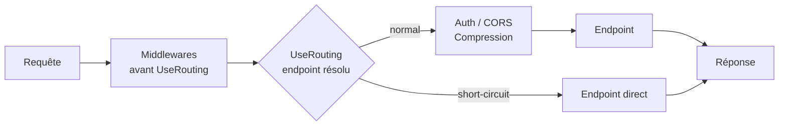

# CSharp — Détail du jeudi 16 juillet 2026

## 1. C# 15 — les indexeurs d'extension complètent les membres d'extension

**Source :** dotnet/core — https://github.com/dotnet/core/blob/main/release-notes/11.0/preview/preview6/csharp.md
**Date :** 14 juillet 2026

### Contexte

Les méthodes d'extension existent depuis C# 3.0 et LINQ. Pendant dix-sept ans, elles sont restées le seul moyen d'ajouter un comportement à un type que tu ne possèdes pas. Tu pouvais écrire `list.MonHelper()`, jamais `list.MaPropriete` ni `list["clé", défaut]`. La syntaxe `static` sur le premier paramètre `this` bloquait tout le reste.

C# 14, livré avec .NET 10, a cassé ce plafond en introduisant les **blocs `extension`** : un nouveau conteneur qui déclare un récepteur une seule fois, puis autorise plusieurs membres à l'intérieur. Méthodes et propriétés d'extension sont arrivées d'un coup. Il manquait une case : les indexeurs. Preview 6 de .NET 11 la coche. La feature complète le tableau et rend l'ensemble cohérent — un bloc `extension` peut désormais porter tout ce qu'un type porte, sauf les champs et les constructeurs.

### Comment ça marche

Le mécanisme se déroule en trois temps, et il est important de comprendre le troisième si tu ne veux pas te faire surprendre.

**Premier temps — la déclaration.** Tu écris un bloc `extension(TypeCible receveur)` dans une classe `static`. Le paramètre du bloc est le récepteur : c'est l'instance sur laquelle ton membre s'appliquera. À l'intérieur, tu déclares `public TValue this[TKey clé] => ...` exactement comme dans un indexeur d'instance normal. Le compilateur, lui, réécrit tout cela en méthodes statiques classiques sous le capot. Aucune magie runtime, aucun coût : c'est du sucre syntaxique résolu à la compilation.

**Deuxième temps — la généricité.** Le bloc `extension` peut être générique. Tu écris `extension<TKey, TValue>(IDictionary<TKey, TValue> dict)` et les paramètres de type sont visibles par tous les membres du bloc. C'est ce qui rend la feature utilisable sur les interfaces de collection de la BCL.

**Troisième temps — la résolution, et c'est là que ça compte.** Un indexeur d'extension n'est **jamais** considéré tant qu'un indexeur d'instance applicable existe. La règle est identique à celle des méthodes d'extension : l'instance gagne toujours. Concrètement, si tu écris une extension `this[TKey]` sur `IDictionary<TKey, TValue>`, elle ne sera jamais appelée — l'indexeur natif du dictionnaire l'emporte. Ton extension doit donc avoir une **signature distincte** pour exister : un paramètre supplémentaire, un type de clé différent, une arité différente. C'est pour ça que l'exemple canonique est `this[TKey clé, TValue fallback]` : deux paramètres, aucune collision possible.

Les indexeurs d'extension supportent les accesseurs `get` et `set`, les paramètres multiples, et fonctionnent dans les **list patterns**. Ils restent en preview : il te faut `<LangVersion>preview</LangVersion>` dans ton `.csproj`.

### En pratique — exemple de code

Le cas d'usage typique : lire une clé de dictionnaire avec une valeur de repli, sans `TryGetValue` ni variable temporaire.

```csharp
// Avant — C# 14 : le TryGetValue pollue chaque site d'appel
public static class DictHelpers
{
    public static TValue GetOr<TKey, TValue>(
        this IDictionary<TKey, TValue> dict, TKey key, TValue fallback)
        => dict.TryGetValue(key, out var v) ? v : fallback;
}

var timeout = config.GetOr("timeout", "30"); // appel de méthode, verbeux

// Après — C# 15 : indexeur d'extension, deux paramètres → pas de collision
public static class DictExtensions
{
    extension<TKey, TValue>(IDictionary<TKey, TValue> dict)
    {
        // Signature distincte de l'indexeur natif this[TKey] : elle sera bien résolue
        public TValue this[TKey key, TValue fallback]
            => dict.TryGetValue(key, out var value) ? value : fallback;
    }
}

var timeout = config["timeout", "30"]; // lecture directe, intention évidente
```

### Pourquoi ça compte pour toi

Tu écris des helpers de configuration, de headers HTTP et de dictionnaires de métadonnées en permanence. Cette feature te laisse exposer une API d'accès naturelle sans wrapper ni classe intermédiaire. Attention au piège : si ta signature est identique à un indexeur d'instance existant, ton code compile mais ton extension ne sera jamais appelée — silencieusement. Vérifie toujours la résolution avant de livrer.

### Points de vigilance

Feature en preview : la syntaxe peut encore bouger d'ici la GA du 10 novembre. Ne l'active pas sur une branche de production.

---

## 2. EF Core (.NET 11 Preview 6) — `FullJoin` natif et index sur colonnes JSON

**Source :** dotnet/core — https://github.com/dotnet/core/blob/main/release-notes/11.0/preview/preview6/efcore.md
**Date :** 14 juillet 2026

### Contexte

`LeftJoin` et `RightJoin` sont devenus des opérateurs LINQ de premier ordre dans EF Core 10 — on en a parlé ici le 11 juillet. Le trio restait incomplet : le `FULL OUTER JOIN`, celui qui rend les lignes non appariées **des deux côtés**, n'avait toujours pas d'équivalent. Pour l'obtenir, il fallait empiler un `GroupJoin` avec `DefaultIfEmpty`, puis un `Concat` avec la symétrique, puis dédupliquer. Illisible, et souvent traduit en SQL catastrophique.

Preview 6 ajoute `Queryable.FullJoin`, et complète le chantier. En parallèle, EF Core élargit ce qu'il sait faire des colonnes JSON : les index SQL Server peuvent désormais porter sur des propriétés nichées à l'intérieur d'une colonne mappée JSON, et les clés comme les index peuvent référencer des propriétés de complex types.

### Comment ça marche

**`FullJoin` d'abord.** L'opérateur prend la même forme que `LeftJoin` : collection externe, collection interne, sélecteur de clé externe, sélecteur de clé interne, sélecteur de résultat. La différence est dans la traduction. EF Core émet un vrai `FULL OUTER JOIN` SQL, et le sélecteur de résultat reçoit **deux références potentiellement nulles**. Ton lambda doit gérer les trois cas : ligne appariée, ligne orpheline à gauche, ligne orpheline à droite. Le compilateur ne t'aidera pas ici — les types de navigation restent non-nullables dans ton modèle, mais le runtime te passera `null`. C'est le prix du `FULL OUTER JOIN`, en SQL comme en LINQ.

**Les index sur JSON ensuite, et c'est le vrai gain de perf.** Une colonne JSON, jusqu'ici, était un trou noir pour l'optimiseur : filtrer sur `client.Adresse.CodePostal` où `Adresse` est mappée en JSON forçait un scan de table complet, avec parsing JSON ligne à ligne. Le moteur ne pouvait rien indexer parce que la propriété n'existait pas en tant que colonne.

Le mécanisme est le suivant : SQL Server matérialise la propriété nichée en **colonne calculée persistée**, puis pose l'index dessus. EF Core génère les deux dans la migration. Ta requête LINQ filtrant sur `Adresse.CodePostal` est traduite vers l'expression de chemin JSON, l'optimiseur reconnaît qu'elle correspond à la colonne calculée indexée, et fait un seek au lieu d'un scan. Tu gardes la souplesse du document, tu récupères la vitesse de la colonne.



Le reste du lot Preview 6 vise le même objectif : moins de SQL inutile. Les expressions conditionnelles se simplifient en `NULLIF`, les vérifications de null-propagation redondantes disparaissent du SQL généré, et `List<T>.Exists` se traduit en sous-requête `EXISTS`.

### En pratique — exemple de code

```csharp
// 1) FullJoin : les commandes sans client ET les clients sans commande, en une requête
var rapport = await db.Clients
    .FullJoin(
        db.Commandes,
        c => c.Id,
        cmd => cmd.ClientId,
        // Les DEUX côtés peuvent être null → toujours utiliser ?. et ??
        (c, cmd) => new
        {
            Client   = c != null ? c.Nom : "(commande orpheline)",
            Commande = cmd != null ? cmd.Reference : "(client sans commande)"
        })
    .ToListAsync();

// 2) Index sur une propriété nichée dans une colonne JSON
protected override void OnModelCreating(ModelBuilder b)
{
    b.Entity<Client>(e =>
    {
        e.ComplexProperty(c => c.Adresse).ToJson();     // Adresse stockée en JSON
        e.HasIndex("Adresse_CodePostal");               // → colonne calculée + index
    });
}
```

### Pourquoi ça compte pour toi

Tu es sur PostgreSQL, donc le provider SQL Server ne te concerne pas directement — mais Npgsql suit toujours ces patterns, et `jsonb` + index GIN est déjà ton quotidien. La leçon est transférable : EF Core cesse de traiter le JSON comme un blob opaque. Côté `FullJoin`, teste le SQL généré avant d'y toucher ; un `FULL OUTER JOIN` sur deux grosses tables reste un piège à performances.

---

## 3. ASP.NET Core (.NET 11 Preview 6) — court-circuiter un endpoint

**Source :** dotnet/core — https://github.com/dotnet/core/blob/main/release-notes/11.0/preview/preview6/aspnetcore.md
**Date :** 14 juillet 2026

### Contexte

Le pipeline ASP.NET Core est une chaîne de middlewares. Chaque requête la traverse dans l'ordre, du premier `Use...` jusqu'au routage, puis exécute l'endpoint. C'est simple et prévisible, mais il y a un coût : **chaque** requête paye **tous** les middlewares, même quand ils n'ont rien à faire.

Le cas le plus visible est `/health`. Ton orchestrateur le sonde toutes les cinq secondes. À chaque appel, la requête traverse l'authentification, l'autorisation, la négociation de contenu, la compression, le CORS, le logging — pour retourner `200 OK` et trois octets. Sur un cluster avec plusieurs dizaines de pods, ça devient une charge parasite mesurable. Même chose pour `/favicon.ico`, `/robots.txt`, ou les routes statiques ultra-chaudes.

### Comment ça marche

Le court-circuitage inverse la logique du pipeline. Normalement, le middleware de routage identifie l'endpoint puis **continue** la chaîne jusqu'à ce que le middleware terminal l'exécute. Avec le court-circuitage, tu marques l'endpoint d'un attribut ; le routage le reconnaît, et **exécute immédiatement** le délégué sans appeler `next()`. Tout ce qui était enregistré après `UseRouting()` est purement sauté.

Le point clé à saisir : le court-circuit prend effet **après** la résolution de la route, pas avant. Les middlewares placés avant `UseRouting()` s'exécutent toujours — ils n'ont pas encore l'information de l'endpoint. Ceux placés après sont ceux que tu économises : auth, autorisation, CORS, compression.



C'est aussi un **risque de sécurité** si tu te trompes de route. Court-circuiter un endpoint, c'est sauter son authentification et son autorisation. À réserver strictement aux routes publiques par nature. Ne l'applique jamais à un endpoint métier « juste pour gagner quelques millisecondes ».

Preview 6 apporte d'autres briques ASP.NET Core dans la même veine : les validateurs asynchrones de bout en bout pour les Minimal API (avec `AsyncValidationAttribute` et `IAsyncValidatableObject` dans les libs de base), et les documents OpenAPI générés qui ciblent désormais **OpenAPI 3.2** par défaut.

### En pratique — exemple de code

```csharp
var app = builder.Build();

// Ces middlewares s'exécutent AVANT le routage : jamais court-circuités
app.UseExceptionHandler();
app.UseRouting();

// Ceux-ci sont APRÈS : ce sont eux que le short-circuit économise
app.UseAuthentication();
app.UseAuthorization();
app.UseResponseCompression();

// Sonde de santé : publique, triviale, appelée toutes les 5 s par l'orchestrateur
// → coupe le pipeline dès la résolution de route
app.MapGet("/health", () => Results.Ok("healthy"))
   .ShortCircuit();

// Route métier : surtout PAS de short-circuit, elle a besoin de l'auth
app.MapGet("/api/commandes", (ICommandeService s) => s.ListerAsync())
   .RequireAuthorization();

app.Run();
```

### Pourquoi ça compte pour toi

Si tu déploies en conteneurs avec des sondes de liveness et readiness agressives, tu paies aujourd'hui le pipeline complet pour chaque sonde. Le gain unitaire est faible mais il se multiplie par le nombre de pods et la fréquence de sondage. Applique-le à `/health` et `/ready`, jamais ailleurs. Et relis la position de ton `UseRouting()` : c'est lui qui détermine ce que tu économises réellement.
