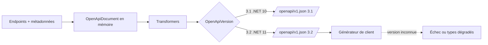

# CSharp — Détail du vendredi 17 juillet 2026

## 1. C# 15 — le mot-clé `union` : ensembles fermés et exhaustivité au compilateur

**Source :** .NET Blog (Bill Wagner) — https://devblogs.microsoft.com/dotnet/csharp-15-union-types/
**Date :** 2 avril 2026 (feature livrée depuis .NET 11 Preview 2, consolidée dans Preview 6 le 14 juillet 2026)

### Contexte

Tu connais le problème. Une méthode doit renvoyer « soit un résultat, soit une erreur », ou « soit un `string`, soit une `Exception` ». Avant C# 15, tu avais trois mauvaises options.

Renvoyer `object` : aucune contrainte, n'importe quel type peut atterrir là, et l'appelant écrit du code défensif pour des cas qui n'arriveront jamais. Utiliser une interface marqueur ou une classe de base abstraite : mieux, l'ensemble est restreint, mais il n'est jamais **fermé** — n'importe qui peut implémenter l'interface, donc le compilateur ne peut pas considérer l'ensemble comme complet. Et surtout, ces deux approches exigent un ancêtre commun, ce qui ne marche pas quand tu veux unir des types **sans lien** entre eux : `int` et `IEnumerable<T>`, `string` et `Exception`. D'où la popularité de la bibliothèque `OneOf` et de ses `OneOf<T0, T1, T2>` génériques.

C# 15 tranche avec le mot-clé `union`. Il déclare un ensemble **fermé** de types de cas, sans exiger de parenté, et le compilateur garantit que tes `switch` les couvrent tous.

### Comment ça marche

Décomposons le mécanisme, étape par étape.

**1. La déclaration.** `public union Pet(Cat, Dog, Bird);` crée un nouveau type `Pet`. Les trois types de cas n'ont besoin d'aucun ancêtre commun.

**2. La génération.** Le compilateur produit un **struct** qui implémente `IUnion`, avec un constructeur par type de cas et une propriété `Value` de type `object?`. Chaque constructeur alimente une **conversion implicite** : tu assignes un `Dog` directement à une variable `Pet`. Assigner un type hors de l'ensemble est une **erreur de compilation**.

**3. Le pattern matching.** C'est le point subtil : les patterns s'appliquent à `Value`, **pas** au struct `union`. Tu écris `Dog d =>` et le compilateur va tester `Value` pour toi — le « déballage » est automatique. Deux exceptions : `var` et `_` s'appliquent à l'union entière, ce qui te permet de capturer ou d'ignorer le tout.

**4. L'exhaustivité.** Si l'instance est connue non-nulle, un `switch` couvrant les trois cas est exhaustif : **pas besoin de branche `_` ni de `default`**. Ajoute un quatrième type de cas plus tard, et chaque `switch` incomplet produit un warning **au build**. C'est ça, la valeur : le compilateur attrape les cas manquants avant le runtime.

**5. Le null.** `default(Pet)` a un `Value` null. Le pattern `null` teste `Value`. Dès qu'un type de cas est nullable (`Bird?`, `int?`), tous les `switch` exigent une branche `null` pour rester exhaustifs.

**6. Le coût.** Le struct stocke toujours un `object?` : les **types valeur sont boxés** à chaque assignation. Pour les chemins chauds, une bibliothèque peut décorer sa propre classe/struct d'un `[System.Runtime.CompilerServices.Union]` et exposer `HasValue` + `TryGetValue` — le compilateur fait alors le pattern matching **sans boxing**.

### En pratique — exemple de code

```csharp
// Avant — C# 14 : résultat « soit valeur, soit erreur » via une base abstraite.
// Rien n'empêche un tiers de dériver ParseResult : le switch n'est jamais exhaustif.
public abstract record ParseResult;
public record Ok(int Value) : ParseResult;
public record Fail(string Reason) : ParseResult;

string Render(ParseResult r) => r switch
{
    Ok o   => $"ok:{o.Value}",
    Fail f => $"ko:{f.Reason}",
    _      => throw new InvalidOperationException(), // branche morte obligatoire
};
```

```csharp
// Après — C# 15 : ensemble fermé, types sans parenté, exhaustivité vérifiée.
// <LangVersion>preview</LangVersion> requis en Preview 6.
public union ParseResult(int, string, Exception);

string Render(ParseResult r) => r switch
{
    int v        => $"ok:{v}",          // pattern appliqué à r.Value
    string s     => $"ko:{s}",
    Exception ex => $"boom:{ex.Message}",
    null         => "vide",             // default(ParseResult).Value est null
};                                       // aucun `_` : le compilateur sait que c'est complet
```

### Pourquoi ça compte pour toi

Tu modélises des retours d'API ou de handlers avec `OneOf`, des exceptions de contrôle de flux ou des `Result<T>` maison. Les unions rendent ça natif et vérifié au build : ajoute un cas d'erreur, le compilateur te liste chaque `switch` à corriger. Surveille le boxing sur tes chemins chauds — un `union(int, string)` alloue. Teste-les dès maintenant en preview, la GA arrive en novembre avec .NET 11.

### Points de vigilance

- **Preview, pas GA** : `<LangVersion>preview</LangVersion>` obligatoire, et le design bouge encore. Les *union member providers* (accéder à un membre commun sans `switch`) ne sont pas implémentés.
- **Roadmap non engagée** : les propositions [closed hierarchies](https://github.com/dotnet/csharplang/blob/main/proposals/closed-hierarchies.md) et [closed enums](https://github.com/dotnet/csharplang/blob/main/proposals/closed-enums.md) complètent le tableau de l'exhaustivité, mais ne sont **rattachées à aucune release**.
- **Pas de `Result`/`Option` en BCL** : contrairement à Rust, C# 15 ne livre pas d'unions standard. Chaque équipe définira les siennes — attends-toi à de la fragmentation.

---

## 2. ASP.NET Core 11 Preview 6 — `AddOpenApi()` bascule sur OpenAPI 3.2 par défaut

**Source :** Microsoft Learn — https://learn.microsoft.com/en-us/aspnet/core/breaking-changes/11/openapi-version-default-3-2
**Date :** .NET 11 Preview 6, 14 juillet 2026

### Contexte

Depuis .NET 9, ASP.NET Core génère ses documents OpenAPI nativement, sans Swashbuckle. La politique de l'équipe est simple et assumée : **le défaut suit la dernière version publiée de la spec OpenAPI**, pour que les apps bénéficient des nouveautés sans configuration. En .NET 10, ce défaut était **3.1**. À partir d'ASP.NET Core 11 Preview 6, `OpenApiOptions.OpenApiVersion` vaut **`OpenApiSpecVersion.OpenApi3_2`**.

Concrètement : tu appelles `AddOpenApi()` sans rien préciser, tu montes de .NET 10 à .NET 11, et ton `/openapi/v1.json` change de version sans que tu aies touché une ligne. C'est un breaking change de comportement, pas de compilation — le pire genre, parce qu'il ne casse rien chez toi et tout chez ton consommateur.

### Comment ça marche

Le pipeline OpenAPI d'ASP.NET Core se lit en trois temps.

**1. Collecte.** Au démarrage, `AddOpenApi()` enregistre un service qui parcourt les endpoints (Minimal API et contrôleurs), lit les métadonnées (`[ProducesResponseType]`, types de paramètres, schémas JSON dérivés) et construit un modèle objet en mémoire — un `OpenApiDocument` de la bibliothèque `Microsoft.OpenApi`.

**2. Transformation.** Tes transformers (document, opération, schéma) s'appliquent sur ce modèle. Cette étape est **indépendante de la version** de la spec : tu manipules le même objet, quelle que soit la cible.

**3. Sérialisation.** C'est là que `OpenApiVersion` intervient. Le même modèle objet est **sérialisé** selon les règles de la version demandée. 3.1 et 3.2 divergent sur des détails qui comptent pour un générateur de clients strict : mots-clés JSON Schema autorisés, forme des exemples, champs additionnels tolérés.

Le piège est donc en aval. Ton app démarre, ton Swagger UI s'affiche, tes tests passent. Mais le pipeline qui génère ton client Angular via `openapi-generator` ou NSwag lit le `openapi: 3.2.0` en tête de document et, s'il ne connaît pas 3.2, échoue — ou pire, dégrade silencieusement les types.



### En pratique — exemple de code

```csharp
// Avant — .NET 10 : AddOpenApi() sans argument produit un document 3.1.
var builder = WebApplication.CreateBuilder(args);
builder.Services.AddOpenApi();   // → openapi: 3.1.0
```

```csharp
// Après — .NET 11 Preview 6 : le même appel produit du 3.2.
// Épingle explicitement la version tant que ta chaîne de génération de clients
// ne sait pas lire 3.2. Une ligne, et le comportement redevient déterministe.
var builder = WebApplication.CreateBuilder(args);

builder.Services.AddOpenApi(options =>
{
    options.OpenApiVersion = Microsoft.OpenApi.OpenApiSpecVersion.OpenApi3_1;
});

var app = builder.Build();
app.MapOpenApi();   // sert /openapi/{documentName}.json
app.Run();
```

### Pourquoi ça compte pour toi

Ton front Angular consomme sans doute un client généré depuis ce JSON. Si tu montes une API .NET 11 sans épingler la version, tu déplaces le risque chez le consommateur — et ça casse en CI, pas chez toi. Règle simple : **épingle `OpenApiVersion` explicitement** dans tout projet dont le contrat est consommé par un générateur. Le défaut implicite est confortable jusqu'au jour où il bouge.

### Pour aller plus loin

- Le même conseil vaut pour les contrats publiés à des tiers : un document OpenAPI est une **API publique**, sa version fait partie du contrat.
- Vérifie la compatibilité 3.2 de ta chaîne (`openapi-generator`, NSwag, Kiota) **avant** de retirer l'épinglage.

---
