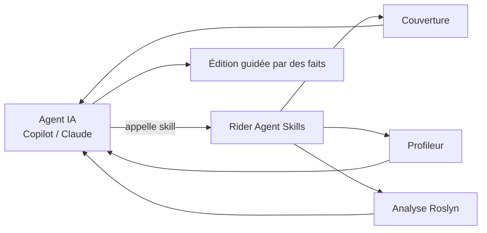
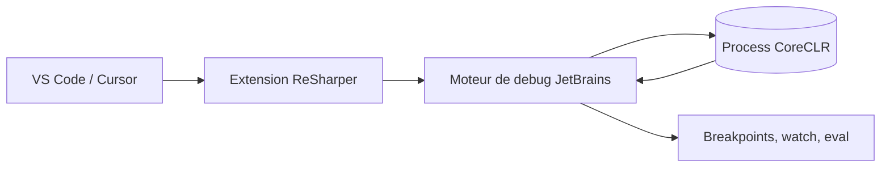

# CSharp — Détail du dimanche 19 juillet 2026

## 1. Rider 2026.2 RC — l'IDE ouvre son intelligence aux agents (Agent Skills) et intègre Copilot

**Source :** The JetBrains Blog — https://blog.jetbrains.com/dotnet/2026/07/15/rider-2026-2-release-candidate-is-out/
**Date :** 15 juillet 2026

### Contexte

JetBrains a publié la **Release Candidate de Rider 2026.2**. Deux axes : l'IDE devient un **fournisseur de compétences pour agents IA** et gagne une **grosse passe de performance .NET**. Chiffres annoncés : lancement du debugger **~2,8 s plus rapide** sur Windows, changement de branche **2 à 3× plus rapide** dans les solutions Roslyn, **7-8 %** de mémoire backend en moins. Copilot est désormais **intégré nativement**, en plus des templates C# mono-fichier, du Hot Reload WPF pour XAML, de la fenêtre NuGet redessinée et du support **TypeScript 7**.

### Comment ça marche

La nouveauté structurante, ce sont les **Agent Skills**. Au lieu de laisser un agent (Copilot, Claude) deviner ton code, Rider expose son savoir interne — **données de couverture**, **profileur**, **analyse de code** — comme des compétences appelables. L'agent interroge l'IDE, qui répond avec des faits (« ce test couvre-t-il cette ligne ? », « où est le point chaud ? »), puis l'agent agit sur une base fiable. Rider embarque aussi les **Agent Skills officiels Microsoft** pour .NET, Aspire et Azure.

L'idée : l'IDE reste la **source de vérité** sémantique (index Roslyn, symboles, couverture), l'agent apporte le raisonnement. Ça réduit les hallucinations classiques quand un LLM improvise une API ou un chemin.



### En pratique — exemple de code

Rider 2026.2 pousse aussi les **apps C# mono-fichier** : un `.cs` exécutable, sans `.csproj`, avec directives `#:`.

```csharp
// hello.cs — app C# mono-fichier, lancée par `dotnet run hello.cs`
#:package Humanizer@2.14.1          // dépendance NuGet déclarée en ligne
using Humanizer;

var deploiement = DateTime.UtcNow.AddHours(-3);
Console.WriteLine($"Déployé {deploiement.Humanize()}"); // "il y a 3 heures"
```

### Pourquoi ça compte pour toi

Si tu pilotes déjà du code par agent, les Agent Skills changent la donne : ton agent lit la **couverture réelle** et le **profileur** au lieu d'inventer. Tu gardes Rider comme garde-fou sémantique. Et les gains Roslyn (branch switch 2-3× plus rapide, debugger plus prompt) se sentent sur une grosse solution .NET au quotidien. À tester en RC avant la stable, surtout si tu vis dans des monorepos.

### Points de vigilance

C'est une RC : valide tes plugins et ton profil de démarrage avant de migrer une équipe. Les Agent Skills exposent ton contexte de code à l'agent — vérifie ta politique de confidentialité côté fournisseur LLM.

---

## 2. ReSharper 2026.2 — le debugger .NET arrive enfin dans VS Code et Cursor

**Source :** The JetBrains Blog — https://blog.jetbrains.com/dotnet/2026/07/13/rs-vsc-debugging/
**Date :** 13 juillet 2026

### Contexte

C'était **la** demande numéro un depuis plus d'un an : l'extension **ReSharper pour VS Code** (et Cursor) n'avait pas de debugger. La **2026.2** livre la première version, bâtie sur **le même moteur de débogage** que les IDE JetBrains (Rider). En parallèle, ReSharper amorce un support d'agents basé sur **ACP** (Agent Client Protocol) dans Visual Studio, avec **Junie** en préversion, et affine analyse, refactorings et intégration `.editorconfig`.

### Comment ça marche

Jusqu'ici, déboguer du .NET dans VS Code passait par le C# Dev Kit de Microsoft. ReSharper amène son **propre backend de debug**, celui de Rider, exposé via l'API de débogage de VS Code. Concrètement, l'extension enregistre un **type de debug** que tu cibles dans `launch.json`. Le moteur s'attache au process CoreCLR, gère points d'arrêt, inspection, évaluation d'expressions — avec la parité de comportement qu'on connaît côté Rider.

L'enjeu : offrir aux devs qui vivent dans **Cursor** (pour l'IA) une expérience de debug .NET de niveau IDE, sans quitter l'éditeur.



### En pratique — exemple de code

Une config de lancement minimale pour attacher le debugger ReSharper à une app .NET.

```json
// .vscode/launch.json
{
  "version": "0.2.0",
  "configurations": [
    {
      "name": ".NET (ReSharper) — lancer API",
      "type": "resharper-dotnet",     // fourni par l'extension ReSharper
      "request": "launch",
      "program": "${workspaceFolder}/src/Api/bin/Debug/net10.0/Api.dll",
      "cwd": "${workspaceFolder}/src/Api",
      "stopAtEntry": false
    }
  ]
}
```

### Pourquoi ça compte pour toi

Si tu as glissé vers **Cursor** pour l'assistance IA mais gardais Rider ouvert juste pour déboguer, tu peux enfin rester dans un seul éditeur. Le moteur est celui de Rider : mêmes points d'arrêt conditionnels, mêmes évaluations. Pour du backend .NET, c'est le chaînon manquant entre éditeur IA-first et debug sérieux. Vérifie ta licence ReSharper : l'extension VS Code suit le même abonnement.

### Limites

Première version du debugger : attends-toi à des angles morts (hot reload, scénarios d'attach avancés) qui restent plus mûrs sur Rider.
