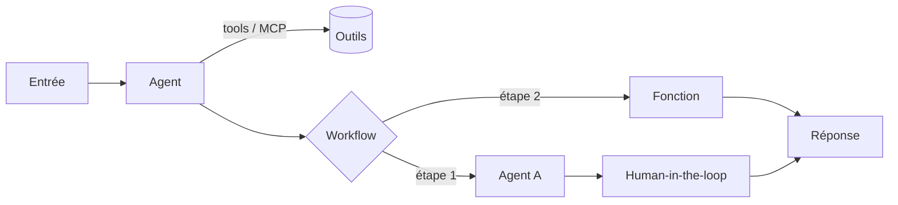

# CSharp — Détail du lundi 20 juillet 2026

## 1. Microsoft Agent Framework — Agents, Harness et Workflows pour bâtir des agents en .NET

**Source :** Microsoft Learn — https://learn.microsoft.com/en-us/agent-framework/overview/
**Date :** page mise à jour le 10 juillet 2026 (GA 1.0 le 3 avril 2026)

### Contexte

Depuis des mois, deux briques Microsoft se disputaient le terrain agentique .NET : **Semantic Kernel** (orienté entreprise : sessions, télémétrie, filtres) et **AutoGen** (abstractions simples pour agents mono/multi). Le **Microsoft Agent Framework** est le successeur officiel des deux, écrit par les mêmes équipes. Il fusionne les abstractions d'AutoGen et les fonctions entreprise de Semantic Kernel, puis ajoute des **workflows** orientés graphe. La page de référence a été rafraîchie le 10 juillet, dans le sillage de **.NET 11 Preview 6** qui pousse le protocole AG-UI côté agents.

Pour toi qui bâtis des API .NET, l'intérêt est net : plus besoin de câbler à la main un orchestrateur maison autour d'un client OpenAI. Le framework fournit clients de modèle, session d'état, mémoire, middleware et clients MCP.

### Comment ça marche

Le framework s'articule en **trois niveaux**, du plus simple au plus contrôlé :

1. **Agent** : un LLM qui reçoit des entrées, appelle des **tools** et des **serveurs MCP**, et répond. Providers supportés : Foundry, Azure OpenAI, OpenAI, Anthropic, Ollama.
2. **Harness** : un agent « batteries incluses » pour les tâches longues et multi-étapes — planification, suivi de todo, **compaction de contexte**, accès fichiers/mémoire, approbation d'outil « ne plus redemander », et observabilité intégrée.
3. **Workflow** : un **graphe typé** qui relie agents et fonctions, avec routage sûr, checkpointing et *human-in-the-loop*. Tu passes de l'agent autonome au processus déterministe quand les étapes sont connues.



Règle d'or de la doc : *« si tu peux écrire une fonction pour faire la tâche, fais-le »*. L'agent sert quand la tâche est ouverte ou conversationnelle ; le workflow quand l'ordre d'exécution doit être explicite.

### En pratique — exemple de code

Créer un agent minimal qui appelle un modèle Foundry, en C# :

```csharp
// dotnet add package Microsoft.Agents.AI.Foundry --prerelease
using Azure.AI.Projects;
using Azure.Identity;
using Microsoft.Agents.AI;

// Un AIProjectClient + AsAIAgent = un agent prêt à l'emploi
AIAgent agent = new AIProjectClient(
        new Uri("https://<ton-service>.services.ai.azure.com/api/projects/<projet>"),
        new AzureCliCredential())        // auth via 'az login', pas de clé en dur
    .AsAIAgent(
        model: "gpt-5.4-mini",
        instructions: "Tu es un assistant concis.");

// RunAsync fait l'appel LLM et renvoie la réponse
Console.WriteLine(await agent.RunAsync("Quelle est la plus grande ville de France ?"));
```

À partir de là, tu ajoutes des tools (`[Description]` sur des méthodes), une session multi-tour, du middleware, puis un workflow pour coordonner plusieurs agents. Les packages sont encore en `--prerelease` mais les APIs sont versionnées et stables depuis la GA d'avril.

### Pourquoi ça compte pour toi

Tu peux enfin standardiser tes intégrations LLM en .NET sans réécrire un orchestrateur à chaque projet. La couche **Harness** t'offre planification, mémoire et approbation d'outils gratuitement ; les **Workflows** t'évitent l'agent « boîte noire » quand tu veux du déterministe et de l'audit. Migre progressivement depuis Semantic Kernel ou AutoGen : les guides sont fournis.

### Points de vigilance

Packages en préversion (`--prerelease`) : épingle les versions. Tout appel à un système tiers (modèle non-Azure, MCP externe) sort de ta frontière de conformité — tu restes responsable des filtres de contenu et de la revue des données échangées.
