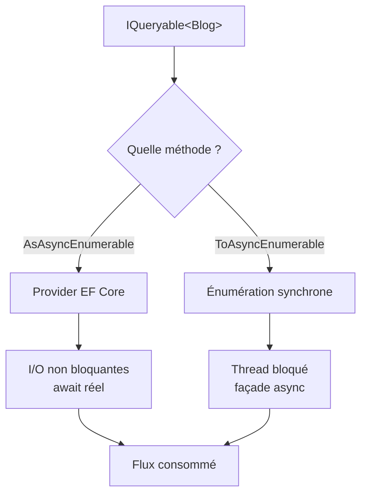
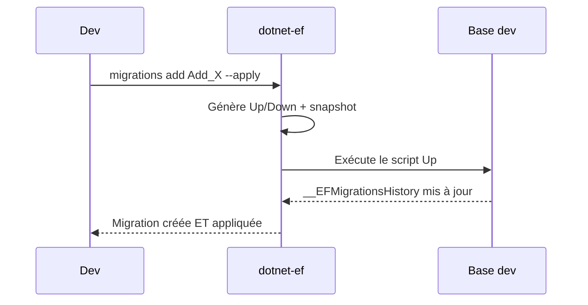

# CSharp — Détail du mercredi 22 juillet 2026

## 1. EF Core — l'analyseur EF1004 attrape les requêtes « async » exécutées en synchrone

**Source :** Visual Studio Magazine — https://visualstudiomagazine.com/articles/2026/07/15/net-11-preview-6-roundup-aspnet-core-maui-c-ef-core-and-sdk-updates.aspx
**Date :** 15 juillet 2026

### Contexte

Tu écris `await` partout, tu crois ton pipeline base de données 100 % asynchrone, et pourtant l'app se fige sous charge. Le coupable est souvent une requête qui *ressemble* à de l'async mais qui matérialise en réalité de façon bloquante. Le cas le plus vicieux : appeler `ToAsyncEnumerable()` sur un `IQueryable<T>` EF Core. Cette méthode vient de `System.Linq.AsyncEnumerable` — pas du pipeline async d'EF Core. Elle enveloppe une énumération synchrone dans une façade `IAsyncEnumerable`, sans jamais passer par les appels réseau non bloquants du provider.

EF Core 11 ajoute un analyseur Roslyn, **EF1004**, qui lève un avertissement au build dès qu'il repère ce motif. C'est la même famille de garde-fous que `EF1001`/`EF1002` : des diagnostics livrés dans le package d'analyseurs EF Core, exécutés à la compilation, sans coût runtime.

### Comment ça marche

Le point clé est de comprendre *où* la requête touche la base. `AsAsyncEnumerable()` (méthode d'EF Core) déclenche l'exécution via le provider async : lecture non bloquante du `DbDataReader`, `await` réel sur les I/O. `ToAsyncEnumerable()` (méthode LINQ générique) prend l'`IQueryable`, l'énumère de façon synchrone côté client, puis rejoue les éléments derrière une interface asynchrone. Le thread reste bloqué pendant l'aller-retour SQL — exactement ce que tu voulais éviter.



L'analyseur fait de l'analyse statique : il inspecte le type du récepteur de l'appel. Si c'est un `IQueryable<T>` rattaché à un `DbSet`, `ToAsyncEnumerable()` déclenche EF1004. Tu peux le traiter comme une erreur bloquante en CI avec `<WarningsAsErrors>EF1004</WarningsAsErrors>`.

### En pratique — exemple de code

```csharp
// AVANT — piège : ToAsyncEnumerable() énumère l'IQueryable de façon SYNCHRONE.
// Le foreach "await" ne masque qu'une exécution bloquante -> deadlock sous charge.
await foreach (var blog in db.Blogs.Where(b => b.IsPublished)
                                   .ToAsyncEnumerable())   // ⚠ EF1004
{
    Process(blog);
}

// APRÈS — AsAsyncEnumerable() passe par le pipeline async d'EF Core.
// La lecture du DbDataReader est réellement non bloquante.
await foreach (var blog in db.Blogs.Where(b => b.IsPublished)
                                   .AsAsyncEnumerable())   // ✅
{
    Process(blog);
}
```

Une lettre de différence (`As` au lieu de `To`), un comportement runtime radicalement différent. Pour un chargement complet en mémoire, `ToListAsync()` reste le bon choix ; `AsAsyncEnumerable()` sert au *streaming* d'un gros résultat sans tout charger d'un coup.

### Pourquoi ça compte pour toi

Tu portes des services .NET sous forte charge : un thread bloqué par requête, c'est le pool épuisé et la latence qui explose. EF1004 transforme un bug de production invisible en avertissement de build. Active-le en erreur dans ta CI dès l'arrivée de l'outil .NET 11, et fais un `grep ToAsyncEnumerable` sur ta base existante — tu trouveras probablement quelques faux-async oubliés.

### Points de vigilance

L'analyseur ne couvre que le motif `ToAsyncEnumerable()` sur `IQueryable`. Un `.Result` ou `.GetAwaiter().GetResult()` sur une requête reste invisible pour lui : garde tes revues de code et un banc de charge.

---

## 2. EF Core 11 — créer et appliquer une migration en une seule commande

**Source :** Start Debugging — https://startdebugging.net/2026/04/efcore-11-single-step-migrations-dotnet-ef-update-add/
**Date :** mise à jour suivie jusqu'au 15 juillet 2026 (train .NET 11)

### Contexte

Le rituel EF Core est en deux temps : `dotnet ef migrations add <Nom>` génère la classe de migration, puis `dotnet ef database update` l'applique à la base de dev. En boucle serrée — tu ajustes un modèle dix fois dans l'après-midi — ce double appel devient une friction mécanique, et on oublie régulièrement le second. EF Core 11 ajoute un flag `--apply` (et un `--update` côté commande jumelle) pour fusionner les deux étapes.

### Comment ça marche

Sous le capot, rien de magique : l'outil `dotnet-ef` enchaîne les deux opérations qu'il faisait déjà, mais dans un seul processus. Il compile le modèle, produit le scaffolding de la migration (`Up`/`Down` + snapshot), puis ouvre la connexion et exécute le `Up` généré contre la base pointée par ta chaîne de connexion de dev. Le snapshot du modèle est mis à jour comme d'habitude, donc l'historique reste cohérent.



L'important : ce raccourci vise **le dev local**, pas la prod. En production tu continues de générer un script SQL idempotent (`dotnet ef migrations script --idempotent`) revu et versionné, appliqué par ton pipeline de déploiement — jamais un `--apply` sauvage sur une base live.

### En pratique — exemple de code

```bash
# AVANT — deux commandes, deux allers-retours mentaux
dotnet ef migrations add Add_OrderStatusColumn
dotnet ef database update

# APRÈS — EF Core 11 : création + application en un seul appel
dotnet ef migrations add Add_OrderStatusColumn --apply

# Symétrique côté "update" : appliquer en régénérant la dernière migration si besoin
dotnet ef database update --add   # crée la migration manquante puis l'applique
```

Le flag n'altère pas le contenu de la migration : tu obtiens exactement la même classe qu'avant, simplement déjà jouée contre ta base de dev.

### Pourquoi ça compte pour toi

C'est un gain de vélocité, pas une révolution : sur une journée où tu itères le schéma PostgreSQL, tu supprimes un aller-retour sur deux et l'oubli du `database update`. Réflexe à garder : réserve `--apply` à ta machine et à tes bases jetables. Pour la CI et la prod, reste sur des scripts idempotents versionnés et revus — le raccourci ne remplace pas la discipline de déploiement.

### Limites

Si la migration échoue à l'application (contrainte violée, données existantes), tu te retrouves avec une classe de migration créée mais non appliquée : il faut alors la corriger ou la supprimer avant de rejouer, comme aujourd'hui.
