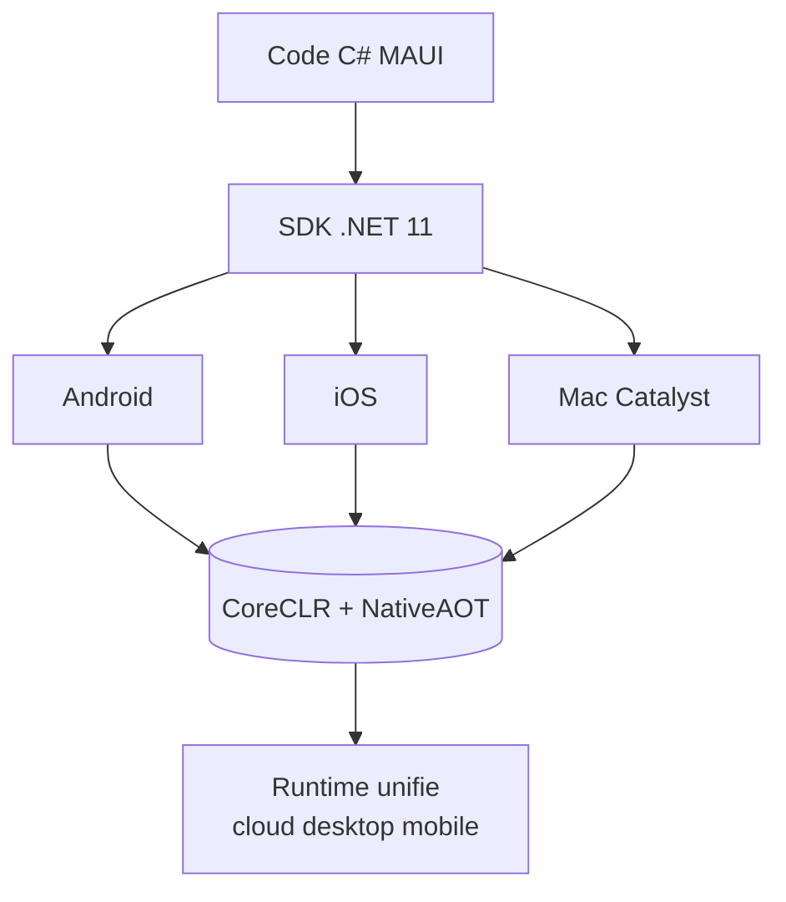

# CSharp — Détail du samedi 25 juillet 2026

## 1. .NET MAUI passe entièrement sur CoreCLR (.NET 11 Preview 6)

**Source :** .NET Blog — https://devblogs.microsoft.com/dotnet/coreclr-progress-and-mono-timeline-dotnet-maui/
**Date :** 14 juillet 2026

### Contexte

Depuis ses débuts, .NET MAUI exécute tes apps mobiles sur **Mono**, un runtime historiquement conçu pour Xamarin et l'embarqué. En parallèle, tout le reste de l'écosystème .NET (ASP.NET Core, services cloud, apps desktop) tourne sur **CoreCLR**, le runtime moderne avec son JIT, son GC générationnel et son tooling de diagnostic. Deux runtimes, deux comportements subtils, deux profils de performance : un casse-tête pour qui partage du code entre backend et mobile.

Microsoft a lancé la convergence en .NET 11 Preview 4, où CoreCLR est devenu le runtime **par défaut** sur mobile. La Preview 6 franchit l'étape suivante : CoreCLR est désormais le **seul** runtime pour Android, iOS et Mac Catalyst. Le travail est fonctionnellement complet — les apps compilent et tournent sur le même moteur que ton API .NET.

### Comment ça marche

L'idée directrice : **un seul runtime sur tous les targets**. Concrètement, la chaîne de build MAUI ne référence plus les assemblies Mono pour les plateformes natives ; elle produit un binaire exécuté par CoreCLR, adapté à chaque OS mobile via des runtime packs dédiés. Ce qui change pour toi :

- **JIT et GC unifiés** : le comportement mémoire de ton app mobile s'aligne sur celui du serveur. Fini les écarts de GC entre Mono et CoreCLR.
- **NativeAOT** : sur mobile, le démarrage à froid est critique. CoreCLR ouvre la voie à la compilation *ahead-of-time* native, qui supprime le coût du JIT au lancement et réduit la taille de l'app. Microsoft vise à réduire l'écart de démarrage face à Kotlin/Jetpack Compose et Swift/SwiftUI.
- **Mono ne disparaît pas partout** : il reste le runtime de Blazor WebAssembly et des scénarios WASM, où le modèle d'exécution navigateur l'impose encore.



### En pratique — exemple de code

Le passage est piloté par ton `.csproj`. Avant, Mono était implicite ; désormais CoreCLR est acté et tu peux activer NativeAOT pour la publication release :

```xml
<!-- Avant (.NET 10) : Mono implicite sur mobile, JIT au démarrage -->
<PropertyGroup>
  <TargetFrameworks>net10.0-android;net10.0-ios</TargetFrameworks>
</PropertyGroup>

<!-- Après (.NET 11) : CoreCLR par défaut, NativeAOT pour un cold start plus court -->
<PropertyGroup>
  <TargetFrameworks>net11.0-android;net11.0-ios</TargetFrameworks>
  <!-- Publication native ahead-of-time : pas de JIT au lancement, app plus petite -->
  <PublishAot Condition="'$(Configuration)' == 'Release'">true</PublishAot>
</PropertyGroup>
```

Rebuild, profile le démarrage à froid avec `dotnet trace`, et compare la taille du package : c'est là que le gain se voit.

### Pourquoi ça compte pour toi

Tu partages déjà des DTO et de la logique entre ton API .NET et un front. Avec MAUI sur CoreCLR, tu partages aussi le **runtime** : même GC, mêmes primitives async, mêmes outils de diagnostic (`dotnet trace`, `dotnet gcdump`) que côté serveur. Moins de surprises à l'exécution, un modèle mental unique. Si tu as une app mobile MAUI, planifie le passage à .NET 11 et teste NativeAOT tôt : c'est le levier de démarrage et de taille.

### Points de vigilance

NativeAOT impose des contraintes : pas de réflexion dynamique non-annotée, attention aux libs qui génèrent du code à l'exécution. Valide tes dépendances tierces avant de l'activer en production.
