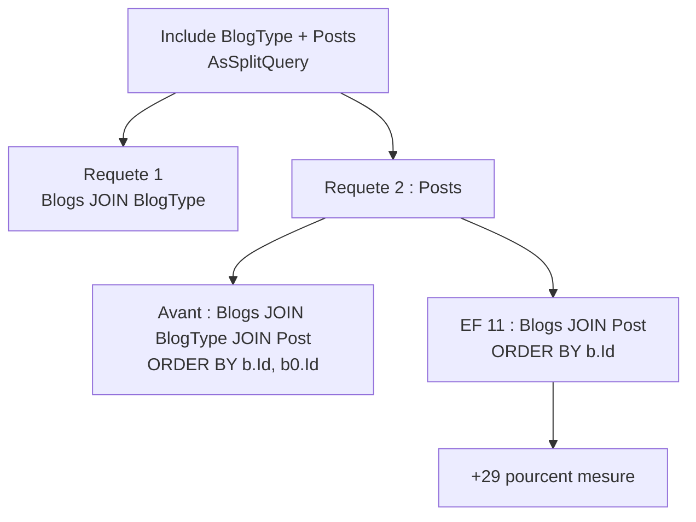

# CSharp — Détail du dimanche 26 juillet 2026

## 1. EF Core 11 — types complexes et colonnes JSON sur héritage TPT/TPC

**Source :** Microsoft Learn — https://learn.microsoft.com/en-us/ef/core/what-is-new/ef-core-11.0/whatsnew
**Date :** 14 juillet 2026 (.NET 11 Preview 6)

### Contexte

EF Core distingue deux façons de modéliser un objet imbriqué. Les **owned entities** existent depuis EF Core 2 : l'objet est une entité déguisée, avec une identité implicite et un suivi de changement propre. Les **complex types**, arrivés en EF Core 8 et étoffés en 10, sont de vrais value objects : pas d'identité, sémantique de valeur, comparaison membre à membre. Pour un `Address`, un `Money` ou un `DateRange`, les types complexes sont le bon outil.

Le blocage était structurel. Dès que ton entité utilisait une stratégie d'héritage **TPT** (une table par type) ou **TPC** (une table par type concret), les types complexes et les colonnes JSON étaient refusés. Tu retombais sur les owned entities, avec leurs pièges connus : identité fantôme, `Include` obligatoires, comportements surprenants sur `ExecuteUpdate`. EF Core 11 lève cette restriction.

### Comment ça marche

Il faut comprendre pourquoi c'était bloqué. En **TPH** (table par hiérarchie), tous les types partagent une seule table : aplatir un type complexe en colonnes `Details_BirthDate`, `Details_Veterinarian` est trivial, il n'y a qu'une destination possible.

En **TPT**, la hiérarchie est éclatée. `Animal` a sa table avec les propriétés de base, `Dog` et `Cat` ont chacune la leur avec leurs propriétés spécifiques et une clé étrangère vers `Animal`. Le moteur doit donc décider **dans quelle table** atterrissent les colonnes du type complexe, et surtout produire les bons `JOIN` au moment de la lecture. En **TPC**, il n'y a pas de table de base du tout : chaque type concret a sa propre table complète, donc le type complexe doit être **dupliqué** dans chacune, et les requêtes polymorphes passent par un `UNION ALL` qui doit rester cohérent colonne par colonne.

EF 11 résout ce mapping. Un type complexe déclaré sur le type de base est matérialisé dans la table de base en TPT — `Details_BirthDate` et `Details_Veterinarian` sur `Animal` — et dupliqué dans chaque table concrète en TPC. La même logique s'applique quand tu choisis `ToJson()` : la colonne JSON est posée au bon niveau de la hiérarchie.

L'équipe a accompagné ce déblocage d'une série de correctifs de stabilité : comparaison de types complexes imbriqués, assignation via `ExecuteUpdate`, nullabilité en hiérarchie TPH, `ReloadAsync` sur complexe null. Le message est explicite — les complex types sont désormais l'alternative recommandée aux owned entities.

### En pratique — exemple de code

Avant, ce modèle levait une exception à la construction du modèle ; maintenant il mappe.

```csharp
// Le value object partage par toute la hierarchie
[ComplexType]
public class AnimalDetails
{
    public DateTime BirthDate { get; set; }
    public string? Veterinarian { get; set; }
}

public abstract class Animal
{
    public int Id { get; set; }
    public string Name { get; set; } = "";
    public required AnimalDetails Details { get; set; }   // refuse avant EF 11 en TPT
}

public class Dog : Animal { public string Breed { get; set; } = ""; }

protected override void OnModelCreating(ModelBuilder modelBuilder)
{
    // Avant EF 11 : impossible, il fallait passer par une owned entity
    // Apres : colonnes Details_BirthDate / Details_Veterinarian sur la table Animal
    modelBuilder.Entity<Animal>().UseTptMappingStrategy();

    // Variante JSON : le value object est serialise dans une colonne unique
    modelBuilder.Entity<Animal>()
        .UseTptMappingStrategy()
        .ComplexProperty(a => a.Details, b => b.ToJson());

    // Bonus EF 11 : configuration par chainage, sans builder intermediaire
    modelBuilder.Entity<Dog>()
        .Property(d => d.Details.Veterinarian)
        .HasMaxLength(200);
}
```

### Pourquoi ça compte pour toi

Si tu as évité TPT parce que tes value objects ne passaient pas, la contrainte tombe. Tu peux modéliser proprement une hiérarchie de documents ou de contrats avec un `Money` ou un `Period` partagé, sans le bruit des owned entities. Sur PostgreSQL comme sur SQL Server, le passage en JSON pour la partie peu requêtée reste une option intéressante. Teste la migration générée : la forme des colonnes change.

---

## 2. EF Core 11 — du SQL plus propre pour les navigations to-one (+29 % mesuré)

**Source :** Microsoft Learn — https://learn.microsoft.com/en-us/ef/core/what-is-new/ef-core-11.0/whatsnew
**Date :** 14 juillet 2026 (.NET 11 Preview 6)

### Contexte

Le pattern est banal : tu charges une entité avec une navigation de référence (`Include(b => b.BlogType)`) et une collection (`Include(b => b.Posts)`). Pour éviter l'explosion cartésienne, tu passes en `AsSplitQuery()`. EF émet alors deux requêtes : une pour les blogs, une pour les posts.

Le problème est dans la seconde. EF y rejoignait `BlogType` alors que cette table ne sert à rien pour hydrater les posts — elle a déjà été lue par la première requête. Sur une table de faits volumineuse, cette jointure inutile coûte réellement. Second défaut, indépendant : EF ajoutait les clés des navigations de référence dans l'`ORDER BY`, alors que la clé du parent identifie déjà la ligne de façon unique.

### Comment ça marche

Le mécanisme du split query se comprend en trois étapes.

**Un.** EF exécute la requête principale : `SELECT ... FROM Blogs INNER JOIN BlogType`. Les blogs et leurs types sont matérialisés et trackés.

**Deux.** EF exécute la requête de collection pour les posts. Elle repart de `Blogs` — c'est nécessaire, car les filtres et le tri appliqués aux blogs doivent contraindre les posts remontés. Mais elle réappliquait aussi le `JOIN BlogType`, hérité mécaniquement de l'arbre de requête initial. EF 11 **élague** cette jointure : le planificateur détecte qu'aucune colonne de `BlogType` n'est projetée ni utilisée dans un prédicat.

**Trois.** Le tri. EF ordonne par la clé du parent pour regrouper les lignes lors de la matérialisation. Il ajoutait aussi la clé de chaque navigation de référence. Or cette clé est **fonctionnellement déterminée** par celle du parent via la clé étrangère : à une ligne `Blogs` correspond exactement une ligne `Owner`. Le tri supplémentaire ne discrimine rien et empêche parfois la base d'utiliser un index existant.

Microsoft mesure **29 %** de gain sur un scénario split query courant et **22 %** sur une requête simple débarrassée de l'`ORDER BY` superflu. Un troisième correctif de la même famille supprime les `CAST` no-op — typiquement `CAST([u].[Name] AS nvarchar(max))` sur une colonne déjà `nvarchar(max)`, généré par les value converters. Ces casts empêchent purement et simplement l'usage d'un index.



### En pratique — exemple de code

Le code LINQ ne change pas d'une ligne ; c'est le SQL émis qui maigrit.

```csharp
// Ton code LINQ : identique avant et apres
var blogs = await context.Blogs
    .Include(b => b.BlogType)   // navigation to-one
    .Include(b => b.Posts)      // collection
    .AsSplitQuery()
    .ToListAsync();
```

```sql
-- Avant EF Core 11 : jointure et tri inutiles dans la requete de collection
SELECT [p].[Id], [p].[BlogId], [p].[Title], [b].[Id], [b0].[Id]
FROM [Blogs] AS [b]
INNER JOIN [BlogType] AS [b0] ON [b].[BlogTypeId] = [b0].[Id]  -- sert a rien
INNER JOIN [Post] AS [p] ON [b].[Id] = [p].[BlogId]
ORDER BY [b].[Id], [b0].[Id];                                   -- redondant

-- EF Core 11 : jointure elaguee, tri reduit a la cle du parent
SELECT [p].[Id], [p].[BlogId], [p].[Title], [b].[Id]
FROM [Blogs] AS [b]
INNER JOIN [Post] AS [p] ON [b].[Id] = [p].[BlogId]
ORDER BY [b].[Id];
```

### Pourquoi ça compte pour toi

C'est du gain sans refactoring : tu migres, tes requêtes s'allègent. Profite quand même de la montée pour relire tes plans d'exécution — la suppression des `CAST` peut réactiver des index que tu croyais inutiles, et certains plans figés en cache méritent d'être invalidés. Sur PostgreSQL, l'élagage de jointure vaut aussi.

---

## 3. EF Core 11 — les colonnes vectorielles ne sont plus chargées par défaut

**Source :** Microsoft Learn — https://learn.microsoft.com/en-us/ef/core/what-is-new/ef-core-11.0/whatsnew
**Date :** 14 juillet 2026 (.NET 11 Preview 6)

### Contexte

EF Core 10 avait introduit `SqlVector<float>` et la traduction de `EF.Functions.VectorDistance()`, ouvrant la recherche vectorielle dans SQL Server sans base spécialisée. Le piège est arrivé avec l'usage : un embedding fait couramment 768, 1 536 ou 3 072 dimensions. En `float`, ça représente entre 3 et 12 Ko **par ligne**, transportés à chaque `ToListAsync()` sur l'entité — même quand tu ne lis jamais le vecteur.

Or le cycle de vie normal d'un embedding est asymétrique : tu l'écris une fois à l'ingestion, tu l'utilises ensuite uniquement dans le `WHERE` ou l'`ORDER BY` de tes recherches, et tu ne le relis pratiquement jamais côté application. Charger systématiquement la colonne était donc du gaspillage pur.

### Comment ça marche

EF Core 11 sort les propriétés `SqlVector<T>` de la **projection par défaut**. C'est le seul changement, mais il faut bien voir ce qu'il n'affecte pas.

**Ce qui change** : quand tu matérialises une entité (`ToListAsync`, `FindAsync`, navigation chargée), le `SELECT` n'inclut plus la colonne vecteur. La propriété reste à sa valeur par défaut en mémoire.

**Ce qui ne change pas** : le vecteur reste pleinement utilisable côté serveur. Dans un `Where`, dans un `OrderBy`, dans un appel à `VectorDistance()` ou `VectorSearch()`, EF émet la colonne dans le SQL comme avant. Le calcul de similarité se fait dans la base, où il doit se faire.

**Comment récupérer le vecteur** : par projection explicite, `Select(b => new { b.Id, b.Embedding })`. Tu paies alors le transfert, mais consciemment.

Le gain mesuré est spectaculaire parce qu'il est dominé par la bande passante réseau : **presque ×9** contre une base locale, **environ ×22** contre une base Azure SQL distante. Plus la latence est haute, plus l'optimisation paie.

En parallèle, EF 11 ajoute la création d'**index vectoriels** via migrations et une méthode `VectorSearch()` qui se traduit en `VECTOR_SEARCH()`. Chaînée avec `Take()` et `WithApproximate()`, elle bascule d'une recherche exacte kNN vers une recherche approchée ANN, beaucoup plus rapide sur de gros volumes. Attention : ces deux features sont marquées expérimentales côté SQL Server comme côté EF.

### En pratique — exemple de code

Le contraste entre les deux comportements, puis la recherche approchée.

```csharp
// Avant EF 11 : l'embedding de 1536 floats partait sur le reseau a chaque ligne
// Apres : la colonne vecteur est exclue du SELECT — ~9x plus rapide en local
var blogs = await context.Blogs.OrderBy(b => b.Name).ToListAsync();
// SQL emis : SELECT [b].[Id], [b].[Name] FROM [Blogs] AS [b] ...

// Tu veux le vecteur ? Projection explicite, cout assume
var withVectors = await context.Blogs
    .Select(b => new { b.Id, b.Embedding })
    .ToListAsync();

// Index vectoriel declare dans le modele, cree par migration
modelBuilder.Entity<Blog>().HasVectorIndex(b => b.Embedding, "cosine");

// Recherche approchee (ANN) : WithApproximate() exploite l'index
var similar = await context.Blogs
    .VectorSearch(b => b.Embedding, queryEmbedding, "cosine")
    .OrderBy(r => r.Distance)
    .Take(5)
    .WithApproximate()          // sans lui : kNN exact, plus lent
    .ToListAsync();
```

### Pourquoi ça compte pour toi

Si tu as branché du RAG sur SQL Server avec EF Core 10, tu transportais probablement des mégaoctets d'embeddings sans le savoir. Le nouveau défaut corrige ça sans que tu touches à ton code. Vérifie juste que rien ne lit `entity.Embedding` après matérialisation — ce serait maintenant vide, et le bug est silencieux.

### Limites

`VECTOR_SEARCH()` et les index vectoriels restent expérimentaux dans SQL Server 2025. Ne les mets pas sur le chemin critique d'une prod sans plan de repli vers `VectorDistance()`.
