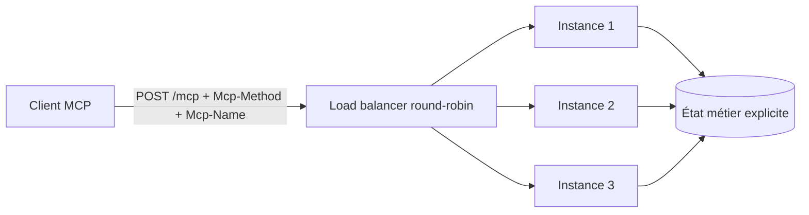
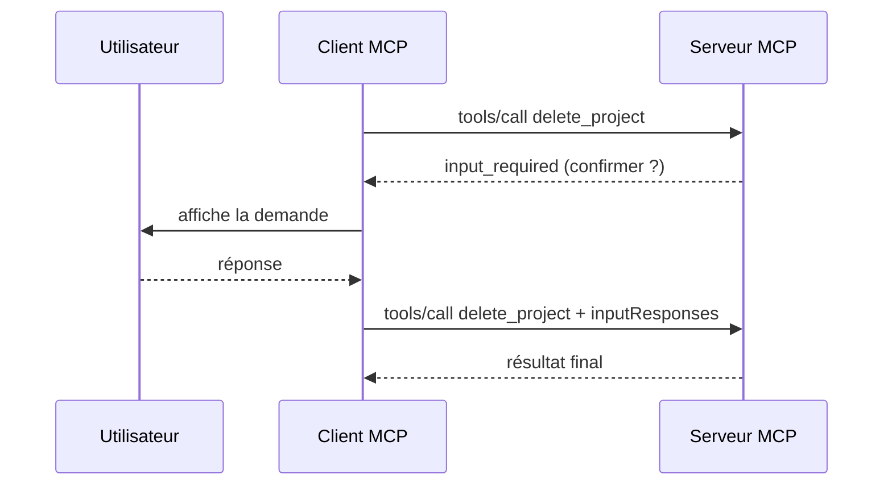

# CSharp — Détail du samedi 1er août 2026

## 1. MCP C# SDK v2.0 — le protocole devient stateless par défaut

**Source :** .NET Blog — https://devblogs.microsoft.com/dotnet/announcing-v20-of-the-official-mcp-csharp-sdk/
**Date :** 28 juillet 2026

### Contexte

Depuis ses débuts, MCP était un protocole bidirectionnel à état. Un client ouvrait une connexion, envoyait `initialize`, recevait `initialized`, obtenait un `Mcp-Session-Id`, puis rejouait cet identifiant sur chaque requête suivante. Le serveur devait retrouver la session correspondante à chaque appel.

Ce modèle marche très bien sur un process unique. Il devient pénible dès que tu veux scaler horizontalement : il faut des sticky sessions au niveau du load balancer, ou un store de sessions partagé entre instances, ou les deux. C'était la demande numéro un des équipes qui déployaient des serveurs MCP en production. La révision `2026-07-28` y répond en supprimant l'état au niveau du protocole, et le SDK C# v2.0 l'implémente en stable.

### Comment ça marche

Le principe est simple à énoncer : **chaque requête est auto-descriptive**. Elle porte sa version de protocole, l'identité du client et ses capacités, dans le champ `_meta`. Il n'y a plus rien à retrouver côté serveur.

Trois pièces rendent ça possible.

**Le handshake disparaît (SEP-2575).** Plus d'échange `initialize`/`initialized`. Un client qui veut connaître les capacités du serveur avant d'agir appelle le nouveau RPC `server/discover` — mais ce n'est pas obligatoire, c'est une optimisation de découverte.

**L'en-tête de session disparaît (SEP-2567).** `Mcp-Session-Id` n'existe plus. C'est ce qui débloque le round-robin : n'importe quelle requête peut atterrir sur n'importe quelle instance.

**Les métadonnées montent dans les en-têtes HTTP (SEP-2243).** `Mcp-Method` et `Mcp-Name` deviennent obligatoires en Streamable HTTP. Ta gateway, ton rate limiter ou ton WAF peuvent router et autoriser sur ces en-têtes sans parser le corps JSON.



Attention au contresens : un protocole stateless n'oblige pas ton application à être stateless. Si ton serveur doit porter de l'état entre appels, la recommandation officielle est d'émettre un **handle explicite** depuis un outil et de laisser le modèle le repasser en argument. L'état devient visible du modèle au lieu d'être caché dans le transport, ce qui se débogue infiniment mieux.

### En pratique — exemple de code

```csharp
// Avant — SDK 1.x : sessions activées d'office, sticky sessions requises
builder.Services
    .AddMcpServer()
    .WithHttpTransport()          // Stateless implicitement false
    .WithToolsFromAssembly();

// Après — SDK 2.0 : Stateless = true par défaut, rien à configurer
builder.Services
    .AddMcpServer()
    .WithHttpTransport()          // Stateless = true
    .WithToolsFromAssembly();

// Transition : clients mixtes (anciens en SSE, nouveaux en Streamable HTTP)
builder.Services
    .AddMcpServer()
    .WithHttpTransport(o =>
    {
        o.Stateless = false;      // comportement historique conservé
        o.EnableLegacySse = true; // SSE servi sur /sse et /message
    });

app.MapMcp();                     // sert les deux transports simultanément
```

Requête brute côté fil, pour visualiser ce qui a changé :

```http
POST /mcp HTTP/1.1
MCP-Protocol-Version: 2026-07-28
Mcp-Method: tools/call
Mcp-Name: search

{"jsonrpc":"2.0","id":1,"method":"tools/call",
 "params":{"name":"search","arguments":{"q":"otters"},
 "_meta":{"io.modelcontextprotocol/clientInfo":{"name":"my-app","version":"1.0"}}}}
```

### Pourquoi ça compte pour toi

Si tu exposes un serveur MCP en ASP.NET Core, tu peux supprimer les sticky sessions et le store de sessions partagé. Ton serveur redevient une API HTTP ordinaire : scalable, cacheable, observable avec ton outillage habituel. La migration coûte surtout si tu t'appuyais sur l'identifiant de session — remplace-le par un handle métier retourné par un outil.

### Points de vigilance

`Stateless = true` par défaut est un breaking change silencieux à la montée de version. Vérifie que tes outils ne stockent rien dans un état connexion-scopé avant de passer en v2.0.

---

## 2. MCP 2026-07-28 — MRTR : demander une confirmation utilisateur sans stream ouvert

**Source :** Model Context Protocol Blog — https://blog.modelcontextprotocol.io/posts/2026-07-28/
**Date :** 28 juillet 2026

### Contexte

Supprimer l'état pose un problème concret : comment un outil serveur demande-t-il quelque chose à l'utilisateur en plein appel ? Confirmer une suppression, réclamer un paramètre manquant, faire valider un coût. Jusqu'ici, MCP traitait ça avec des requêtes serveur → client : `elicitation/create`, `sampling/createMessage`, `roots/list`. Elles supposaient une connexion bidirectionnelle maintenue ouverte pendant tout l'appel.

Sans session, ce canal n'existe plus. La spécification `2026-07-28` introduit donc **MRTR** — Multi Round-Trip Requests, SEP-2322 — qui rend l'interaction possible en pur requête/réponse.

### Comment ça marche

L'idée est d'inverser le sens du besoin : au lieu que le serveur pousse une question, il **renvoie un résultat incomplet** qui décrit ce qui lui manque, et le client rejoue l'appel avec les réponses attachées.

Le cycle se déroule en quatre étapes.

1. Le client appelle `tools/call` normalement.
2. L'outil serveur détecte qu'il lui faut une réponse humaine. Il retourne un résultat avec `resultType: "input_required"` et la liste des demandes à satisfaire.
3. Le client résout ces demandes — affichage d'une modale, prompt CLI, ce que tu veux.
4. Le client **rejoue l'appel original**, à l'identique, avec les réponses dans `inputResponses`.



Le serveur ne conserve rien entre les deux appels — c'est le client qui porte le contexte accumulé. Toute la charge d'état revient donc au client, et le second appel peut atterrir sur une autre instance sans conséquence. C'est exactement ce qui rend l'interactivité compatible avec le round-robin.

Corollaire à retenir : `sampling` et `roots` sont **dépréciés** au profit de ce mécanisme, avec une fenêtre minimale de douze mois. `logging` l'est aussi, et le transport HTTP+SSE historique également.

### En pratique — exemple de code

```csharp
// Outil MCP qui exige une confirmation avant une action destructrice.
[McpServerToolType]
public static class ProjectTools
{
    [McpServerTool, Description("Supprime un projet.")]
    public static async Task<CallToolResult> DeleteProject(
        string projectId,
        // Les réponses MRTR renvoyées par le client au second passage.
        RequestContext<CallToolRequestParams> ctx)
    {
        var confirmed = ctx.GetInputResponse<bool>("confirm-delete");

        // Premier passage : pas de réponse -> on demande, on ne stocke rien.
        if (confirmed is null)
        {
            return CallToolResult.InputRequired(
                InputRequest.Confirm("confirm-delete",
                    $"Supprimer définitivement le projet {projectId} ?"));
        }

        // Second passage : la réponse voyage avec la requête rejouée.
        if (confirmed is false)
            return CallToolResult.Text("Suppression annulée.");

        await ProjectStore.DeleteAsync(projectId);
        return CallToolResult.Text($"Projet {projectId} supprimé.");
    }
}
```

### Pourquoi ça compte pour toi

Si tu exposes des outils destructifs — suppression, migration, écriture en base — MRTR te donne une porte de confirmation sans réintroduire de session. Conçois tes outils comme des fonctions pures qui reçoivent tout leur contexte en entrée : c'est déjà ta discipline côté API REST, elle s'applique telle quelle ici.

### Limites

MRTR force le client à rejouer l'appel complet. Si ton outil fait un travail coûteux avant de découvrir qu'il lui manque une entrée, tu paieras ce travail deux fois. Valide les prérequis en tout début d'exécution.
