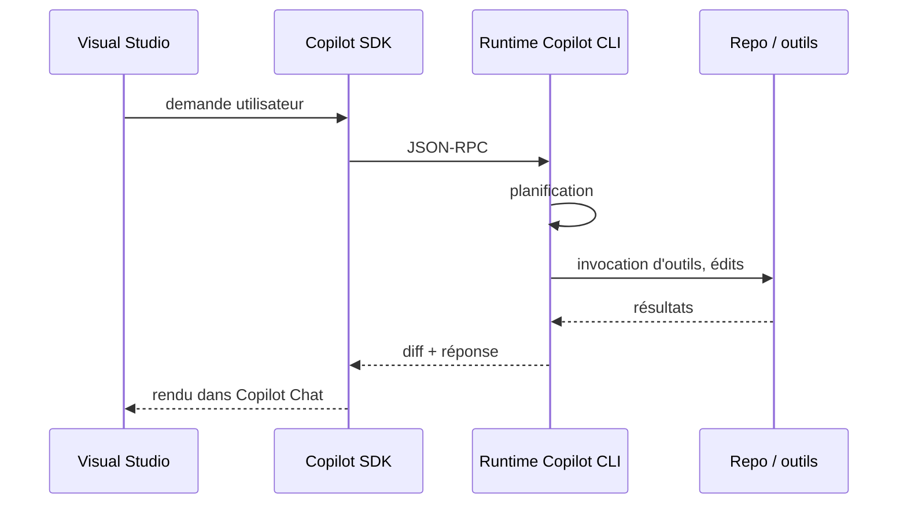
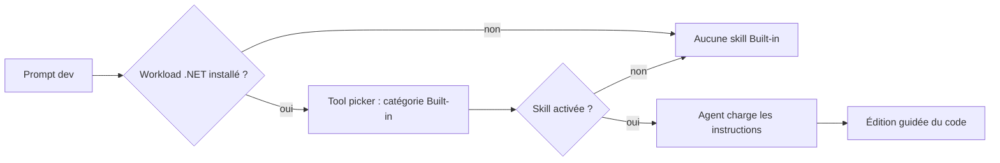

# CSharp — Détail du dimanche 2 août 2026

## 1. Visual Studio 2026 — l'Agent (Preview) tourne sur le GitHub Copilot SDK

**Source :** Visual Studio Blog (Microsoft) — https://devblogs.microsoft.com/visualstudio/visual-studio-july-update-meet-the-new-agent-powered-by-copilot-sdk/
**Date :** 28 juillet 2026

### Contexte

Jusqu'ici, chaque surface Copilot avait son propre agent. Copilot CLI avait le sien, VS Code le sien, Visual Studio encore un autre. Les comportements divergeaient : un même prompt ne produisait pas le même plan d'action selon l'outil, et une tâche commencée dans le terminal ne se reprenait pas dans l'IDE. Pour une équipe qui mélange terminal, éditeur et IDE lourd, ça veut dire trois modèles mentaux à entretenir.

La mise à jour de juillet de Visual Studio 2026 casse cette fragmentation. Le nouvel **Agent (Preview)**, disponible dans le picker d'agent de Copilot Chat, ne réimplémente pas sa propre boucle d'agent : il consomme le **GitHub Copilot SDK**, exactement le même runtime que Copilot CLI. Microsoft présente l'objectif comme « boucler plus de travail avec moins d'allers-retours », avec des réponses plus courtes et plus scannables.

### Comment ça marche

Le SDK n'est pas une bibliothèque de prompts. C'est une **interface programmatique vers le runtime d'agent de Copilot CLI**. La séparation des responsabilités est nette :

1. Ton client (Visual Studio, ou ton propre programme) formule une demande.
2. Le SDK ouvre un canal **JSON-RPC** vers un serveur Copilot CLI.
3. Le **runtime** côté serveur porte toute l'intelligence : planification, choix et invocation des outils, édition des fichiers.
4. Les résultats remontent au client, qui se contente d'afficher et de laisser l'utilisateur valider.

Conséquence directe : l'agent de Visual Studio et celui du terminal partagent la même logique de planification. Le SDK est publié pour .NET, TypeScript, Python, Go, Java et Rust — tu peux donc bâtir ton propre harnais d'agent en C# sur le même runtime que l'outil officiel.

C'est aussi ce qui rend la **continuité inter-surfaces** possible : commence une modification dans Copilot CLI, dans l'app GitHub ou dans VS Code, puis reprends-la dans Visual Studio pour relire, affiner ou poursuivre. L'état de la tâche vit côté runtime, pas côté IDE.



### En pratique — exemple de code

Le transport est du JSON-RPC classique. Voici la forme générale d'un échange, utile pour comprendre ce qui circule quand tu débogues un agent qui « ne fait rien » : la requête porte une méthode et des paramètres, la réponse porte un `id` corrélé.

```json
// Trame JSON-RPC schématique : le client demande, le runtime répond.
// Le client ne décide pas des outils : il transmet l'intention.
{ "jsonrpc": "2.0", "id": 42, "method": "session/prompt",
  "params": { "prompt": "corrige le nullable warning dans OrderService" } }

// Réponse : le runtime a déjà planifié, appelé ses outils et édité les fichiers.
{ "jsonrpc": "2.0", "id": 42,
  "result": { "status": "completed", "filesChanged": ["src/OrderService.cs"] } }
```

Côté activation, rien à installer : ouvre **GitHub Copilot Chat**, clique le sélecteur d'agent en bas de la fenêtre, choisis **Agent (Preview)**. Les retours passent par `Help > Send Feedback > Report a Problem`.

### Pourquoi ça compte pour toi

Tu gagnes un comportement d'agent unique entre ton terminal et ton IDE : un seul modèle mental à entretenir, une tâche reprenable d'une surface à l'autre. Le SDK étant publié en .NET, tu peux aussi câbler ce runtime dans tes propres outils internes — script de migration, générateur de scaffolding — au lieu de réécrire une boucle d'agent maison. C'est encore en preview : garde la revue de diff manuelle.

### Points de vigilance

Le SDK est décrit comme GA dans son dépôt, mais **l'agent Visual Studio est explicitement étiqueté preview**. Ne le branche pas sur des workflows automatisés sans validation humaine.

---

## 2. Agent Skills .NET et Azure livrés d'usine dans Visual Studio 18.8

**Source :** Visual Studio Blog (Microsoft) — https://devblogs.microsoft.com/visualstudio/built-in-agent-skills-in-visual-studio/
**Date :** 28 juillet 2026

### Contexte

Un agent générique connaît le C#, mais pas *tes* conventions ni celles d'ASP.NET Core. Résultat classique : il génère un contrôleur qui compile mais ignore la sémantique HTTP, ou il « optimise » du code en introduisant un anti-pattern async. La réponse de l'écosystème s'appelle **Agent Skills** : des capacités réutilisables, décrites en texte, qu'un agent charge quand la tâche s'y prête.

Depuis la release **18.8**, Visual Studio embarque des skills écrites par les équipes .NET et Azure de Microsoft. Elles apparaissent dans la catégorie **Built-in** du tool picker Copilot, mais seulement si le workload correspondant (.NET ou Azure) est installé. Détail important : elles sont **désactivées par défaut**. Microsoft attend que tu les relises avant de les activer.

### Comment ça marche

Une skill est un dossier avec un fichier de description. L'agent ne charge pas tout le contenu en permanence : il lit d'abord la description courte, décide si elle est pertinente pour la tâche, puis charge les instructions détaillées. C'est un mécanisme de **routage par description** — la qualité du champ `description` détermine si la skill se déclenche au bon moment.

Deux skills .NET sont identifiées d'emblée :

- **`dotnet-webapi`** — pilote la création et la modification d'endpoints HTTP ASP.NET Core : verbes et codes de statut, métadonnées OpenAPI, gestion d'erreurs cohérente.
- **`analyzing-dotnet-performance`** — balaye le code à la recherche d'environ **50 anti-patterns** : async mal formé, allocations mémoire, manipulation de strings, choix de collections, LINQ, expressions régulières, sérialisation, I/O.

Côté Azure, Microsoft met en avant une séquence de déploiement en trois temps : `azure-prepare` génère l'infra (Bicep ou Terraform, `azure.yaml`, Dockerfiles, identité managée), `azure-validate` contrôle configuration, permissions et build avant déploiement, `azure-deploy` exécute l'opération avec reprise sur erreur. S'y ajoutent `azure-kusto` pour les requêtes KQL et `microsoft-foundry` pour le cycle de vie des modèles.

Le dépôt public **`dotnet/skills`** va beaucoup plus loin que les deux skills embarquées : accès aux données, diagnostics, MSBuild, NuGet, migrations de version, .NET MAUI, dev IA, tests, ASP.NET Core, Blazor. Attention : Microsoft ne dit **pas** que tout le dépôt est installé comme skill intégrée.



### En pratique — exemple de code

Une skill se lit comme un document. Voici la structure type d'un `SKILL.md` : un frontmatter YAML minimal pour le routage, puis les instructions. Tu peux en écrire une pour tes propres conventions maison et la poser à côté des skills Microsoft.

```markdown
---
name: conventions-api-interne
description: Applique nos conventions d'API REST internes (pagination,
  enveloppe d'erreur RFC 9457, versioning par header) sur un projet ASP.NET Core.
---

# Conventions d'API interne

## Pagination
Toujours exposer `?page` et `?pageSize`, plafonner `pageSize` à 200.
Renvoyer le total dans le header `X-Total-Count`.

## Erreurs
Utiliser `Results.Problem(...)` — jamais un `500` nu ni un message brut.
```

Pour inspecter une skill livrée par Microsoft : survole son nom dans le tool picker pour voir description et chemin de fichier, ou passe par son menu trois-points pour ouvrir la skill complète ou son dossier.

### Pourquoi ça compte pour toi

Tu as maintenant un vecteur officiel pour injecter du savoir-faire ASP.NET Core dans l'agent, et un modèle à copier pour encoder tes conventions maison — enveloppe d'erreur, pagination, règles EF Core. La skill perf est la plus immédiatement rentable : 50 anti-patterns balayés, c'est une revue de code gratuite avant la tienne. Relis chaque skill avant activation : tu importes des instructions dans ton agent.

### Limites

Le fait qu'elles soient désactivées par défaut n'est pas un détail administratif : une skill est du texte que ton agent exécutera comme instruction. Traite l'activation comme une dépendance ajoutée au projet, pas comme un réglage d'IDE.
