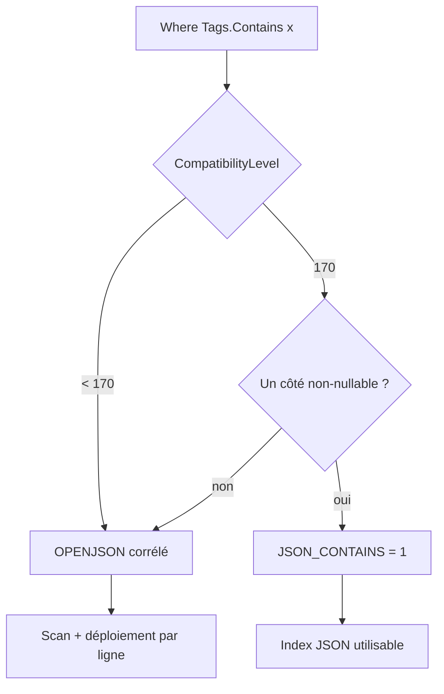
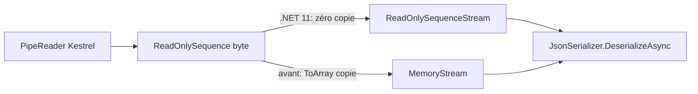

# CSharp — Détail du lundi 3 août 2026

## 1. EF Core 11 — `Contains` sur collection JSON bascule sur `JSON_CONTAINS`

**Source :** Microsoft Learn — https://learn.microsoft.com/en-us/ef/core/what-is-new/ef-core-11.0/whatsnew
**Date :** page mise à jour le 24 juin 2026 (cycle EF Core 11)

### Contexte

Depuis EF Core 8, tu peux mapper une collection de types primitifs — `List<string> Tags` — sur une seule colonne JSON, sans table de jointure. Pratique pour des tags, des rôles, des codes. Le prix caché était la traduction du filtre : `Where(b => b.Tags.Contains("ef-core"))` produisait un `OPENJSON` corrélé, c'est-à-dire une sous-requête qui déplie le document JSON en table pour chaque ligne examinée.

Ce plan est fonctionnel mais coûteux. `OPENJSON` est une fonction table : l'optimiseur SQL Server ne dispose d'aucune statistique dessus, il estime le cardinal par défaut, et aucun index ne peut être utilisé. Sur une table de quelques milliers de lignes ça passe ; sur une table de plusieurs millions filtrée par tag, tu paies un scan complet. SQL Server 2025 a introduit `JSON_CONTAINS`, un prédicat scalaire qui répond à la même question sans matérialiser de table intermédiaire — et surtout capable d'exploiter un index JSON. EF Core 11 câble la traduction.

### Comment ça marche

La bascule n'est pas automatique au sens strict : elle dépend du niveau de compatibilité déclaré sur le provider. `UseSqlServer` passe par défaut au niveau 160 (SQL Server 2022) dans EF 11, ce qui active déjà `LEAST`/`GREATEST`. Pour `JSON_CONTAINS`, il faut monter à 170 (SQL Server 2025) via `UseCompatibilityLevel(170)`. C'est un garde-fou : EF refuse d'émettre du SQL que ta cible ne comprendrait pas.

Une fois le niveau déclaré, le pipeline de traduction reconnaît le motif `collectionJson.Contains(valeur)` et émet `JSON_CONTAINS(colonne, valeur) = 1`. Le prédicat est sargable si un index JSON existe sur la colonne, ce qui change la nature du plan : recherche indexée au lieu de scan plus déplié.

Il reste une subtilité de sémantique, et elle est importante. `JSON_CONTAINS` ne sait pas chercher `null`. EF ne peut donc appliquer la traduction que s'il prouve qu'au moins un des deux côtés est non-nullable — soit la valeur cherchée (constante non nulle, colonne non-nullable), soit les éléments de la collection. Quand il ne peut pas trancher, il retombe silencieusement sur `OPENJSON`. Concrètement : si tu passes une variable `string?` non annotée, tu perds l'optimisation sans aucun avertissement. Vérifie le SQL généré.



### En pratique — exemple de code

```csharp
// Configuration : déclarer la cible SQL Server 2025
protected override void OnConfiguring(DbContextOptionsBuilder options)
    => options.UseSqlServer(_cs, o => o.UseCompatibilityLevel(170));

// Requête inchangée côté LINQ
var blogs = await context.Blogs
    .Where(b => b.Tags.Contains("ef-core"))   // Tags : List<string> mappé en colonne JSON
    .ToListAsync();
```

```sql
-- Avant (ou compat < 170) : sous-requête OPENJSON par ligne
WHERE N'ef-core' IN (
    SELECT [t].[value] FROM OPENJSON([b].[Tags]) WITH ([value] nvarchar(max) '$') AS [t]
)

-- Après (compat 170) : prédicat scalaire, index JSON exploitable
WHERE JSON_CONTAINS([b].[Tags], 'ef-core') = 1
```

Pour les cas que LINQ ne couvre pas — chemin JSON précis, mode de recherche —, EF 11 expose la fonction directement :

```csharp
// Cherche la valeur 8 au chemin $.Rating dans la colonne JsonData
var blogs = await context.Blogs
    .Where(b => EF.Functions.JsonContains(b.JsonData, 8, "$.Rating") == 1)
    .ToListAsync();

// Test d'existence d'un chemin -> JSON_PATH_EXISTS (SQL Server 2022+)
var withOptional = await context.Blogs
    .Where(b => EF.Functions.JsonPathExists(b.JsonData, "$.OptionalInt"))
    .ToListAsync();
```

### Pourquoi ça compte pour toi

Si tu stockes des collections de scalaires en JSON pour éviter une table de jointure, cette traduction décide de la viabilité du modèle à l'échelle. Monte le niveau de compatibilité à 170 seulement après avoir vérifié la version réelle de ton serveur, puis relis le SQL généré sur tes requêtes chaudes. Le repli silencieux vers `OPENJSON` quand la nullabilité est ambiguë est le piège principal : annote correctement tes paramètres.

### Points de vigilance

Sur PostgreSQL, rien de tout ça ne s'applique : Npgsql traduit déjà `Contains` vers les opérateurs `jsonb` natifs. Le sujet concerne la cible SQL Server.

---

## 2. EF Core 11 — `MaxByAsync`/`MinByAsync` traduits, et fin des `CAST` inutiles

**Source :** Microsoft Learn — https://learn.microsoft.com/en-us/ef/core/what-is-new/ef-core-11.0/whatsnew
**Date :** page mise à jour le 24 juin 2026 (cycle EF Core 11)

### Contexte

Deux améliorations distinctes du traducteur SQL, mais un même symptôme évité : du travail inutile côté client ou côté moteur.

`MaxBy` et `MinBy` existent dans LINQ to Objects depuis .NET 6. Elles répondent à une question courante — « quel est l'élément dont la clé est maximale », pas « quelle est la valeur maximale ». Jusqu'ici EF ne savait pas les traduire : appelées sur un `IQueryable`, elles provoquaient une évaluation client, donc le rapatriement de toute la table avant de choisir une ligne. Beaucoup d'équipes contournaient avec `OrderByDescending(...).FirstOrDefault()`, ce qui produit exactement le bon SQL mais exprime moins bien l'intention.

Le second point concerne les `CAST` parasites. EF générait parfois des conversions vers le type déjà stocké, typiquement `CAST([u].[Name] AS nvarchar(max))` sur une colonne qui est déjà `nvarchar(max)`. Le cas classique vient des propriétés à convertisseur de valeur dont le type CLR possède une conversion implicite vers le type provider. Un `CAST` sur une colonne rend le prédicat non-sargable : l'optimiseur ne peut plus utiliser d'index sur cette colonne.

### Comment ça marche

Pour `MaxByAsync`, la traduction est directe : EF construit un `ORDER BY <clé> DESC` suivi d'un `TOP(1)`, en projetant les colonnes de l'entité. La clé peut être une sous-requête corrélée — le compte des posts d'un blog, par exemple —, ce qui reste un plan tout à fait raisonnable côté serveur. `MinByAsync` fait la même chose en ordre ascendant. La différence avec `OrderByDescending().FirstOrDefault()` est purement expressive : le SQL produit est équivalent, mais l'intention est lisible et le risque d'évaluation client disparaît.

Pour les `CAST`, l'élimination se fait en post-traitement de l'arbre SQL, juste avant la génération de texte. EF compare le type cible du `CAST` au type de stockage effectif de l'expression sous-jacente ; s'ils coïncident, le nœud est retiré. C'est une passe d'optimisation, pas un changement de sémantique : le résultat de la requête est identique, seul le plan change.

### En pratique — exemple de code

```csharp
// Avant EF 11 — MaxBy provoquait une évaluation client : toute la table remontait
var blogs = await context.Blogs.ToListAsync();
var withMostPosts = blogs.MaxBy(b => b.Posts.Count);

// Après EF 11 — traduit côté serveur
var withMostPosts = await context.Blogs.MaxByAsync(b => b.Posts.Count());
```

```sql
-- SQL généré : une seule ligne remonte
SELECT TOP(1) [b].[Id], [b].[Name]
FROM [Blogs] AS [b]
ORDER BY (SELECT COUNT(*) FROM [Posts] AS [p] WHERE [b].[Id] = [p].[BlogId]) DESC
```

Et pour les `CAST`, la différence se lit uniquement dans le SQL, à requête LINQ inchangée :

```sql
-- Avant : le CAST bloque l'index sur [Name]
WHERE CAST([u].[Name] AS nvarchar(max)) LIKE N'Name%'

-- EF Core 11 : prédicat sargable
WHERE [u].[Name] LIKE N'Name%'
```

### Pourquoi ça compte pour toi

Le second point est le plus rentable, parce qu'il te profite sans changer une ligne : si tu utilises des convertisseurs de valeur — enums en texte, identifiants fortement typés — tu as probablement des `CAST` qui neutralisent tes index depuis des années. Après migration, compare les plans sur tes requêtes filtrantes. Côté `MaxByAsync`, remplace tes `OrderByDescending().FirstOrDefault()` quand la clé est la vraie intention : c'est plus lisible et l'analyseur ne te laissera plus glisser vers du client-side.

### Pour aller plus loin

EF 11 apporte aussi l'élagage des jointures to-one inutiles en `AsSplitQuery` et la suppression des clés redondantes dans `ORDER BY` — deux gains mesurés respectivement à 29 % et 22 % sur les scénarios de référence.

---

## 3. .NET 11 — quatre nouveaux `Stream` qui n'allouent pas de tampon

**Source :** Microsoft Learn — https://learn.microsoft.com/en-us/dotnet/core/whats-new/dotnet-11/overview
**Date :** page mise à jour le 20 juillet 2026 (état Preview 6)

### Contexte

Le type `Stream` est l'abstraction d'entrée-sortie universelle de .NET. Beaucoup d'APIs ne parlent que ce langage : `JsonSerializer.DeserializeAsync`, les compresseurs, les parseurs de fichiers, les clients HTTP. Le problème apparaît quand la donnée est déjà en mémoire sous une autre forme.

Le cas le plus fréquent : tu as un `ReadOnlyMemory<byte>` issu d'un `ArrayPool`, ou un `ReadOnlySequence<byte>` sorti d'un `PipeReader` Kestrel, et l'API en face veut un `Stream`. Jusqu'ici la seule option portable était `new MemoryStream(array)` — ce qui suppose de posséder un `byte[]` contigu. Depuis un `ReadOnlySequence<byte>` fragmenté en plusieurs segments, il fallait appeler `ToArray()` : une allocation LOH potentielle et une copie complète, sur le chemin chaud d'une requête. Même chose pour une `string` : `new MemoryStream(Encoding.UTF8.GetBytes(s))` alloue deux fois.

.NET 11 ajoute quatre types qui referment ces trous.

### Comment ça marche

Chaque type est un adaptateur mince : il conserve une référence sur la mémoire source et implémente `Read`/`ReadAsync` en avançant un curseur, sans jamais recopier le contenu.

`ReadOnlyMemoryStream` enveloppe un `ReadOnlyMemory<byte>`. Il est en lecture seule, seekable, et sa longueur est connue d'avance — ce qui permet aux consommateurs de dimensionner correctement leurs tampons.

`ReadOnlySequenceStream` enveloppe un `ReadOnlySequence<byte>`, c'est-à-dire une liste chaînée de segments. C'est le type qui compte pour un service ASP.NET Core : le corps de requête arrive déjà sous cette forme via `PipeReader`, et tu peux désormais le passer à un désérialiseur sans le linéariser.

`StringStream` expose une `string` comme flux d'octets, en encodant à la volée segment par segment plutôt qu'en produisant le tableau complet.

`WritableMemoryStream` est le pendant en écriture : il écrit dans un `Memory<byte>` que tu fournis — typiquement un tampon loué à `ArrayPool<byte>.Shared` — au lieu de faire croître un tableau interne par doublements successifs comme `MemoryStream`.



### En pratique — exemple de code

```csharp
// Avant : linéarisation obligatoire, une copie complète du corps de requête
ReadOnlySequence<byte> buffer = (await reader.ReadAsync()).Buffer;
using var ms = new MemoryStream(buffer.ToArray());          // alloc + copie
var dto = await JsonSerializer.DeserializeAsync<OrderDto>(ms);

// Après (.NET 11) : le flux lit directement les segments existants
ReadOnlySequence<byte> buffer = (await reader.ReadAsync()).Buffer;
using var stream = new ReadOnlySequenceStream(buffer);      // aucune copie
var dto = await JsonSerializer.DeserializeAsync<OrderDto>(stream);
```

```csharp
// Écriture dans un tampon loué plutôt que dans un tableau qui double de taille
byte[] rented = ArrayPool<byte>.Shared.Rent(8 * 1024);
try
{
    using var output = new WritableMemoryStream(rented);
    await JsonSerializer.SerializeAsync(output, dto);
    await socket.SendAsync(rented.AsMemory(0, (int)output.Position));
}
finally { ArrayPool<byte>.Shared.Return(rented); }
```

### Pourquoi ça compte pour toi

Sur une API .NET à fort trafic, la copie du corps de requête est une allocation par appel — invisible en profilage naïf, très visible en pression GC de génération 2. `ReadOnlySequenceStream` la supprime sur le chemin `PipeReader → désérialisation`. Cherche dans ton code les `ToArray()` suivis d'un `new MemoryStream` : chacun est un candidat direct. Attention à la durée de vie : ces flux ne possèdent pas leur mémoire, donc ne les laisse pas survivre au tampon sous-jacent.

### Limites

Ces types sont des vues, pas des propriétaires. Si tu rends un tampon à l'`ArrayPool` pendant qu'un `ReadOnlyMemoryStream` le référence encore, tu lis de la mémoire réutilisée par quelqu'un d'autre.
