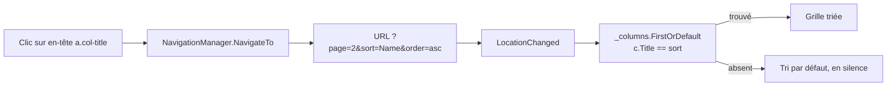
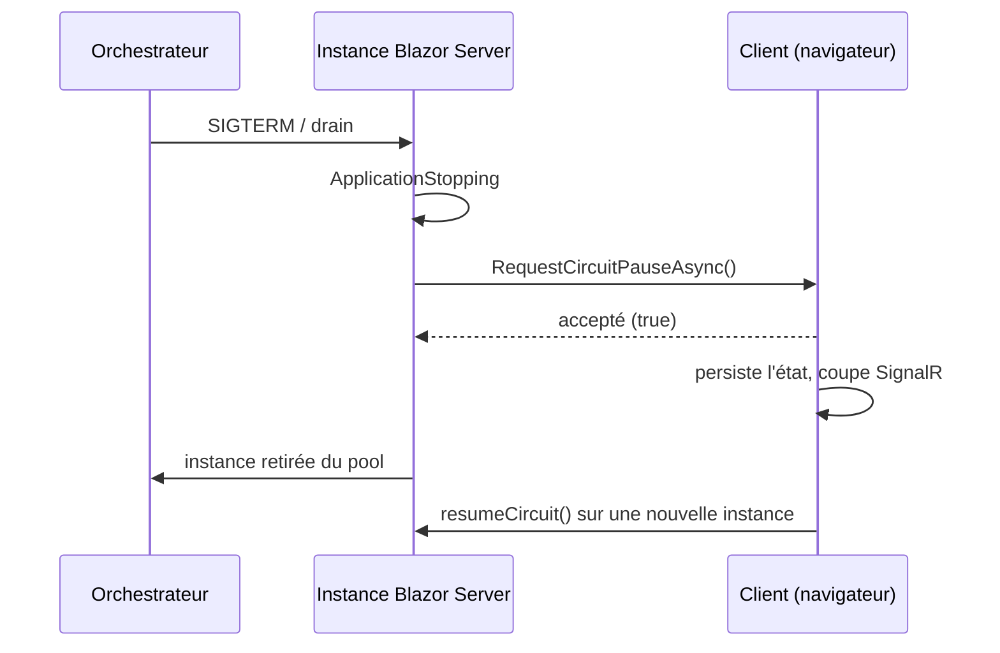

# CSharp — Détail du jeudi 6 août 2026

## 1. QuickGrid en .NET 11 — la pagination et le tri déménagent dans l'URL

**Source :** Microsoft Learn — https://learn.microsoft.com/en-us/aspnet/core/release-notes/aspnetcore-11
**Date :** .NET 11 Preview 7 — standup ASP.NET Core du 4 août 2026

### Contexte

`QuickGrid` est le composant de grille livré avec Blazor. Jusqu'à .NET 10, son état de pagination et de tri vivait **en mémoire, dans le composant**, sans jamais toucher l'URL. Microsoft appelle ce mode *inner-state navigation*. Deux conséquences pratiques : il fallait un mode de rendu interactif (Server ou WebAssembly), et un utilisateur ne pouvait pas partager un lien vers la page 3 triée par date.

.NET 11 introduit la *URL-based navigation*. Ce n'est pas une option qu'on active : c'est le nouveau comportement, avec un interrupteur `AppContext` pour revenir en arrière. Le changement fait basculer QuickGrid dans la catégorie des composants qui fonctionnent en **SSR statique**, sans runtime JavaScript — et il casse au passage deux ou trois choses qu'il faut connaître avant de faire le `dotnet upgrade`.

### Comment ça marche

Suivons le cycle complet d'un clic sur un en-tête de colonne.

**Étape 1 — le rendu.** Les en-têtes triables et les contrôles du paginateur ne sont plus des `<button>` avec un `@onclick`. Ce sont des `<a href="...">`. C'est `StaticHtmlRenderer` qui les produit, donc ils existent même sans interactivité.

**Étape 2 — le clic.** Le navigateur suit le lien. L'URL devient par exemple `?page=2&sort=Name&order=asc`. Trois paramètres seulement :

- `page` : numéro de page **base 1**. La première page **omet** le paramètre, pour garder des URL propres.
- `sort` : le **titre** de la colonne.
- `order` : `asc` ou `desc`.

**Étape 3 — la lecture.** À l'initialisation, QuickGrid lit la query string. Il s'abonne aussi à `NavigationManager.LocationChanged`, ce qui fait fonctionner les boutons précédent/suivant du navigateur et la saisie directe d'une URL. Si les paramètres de tri disparaissent de l'URL, la grille retombe sur sa colonne et sa direction de tri par défaut.

**Étape 4 — la résolution de colonne.** C'est le point à retenir. `sort` contient le `Title` de la colonne, et QuickGrid le résout littéralement par `_columns.FirstOrDefault(c => c.Title == sort.ColumnTitle)`. Aucun titre correspondant ? Le tri est **ignoré en silence** et la grille utilise son tri par défaut. Renommer le `Title` d'une colonne est donc un changement cassant d'URL. Et pour un `PropertyColumn`, le `Title` dérive du nom de propriété — `Property="@(p => p.FirstName)"` produit `Title="First Name"` — donc renommer la propriété casse aussi les URL déjà partagées.

**Étape 5 — le paginateur.** `Paginator` injecte `NavigationManager`, s'abonne à `LocationChanged`, et relit l'index de page à chaque changement d'emplacement. `GoToPageAsync` **navigue** vers l'URL cible au lieu de muter directement `PaginationState` ; l'état est mis à jour par le rappel `LocationChanged`.



### En pratique — exemple de code

Le cas qui casse le plus souvent : deux grilles sur la même page. Ça marchait implicitement avant, ça exige maintenant un préfixe.

```razor
@* --- Avant (.NET 10) : deux grilles cohabitaient sans configuration --- *@
<QuickGrid Items="@people" Pagination="@pagination1">
    <PropertyColumn Property="@(p => p.Name)" Sortable="true" />
</QuickGrid>

<QuickGrid Items="@cities" Pagination="@pagination2">
    <PropertyColumn Property="@(c => c.Label)" Sortable="true" />
</QuickGrid>

@* --- Après (.NET 11) : préfixe unique obligatoire sur la 2e grille --- *@
<QuickGrid Items="@people" Pagination="@pagination1">
    @* préfixe vide par défaut -> page, sort, order *@
    <PropertyColumn Property="@(p => p.Name)" Sortable="true" />
</QuickGrid>

<QuickGrid Items="@cities" Pagination="@pagination2"
           QueryParameterNamePrefix="cities">
    @* -> cities_page, cities_sort, cities_order *@
    <PropertyColumn Property="@(c => c.Label)" Sortable="true" />
</QuickGrid>

@code {
    // UNE instance PaginationState PAR grille. Partager la même instance entre
    // deux grilles à préfixes différents fait que la dernière rendue écrase le
    // nom du paramètre : le Paginator lit alors le mauvais paramètre.
    PaginationState pagination1 = new() { ItemsPerPage = 20 };
    PaginationState pagination2 = new() { ItemsPerPage = 20 };
}
```

Pour revenir au comportement précédent — utile si ton CSS maison n'est pas prêt :

```csharp
// Program.cs, avant builder.Build()
AppContext.SetSwitch(
    "Microsoft.AspNetCore.Components.QuickGrid.EnableUrlBasedQuickGridNavigationAndSorting",
    false);
```

Attention à ce que fait vraiment cet interrupteur : il ne contrôle **que l'élément HTML rendu** (`<a>` contre `<button>`). Même désactivé, QuickGrid continue de lire et d'écrire son état dans la query string, et `SortByColumnAsync` comme `Paginator.GoToPageAsync` naviguent via `NavigationManager.NavigateTo`. Le mode de rendu interactif redevient obligatoire.

### Pourquoi ça compte pour toi

Trois choses à faire avant de migrer. Un : audite ton CSS — tout sélecteur sur `button.col-title` doit aussi viser `a.col-title`, et `nav button` / `nav button:disabled` doivent devenir `nav a` / `nav a[aria-disabled="true"]`. Deux : cherche les pages à plusieurs grilles et ajoute les préfixes. Trois : fige les `Title` de colonnes que tu exposes, ou tes liens partagés casseront en silence. En échange, tu gagnes une grille paginée en SSR statique — sans circuit, sans WebAssembly.

### Pour aller plus loin

`QuickGrid` gagne aussi un paramètre `OnRowClick` : la grille applique automatiquement le curseur pointer et invoque le rappel avec l'élément cliqué. Pratique pour un « voir le détail » sans coller un `<a>` dans chaque cellule. Les colonnes sans `Title` rendent un en-tête `<div>` non cliquable.

---

## 2. Blazor Server — `Circuit.RequestCircuitPauseAsync()` : le serveur demande la pause, le client l'exécute

**Source :** Microsoft Learn — https://learn.microsoft.com/en-us/aspnet/core/release-notes/aspnetcore-11
**Date :** .NET 11 Preview 7 — standup ASP.NET Core du 4 août 2026

### Contexte

Le talon d'Achille de Blazor Server, c'est le circuit : une connexion SignalR persistante qui porte tout l'état de l'interface côté serveur. Redémarre l'instance, et chaque utilisateur connecté voit son formulaire à moitié rempli disparaître derrière un message de reconnexion. C'est le point de friction récurrent des déploiements en rolling update et du scale-in automatique.

.NET 10 avait apporté une réponse partielle : `Blazor.pauseCircuit()` et `Blazor.resumeCircuit()`, appelables **depuis le client** en JavaScript. La pause gracieuse persiste l'état, coupe la connexion, et la reprend plus tard. Utile — mais c'est le client qui décide, et le client ne sait pas que tu vas déployer dans deux minutes.

.NET 11 rend la capacité symétrique.

### Comment ça marche

`Circuit.RequestCircuitPauseAsync(CancellationToken)` demande au client connecté d'**entamer** le flux de pause gracieuse. Trois nuances portent tout le sens de l'API.

**Ce n'est pas un ordre, c'est une demande.** Le serveur ne coupe pas le circuit. Il envoie une requête ; le client répond en lançant sa propre séquence de pause, celle-là même qu'il aurait déclenchée via `Blazor.pauseCircuit()`. La persistance d'état passe par le chemin déjà éprouvé.

**La valeur de retour est le contrat.** La méthode retourne `true` si la demande a été **acceptée** et que le client a été prié de commencer à mettre en pause. Un `false` te dit que ce circuit ne coopère pas — client déjà déconnecté, version de script incompatible, ou refus. Ton code de drain doit traiter ce cas, pas le supposer.

**Le `CancellationToken` annule la demande, pas la pause.** Il coupe la requête avant qu'elle soit acceptée par le framework. Une fois le client parti en pause, ce jeton n'a plus prise.

L'usage naturel est un `IHostApplicationLifetime.ApplicationStopping` : à l'arrêt, tu parcours les circuits actifs, tu demandes la pause à chacun, et tu attends un court délai avant de laisser l'hôte s'éteindre.



### En pratique — exemple de code

```csharp
// Avant (.NET 10) : le serveur subit l'arrêt, le client découvre la coupure.
// Seul recours : Blazor.pauseCircuit() appelé depuis le JS du client,
// qui n'a aucun moyen de savoir qu'un déploiement arrive.

// Après (.NET 11) : on draine explicitement avant de rendre la main.
public sealed class CircuitDrainService : IHostedService
{
    private readonly CircuitRegistry _registry;      // ton suivi des circuits actifs
    private readonly IHostApplicationLifetime _life;
    private readonly ILogger<CircuitDrainService> _log;

    public CircuitDrainService(CircuitRegistry r, IHostApplicationLifetime l,
                               ILogger<CircuitDrainService> log)
        => (_registry, _life, _log) = (r, l, log);

    public Task StartAsync(CancellationToken ct)
    {
        _life.ApplicationStopping.Register(() => DrainAsync().GetAwaiter().GetResult());
        return Task.CompletedTask;
    }

    private async Task DrainAsync()
    {
        // 5 s max : au-delà, on laisse l'hôte s'arrêter de toute façon.
        using var cts = new CancellationTokenSource(TimeSpan.FromSeconds(5));

        foreach (var circuit in _registry.Active)
        {
            // false => ce client ne coopère pas. On log, on n'attend pas.
            bool accepted = await circuit.RequestCircuitPauseAsync(cts.Token);
            if (!accepted)
                _log.LogWarning("Circuit {Id} n'a pas accepté la pause", circuit.Id);
        }
    }

    public Task StopAsync(CancellationToken ct) => Task.CompletedTask;
}
```

### Pourquoi ça compte pour toi

Si tu maintiens du Blazor Server derrière un orchestrateur, tu as probablement un hack maison : bannière « maintenance », drain manuel, ou déploiement nocturne. Cette API remplace ce bricolage par un chemin supporté. Branche-la sur `ApplicationStopping`, borne l'attente à quelques secondes, et traite le `false` comme un cas normal — pas comme une erreur.

### Points de vigilance

La pause repose sur la persistance d'état côté client puis sa reprise. Vérifie ce que ton application met réellement dans l'état de circuit : un `DbContext` scopé ou une connexion ouverte ne survit pas à une pause. C'est aussi une bonne occasion d'auditer les services scopés de tes composants avant de compter sur ce mécanisme en production.
