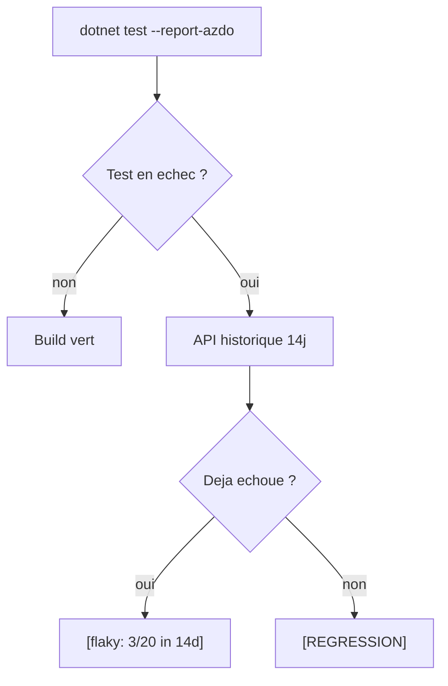
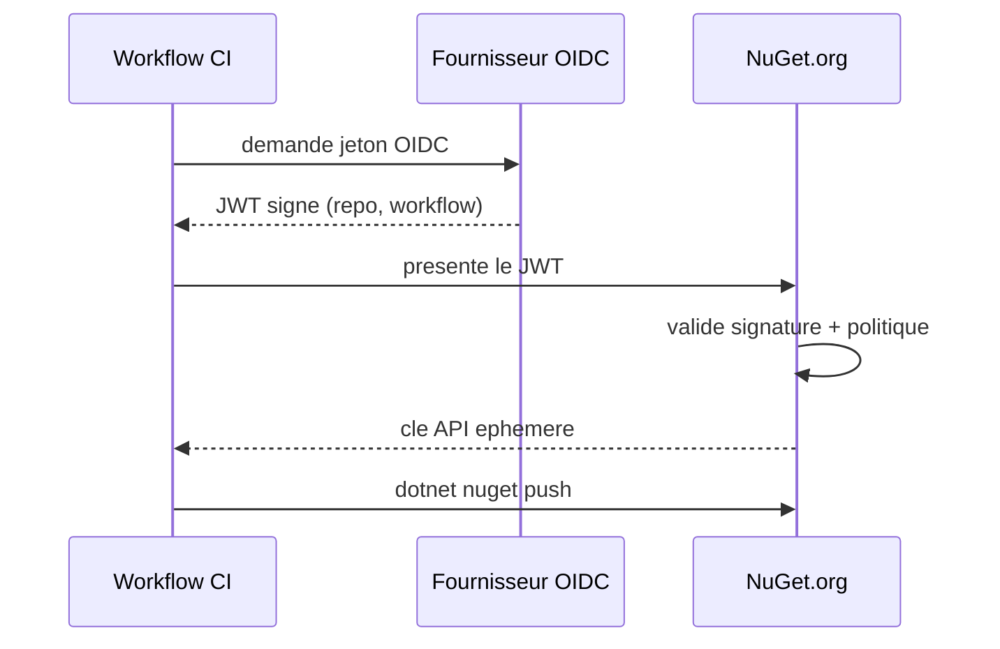

# CSharp — Détail du samedi 8 août 2026

## 1. Microsoft.Testing.Platform 2.3 — l'historique du pipeline distingue régression et flaky

**Source :** .NET Blog — https://devblogs.microsoft.com/dotnet/microsoft-testing-platform-reporting/
**Date :** 6 août 2026

### Contexte

Microsoft.Testing.Platform (MTP) est le moteur qui exécute `dotnet test`, le Test Explorer de Visual Studio et VS Code, et tes runs de CI. Il remplace progressivement VSTest et fonctionne avec MSTest, NUnit, xUnit.net, TUnit et Expecto. Jusqu'ici, l'argument de vente était l'exécution : plus léger, plus rapide, moins de couches. Ce billet documente un déplacement du curseur vers le reporting.

Le problème visé est banal et coûteux. Un test échoue en CI. Tu ouvres le job, tu cherches dans 4 000 lignes de log, tu télécharges un artefact TRX, et tu finis par demander à un collègue si ce test « n'était pas déjà instable ». Dans une suite large, les tests intermittents entraînent les relecteurs à lire le rouge comme du bruit — et à ce moment-là, les vraies régressions héritent du même haussement d'épaules. Le coût n'est pas le test flaky : c'est le temps de réaction sur tout le reste.

### Comment ça marche

Trois mécanismes distincts, à activer indépendamment.

**Annotations inline.** `--report-gh` fait émettre à MTP le format d'annotation que GitHub Actions comprend nativement. Un test en échec devient une annotation sur la ligne de code fautive, visible depuis la pull request sans télécharger d'artefact. Les tests skippés deviennent des warnings, chaque assembly est replié dans son propre groupe de log. `--report-azdo` fait la même chose côté Azure DevOps, et `--publish-azdo-test-results` pousse les résultats dans l'onglet Tests **pendant** que le run tourne, au lieu d'attendre une tâche de publication qui ne s'exécutera que si le job survit.

**Historique flaky.** C'est la partie la plus intéressante, et elle est Azure DevOps uniquement. Avec `--report-azdo-flaky-history 14`, MTP appelle l'API REST Azure DevOps, récupère les 14 derniers jours de résultats du pipeline, et compare chaque échec courant à son propre passé. Un test qui échoue par intermittence depuis deux semaines reçoit l'étiquette `[flaky: failed 3/20 in last 14d]`. Un test sans historique d'échec reçoit `[REGRESSION]`. L'option demande `SYSTEM_ACCESSTOKEN` dans l'environnement du step ; sans lui, le run continue et saute simplement les annotations. `--report-azdo-demote-known-flaky` va plus loin et transforme les échecs flaky connus en warnings — l'équipe testfx elle-même laisse cette option désactivée pour garder tout échec bloquant.

**Rapports résistants au crash.** Les résultats TRX sont désormais écrits en flux au fur et à mesure, pas sérialisés à la fin. Couplé à l'extension crash dump, un processus contrôleur finalise le rapport partiel quand le host meurt, et la console liste nommément les tests encore en cours d'exécution. Un fichier `*.crash.sequence.log` enregistre chaque début et fin de test, ce qui lève l'ambiguïté quand plusieurs tests tournaient en parallèle.



### En pratique — exemple de code

```bash
# Annotations + historique flaky sur Azure DevOps (nécessite SYSTEM_ACCESSTOKEN)
dotnet test --report-azdo --report-azdo-flaky-history 14

# Rapport TRX qui survit à un crash du host de test
dotnet test --report-trx --crashdump

# Noms de fichiers déterministes : évite l'écrasement en build multi-cibles
dotnet test --report-trx --report-trx-filename "reports/{asm}_{tfm}_{time}.trx"
```

```json
// testconfig.json à côté du projet de test : la politique vit dans le dépôt,
// donc les runs locaux et CI produisent les mêmes rapports par défaut.
{
  "commandLineOptions": {
    "report-trx": true,
    "report-html": true,
    "report-azdo": true,
    "report-azdo-flaky-history": 14
  }
}
```

Une option mal orthographiée échoue au démarrage avec un message nommant le fichier, au lieu d'être ignorée en silence.

### Pourquoi ça compte pour toi

Tes options minimales : passer un projet de test en MTP 2.3, ajouter `--report-gh` ou `--report-azdo`, et regarder où apparaît le prochain échec. Vérifie surtout les noms de fichiers TRX si tu multi-cibles : `net8.0` et `net8.0-windows` s'écrasaient mutuellement, c'est une perte de données silencieuse dans les builds matriciels.

### Points de vigilance

Publication live et `PublishTestResults@2` sont deux publieurs indépendants : activer les deux crée deux runs de test dans Azure DevOps. Garde `PublishCodeCoverageResults@2`, rien ici ne remplit l'onglet Code Coverage. Les reporters JUnit et CTRF sont encore en preview, et `--publish-azdo-test-results` a un bug bloquant ouvert sur le dépôt testfx.

---

## 2. NuGet.org — les clés API tombent à 30 jours, et toutes les anciennes expirent le 1er novembre

**Source :** .NET Blog — https://devblogs.microsoft.com/dotnet/strengthening-nuget-supply-chain-security-reducing-api-key-lifetime/
**Date :** 3 août 2026

### Contexte

Une clé API NuGet.org est un mot de passe de publication. Elle a deux défauts structurels : c'est une chaîne libre, facile à perdre, et elle a historiquement eu une durée longue — jusqu'à 365 jours. Stockée dans un secret de dépôt, copiée entre systèmes, embarquée dans une config de build, sa divulgation offre à un attaquant une fenêtre étendue pour publier des versions non autorisées.

Le précédent cité par Microsoft est parlant. Le paquet NX Console a été compromis avec des identifiants volés : la version malveillante a été activée 6 000 fois en 36 minutes avant retrait. D'autres attaques ont eu un rayon bien plus large. npm a fait le même virage il y a peu ; NuGet suit.

### Comment ça marche

Le calendrier est en deux temps, sans période de grâce.

**17 août 2026.** Les nouvelles clés API sont plafonnées à 30 jours. L'option 365 jours disparaît de l'interface.

**1er novembre 2026.** Toutes les clés créées avant le 17 août expirent, quelle que soit leur date d'expiration théorique. C'est le point à retenir : ce n'est pas une expiration naturelle, c'est une révocation de masse.

L'alternative recommandée est Trusted Publishing, lancé en septembre 2025. Le principe repose sur OpenID Connect. Au lieu de lire une clé longue durée dans un coffre de secrets, ton workflow CI/CD présente un jeton d'identité signé et de courte durée, émis par le fournisseur de CI lui-même. NuGet.org valide ce jeton contre une politique configurée par le propriétaire du paquet — dépôt, workflow, et optionnellement environnement — puis émet une clé API temporaire valable pour cette seule opération de publication.

Déroulé pas à pas :

1. Ton workflow GitHub Actions demande un jeton OIDC à GitHub, avec une audience `nuget.org`.
2. GitHub signe un JWT contenant les revendications `repository`, `workflow`, `environment`.
3. Le workflow présente ce JWT à NuGet.org.
4. NuGet.org vérifie la signature via les clés publiques de GitHub, puis compare les revendications à la politique du paquet.
5. Si tout correspond, NuGet.org renvoie une clé API éphémère.
6. `dotnet nuget push` utilise cette clé, qui expire immédiatement après.

Aucun secret long terme ne transite ni ne dort dans le dépôt.



### En pratique — exemple de code

```yaml
# Avant — clé longue durée stockée en secret de dépôt
- run: dotnet nuget push "bin/Release/*.nupkg" \
       --api-key ${{ secrets.NUGET_API_KEY }} \
       --source https://api.nuget.org/v3/index.json

# Après — Trusted Publishing : aucun secret persistant
permissions:
  id-token: write   # autorise le workflow à demander un jeton OIDC
  contents: read
steps:
  - uses: NuGet/login@v1          # échange le jeton OIDC contre une clé éphémère
    id: login
    with:
      user: ${{ vars.NUGET_USER }}
  - run: dotnet nuget push "bin/Release/*.nupkg" \
         --api-key ${{ steps.login.outputs.NUGET_API_KEY }} \
         --source https://api.nuget.org/v3/index.json
```

### Pourquoi ça compte pour toi

Si tu publies des paquets internes ou open source sur NuGet.org, inventorie dès maintenant tes workflows de publication et repère les clés créées avant le 17 août : elles meurent le 1er novembre. Sur GitHub Actions ou GitLab, migre vers Trusted Publishing. Ailleurs, prévois une rotation automatisée à 30 jours et vérifie que les mails d'expiration arrivent sur une boîte réellement surveillée.

### Limites

Trusted Publishing se configure aujourd'hui par dépôt et par workflow, sans politique au niveau organisation — plusieurs mainteneurs le signalent en commentaire comme le blocage principal à l'adoption. Azure DevOps Pipelines n'est pas encore dans la liste des environnements supportés.
