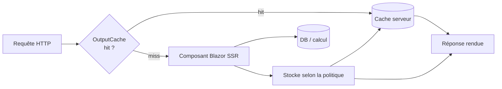

# CSharp — Détail du dimanche 9 août 2026

## 1. .NET 11 Preview 7 — l'output caching s'étend au rendu Blazor

**Source :** ASP.NET Community Standup — What's new in .NET 11 Preview 7 — https://daily.dev/posts/asp-net-community-standup-what-s-new-in-net-11-preview-7--yrf7zkwzq
**Date :** ~4 août 2026

### Contexte

Le rendu serveur (SSR) d'un composant Blazor a un coût : à chaque requête, le serveur ré-exécute le composant, ce qui peut déclencher des appels base de données ou des calculs. Pour une page publique très visitée dont le contenu bouge peu (catalogue, article, tableau de bord read-only), refaire ce travail à l'identique pour chaque visiteur anonyme est du gaspillage. ASP.NET Core a déjà un **middleware d'output caching** depuis .NET 7, mais il ciblait les endpoints (Minimal API, MVC). Preview 7 l'ouvre au **rendu Blazor**, avec Daniel Roth et Javier Calvarro Nelson qui en font la démo au Community Standup.

### Comment ça marche

L'output caching stocke côté serveur la **réponse HTTP déjà rendue** et la re-sert sans repasser par le composant. Une requête entrante est comparée à une **clé de cache** (chemin + variations déclarées : query string, en-têtes). En cas de *hit*, la réponse sort du cache ; en *miss*, le composant se rend, la sortie est capturée puis stockée selon la **politique** (durée d'expiration, tags d'invalidation). L'invalidation par tag permet de vider précisément un ensemble d'entrées quand la donnée change.



### En pratique — exemple de code

On enregistre le service, on active le middleware, puis on applique une politique. L'API est celle de l'output caching existant — c'est son application à Blazor qui est nouvelle.

```csharp
var builder = WebApplication.CreateBuilder(args);

builder.Services.AddRazorComponents().AddInteractiveServerComponents();
// 1) Enregistre l'output cache + une politique nommée
builder.Services.AddOutputCache(options =>
{
    options.AddPolicy("Catalogue", p => p
        .Expire(TimeSpan.FromMinutes(5))   // durée de vie de l'entrée
        .SetVaryByQuery("page", "tri")     // une entrée par (page, tri)
        .Tag("catalogue"));                // pour invalidation ciblée
});

var app = builder.Build();
app.UseOutputCache();                      // 2) middleware AVANT le mapping
app.MapRazorComponents<App>()
   .AddInteractiveServerRenderMode()
   .CacheOutput("Catalogue");              // 3) applique la politique au rendu

// Invalidation quand la donnée change (ex. après un import produit) :
// await cacheStore.EvictByTagAsync("catalogue", ct);
app.Run();
```

### Pourquoi ça compte pour toi

Sur tes pages Blazor SSR à fort trafic et faible fraîcheur, tu gagnes de la perf sans toucher au composant : tu déclares une politique et tu invalides par tag quand la donnée bouge. Attention au piège classique du cache : ne mets jamais en cache une page dont le rendu dépend de l'utilisateur connecté sans `VaryBy` adéquat, sinon tu sers le contenu d'un visiteur à un autre. Réserve-le au contenu anonyme ou varie strictement par identité.

### Points de vigilance

C'est une **preview** : garde-la hors production jusqu'à la LTS de novembre, et vérifie le comportement avec le mode interactif serveur (circuits) avant de généraliser.
