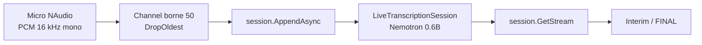

# CSharp — Détail du lundi 10 août 2026

## 1. Foundry Local et C# — transcription vocale en direct avec Nemotron 0.6B

**Source :** .NET Blog — https://devblogs.microsoft.com/dotnet/foundry-local-live-speech-to-text-csharp/
**Date :** 4 août 2026

### Contexte

L'IA locale en .NET se résume souvent à un même exemple : brancher `IChatClient` de `Microsoft.Extensions.AI` sur Ollama et discuter avec un petit modèle. C'est utile mais réducteur. Un poste de travail sait faire tourner des modèles spécialisés — reconnaissance vocale, vision, embeddings — sans GPU ni clé d'API.

Le frein n'a jamais été le modèle mais la plomberie. Il faut choisir la bonne variante pour le matériel disponible, la télécharger, gérer un cache, charger les bons execution providers, puis libérer la mémoire. C'est précisément ce que Foundry Local prend en charge. Bruno Capuano en fait la démonstration avec une application console qui transcrit le micro en temps réel.

### Comment ça marche

Le déroulé se lit en cinq étapes. **Un** : tu initialises `FoundryLocalManager` avec une configuration nommée, puis tu appelles `DownloadAndRegisterEpsAsync()`. Les « EPs » sont les execution providers — les backends d'exécution correspondant au matériel détecté (CPU, DirectML, CUDA). Foundry Local sonde la machine et installe ce qu'il faut.

**Deux** : tu demandes un modèle **par alias** au catalogue, pas par URL. `GetModelAsync("nemotron-speech-streaming-en-0.6b")` renvoie une référence ; `DownloadAsync()` récupère les fichiers avec une callback de progression ; `LoadAsync()` le met en mémoire. Le point important est que Foundry Local possède les métadonnées et la disposition des fichiers du catalogue. Télécharger les poids à la main depuis Hugging Face casserait ce contrat.

**Trois** : `GetAudioClientAsync()` puis `CreateLiveTranscriptionSession()`. Ce n'est pas de la transcription par lot sur un fichier terminé. La session reste ouverte et accepte du PCM brut pendant que la personne parle. Tu fixes le taux d'échantillonnage, le nombre de canaux et la langue dans `session.Settings`.

**Quatre** : la capture. `NAudio.WaveInEvent` fournit des tampons en 16 kHz, 16 bits, mono. Ici se cache le vrai piège d'ingénierie : la callback NAudio est **synchrone**, alors que `session.AppendAsync()` est asynchrone. Lancer un `async void` par tampon produirait un nombre illimité d'opérations en vol. La solution retenue est un `Channel<byte[]>` **borné**, drainé par une tâche dédiée — de la backpressure explicite.

**Cinq** : la lecture des résultats via `session.GetStream()`, un `IAsyncEnumerable`. Chaque élément porte un texte et un drapeau `IsFinal`. Les résultats intermédiaires s'affichent immédiatement ; le résultat final arrive quand le modèle clôt un énoncé. Consomme ce flux depuis une tâche **différente** de celle qui appelle `AppendAsync()`, sinon la lecture bloque la capture.



### En pratique — exemple de code

Résolution du modèle par alias, puis ouverture de la session de transcription. Foundry Local s'occupe du téléchargement et du cache.

```csharp
using Microsoft.AI.Foundry.Local;

// 1. Initialisation + providers d'exécution adaptés au matériel détecté
await FoundryLocalManager.CreateAsync(config, NullLogger.Instance);
using var manager = FoundryLocalManager.Instance;
await manager.DownloadAndRegisterEpsAsync();

// 2. Le modèle est demandé PAR ALIAS, jamais par URL de fichiers
var catalog = await manager.GetCatalogAsync();
var model = await catalog.GetModelAsync("nemotron-speech-streaming-en-0.6b")
    ?? throw new InvalidOperationException("Speech model not found.");

await model.DownloadAsync(p => Console.Write($"\rTéléchargement : {p:F2}%"));
await model.LoadAsync();

// 3. Session live : PCM brut poussé au fil de l'eau, pas un fichier complet
var audioClient = await model.GetAudioClientAsync();
using var session = audioClient.CreateLiveTranscriptionSession();
session.Settings.SampleRate = 16000;   // le modèle attend exactement 16 kHz
session.Settings.Channels   = 1;
session.Settings.Language   = "en";    // cette variante Nemotron est anglophone
await session.StartAsync();
```

Le pont entre la capture synchrone et l'envoi asynchrone passe par un canal borné, qui impose la backpressure.

```csharp
// Canal borné : si le modèle prend du retard, on jette les plus vieux tampons
var audioChannel = Channel.CreateBounded<byte[]>(
    new BoundedChannelOptions(50) { FullMode = BoundedChannelFullMode.DropOldest });

// Une seule tâche pousse vers la session -> pas de fire-and-forget non borné
var appendTask = Task.Run(async () =>
{
    await foreach (var chunk in audioChannel.Reader.ReadAllAsync())
        await session.AppendAsync(chunk);
});

// Lecture des résultats dans une AUTRE tâche, sinon la capture se bloque
await foreach (var result in session.GetStream())
{
    var text = result.Content?[0]?.Text;
    if (result.IsFinal) Console.WriteLine($"\n[FINAL] {text}");
    else if (!string.IsNullOrEmpty(text)) Console.Write(text);
}
```

### Pourquoi ça compte pour toi

Le motif « abstraction quand ça colle, SDK natif quand il faut une capacité spécifique » vaut pour toute ton archi IA en .NET. Retiens surtout la mécanique : catalogue par alias, cycle de vie géré, session streaming consommée en `IAsyncEnumerable`, backpressure par `Channel` borné. C'est du C# ordinaire, testable, sans clé d'API. Pour de l'audio sensible ou un scénario hors ligne, ça t'évite un aller-retour cloud.

### Points de vigilance

L'échantillon est **Windows uniquement** : `Microsoft.AI.Foundry.Local.WinML` cible Windows ML et `NAudio.WaveInEvent` les API audio Windows. Encadre `LoadAsync()` et `StartAsync()` par des `try/finally` qui appellent `StopAsync()` et `UnloadAsync()`, sinon le modèle reste chargé en mémoire après une exception.

---

## 2. .NET 11 — LINQ gagne `FullJoin` et des jointures qui renvoient des tuples

**Source :** Microsoft Learn — https://learn.microsoft.com/en-us/dotnet/core/whats-new/dotnet-11/overview
**Date :** Preview 6, documentation mise à jour le 20 juillet 2026

### Contexte

LINQ propose `Join` (inner join) et `GroupJoin` (base du left join) depuis .NET Framework 3.5. Il n'a jamais eu de jointure externe complète. Pour obtenir un FULL OUTER JOIN en mémoire, il fallait composer deux `GroupJoin` avec `SelectMany`, un `DefaultIfEmpty`, puis un `Except` pour rattraper les orphelins de droite. Le code est long, difficile à relire, et la moindre inattention perd des lignes.

Le second irritant est plus prosaïque. `Join` exige un `resultSelector` même quand tu veux juste la paire des deux éléments. Écrire `(o, i) => (o, i)` à chaque appel est du bruit pur. .NET 11 traite les deux points d'un coup, sur `Enumerable`, `Queryable` et `AsyncEnumerable` — les trois familles restent alignées.

### Comment ça marche

`FullJoin` conserve la signature familière : séquence externe, séquence interne, sélecteur de clé externe, sélecteur de clé interne, sélecteur de résultat. La différence est sémantique. Une clé présente d'un seul côté produit quand même une ligne, avec la valeur manquante à `default`. Pour un type référence, c'est `null` ; pour un type valeur, c'est le zéro du type — d'où l'intérêt de projeter vers des types nullables si tu dois distinguer « absent » de « zéro ».

L'implémentation en mémoire suit le schéma classique : elle construit une table de hachage sur la séquence interne, parcourt la séquence externe en émettant les correspondances, marque les clés internes consommées, puis émet en fin de parcours les entrées internes jamais appariées. Conséquence pratique : la séquence interne est **entièrement matérialisée** avant la première émission, et l'ordre des lignes orphelines de droite arrive à la fin.

Les surcharges tuple sont du sucre syntaxique, mais du bon. `Join` et `GroupJoin` acceptent désormais un appel sans `resultSelector` et rendent un `(TOuter, TInner)` — respectivement `(TOuter, IEnumerable<TInner>)` pour `GroupJoin`. Tu déstructures ensuite dans le `select` ou dans une boucle `foreach`.

Le vrai déblocage est côté base. `Queryable.FullJoin` n'a d'intérêt que si le provider sait le traduire, et EF Core 11 ajoute justement la **traduction FULL OUTER JOIN**. Sur PostgreSQL, `FULL OUTER JOIN` est supporté nativement, donc l'expression LINQ descend en un seul aller-retour SQL au lieu de deux requêtes recollées côté client.

### En pratique — exemple de code

Réconcilier deux sources qui ne se recouvrent pas — le cas d'usage typique : lignes de commande contre lignes de facture.

```csharp
// AVANT — .NET 10 : full outer join reconstitué à la main, verbeux et fragile
var gauche = commandes
    .GroupJoin(factures, c => c.Ref, f => f.Ref, (c, fs) => new { c, fs })
    .SelectMany(x => x.fs.DefaultIfEmpty(), (x, f) => new { Cmd = x.c, Fac = f });

var orphelinsDroite = factures
    .Where(f => !commandes.Any(c => c.Ref == f.Ref))      // O(n*m) si on ne fait pas attention
    .Select(f => new { Cmd = (Commande?)null, Fac = f });

var reconciliation = gauche.Concat(orphelinsDroite);
```

```csharp
// APRÈS — .NET 11 : une seule expression, sémantique explicite
var reconciliation = commandes.FullJoin(
    factures,
    c => c.Ref,                       // clé côté externe
    f => f.Ref,                       // clé côté interne
    (c, f) => new                     // c ou f vaut null selon le côté manquant
    {
        Reference = c?.Ref ?? f!.Ref,
        Commande  = c,
        Facture   = f,
        Ecart     = (c?.Montant ?? 0m) - (f?.Montant ?? 0m)
    });
```

```csharp
// Surcharges tuple : plus besoin d'un resultSelector qui ne fait que réemballer
foreach (var (commande, facture) in commandes.Join(factures, c => c.Ref, f => f.Ref))
    Console.WriteLine($"{commande.Ref} : {commande.Montant} vs {facture.Montant}");

// En IQueryable, EF Core 11 traduit désormais ceci en FULL OUTER JOIN côté PostgreSQL
var ecarts = await db.Commandes
    .FullJoin(db.Factures, c => c.Ref, f => f.Ref, (c, f) => new { c, f })
    .Where(x => x.c == null || x.f == null)
    .ToListAsync();
```

### Pourquoi ça compte pour toi

Tu écris régulièrement des rapprochements de données : commandes contre factures, stock théorique contre stock réel, référentiel contre import. Jusqu'ici tu ramenais les deux jeux en mémoire ou tu descendais en SQL brut. Avec `FullJoin` traduit par EF Core 11, la réconciliation redevient une requête LINQ typée, exécutée en un aller-retour PostgreSQL. Vérifie juste le plan généré sur des volumes réels.

### Limites

`FullJoin` matérialise la séquence interne avant la première émission en LINQ to Objects — évite-le sur un flux infini. Et le `default` renvoyé pour un type valeur est indiscernable d'un vrai zéro : projette vers `decimal?` ou `int?` quand la distinction compte.
