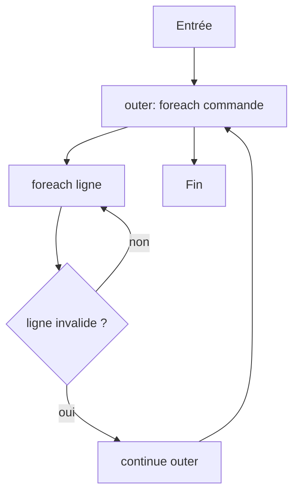
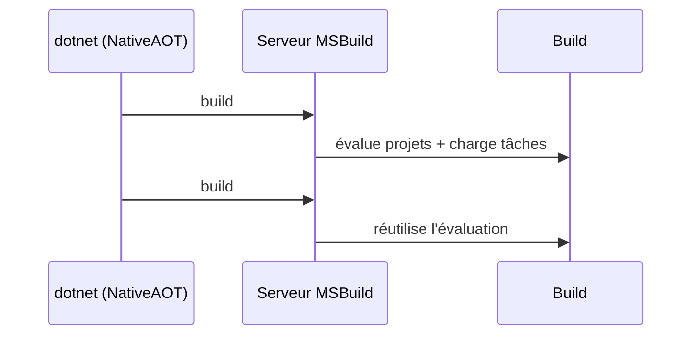

# CSharp — Détail du mercredi 12 août 2026

## 1. C# 15 — `break` et `continue` étiquetés, la fin du drapeau booléen

**Source :** Microsoft Learn — https://learn.microsoft.com/en-us/dotnet/csharp/language-reference/proposals/labeled-break-continue
**Date :** 11 août 2026 (.NET 11 Preview 7)

### Contexte

Sortir de deux boucles imbriquées est un problème vieux comme C#. Jusqu'ici tu avais trois options, toutes bancales. Un **drapeau booléen** que tu positionnes dans la boucle interne et que tu testes à chaque niveau au-dessus : verbeux, et facile à oublier quand tu ajoutes un niveau. Un **`goto`** vers une étiquette placée après les boucles : ça marche, mais tu paies le coût social du mot-clé et la relecture n'est pas plus claire. Ou **extraire la boucle dans une méthode** et faire un `return` : correct, mais tu déplaces du code juste pour contourner une limite syntaxique.

Java a les boucles étiquetées depuis 1995. C# 15, livré avec .NET 11 Preview 7, comble enfin le trou. La feature a fait débat — plusieurs voix ont rappelé que `goto` existe déjà — mais l'argument décisif est la lisibilité locale : l'intention est écrite sur la ligne du saut.

### Comment ça marche

Le principe tient en deux règles.

**Règle 1 — poser l'étiquette.** Tu préfixes une boucle (`for`, `foreach`, `while`, `do`) ou un `switch` par un identifiant suivi de deux-points. C'est la syntaxe d'étiquette existante de C#, celle utilisée par `goto` ; il n'y a pas de nouveau jeton à apprendre.

**Règle 2 — viser l'étiquette.** Depuis n'importe quel niveau imbriqué, `break <étiquette>;` sort de la construction nommée, et `continue <étiquette>;` démarre son itération suivante. La cible doit être une construction **englobante** : le compilateur refuse de sauter vers une étiquette latérale ou descendante. C'est ce qui distingue la feature d'un `goto` — le flux reste structuré, il ne peut que remonter la pile de blocs.

Le point pédagogique est là. Un `break` non étiqueté sort de la boucle **la plus proche** ; c'est implicite et ça dépend du contexte. Un `break outer` sort de la boucle **nommée** ; c'est explicite et ça survit à un refactoring qui insère un niveau intermédiaire. Le second est robuste, le premier est fragile.

Un cas d'usage souvent négligé : `continue` étiqueté. Dans une double boucle de rapprochement, tu veux fréquemment « passer à la ligne suivante » dès qu'une condition est vue dans la boucle interne. Sans étiquette il faut un `break` puis un test après la boucle interne. Avec, c'est une ligne.



### En pratique — exemple de code

Rapprochement de commandes : on rejette une commande entière dès qu'une de ses lignes est invalide.

```csharp
// Avant — C# 14 : drapeau booléen testé à chaque niveau
foreach (var commande in commandes)
{
    var invalide = false;
    foreach (var ligne in commande.Lignes)
    {
        if (ligne.Quantite <= 0) { invalide = true; break; }
        Traiter(ligne);
    }
    if (invalide) continue;   // bookkeeping : facile à oublier si on ajoute un niveau
    Valider(commande);
}
```

```csharp
// Après — C# 15 : l'étiquette nomme la boucle visée, plus de drapeau
outer:
foreach (var commande in commandes)
{
    foreach (var ligne in commande.Lignes)
    {
        if (ligne.Quantite <= 0) continue outer;  // ligne suivante de `commandes`
        Traiter(ligne);
    }
    Valider(commande);
}
```

```csharp
// `break` étiqueté : on arrête tout le balayage dès qu'on trouve le doublon
search:
foreach (var a in gauche)
    foreach (var b in droite)
        if (a.Id == b.Id) { doublon = a; break search; }
```

### Pourquoi ça compte pour toi

Tu écris ce genre de double boucle dans tous tes imports et tes rapprochements de données. Le gain n'est pas la performance, c'est la relecture et la résistance au refactoring : ajouter un niveau de boucle ne casse plus silencieusement la logique. Attends-toi à voir la feature en revue de code — c'est du sucre syntaxique, pas une raison de réécrire du code qui marche. Migre à l'occasion, pas en campagne.

### Points de vigilance

Le langage n'est disponible qu'avec `<LangVersion>preview</LangVersion>` tant que .NET 11 n'est pas GA (10 novembre 2026).

---

## 2. .NET 11 Preview 7 — CLI en NativeAOT et serveur MSBuild activés par défaut

**Source :** .NET Blog — https://devblogs.microsoft.com/dotnet/dotnet-11-preview-7/
**Date :** 11 août 2026

### Contexte

Le temps de démarrage du SDK est une taxe invisible. Elle ne se voit pas sur un build de dix minutes, mais elle se voit très bien sur une CI qui enchaîne vingt commandes courtes, ou sur un `dotnet --help` que tu tapes machinalement. Deux chantiers de longue haleine s'attaquent à cette taxe, et la Preview 7 les bascule tous les deux en **activés par défaut**.

Le premier est le portage du CLI `dotnet` en **NativeAOT**. Le second est le **serveur MSBuild**, un processus de build persistant que .NET traîne en opt-in depuis plusieurs versions. Les deux étaient déjà là ; la nouvelle du 11 août, c'est le changement de valeur par défaut.

### Comment ça marche

**Le CLI en NativeAOT.** Historiquement, `dotnet <commande>` démarrait un hôte natif qui chargeait le runtime, puis exécutait le CLI managé, qui parsait enfin ta ligne de commande. Trois étapes avant que la moindre décision soit prise. Avec le CLI compilé en NativeAOT, l'exécutable contient déjà du code machine : pas de JIT, pas de chargement d'assemblies managées pour le parsing. La note de release précise que la surface complète des commandes est servie depuis ce chemin AOT, `--help` compris, ainsi que le lancement des outils et commandes externes. Le démarrage du CLI managé est court-circuité.

**Le serveur MSBuild.** MSBuild est un moteur d'évaluation : il charge des tâches, résout des cibles, construit un graphe de projets. Ce travail est en grande partie réutilisable d'un build à l'autre. Le serveur MSBuild garde ce processus **vivant entre deux invocations** : la seconde commande se connecte à un moteur déjà chaud au lieu de tout reconstruire. Le gain est proportionnel au nombre de commandes courtes que tu enchaînes, pas à la taille de la solution.

La contrepartie mérite d'être dite. Un processus persistant garde de l'état en mémoire : caches d'évaluation, assemblies de tâches chargées. Si tu développes une **tâche MSBuild custom**, le serveur peut te servir une ancienne version après recompilation. C'est le piège classique, et la raison pour laquelle il faut savoir le tuer.



### En pratique — exemple de code

```bash
# Vérifier le SDK et mesurer la latence fixe du CLI
dotnet --version                     # attendu : 11.0.100-preview.7.xxxxx
time dotnet --help                   # chemin NativeAOT : pas de démarrage du CLI managé

# Le serveur MSBuild est actif par défaut : le 2e build repart à chaud
time dotnet build ./src/Api/Api.csproj
time dotnet build ./src/Api/Api.csproj
```

```bash
# Diagnostic — le levier à connaître quand un build se comporte bizarrement
dotnet build-server shutdown         # tue MSBuild, VBCSCompiler et Razor
export DOTNET_CLI_USE_MSBUILD_SERVER=0   # désactive le serveur pour la session

# Cas typique : après recompilation d'une tâche MSBuild custom,
# le serveur peut encore servir l'ancienne DLL chargée en mémoire.
```

### Pourquoi ça compte pour toi

Deux réflexes à prendre. Sur ta CI, teste la Preview 7 sur un pipeline complet et mesure : le gain est sur la latence fixe, donc proportionnel au nombre d'étapes. Sur ton poste, retiens `dotnet build-server shutdown` : c'est le premier geste quand un build donne un résultat incohérent avec les sources, surtout si tu écris des tâches MSBuild ou des générateurs de source.

### Pour aller plus loin

.NET 11 est une release **STS** de deux ans, GA prévue le 10 novembre 2026. Il reste une preview avant le RC.
