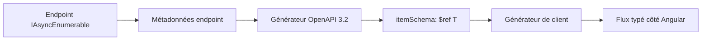
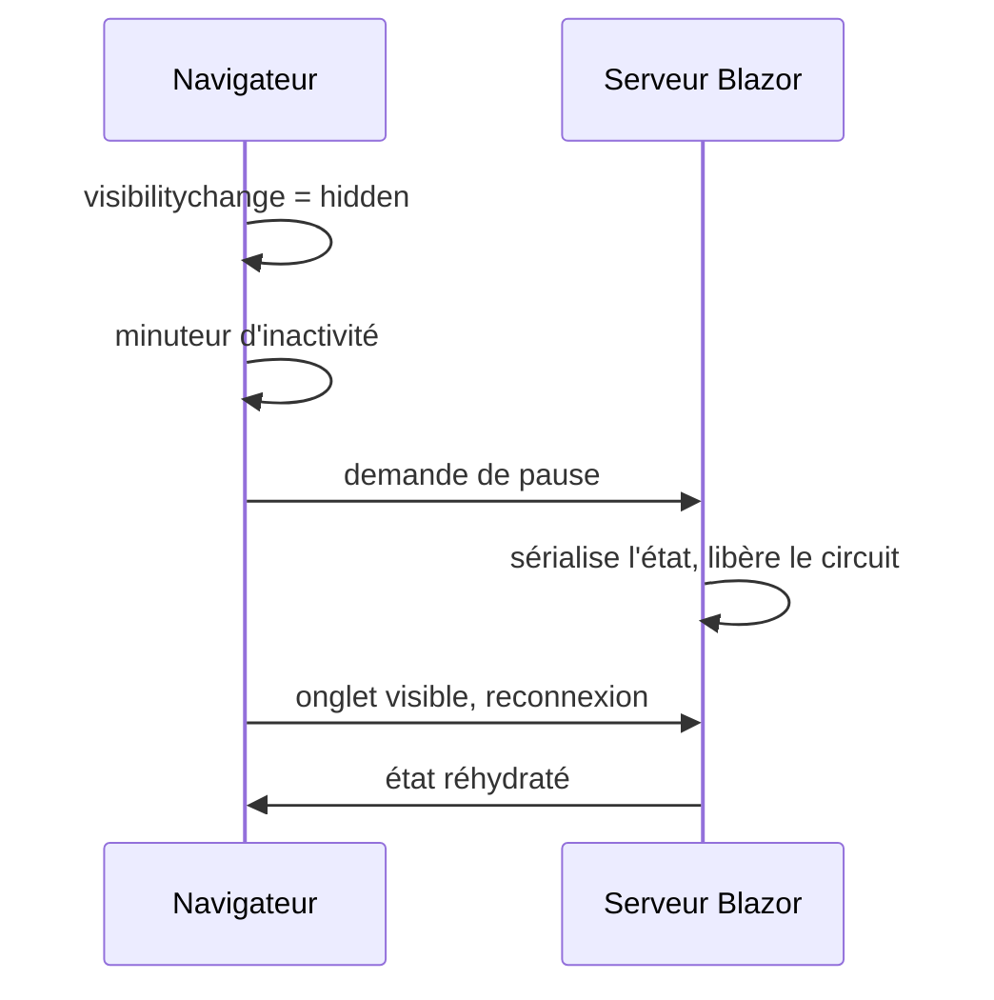

# CSharp — Détail du vendredi 14 août 2026

## 1. ASP.NET Core (.NET 11 Preview 7) — décrire un flux Server-Sent Events dans OpenAPI 3.2

**Source :** dotnet/core — release notes ASP.NET Core Preview 7 — https://github.com/dotnet/core/blob/main/release-notes/11.0/preview/preview7/aspnetcore.md
**Date :** 11 août 2026

### Contexte

Server-Sent Events, c'est le protocole de streaming le plus simple du web : une réponse HTTP qui ne se ferme pas, de type `text/event-stream`, dans laquelle le serveur pousse des lignes `data:` séparées par des lignes vides. Pas de WebSocket, pas de négociation, pas de bibliothèque cliente obligatoire — `EventSource` est natif dans le navigateur. C'est devenu le transport par défaut des réponses de LLM en flux, des barres de progression et des notifications légères.

Le point de friction n'était pas le protocole, c'était sa **description**. OpenAPI 3.0 modélise une réponse comme *un* corps avec *un* schéma. Un flux SSE, c'est N événements successifs, chacun avec son propre schéma. Le document généré indiquait donc `text/event-stream` sans plus, et tes générateurs de clients — NSwag, Kiota, openapi-generator — produisaient soit rien, soit un `string`. Résultat : côté Angular, tu écrivais ton parsing SSE à la main, avec ton propre type TypeScript recopié depuis le DTO C#, et sans rien pour détecter la dérive entre les deux.

### Comment ça marche

OpenAPI 3.2 introduit un mot-clé pour ce cas exact : **`itemSchema`**. Il se pose à côté de `schema` dans un `content` et signifie « ce corps est une séquence ; voici le schéma d'**un élément** de la séquence ». Le générateur de client peut alors produire un flux typé plutôt qu'une chaîne.

Le pipeline, étape par étape :

**Étape 1 — l'endpoint déclare son type de retour.** Dans une Minimal API, tu renvoies un `IAsyncEnumerable<T>` enveloppé par `TypedResults.ServerSentEvents(...)`. La signature porte donc `T`, le type de l'élément, pas le type du flux.

**Étape 2 — le générateur OpenAPI inspecte les métadonnées d'endpoint.** ASP.NET Core reconnaît le résultat SSE et sait qu'il a affaire à une séquence de `T`, non à un `T` unique.

**Étape 3 — émission du document.** Au lieu d'écrire `schema: {$ref: T}` sous `text/event-stream`, il écrit `itemSchema: {$ref: T}`. Le schéma de `T` est ajouté aux `components` comme n'importe quel DTO.

**Étape 4 — génération du client.** L'outil lit `itemSchema` et génère une méthode qui rend un flux d'objets typés, pas une réponse unitaire.

Rien de tout cela ne change le format sur le fil : ce qui transite reste du SSE standard. C'est purement une amélioration du contrat.



### En pratique — exemple de code

Un endpoint de progression de traitement, streamé en SSE.

```csharp
// Le DTO est un type normal : il finira dans components/schemas.
public record Progression(int Pourcent, string Etape);

app.MapGet("/import/{id:guid}/progression", (Guid id, CancellationToken ct) =>
{
    async IAsyncEnumerable<Progression> Suivre([EnumeratorCancellation] CancellationToken t)
    {
        for (var p = 0; p <= 100; p += 10)
        {
            yield return new Progression(p, p < 100 ? "traitement" : "termine");
            await Task.Delay(500, t);
        }
    }

    // Preview 7 : ce résultat est reconnu par le générateur OpenAPI,
    // qui émet itemSchema plutôt qu'un schema de corps unique.
    return TypedResults.ServerSentEvents(Suivre(ct), eventType: "progression");
})
.WithName("SuivreImport");
```

Ce que le document produit, avant et après :

```json
// Avant — OpenAPI 3.0 : le client ne sait rien de la forme des événements
{ "text/event-stream": { "schema": { "type": "string" } } }

// Après — OpenAPI 3.2 : chaque événement est typé
{ "text/event-stream": { "itemSchema": { "$ref": "#/components/schemas/Progression" } } }
```

### Pourquoi ça compte pour toi

Tu as sûrement un endpoint de progression ou de log en direct entre ton API .NET et ton front Angular, avec un type TypeScript recopié à la main. Sur .NET 11, ce contrat redevient généré : ton DTO C# est la source unique, et un changement de champ casse la génération au lieu de casser l'UI en production. Vérifie juste que ton générateur de clients gère OpenAPI 3.2 — plusieurs sont encore bloqués en 3.0.

### Points de vigilance

`AddOpenApi()` émet déjà de l'OpenAPI 3.2 par défaut depuis la Preview 6. Si un outil de ta chaîne (portail de doc, passerelle d'API, validateur de contrat) refuse encore la 3.2, tu peux forcer une version inférieure — mais tu perds `itemSchema` au passage. Teste la chaîne complète avant de compter dessus.

---

## 2. Blazor Server (.NET 11 Preview 7) — pause automatique du circuit quand l'onglet est caché

**Source :** dotnet/core — release notes ASP.NET Core Preview 7 — https://github.com/dotnet/core/blob/main/release-notes/11.0/preview/preview7/aspnetcore.md
**Date :** 11 août 2026

### Contexte

Le modèle Blazor Server repose sur le **circuit** : une connexion SignalR persistante entre le navigateur et le serveur, avec l'arbre de rendu et l'état des composants conservés côté serveur. C'est ce qui rend le modèle si productif — tu écris du C# qui accède directement à `DbContext` — et c'est aussi son coût. Chaque onglet ouvert, c'est de la mémoire serveur immobilisée, plus une connexion maintenue.

Le problème est banal et coûteux : les utilisateurs ne ferment pas les onglets. Ils les laissent en arrière-plan pendant des heures. Un circuit inactif consomme autant qu'un circuit actif. La pause de circuit a été introduite pour ça : sérialiser l'état, libérer les ressources serveur, et restaurer à la reprise. .NET 11 avait déjà livré la face serveur, avec la possibilité de **demander** une pause. Il manquait le déclencheur : le serveur ne sait pas qu'un onglet est caché. Seul le navigateur le sait.

### Comment ça marche

La Preview 7 ajoute un paquet **opt-in** qui installe côté client la logique de détection. Le mécanisme se lit en quatre temps.

**Détection.** Le script Blazor s'abonne à l'événement `visibilitychange` du document. Quand `document.visibilityState` passe à `hidden` — onglet en arrière-plan, fenêtre minimisée, écran verrouillé — un minuteur démarre.

**Délai de grâce.** Le minuteur est configurable. C'est essentiel : un utilisateur qui bascule deux secondes sur un autre onglet ne doit pas payer le coût d'une pause et d'une reprise. Le délai typique se compte en minutes.

**Demande de pause.** À l'expiration, si l'onglet est toujours caché, le client demande la pause. Le serveur sérialise l'état du circuit dans un magasin persistant et libère la mémoire du circuit actif.

**Reprise.** L'onglet redevient visible, le client rouvre une connexion, le serveur réhydrate l'état depuis le magasin. L'utilisateur retrouve son formulaire à moitié rempli.

Le point non trivial est la **sérialisation de l'état**. Tout ce que tes composants tiennent en champ doit être sérialisable ou reconstructible. Un `DbContext` ou une connexion ouverte ne l'est pas — d'où le caractère opt-in : c'est à toi de décider si ton application le supporte.



### En pratique — exemple de code

Activation côté serveur, avec le délai d'inactivité.

```csharp
// Program.cs — la pause serveur existe déjà ; on ajoute ici le déclencheur client.
builder.Services.AddRazorComponents()
    .AddInteractiveServerComponents(options =>
    {
        // Combien de temps l'onglet doit rester caché avant de demander la pause.
        options.HiddenPageInactivityDelay = TimeSpan.FromMinutes(3);

        // Le magasin doit survivre à la libération du circuit :
        // en ferme d'instances, viser un magasin distribué, pas la mémoire locale.
        options.PersistedCircuitInMemoryMaxRetained = 200;
    });
```

Un composant qui tient une ressource non sérialisable doit la relâcher et la reprendre :

```csharp
// Avant : la connexion est ouverte pour la durée de vie du composant -> bloque la pause.
private NpgsqlConnection _cnx = new(_chaine);

// Après : rien de non sérialisable en champ ; on ouvre à l'usage, on relâche aussitôt.
private async Task<IReadOnlyList<Ligne>> ChargerAsync(CancellationToken ct)
{
    await using var cnx = new NpgsqlConnection(_chaine);
    await cnx.OpenAsync(ct);
    return await cnx.QueryAsync<Ligne>("select * from lignes limit 50");
}
```

### Pourquoi ça compte pour toi

Si tu exploites du Blazor Server derrière un back .NET, c'est la fonctionnalité qui rend ta facture mémoire proportionnelle aux utilisateurs *actifs*, pas aux onglets ouverts. Le travail réel n'est pas l'activation : c'est l'audit de tes composants pour supprimer les champs non sérialisables. Fais-le sur les pages les plus ouvertes en premier, et mesure avant/après sur un environnement de test.

### Pour aller plus loin

En ferme d'instances, la reprise peut tomber sur un autre serveur que celui qui a servi la pause. Le magasin d'état persisté doit donc être partagé — Redis ou SQL Server — sinon la reprise échoue et l'utilisateur perd sa saisie exactement dans le scénario que la fonctionnalité prétend améliorer. Teste la reprise derrière ton load balancer réel, pas en local.
