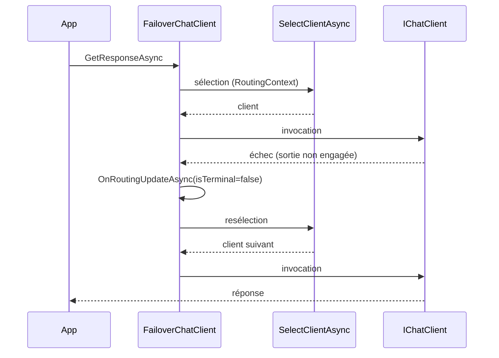

# CSharp — Détail du samedi 15 août 2026

## 1. Microsoft.Extensions.AI 10.9.0 — `RoutingChatClient` et `FailoverChatClient`

**Source :** .NET Blog — https://devblogs.microsoft.com/dotnet/routing-and-failover-for-microsoft-extensions-ai/
**Date :** 13 août 2026

### Contexte

Quand une application .NET appelle un LLM, trois contraintes arrivent ensemble : le coût, la disponibilité et la latence. Router entre plusieurs modèles agit sur les trois d'un coup. Jusqu'ici, chaque équipe écrivait sa propre couche : un `switch` sur le type de requête, un `try/catch` autour du client principal, un fallback bricolé. Le résultat était rarement testable et jamais réutilisable.

`Microsoft.Extensions.AI` 10.9.0 fait entrer ce besoin dans l'abstraction existante. Les quatre nouveaux types sont des `IChatClient`, donc ils se composent avec tout le reste du pipeline : `ConfigureOptionsChatClient`, `FunctionInvokingChatClient`, la télémétrie. Tous sont marqués `[Experimental]` avec le diagnostic `MEAI001`.

### Comment ça marche

`RoutingChatClient` est abstrait. À chaque appel de `GetResponseAsync` ou `GetStreamingResponseAsync`, il appelle `SelectClientAsync`, transmet l'appel au client retourné, puis propage la réponse. Un `RoutingContext` frais est créé par requête ; il contient les messages et un **clone** de `ChatOptions`. L'objet d'options du caller n'est jamais passé tel quel à un client sous-jacent, donc une modification faite après le début de l'appel n'est pas observée. Ce clonage sépare proprement deux niveaux : les options **de requête**, portées par `context.ChatOptions` et persistantes entre deux tentatives, et les options **de route**, portées par le client lui-même via un wrapper `ConfigureOptions`.

`SemanticRoutingChatClient` route sur le sens. Tu fournis un dictionnaire client → énoncés d'exemple. Au premier appel, tous les énoncés sont embarqués en un seul appel batché, et les vecteurs sont mis en cache. Ensuite, chaque requête n'embarque que le dernier message utilisateur et le compare. Le client dont le score dépasse `scoreThreshold` gagne ; sinon c'est `defaultClient`. `topK` fixe le nombre de correspondances agrégées, `scoreAggregation` vaut `Mean` ou `Sum`. `topK: 5` avec `Mean` est un point de départ raisonnable : la moyenne est plus stable qu'un unique voisin le plus proche, et garde les scores sur l'échelle `-1`/`1`, donc un seuil de `0.3` signifie la même chose quel que soit `topK`.

`FailoverChatClient` ajoute une boucle de retry. Le point clé est la notion de **sortie engagée** : tant qu'aucun update de streaming n'a atteint le caller, un échec déclenche une nouvelle sélection. Une fois la sortie commencée, l'échec devient terminal — il n'y a pas de reprise en cours de flux. En non-streaming, la question ne se pose pas. Le hook `OnRoutingUpdateAsync` reçoit un `FailoverChatClientAttempt` après chaque invocation, succès compris, avec `Duration`, `TimeToFirstUpdate`, `Exception`, `ResponseCompleted` et `OutputCommitted`. C'est ta source de données pour un circuit breaker ou un scoring de latence.

Attention à un piège documenté : une exception levée par *ton* code ne produit aucun callback. Si `SelectClientAsync` lève, aucun update n'est émis ; si `OnRoutingUpdateAsync` lève pendant un update non terminal, aucun retry ne suit. Libère ton état par requête **avant** de lever.



### En pratique — exemple de code

Le passage d'un fallback maison à la primitive du framework :

```csharp
// Avant — fallback maison : pas de télémétrie, pas de garde sur la sortie engagée
try { return await primary.GetResponseAsync(msgs, opts, ct); }
catch { return await backup.GetResponseAsync(msgs, opts, ct); }

// Après — bascule ordonnée, options clonées par requête, attempts observables
var failover = new OrderedFailoverChatClient([primary, backup, lastResort]);
var response = await failover.GetResponseAsync(msgs, opts, ct);
```

Et le routage sémantique, qui remplace un classifieur écrit à la main :

```csharp
// Route sur le sens du dernier message utilisateur, pas sur un mot-clé.
// Les embeddings des profils sont générés une fois puis mis en cache.
var router = new SemanticRoutingChatClient(
    embeddingGenerator,
    clientProfiles: new Dictionary<IChatClient, IReadOnlyList<string>>
    {
        [codingClient]   = ["write code", "fix this bug", "refactor this function"],
        [creativeClient] = ["write a story", "brainstorm names", "generate a poem"],
    },
    defaultClient: generalClient,   // filet quand rien ne franchit le seuil
    scoreThreshold: 0.3f);
```

### Pourquoi ça compte pour toi

Si tu as déjà un `try/catch` autour d'un appel LLM dans une API ASP.NET Core, remplace-le par `OrderedFailoverChatClient` : tu gagnes la télémétrie par tentative gratuitement. Mais garde ces types derrière ta propre interface — ils sont `[Experimental]`, l'API bougera. Retiens surtout la règle de placement : un routeur autour de `FunctionInvokingChatClient` fige le modèle pour toute la boucle d'outils.

### Limites

Le routeur choisit **avant** d'invoquer, une fois par requête. Le cascading qualité, l'ensemble et le hedging sont hors périmètre : ils exigent d'appeler plusieurs clients. Le re-routage à chaque tour coûte aussi cher : tu perds le cache de prompt et tu peux orphaner un artefact de raisonnement propriétaire. Décide une fois, puis colle à la route.

---

## 2. Rx.NET 7.0 — les intégrations UI Windows quittent `System.Reactive`

**Source :** InfoQ — https://www.infoq.com/news/2026/08/rx-net-7/
**Date :** 14 août 2026

### Contexte

`System.Reactive` traîne une dette d'empaquetage depuis des années. Le paquet embarquait les intégrations WPF, Windows Forms, UWP et Windows Runtime — essentiellement des schedulers qui savent revenir sur le thread UI. Sur une application de bureau, c'est ce que tu veux. Sur un service ASP.NET Core, une fonction Azure ou un worker Linux, ces références n'ont aucun sens et pourtant elles voyagent avec le paquet.

Le symptôme devient concret en publication self-contained ou NativeAOT : l'application acquiert des dizaines de mégaoctets de dépendances de framework jamais appelées. Rx.NET 7.0 corrige ça, et rien d'autre. La release est volontairement étroite.

### Comment ça marche

Le mécanisme à comprendre est celui de la **fermeture de dépendances**. Quand tu publies en self-contained, le SDK ne copie pas seulement tes assemblies : il calcule le graphe transitif complet et embarque tout ce qui est atteignable. Une référence déclarée par un paquet suffit à faire entrer un pan entier de framework dans la sortie, même si aucun de tes chemins de code ne l'exécute jamais.

Le trimmer sait éliminer du code mort, mais il travaille sous contrainte. Les schedulers UI utilisent des patterns que l'analyse statique ne peut pas prouver inatteignables : réflexion, activation par type, dispatch dynamique. Face au doute, le trimmer conserve. C'est pour ça qu'on ne peut pas régler ce problème en aval, avec un flag de publication : il faut le régler **en amont**, au niveau du paquet.

D'où la séparation. `System.Reactive` ne contient plus que le cœur agnostique — `IObservable<T>`, les opérateurs, les schedulers non-UI. Les intégrations vivent dans des paquets dédiés que tu référence explicitement si tu es une application de bureau. Une application serveur ne les voit jamais, et sa fermeture de dépendances rétrécit d'autant.

C'est exactement la même logique que celle appliquée depuis .NET 5 sur les paquets `Microsoft.Extensions.*` : un cœur d'abstractions, des paquets d'intégration séparés par technologie. Le principe général vaut aussi pour ton propre code : une bibliothèque partagée qui référence un framework UI contamine tous ses consommateurs.

### En pratique — exemple de code

La migration se joue dans le `.csproj`. Une application serveur n'a rien à faire ; une application WPF doit ajouter le paquet d'intégration.

```xml
<!-- Avant — Rx.NET 6 : un seul paquet, les intégrations UI viennent avec -->
<ItemGroup>
  <PackageReference Include="System.Reactive" Version="6.0.1" />
</ItemGroup>

<!-- Après — Rx.NET 7 : le cœur seul. Une API ASP.NET Core s'arrête ici. -->
<ItemGroup>
  <PackageReference Include="System.Reactive" Version="7.0.0" />
</ItemGroup>
```

Vérifie l'effet plutôt que de le supposer :

```bash
# Mesure la fermeture de dépendances réellement publiée, avant et après.
dotnet publish -c Release -r linux-x64 --self-contained true
du -sh bin/Release/net11.0/linux-x64/publish

# Liste ce qui entre dans la sortie : c'est là qu'on voit les assemblies fantômes
ls bin/Release/net11.0/linux-x64/publish/*.dll | wc -l
```

### Pourquoi ça compte pour toi

Si tu publies des services .NET en conteneur ou en self-contained, cette release réduit ton image sans que tu changes une ligne de logique. Mesure avant/après avec `dotnet publish` plutôt que de croire l'annonce. Et retiens le principe pour tes propres bibliothèques internes : une référence UI dans un paquet partagé se propage à tous les consommateurs et survit au trimmer.

### Points de vigilance

Si tu maintiens une application WPF ou WinForms qui utilise `ObserveOn(DispatcherScheduler.Current)`, la montée en version cassera la compilation tant que tu n'as pas ajouté le paquet d'intégration correspondant. C'est une erreur de compilation franche, pas un bug silencieux — ce qui est la bonne façon de casser.
