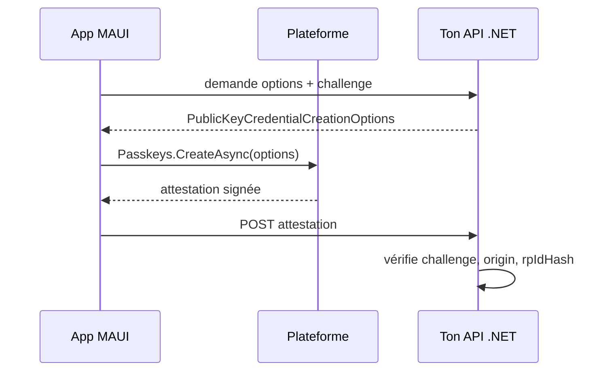

# CSharp — Détail du mercredi 19 août 2026

## 1. .NET 11 Preview 7 — l'API Passkeys de MAUI s'arrête là où ton serveur commence

**Source :** InfoQ — https://www.infoq.com/news/2026/08/dotnet-11-preview7-maui/
**Date :** 18 août 2026 (release du 11 août 2026)

### Contexte

Les passkeys remplacent le mot de passe par une paire de clés asymétriques : la clé privée reste dans l'enclave sécurisée de l'appareil, la clé publique est stockée par le serveur. Le standard sous-jacent est **WebAuthn** du W3C, avec la spécification CTAP côté authentificateur. Jusqu'ici, en .NET, tu implémentais ça côté web via `navigator.credentials` dans le navigateur, ou via des SDK natifs par plateforme dans une app mobile.

.NET 11 Preview 7 ajoute une API `Passkeys` dans MAUI Essentials qui pilote l'expérience native sur Android 14+, iOS et Mac Catalyst 16+, et les versions supportées de Windows 10. Le point important, et c'est ce qu'InfoQ souligne : l'API gère **uniquement la cérémonie côté plateforme**. Les responsabilités serveur restent entièrement à ta charge. Si tu es le backend .NET derrière une app MAUI, ce n'est pas une news mobile — c'est un ticket dans ton backlog.

### Comment ça marche

Une cérémonie WebAuthn se déroule toujours en deux temps symétriques : **enregistrement** (attestation) puis **authentification** (assertion). Dans les deux cas, le serveur — le *relying party* — génère un `challenge` aléatoire à usage unique, le client le fait signer par l'authentificateur, et le serveur vérifie la signature.

Étape par étape pour l'enregistrement. Ton API génère un challenge cryptographiquement aléatoire, le stocke lié à la session, et renvoie les `PublicKeyCredentialCreationOptions` : identifiant du relying party (ton domaine), identifiant utilisateur, algorithmes acceptés, critères d'authentificateur. `Passkeys.CreateAsync` transmet ces options à la plateforme, qui déclenche Face ID, Touch ID ou Windows Hello. L'appareil génère la paire de clés, et renvoie un objet d'attestation. Ton serveur doit alors : vérifier que le challenge correspond, que l'origine est la tienne, que le `rpIdHash` correspond au hash de ton domaine, puis extraire et persister la clé publique et le `credentialId`.

Pour l'authentification, `Passkeys.AssertAsync` fait signer un nouveau challenge par la clé privée. Ton serveur retrouve la clé publique par `credentialId`, vérifie la signature, et surtout **contrôle le compteur de signatures** (`signCount`) : s'il n'a pas augmenté, tu as probablement affaire à un authentificateur cloné.



Dernier point, souvent oublié : l'association de domaine. Sur Apple, il faut les **Associated Domains** et un fichier **Apple App Site Association** servi sur ton domaine ; sur Android, les **Digital Asset Links**. Sans ça, la plateforme refuse de lier la passkey à ton `rpId` et rien ne fonctionne — c'est un point de configuration serveur, pas app.

### En pratique — exemple de code

Côté client, l'appel est court ; toute la complexité est dans ce que tu lui donnes et ce que tu fais du retour :

```csharp
// Côté MAUI — la plateforme fait la biométrie, rien de plus.
if (!Passkeys.IsSupported)
    return await FallbackToPasswordAsync();

// 1. Le challenge vient du serveur, JAMAIS du client.
var options = await _api.GetCreationOptionsAsync(userId);

// 2. La plateforme génère la paire de clés et signe l'attestation.
var attestation = await Passkeys.CreateAsync(options);

// 3. Le serveur valide et persiste la clé publique.
await _api.RegisterCredentialAsync(attestation);
```

Côté serveur ASP.NET Core, l'esquisse de ce que l'API MAUI ne fait pas pour toi :

```csharp
[HttpPost("passkeys/register")]
public async Task<IResult> Register(AttestationDto dto, CancellationToken ct)
{
    // a. Le challenge doit être à usage unique et lié à la session.
    var expected = await _challenges.ConsumeAsync(User.GetSessionId(), ct);
    if (expected is null || !CryptographicOperations.FixedTimeEquals(
            expected, dto.ClientData.Challenge))
        return Results.Unauthorized();

    // b. L'origine et le rpIdHash doivent correspondre à TON domaine.
    if (dto.ClientData.Origin != _opts.Origin) return Results.Unauthorized();

    // c. Persiste credentialId + clé publique + signCount initial.
    await _credentials.AddAsync(User.GetUserId(), dto.CredentialId,
                                dto.PublicKey, dto.SignCount, ct);
    return Results.Ok();
}
```

### Pourquoi ça compte pour toi

Si une app MAUI arrive dans ton périmètre, tu hérites de la moitié serveur : endpoints d'options, stockage des challenges à usage unique, validation d'attestation et d'assertion, suivi du `signCount`, et fichiers d'association servis sur ton domaine. Prévois aussi un plan de repli — `Passkeys.IsSupported` est faux sur les plateformes anciennes. Et rappelle-toi qu'un credential est lié à un `rpId` : changer de domaine invalide toutes les passkeys enregistrées.

### Pour aller plus loin

Le reste de Preview 7 côté MAUI vaut un coup d'œil si tu touches au sujet. **XAML Incremental Hot Reload** combine un source generator et `MetadataUpdateHandler` pour modifier les pages déjà construites au lieu de tout reconstruire ; c'est activé par défaut en Debug et fonctionne avec `dotnet watch`. Les **templates de routes Shell** reprennent les concepts d'ASP.NET Core et de Blazor — segments requis, optionnels, par défaut, contraints, catch-all, comme `product/{sku}` — avec les valeurs qui transitent par `QueryProperty` et `IQueryAttributable`, mais uniquement en navigation absolue pour l'instant. Enfin, `{RelativeSource AncestorType=...}` compile désormais en `TypedBinding` trim-safe quand le type ancêtre est résoluble à la compilation, ce qui supprime une source classique de casse au trimming.
