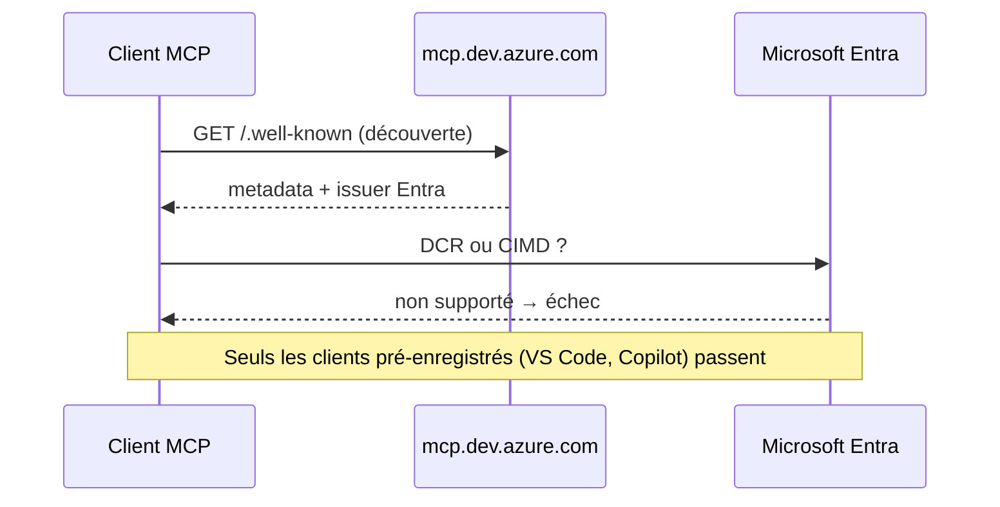

# CSharp — Détail du vendredi 21 août 2026

## 1. Aspire 13.5 — `WithTerminal()`, imports de fichiers et AppHost TypeScript en GA

**Source :** InfoQ — https://www.infoq.com/news/2026/08/dotnet-aspire-13-5-release/
**Date :** 20 août 2026

### Contexte

Aspire est le modèle d'orchestration local de .NET : un projet AppHost décrit en C# les projets, conteneurs et ressources externes de ton application, et le dashboard te donne logs, traces et métriques agrégés. La branche 13 avait élargi le périmètre — AppHost TypeScript, déploiement Kubernetes et Docker Compose, intégration des agents de code.

**Aspire 13.5** change de registre. Peu de nouvelles cibles, beaucoup de confort quotidien. Le fil conducteur : réduire les allers-retours entre le dashboard, le terminal et l'explorateur de fichiers pendant une session de développement.

### Comment ça marche

Trois mécanismes méritent d'être compris.

**L'Interaction Service.** C'est le canal par lequel une commande de ressource parle au développeur là où il se trouve — dashboard ou CLI. Jusqu'ici il gérait saisie de texte et notifications. Il accepte maintenant des **imports de fichiers** : une commande ouvre un sélecteur restreint aux JSON ou YAML, impose une limite de taille, et l'AppHost reçoit un `Stream` à lire. Ça remplace le détour habituel qui consistait à déposer un fichier dans un répertoire convenu avant de lancer un script. S'y ajoutent les dialogues de progression avec annulation, et les **arguments nommés** : une commande déclare ses paramètres, le dashboard les rend en contrôles de saisie et la CLI les expose en options. Même déclaration, deux surfaces.

**`WithTerminal()`.** Attaché à une ressource, il lui donne une session terminal interactive dans le dashboard. Ce n'est pas un flux de logs : tu tapes dedans. Utile pour un shell, un REPL, `psql`, une console EF Core. Tu peux basculer entre réplicas, revenir aux logs console sans tuer la session, et plusieurs personnes peuvent s'attacher au même processus. La fonctionnalité et ses commandes associées sont marquées expérimentales.

**AppHost TypeScript en GA.** Il ne demande plus d'opt-in expérimental. Interaction Service, uploads de fichiers et dialogues de progression fonctionnent identiquement depuis C# et TypeScript, et la release comble les derniers trous : health checks personnalisés et copie de fichiers dans les conteneurs. Les certificats HTTPS de développement peuvent être attribués directement depuis l'AppHost aux ressources projet et exécutable, mais ces API restent expérimentales.

Côté déploiement, les workloads Kubernetes peuvent modéliser un **volume persistant** — classe de stockage, capacité, mode d'accès — et Aspire émet le PersistentVolumeClaim correspondant. De nouvelles méthodes permettent de référencer des ressources Azure existantes à travers groupes de ressources, souscriptions et tenants, en gardant les détails d'environnement hors du code source de l'AppHost.

### En pratique — exemple de code

Avant / après sur une commande d'import de configuration, plus l'ajout d'un terminal :

```csharp
// Avant (Aspire 13.4) — l'utilisateur devait déposer le fichier lui-même
var api = builder.AddProject<Projects.Api>("api")
    .WithCommand("seed", "Importer le jeu de données",
        _ => { /* lit ./seed/data.json, chemin conventionnel non vérifié */ });
```

```csharp
// Après (Aspire 13.5) — l'Interaction Service ouvre un sélecteur et livre un Stream
var api = builder.AddProject<Projects.Api>("api")
    .WithCommand("seed", "Importer le jeu de données", async ctx =>
    {
        var svc = ctx.ServiceProvider.GetRequiredService<IInteractionService>();
        var file = await svc.PromptFileAsync(new FileInputOptions
        {
            AllowedExtensions = [".json", ".yaml"],   // filtre côté sélecteur
            MaxSizeInBytes = 5 * 1024 * 1024          // garde-fou explicite
        });
        await using var stream = file.OpenRead();      // rien à écrire sur disque
        return CommandResults.Success();
    });

// Terminal interactif attaché à la ressource (expérimental en 13.5)
builder.AddContainer("pg", "postgres:17").WithTerminal();
```

### Pourquoi ça compte pour toi

`WithTerminal()` t'évite un `docker exec` à chaque fois que tu veux ouvrir `psql` sur ta base de dev. L'Interaction Service avec imports transforme tes scripts de seed en commandes cliquables, sans convention de chemin fragile. Prévois par contre la migration : `ServiceProvider` devient `Services`, l'intégration GitHub Models est dépréciée et le chat AI Assistant du dashboard disparaît.

### Pour aller plus loin

La CLI Aspire s'installe et se met à jour via Homebrew, WinGet, npm, Nix, mise et NuGet. L'extension VS Code, rebaptisée Aspire, ouvre le dashboard en panneau latéral, débogue Bun et MAUI, et affiche les commandes de ressource directement dans l'arbre.

---

## 2. Azure DevOps Remote MCP Server GA — quand Entra bloque les agents tiers

**Source :** InfoQ — https://www.infoq.com/news/2026/08/azure-devops-remote-mcp-ga/
**Date :** 21 août 2026

### Contexte

Jusqu'ici, brancher un assistant de code sur Azure DevOps voulait dire faire tourner un serveur MCP local par développeur, avec un Personal Access Token dans un fichier de configuration. Ça marche, mais ça multiplie les copies d'un secret à durée de vie longue et les portées trop larges.

Microsoft rend **généralement disponible** le serveur MCP distant d'Azure DevOps : un endpoint hébergé qui expose work items, pull requests, dépôts et pipelines, sans rien à installer. La nuance qui fait l'actualité : Claude Desktop, Claude Code, ChatGPT et Cursor ne peuvent pas s'y connecter, et le blocage est chez Microsoft, pas chez eux.

### Comment ça marche

L'endpoint vit sur `https://mcp.dev.azure.com/{organization}` et parle **streamable HTTP** — le transport que la spécification MCP a normalisé pour remplacer les serveurs stdio locaux. Côté client compatible, la configuration tient en une entrée dans `mcp.json`.

L'authentification passe par **Microsoft Entra**, et c'est là que tout se joue. Pour qu'un client OAuth puisse s'authentifier auprès d'un serveur d'autorisation qu'il ne connaissait pas à l'avance, il lui faut l'un de deux mécanismes :

- **Dynamic Client Registration (DCR)** : le client s'enregistre lui-même auprès du serveur d'autorisation au premier contact et récupère un `client_id`.
- **Client ID Metadata Documents (CIMD)** : le client publie un document de métadonnées à une URL, et cette URL *est* son identifiant — plus besoin d'enregistrement préalable.

Entra ne supporte ni l'un ni l'autre. Les clients qui n'ont pas d'application pré-enregistrée dans le tenant restent donc à la porte. Dan Hellem, product manager Azure Boards/Repos/Wiki, le formule directement : le support dépend de la capacité du client à s'authentifier avec Entra.

Le timing est ironique. La spécification MCP **2026-07-28**, publiée une semaine avant cette GA, a justement réordonné ces mécanismes : clients pré-enregistrés d'abord, puis CIMD, avec DCR en repli déprécié et prévu pour disparaître après l'été 2027. Entra ne supporte aucun des deux mécanismes sur lesquels la spec s'appuie.



Une seconde restriction est définitive, pas en attente : l'organisation doit être adossée à un tenant Entra. Les organisations autonomes sur compte Microsoft ne sont pas supportées.

### En pratique — exemple de code

```json
// mcp.json — configuration d'un client compatible Entra (VS Code + GitHub Copilot)
{
  "servers": {
    "ado-remote-mcp": {
      "url": "https://mcp.dev.azure.com/{organization}",
      "type": "http"
    }
  },
  "inputs": []
}
```

Aucun secret dans ce fichier : c'est tout l'intérêt. Le jeton est émis par Entra au nom de l'utilisateur connecté, et l'assistant hérite exactement de ses permissions Azure DevOps, ni plus ni moins.

```bash
# Repli pour un agent tiers : le serveur MCP local, aligné sur l'outillage du distant
npx -y @azure-devops/mcp {organization}
```

### Pourquoi ça compte pour toi

Si ton équipe est sur Visual Studio Code avec Copilot, tu supprimes un PAT par développeur et tu gagnes le triage de build depuis l'éditeur — quelle étape a échoué, pourquoi, sans ouvrir cinq onglets sur un log de quatre mille lignes. Si tu standardises sur Claude Code ou Cursor, tu continues d'héberger un serveur local par poste. Retiens surtout le principe : MCP normalise la découverte et l'appel d'outils, pas l'identité.

### Points de vigilance

Microsoft n'a publié aucun calendrier pour les travaux Entra. Le serveur local reste maintenu et Microsoft s'engage sur la parité fonctionnelle entre les deux, ce qui rend le repli viable — mais tu portes la charge d'exploitation et la gestion des credentials que tes collègues sous Copilot n'ont plus.
