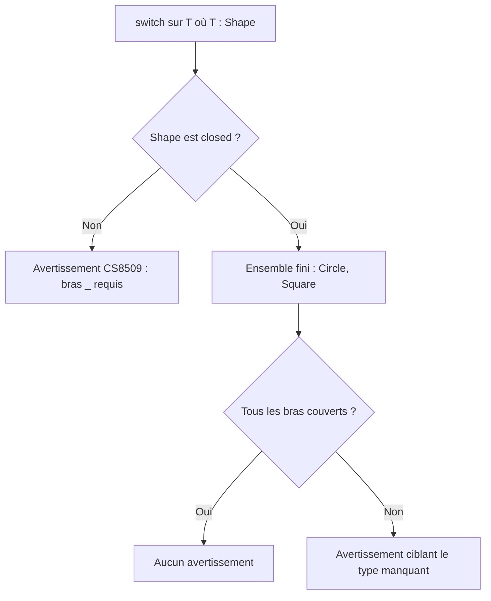
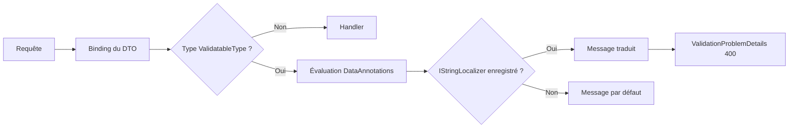

# CSharp — Détail du dimanche 23 août 2026

## 1. C# 15 (.NET 11 Preview 7) — exhaustivité des `switch` sur les hiérarchies `closed`

**Source :** dotnet/core — https://github.com/dotnet/core/blob/main/release-notes/11.0/preview/preview7/csharp.md
**Date :** 11 août 2026

### Contexte

Une hiérarchie fermée, c'est la façon C# de dire au compilateur : « ce type a exactement ces sous-types, et pas d'autres ». Tu la déclares avec le modificateur `closed`. L'intérêt n'est pas décoratif : dès que le compilateur connaît la liste complète des formes possibles, il peut vérifier qu'un `switch` les traite toutes. C'est le contrat qu'un développeur venant de F#, Rust ou TypeScript attend d'un type somme.

Jusqu'à Preview 6, ce raisonnement s'arrêtait au premier générique. Si ta méthode prenait `T shape` avec `where T : Shape` au lieu de `Shape shape`, le compilateur perdait le fil. Il ne voyait plus une hiérarchie fermée mais un paramètre de type opaque, et te réclamait un bras `_ => throw new UnreachableException()` pour un cas qui ne peut littéralement pas se produire. Ce bras mort est un poison discret : il pollue la couverture de tests et masque les vraies régressions le jour où tu ajoutes un sous-type.

### Comment ça marche

Preview 7 apprend au compilateur à propager la fermeture à travers la contrainte générique. Le raisonnement se déroule en trois temps.

**Premier temps — la déclaration.** `public closed record class Shape;` publie une hiérarchie fermée. Le compilateur enregistre l'ensemble exact des types dérivés visibles au moment de la compilation, ici `Circle` et `Square`.

**Deuxième temps — la contrainte.** Quand il rencontre `where T : Shape`, il ne traite plus `T` comme un type inconnu. Puisque `Shape` est fermé, tout `T` valide est nécessairement l'un des types dérivés déclarés. L'ensemble des valeurs possibles de `T` est donc lui aussi fini et connu.

**Troisième temps — le contrôle d'exhaustivité.** Le compilateur confronte les bras du `switch` à cet ensemble. S'ils le couvrent intégralement, aucun avertissement `CS8509` n'est émis. S'il manque un cas, l'avertissement pointe précisément le type non traité. Le jour où tu ajoutes `Triangle` à la hiérarchie, tous les `switch` incomplets du dépôt te le signalent à la compilation.

L'autre changement de Preview 7 concerne les **patterns d'union**, toujours en préversion. Ils adoptent une stratégie dite « try-both » : le motif est d'abord confronté au type union lui-même, puis, en cas d'échec, à la valeur qu'il contient. Cette double tentative règle l'ambiguïté qui apparaissait quand un motif pouvait légitimement viser l'un ou l'autre niveau.

Enfin, un détail de robustesse mérite d'être noté : les helpers générés par le compilateur pour les `InlineArray` intègrent désormais un contrôle de nullité. Former une référence à partir d'un buffer nul lève maintenant de façon déterministe, au lieu de produire un comportement indéfini plus loin dans l'exécution.



### En pratique — exemple de code

Le code ci-dessous calcule l'aire d'une forme. Seul le comportement du compilateur change entre les deux versions.

```csharp
// Avant — Preview 6 : le compilateur ne voit pas que T est fermé.
// CS8509 : il réclame un bras par défaut pour un cas impossible.
static double Area<T>(T shape) where T : Shape => shape switch
{
    Circle(var r) => Math.PI * r * r,
    Square(var s) => s * s,
    _ => throw new UnreachableException() // bras mort, jamais couvert par les tests
};
```

```csharp
// Après — Preview 7 : la fermeture traverse la contrainte générique.
public closed record class Shape;
public record class Circle(double Radius) : Shape;
public record class Square(double Side) : Shape;

static double Area<T>(T shape) where T : Shape => shape switch
{
    Circle(var r) => Math.PI * r * r,
    Square(var s) => s * s
    // Plus de bras _ : ajouter Triangle fera échouer la compilation ici.
};
```

### Pourquoi ça compte pour toi

Tu modélises régulièrement des états métier — statut de commande, résultat d'appel, type de document — avec une hiérarchie de records. Cette évolution te rend l'exhaustivité utilisable dans le code générique, donc dans tes handlers et tes pipelines réutilisables. Concrètement : tu supprimes les bras `_ => throw` qui gonflaient artificiellement ta couverture, et le compilateur devient ton filet quand la hiérarchie s'enrichit.

### Limites

- Les types union restent en préversion, derrière un drapeau. Le comportement « try-both » peut encore bouger avant la GA de novembre 2026.
- La fermeture ne vaut que pour les types dérivés visibles à la compilation : une hiérarchie `closed` exposée à travers une frontière d'assembly demande de vérifier ce que voit réellement le consommateur.

---

## 2. ASP.NET Core (.NET 11 Preview 7) — messages de validation localisés sans plomberie

**Source :** dotnet/core — https://github.com/dotnet/core/blob/main/release-notes/11.0/preview/preview7/aspnetcore.md
**Date :** 11 août 2026

### Contexte

Localiser les messages de validation d'une API .NET a longtemps relevé du bricolage administré. La voie classique passe par `ErrorMessageResourceType` et `ErrorMessageResourceName` sur chaque attribut `DataAnnotations`, ce qui couple chaque DTO à un type de ressource généré, casse à la moindre renommée de clé, et ne survit pas à un refactoring un peu large. La voie alternative — remplacer le `IValidationAttributeAdapterProvider` — fonctionne, mais suppose de connaître un point d'extension que personne ne découvre par hasard.

En parallèle, les Minimal APIs de .NET 10 avaient introduit une validation déclarative avec les attributs `ValidatableType` et `SkipValidation`, restés en préversion. Preview 7 règle les deux sujets d'un coup.

### Comment ça marche

**La localisation devient conditionnelle à une seule chose : la présence d'un `IStringLocalizer` dans le conteneur.** Si tu appelles `AddLocalization()`, le pipeline de validation résout un localisateur et l'utilise pour traduire les messages produits par les attributs standards. Si tu ne l'appelles pas, rien ne change et les messages restent en anglais. Aucun attribut à modifier, aucun adaptateur à écrire.

Le mécanisme s'insère à l'endroit où le message est matérialisé, pas là où la règle est évaluée. La règle `[Required]` continue de décider si la valeur est absente ; c'est la production de la chaîne d'erreur qui passe par le localisateur, avec le message anglais par défaut comme clé de recherche dans le fichier de ressources. C'est ce détail qui rend l'adoption non intrusive : tes attributs restent lisibles, ta traduction vit dans un `.resx` à côté.

**Deuxième changement : `ValidatableType` et `SkipValidation` sortent de préversion.** Le premier marque un type comme devant être validé quand il traverse une Minimal API ; le second exclut explicitement une propriété ou un paramètre. La validation devient donc déclarative de bout en bout, sans filtre écrit à la main.

**Troisième point, à lire comme un avertissement.** Preview 6 avait activé une protection cross-origin automatique sur tous les endpoints. Preview 7 annule ce choix : seuls les endpoints qui l'activent explicitement sont validés, ce qui rétablit le comportement de .NET 10. La raison affichée est de ne pas casser les applications existantes. La conséquence pratique : si tu comptais sur la protection implicite de Preview 6, tu dois maintenant l'activer endpoint par endpoint.



### En pratique — exemple de code

Le contraste tient en quelques lignes de configuration.

```csharp
// Avant — chaque attribut porte sa plomberie de ressources
public class CreateOrderRequest
{
    [Required(ErrorMessageResourceType = typeof(Messages),
              ErrorMessageResourceName = "OrderRef_Required")]
    [StringLength(32, ErrorMessageResourceType = typeof(Messages),
                      ErrorMessageResourceName = "OrderRef_TooLong")]
    public string Reference { get; set; } = "";
}
```

```csharp
// Après — les attributs redeviennent lisibles, la traduction vit dans le .resx
var builder = WebApplication.CreateBuilder(args);
builder.Services.AddLocalization(o => o.ResourcesPath = "Resources");
builder.Services.AddValidation(); // active la validation des Minimal APIs

[ValidatableType]
public class CreateOrderRequest
{
    [Required]
    [StringLength(32)]
    public string Reference { get; set; } = "";

    [SkipValidation]                       // champ de diagnostic, hors contrat
    public string? TraceHint { get; set; }
}
```

### Pourquoi ça compte pour toi

Sur une API .NET destinée à un front Angular francophone, tu écrivais jusqu'ici la traduction des erreurs côté client, ou tu remappais les codes à la main. Ce changement te permet de renvoyer directement un `ValidationProblemDetails` déjà localisé, et de garder une seule source de vérité pour les messages. Vérifie en revanche la négociation de langue : c'est `RequestLocalizationMiddleware` qui décide de la culture, pas l'attribut.

### Points de vigilance

- La localisation ne s'active que si un `IStringLocalizer` est effectivement résolu — un `AddLocalization()` oublié en environnement de test produit silencieusement des messages anglais.
- La protection cross-origin repasse en opt-in : relis tes endpoints si tu avais adopté le comportement de Preview 6.
- `.NET 11` reste en préversion jusqu'en novembre 2026 ; ces API peuvent encore bouger d'ici la RC.
