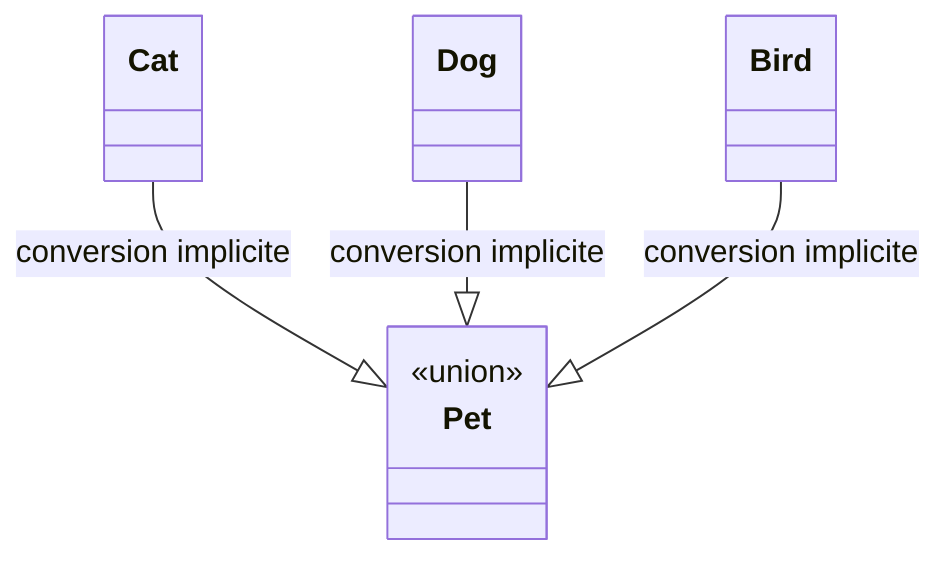
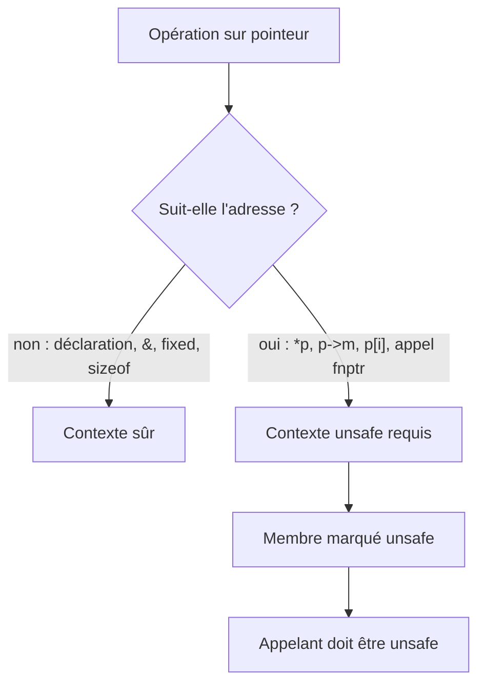

# CSharp — Détail du mardi 25 août 2026

## 1. C# 15 — les types union, un ensemble fermé de cas sans héritage

**Source :** .NET Blog (Bill Wagner) — https://devblogs.microsoft.com/dotnet/explore-csharp-15/
**Date :** 24 août 2026

### Contexte

Tu modélises régulièrement des valeurs qui peuvent prendre plusieurs formes : un résultat qui est soit une réussite soit une erreur, un événement de domaine qui est l'un de cinq types, une réponse d'API qui varie selon un discriminant. En C# jusqu'ici, tu avais trois options, toutes imparfaites. Un `object` : le compilateur ne t'aide plus du tout. Une interface marqueur : n'importe qui peut l'implémenter, y compris depuis un autre assembly. Une classe de base abstraite : impose une relation d'héritage entre des types qui n'en ont pas naturellement.

Le problème commun est que le compilateur ignore l'**ensemble complet** des cas possibles. Il ne peut donc pas vérifier qu'un `switch` les couvre tous. Tu écris un bras `_ => throw new InvalidOperationException(...)` et tu découvres l'oubli à l'exécution, en production. C# 15 comble ce trou avec les types union, disponibles dès .NET 11 Preview 7.

### Comment ça marche

Un type union déclare, en une ligne, la liste exhaustive des **types-cas** qu'une valeur peut porter. Le point clé : ces types n'ont besoin d'aucun lien de parenté. `Cat`, `Dog` et `Bird` peuvent être trois records indépendants.

Le compilateur génère les conversions implicites de chaque type-cas vers le type union. Tu écris `Pet pet = new Dog("Rex");` sans wrapper explicite. À la lecture, le pattern matching redevient une vraie analyse de cas : comme l'ensemble est connu et fermé, un `switch` sur une valeur non-nulle qui couvre `Dog`, `Cat` et `Bird` est **exhaustif**. Aucun bras `default` ni discard n'est exigé. Si tu ajoutes plus tard `Fish` à l'union, chaque `switch` qui ne le traite pas devient une erreur de compilation. C'est exactement le comportement que tu attends d'un type somme.

Il faut distinguer les unions des **hiérarchies `closed`**, l'autre nouveauté de C# 15. Une hiérarchie `closed` restreint les types dérivés d'une base au sein de l'assembly déclarant ; elle suppose donc une relation d'héritage. L'union, elle, agrège des types sans relation. Même idée de fond — rendre l'ensemble autorisé explicite dans le système de types — appliquée à deux formes différentes.



### En pratique — exemple de code

Déclaration de l'union et consommation exhaustive :

```csharp
// Trois records sans lien d'héritage entre eux
public record class Cat(string Name);
public record class Dog(string Name);
public record class Bird(string Name);

// L'union fixe l'ensemble complet des cas possibles
public union Pet(Cat, Dog, Bird);

// Conversion implicite : pas de wrapper à écrire
Pet pet = new Dog("Rex");

// switch exhaustif : aucun bras `_` ni `default` requis
string name = pet switch
{
    Dog d => d.Name,
    Cat c => c.Name,
    Bird b => b.Name,
};
```

Avant C# 15, le même code demandait une interface marqueur et un bras de secours :

```csharp
// Avant — interface marqueur : ensemble ouvert, exhaustivité impossible
public interface IPet { string Name { get; } }
public record class Dog(string Name) : IPet;

IPet pet = new Dog("Rex");
string name = pet switch
{
    Dog d => d.Name,
    Cat c => c.Name,
    _ => throw new InvalidOperationException("cas non géré"), // détecté à l'exécution
};
```

### Pourquoi ça compte pour toi

Tu vas pouvoir supprimer les `throw` de fin de `switch` sur tes résultats d'opération et tes événements de domaine. Le compilateur devient ton test de couverture des cas. Sur une API où tu retournes succès / erreur métier / erreur technique, l'union remplace un `Result<T>` maison sans en payer l'allocation ni la cérémonie. Prévois quand même la sérialisation : le format sur le fil n'est pas défini par le langage.

### Points de vigilance

C# 15 sort avec .NET 11 en novembre. Ne mets pas d'union dans une bibliothèque publique consommée par des projets restés en C# 14 : les conversions implicites générées ne leur seront pas exploitables comme tu l'attends.

---

## 2. C# 15 — le modèle `unsafe` redevient un contrat vérifié à l'appel

**Source :** .NET Blog (Bill Wagner) — https://devblogs.microsoft.com/dotnet/improving-csharp-memory-safety/
**Date :** 24 août 2026

### Contexte

Depuis C# 1, `unsafe` veut dire « il y a des pointeurs ici ». C'est un marqueur syntaxique : tu ouvres un bloc, et tout ce qui touche aux pointeurs devient légal à l'intérieur. Le problème est que ce marqueur mélange deux choses très différentes. Déclarer un `int*` ou prendre l'adresse d'une variable avec `&` ne casse rien en soi. Déréférencer ce pointeur, en revanche, peut corrompre la mémoire du processus.

Résultat : du code parfaitement sûr — une signature d'interop, un `stackalloc` converti en pointeur, un `sizeof` — se retrouve enfermé dans un bloc `unsafe` aussi large qu'un bloc réellement dangereux. Le marqueur perd son signal. C# 15 démarre une refonte du modèle, en **préversion explicite** : le design n'est pas figé et peut changer pour .NET 12 et C# 16.

### Comment ça marche

Le nouveau modèle sépare ce qui **manipule une adresse** de ce qui **suit une adresse**.

Première catégorie, désormais autorisée en contexte sûr : déclarer un type pointeur, prendre une adresse avec `&`, utiliser l'instruction `fixed`, convertir un `stackalloc` en pointeur, appeler `sizeof` sur un type non managé. Aucune de ces opérations ne lit ni n'écrit à travers un pointeur.

Deuxième catégorie, qui exige toujours `unsafe` : l'indirection `*p`, l'accès membre `p->m`, l'accès élément `p[i]`, l'accès aux éléments d'un buffer de taille fixe, et l'invocation d'un pointeur de fonction. Ce sont les seuls points où le runtime peut réellement partir en vrille.

Le troisième changement est le plus structurant, et c'est un **breaking change**. Quand un membre porte le modificateur `unsafe` dans sa signature, il ne peut plus être appelé que depuis un contexte `unsafe`. La sémantique bascule : `unsafe` sur un membre ne dit plus « mon corps contient des pointeurs », il dit « appelant, tu dois garantir le contrat, ou propager l'incertitude en te déclarant `unsafe` toi aussi ». La contrainte remonte la pile d'appels au lieu de s'arrêter à la porte de la méthode.



### En pratique — exemple de code

L'opt-in se fait au niveau du projet, puis le code se resserre :

```xml
<!-- .csproj : la refonte est en préversion, elle ne s'active pas toute seule -->
<PropertyGroup>
  <LangVersion>preview</LangVersion>
  <Features>$(Features);updated-memory-safety-rules</Features>
</PropertyGroup>
```

```csharp
// Avant (C# 14) — tout le bloc bascule en unsafe, y compris ce qui est inoffensif
public static int SumFirstTwo(int[] data)
{
    unsafe
    {
        fixed (int* p = data)   // sûr, mais enfermé dans unsafe
        {
            return p[0] + p[1]; // seul ce déréférencement est réellement dangereux
        }
    }
}

// Après (C# 15, preview) — la portée unsafe se réduit au déréférencement
public static int SumFirstTwo(int[] data)
{
    fixed (int* p = data)       // désormais autorisé en contexte sûr
    {
        unsafe { return p[0] + p[1]; }
    }
}
```

### Pourquoi ça compte pour toi

Si tu maintiens des couches d'interop natif ou du parsing haute performance sur `Span<T>`, tes blocs `unsafe` vont rétrécir et redevenir lisibles en revue. À l'inverse, prépare-toi au breaking change : chaque méthode publique marquée `unsafe` contamine désormais ses appelants. Fais l'inventaire avant de monter le `LangVersion`, sinon la migration se transformera en cascade de compilations rouges.

### Limites

C'est une préversion assumée. Microsoft demande explicitement des retours sur `csharplang` avant de figer la syntaxe. Ne la déploie pas sur une branche de production.

---

## 3. C# 15 — arguments d'expression de collection et indexeurs d'extension

**Source :** .NET Blog (Bill Wagner) — https://devblogs.microsoft.com/dotnet/explore-csharp-15/
**Date :** 24 août 2026

### Contexte

Les expressions de collection, arrivées en C# 12, ont simplifié l'initialisation : `List<int> x = [1, 2, 3];` se convertit vers un grand nombre de types cibles. Elles avaient un angle mort : impossible de passer quoi que ce soit au constructeur sous-jacent ou à la méthode `Create`. Dès que tu voulais un `HashSet<string>` insensible à la casse, ou une `List<T>` pré-dimensionnée, tu repassais au `new` classique. La syntaxe moderne s'arrêtait exactement là où l'optimisation commençait.

Deuxième manque, côté membres d'extension : C# 14 avait introduit les propriétés et opérateurs d'extension à côté des méthodes, mais pas les indexeurs. Tu pouvais écrire `sequence.ElementAtIndex(2)`, jamais `sequence[2]`.

### Comment ça marche

C# 15 ajoute un élément `with(...)` dans les expressions de collection. Il s'écrit **en premier**, avant les éléments, et transfère ses arguments au constructeur ou à la fabrique du type cible. Le reste de l'expression fonctionne comme avant : éléments littéraux, spread `..`, mélange des deux.

Mécaniquement, le compilateur choisit d'abord le type cible via l'inférence habituelle, puis résout la surcharge de constructeur ou de `Create` qui correspond aux arguments de `with`. Les éléments qui suivent sont ensuite ajoutés à l'instance produite. Tu n'as donc pas deux syntaxes concurrentes : `with` s'insère dans celle qui existe déjà.

Cette brique n'est pas gratuite : elle est le prérequis des **dictionary expressions** annoncées pour plus tard. Un dictionnaire se construit presque toujours avec un comparateur explicite, et il fallait un moyen de le passer.

Les indexeurs d'extension complètent les membres d'extension de C# 14. Un indexeur ne peut pas être statique, donc le conteneur d'extension doit déclarer un **receveur nommé** : `extension(IEnumerable<int> sequence)`. À l'intérieur, tu déclares `public int this[int index] => ...`, et l'appelant indexe le type receveur comme si l'indexeur y était défini.

### En pratique — exemple de code

Arguments de collection, avant et après :

```csharp
// Avant — retour au new dès qu'il faut un argument
List<string> names = new(capacity: values.Length * 2);
names.AddRange(values);

var set = new HashSet<string>(StringComparer.OrdinalIgnoreCase) { "Hello", "HELLO" };

// Après (C# 15) — with(...) en premier élément, le reste ne bouge pas
List<string> names = [with(capacity: values.Length * 2), .. values];

HashSet<string> set = [with(StringComparer.OrdinalIgnoreCase), "Hello", "HELLO"];
```

Indexeur d'extension, avec receveur nommé :

```csharp
// Après (C# 15) — l'indexeur se déclare dans un bloc extension nommé
public static class SequenceExtensions
{
    extension(IEnumerable<int> sequence)
    {
        public int this[int index] => sequence.ElementAt(index);
    }
}

int third = numbers[2];   // au lieu de numbers.ElementAtIndex(2)
```

### Pourquoi ça compte pour toi

Le `with(capacity:)` t'évite les redimensionnements successifs quand tu construis une liste dont tu connais la taille — un gain mesurable sur les boucles de mapping DTO. Le comparateur insensible à la casse dans un `HashSet` cesse d'être une raison de sortir de la syntaxe moderne. Côté indexeurs d'extension, sois prudent : masquer un `ElementAt` en O(n) derrière `[i]` sur un `IEnumerable` invite au piège de performance.
