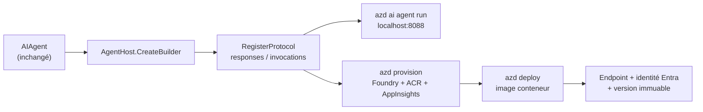
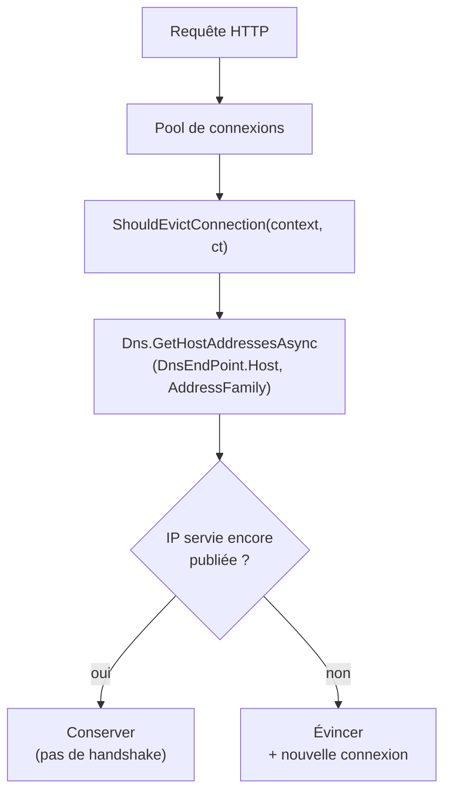

# CSharp — Détail du samedi 29 août 2026

## 1. Foundry Hosted Agents en C# — `AgentHost` et `Microsoft.Agents.AI.Foundry.Hosting`

**Source :** .NET Blog — https://devblogs.microsoft.com/dotnet/from-dotnet-run-to-foundry-hosted-agent-in-3-lines-of-csharp/
**Date :** 24 août 2026

### Contexte

Microsoft Agent Framework permet d'écrire un agent en C# en quelques lignes : un `AIProjectClient`, un appel à `AsAIAgent(...)`, et tu as un `AIAgent` fonctionnel. Le problème, c'est ce que tu obtiens en sortie — une application console. Elle vit dans ton terminal et nulle part ailleurs.

Passer en production imposait jusqu'ici de reconstruire tout un second projet : Dockerfile, serveur web, authentification, stockage de session, règles de scale, télémétrie. Du travail entièrement générique, refait à l'identique par chaque équipe, et sans rapport avec la logique métier de l'agent.

Foundry Hosted Agents est la couche d'hébergement managée de Microsoft Foundry Agent Service, désormais GA. L'article annonce l'intégration .NET qui va avec. Le principe : tu gardes intact le `AIAgent` déjà écrit et tu le déploies comme application conteneurisée sur une infra gérée par Microsoft. La plateforme provisionne le compute par session, descend à zéro à l'inactivité, et fournit endpoint, identité, état de session et observabilité. Le coût annoncé est d'un package NuGet, trois lignes de C# et deux commandes `azd`.

### Comment ça marche

Tu ajoutes `Microsoft.Agents.AI.Foundry.Hosting` en `--prerelease` — le flag est obligatoire, l'intégration hosting n'est pas encore stable même si Hosted Agents l'est.

Les trois lignes se lisent comme du ASP.NET Core. `AgentHost.CreateBuilder(args)` remplace `WebApplication.CreateBuilder` et arrive préconfiguré pour l'environnement Foundry : health checks, OpenTelemetry et contexte de session déjà câblés. `builder.Services.AddFoundryResponses(agent)` enregistre ton instance `AIAgent` auprès du handler de protocole — l'objet lui-même n'est pas modifié. `builder.RegisterProtocol("responses", e => e.MapFoundryResponses())` mappe l'endpoint HTTP.

Deux protocoles coexistent. **Responses** est compatible OpenAI : la plateforme gère l'historique de conversation, le streaming et le cycle de vie de session. **Invocations** te rend le contrôle brut de la requête HTTP, pour un webhook ou un payload maison. Un même agent peut exposer les deux.



La boucle locale passe par `azd ext install azure.ai.agents` puis `azd ai agent init`, qui scaffolde le projet et génère un `agent.yaml`. Deux variables d'environnement sont attendues : `FOUNDRY_PROJECT_ENDPOINT` et `AZURE_AI_MODEL_DEPLOYMENT_NAME`. `azd ai agent run` démarre l'hôte sur `http://localhost:8088`, que tu appelles par `azd ai agent invoke --local "Hello!"` ou un simple `POST /responses`.

Côté déploiement, `azd provision` crée le resource group, l'instance Foundry, le projet, le déploiement de modèle, Application Insights et un Azure Container Registry. `azd deploy` empaquette l'agent en image, la pousse dans l'ACR et la déploie. À l'arrivée, l'agent reçoit un endpoint dédié et une **identité Microsoft Entra créée automatiquement** — pas de managed identity à configurer à la main. La chaîne de connexion Application Insights est injectée dans le conteneur, et les bibliothèques de protocole émettent leurs traces OpenTelemetry par défaut.

Deux propriétés opérationnelles méritent d'être retenues. Chaque déploiement crée une **version d'agent immuable**, donc le rollback est trivial. Et les sessions sont gérées par la plateforme : `$HOME` et les fichiers uploadés persistent entre les tours, le compute est déprovisionné après **15 minutes d'inactivité**, l'état étant restauré à la reprise.

### En pratique — exemple de code

```csharp
// ---------- AVANT : agent console, injoignable de l'extérieur ----------
AIAgent agent = new AIProjectClient(new Uri(endpoint), new DefaultAzureCredential())
    .AsAIAgent(model: deployment, instructions: "You are a friendly assistant.", name: "HelloAgent");
Console.WriteLine(await agent.RunAsync("Hello!"));   // vit dans le terminal, point.

// ---------- APRÈS : même AIAgent, exposé en protocole Responses ----------
using Azure.AI.AgentServer.Core;
using Microsoft.Agents.AI.Foundry.Hosting;   // seul package ajouté (--prerelease)

var projectEndpoint = new Uri(Environment.GetEnvironmentVariable("FOUNDRY_PROJECT_ENDPOINT")
    ?? throw new InvalidOperationException("FOUNDRY_PROJECT_ENDPOINT is not set."));
var deployment = Environment.GetEnvironmentVariable("AZURE_AI_MODEL_DEPLOYMENT_NAME") ?? "gpt-5-mini";

AIAgent agent = new AIProjectClient(projectEndpoint, new DefaultAzureCredential())
    .AsAIAgent(model: deployment,
               instructions: "You are a friendly assistant. Keep your answers brief.",
               name: "HelloAgent");             // strictement identique à l'avant

var builder = AgentHost.CreateBuilder(args);    // 1. hôte pré-câblé (OTel, health, session)
builder.Services.AddFoundryResponses(agent);    // 2. branche l'AIAgent sur le protocole
builder.RegisterProtocol("responses",           // 3. mappe POST /responses
    endpoints => endpoints.MapFoundryResponses());

var app = builder.Build();
app.Run();                                      // ni Kestrel, ni session store, ni streaming à écrire
```

### Pourquoi ça compte pour toi

Si tu prototypes des agents en console et que tu bloques sur la mise en production, c'est le chaînon manquant. Tu gardes ton code métier et tu supprimes la couche d'hébergement. Attention quand même : `azd provision` crée des ressources Azure facturables. Prévois un `azd down` dans ton workflow de démo, et lis le prérequis SDK — c'est .NET 10, pas .NET 11.

### Points de vigilance

- `--prerelease` obligatoire : la surface d'API peut encore bouger.
- Prérequis SDK .NET 10, Azure Developer CLI, et droits de création de ressources **et de role assignments** dans l'abonnement.
- L'Activity Protocol (agents M365 Copilot) n'est pas supporté : seuls Responses et Invocations existent.
- Le port 8088 est un endpoint de dev non sécurisé. Ne le traite pas comme une frontière d'authentification.
- Le nom de la variable de déploiement diffère entre l'exemple console (`AZURE_OPENAI_DEPLOYMENT_NAME`) et l'exemple hébergé (`AZURE_AI_MODEL_DEPLOYMENT_NAME`) — piège au copier-coller.

---

## 2. .NET 11 Preview 7 — `SocketsHttpHandler.ShouldEvictConnection` : l'éviction de connexion devient une décision, pas un TTL

**Source :** dotnet/core — https://github.com/dotnet/core/blob/main/release-notes/11.0/preview/preview7/libraries.md
**Date :** 11 août 2026

### Contexte

Depuis .NET Core, le pool de connexions de `SocketsHttpHandler` est global au handler, et les connexions HTTP restent ouvertes indéfiniment par défaut. Le scénario qui fait mal est connu : le DNS de l'hôte cible change — bascule d'IP, blue/green, failover régional — et `HttpClient` continue de taper l'ancienne adresse tant que la connexion TCP reste vivante.

Le contournement universellement recommandé était `PooledConnectionLifetime`, qui force le recyclage périodique de toutes les connexions. Le coût est réel et permanent : tu détruis des connexions parfaitement saines, donc tu repaies handshake TCP et négociation TLS, juste pour couvrir le cas rare où le DNS a bougé. Sur un service qui parle à une dizaine de backends, c'est de la latence gratuite à chaque cycle.

Preview 7 inverse la logique avec un callback `ShouldEvictConnection` : au lieu d'un TTL aveugle, l'application décide **connexion par connexion**. En complément, un `ConnectionId` apparaît sur `HttpRequestMessage` et sur les contextes `ConnectCallback` / `PlaintextStreamFilter`, pour corréler quelle connexion a servi quelle requête.

### Comment ça marche

La propriété se pose sur `SocketsHttpHandler`, au même niveau que `PooledConnectionLifetime` et `ConnectCallback`. Elle est marquée `[Experimental]`, ce qui produit un avertissement de compilation à supprimer explicitement — l'identifiant exact du diagnostic n'est pas donné dans les notes de version, tu le liras dans le message du compilateur.

Le callback est **asynchrone** : il reçoit un objet de contexte et un `CancellationToken`, et retourne un `bool` où `true` signifie « évince cette connexion ». Le contexte expose `Age` (durée de vie de la connexion), `ConnectionId`, `DnsEndPoint` (l'hôte logique demandé), `RemoteEndPoint` (l'endpoint réellement connecté) et `HttpVersion`.



Le pattern canonique donné par l'équipe est en deux temps. Tu mets `PooledConnectionLifetime = Timeout.InfiniteTimeSpan`, ce qui désactive complètement le recyclage temporel, puis tu délègues toute la décision au callback. Dans celui-ci, tu castes `context.RemoteEndPoint` en `IPEndPoint`, tu résous `Dns.GetHostAddressesAsync(context.DnsEndPoint.Host, connectionIp.AddressFamily, ct)`, et tu n'évinces que si l'IP courante n'est plus dans le jeu retourné.

Passer l'`AddressFamily` n'est pas cosmétique : sans elle, tu compares des enregistrements A et AAAA entre eux et tu évinces en boucle sur un hôte dual-stack. Garde aussi un garde-fou temporel en repli, via `context.Age`, pour les cas où `RemoteEndPoint` n'est pas un `IPEndPoint`.

Le `ConnectionId` exposé côté `HttpRequestMessage` est **le même** que celui déjà émis par la télémétrie `EventSource` de `System.Net.Http`. La corrélation avec tes traces existantes est donc directe, sans table de correspondance. Au-delà du DNS, ça ouvre d'autres usages : évincer les connexions d'un backend que tu sais en cours de drain, forcer une renégociation TLS après rotation de certificat, ou retirer une connexion identifiée comme problématique par tes propres métriques.

### En pratique — exemple de code

```csharp
// ---------- AVANT (.NET 8/10) : TTL aveugle, on tue aussi les connexions saines ----------
var oldHandler = new SocketsHttpHandler
{
    // Seul levier pour prendre en compte un changement DNS :
    // recycler TOUTES les connexions toutes les 2 minutes, DNS changé ou non.
    PooledConnectionLifetime = TimeSpan.FromMinutes(2),
};

// ---------- APRÈS (.NET 11 Preview 7) : éviction ciblée, décidée par connexion ----------
using System.Net;

var handler = new SocketsHttpHandler
{
    // Plus aucun recyclage temporel : les connexions saines vivent indéfiniment.
    PooledConnectionLifetime = Timeout.InfiniteTimeSpan,

    ShouldEvictConnection = async (context, ct) =>
    {
        if (context.RemoteEndPoint is IPEndPoint connectionIp)
        {
            // On re-résout l'hôte LOGIQUE, restreint à la même AddressFamily
            // pour ne pas comparer des A avec des AAAA sur un hôte dual-stack.
            var addresses = await Dns.GetHostAddressesAsync(
                context.DnsEndPoint.Host, connectionIp.AddressFamily, ct);

            return !addresses.Contains(connectionIp.Address);   // évince si l'IP a disparu
        }

        return context.Age > TimeSpan.FromMinutes(10);          // garde-fou de repli
    },
};
// context.ConnectionId == l'ID déjà émis par la télémétrie EventSource,
// et le même est désormais lisible sur HttpRequestMessage.
```

### Pourquoi ça compte pour toi

Si tes services .NET appellent des backends derrière un load balancer ou un CDN, tu payes probablement un `PooledConnectionLifetime` court sans savoir combien il te coûte. Mesure d'abord tes handshakes TLS, puis teste ce callback en préproduction — mais garde-le sous surveillance : l'API est expérimentale jusqu'à la GA de novembre.

### Points de vigilance

- **Chemin chaud.** Le callback est évalué par connexion poolée. Une résolution DNS réseau à chaque évaluation coûte cher sous charge : appuie-toi sur le cache de l'OS, un cache applicatif, ou ne résous qu'au-delà d'un certain `context.Age`.
- **Faux positifs sur DNS round-robin.** Un hôte qui renvoie un sous-ensemble tournant d'IP fera évincer des connexions saines en permanence. Vérifie le comportement réel de ton résolveur avant d'adopter le pattern tel quel.
- `Timeout.InfiniteTimeSpan` supprime tout filet de sécurité. Le comportement en cas d'exception dans le callback n'est pas précisé : traite-le défensivement, avec un `try/catch` qui retourne `false` et un `Age` maximal.
- Signature et noms de types peuvent changer avant la GA (.NET Conf, 10-12 novembre 2026).
- Dans le même Preview 7, si tu utilises la compression de requête : `WindowLog` est renommé `WindowLog2` sur `BrotliCompressionOptions`, `ZLibCompressionOptions` et `ZstandardCompressionOptions`, **sans alias de compatibilité**.
