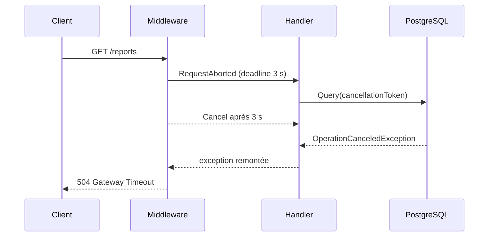
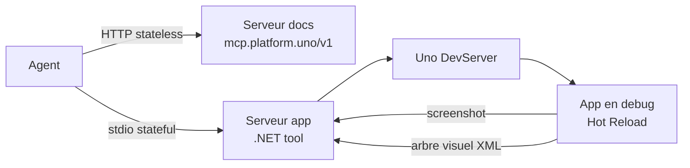

# CSharp — Détail du dimanche 30 août 2026

## 1. ASP.NET Core — `RequestTimeouts`, la deadline coopérative que personne ne configure

**Source :** Milan Jovanović (The .NET Weekly n° 209) — https://milanjovanovic.tech/blog/your-aspnetcore-endpoints-dont-have-a-timeout
**Date :** 29 août 2026

### Contexte

Une API ASP.NET Core n'applique **aucune deadline applicative** aux requêtes entrantes. Kestrel impose des limites de transport — taille de corps, vitesse minimale, durée du handshake — mais rien qui dise « cette requête a assez duré, abandonne ». Ce n'est pas un oubli : c'est le comportement par défaut depuis toujours.

En pratique, ça marche quand même, parce qu'un reverse proxy ou un load balancer coupe la connexion au bout de trente ou soixante secondes. Sauf que dans ce scénario, c'est **lui** qui décide de la deadline et **lui** qui fabrique la réponse d'erreur. Ton application n'en sait rien. Elle continue à tenir une connexion PostgreSQL, à occuper un thread du pool et à consommer de la mémoire pour produire un résultat que plus personne n'attend. Sous charge, ces requêtes fantômes s'accumulent et deviennent le facteur limitant.

.NET 8 a introduit un middleware de request timeout précisément pour rendre cette deadline **explicite et applicative**. Deux ans plus tard, il reste largement sous-utilisé, et surtout mal câblé.

### Comment ça marche

Trois pièces, et il faut les trois. `builder.Services.AddRequestTimeouts()` **n'active aucune limite** : il ne fait qu'enregistrer les services. `app.UseRequestTimeouts()` insère le middleware dans le pipeline. Enfin `.WithRequestTimeout(TimeSpan.FromSeconds(3))` sur l'endpoint applique effectivement la deadline. Oublier l'une des trois donne un système qui compile, démarre et ne coupe jamais rien.

Le point que la plupart des gens ratent est la nature de l'annulation. Le middleware **n'interrompt aucun thread** et n'appelle pas `HttpContext.Abort()`. Il se contente d'annuler le `CancellationToken` exposé par `HttpContext.RequestAborted`, puis il **continue d'attendre** que l'endpoint rende la main. C'est une annulation **coopérative** : rien ne s'arrête si personne n'observe le token.

En Minimal API, un paramètre `CancellationToken` déclaré dans le handler est automatiquement lié à `HttpContext.RequestAborted`. Si une `OperationCanceledException` remonte jusqu'au middleware **avant que la réponse ait commencé**, la réponse par défaut est un `504 Gateway Timeout` vide. Si l'exception ne remonte pas, il ne se passe rien.

Le même token est aussi annulé quand le client ferme sa connexion. Le propager a donc de la valeur même sans timeout configuré : ça libère les ressources d'un utilisateur qui a fermé son onglet.



Le token doit franchir **chaque frontière** : endpoint → service applicatif → repository → EF Core → provider. Une seule couche qui l'avale et la deadline devient décorative.

### En pratique — exemple de code

```csharp
var builder = WebApplication.CreateBuilder(args);
builder.Services.AddRequestTimeouts();   // enregistre les services, n'active rien
var app = builder.Build();
app.UseRequestTimeouts();                // insère le middleware

app.MapGet("/reports", async (CancellationToken cancellationToken) =>
{
    // Le token est lié à HttpContext.RequestAborted automatiquement.
    // Sans lui, Task.Delay va au bout des 10 s et renvoie 200 OK : pas de 504.
    await Task.Delay(TimeSpan.FromSeconds(10), cancellationToken);
    return Results.Ok("Ready");
})
.WithRequestTimeout(TimeSpan.FromSeconds(3));
```

Le même token doit descendre jusqu'à EF Core, qui le transmet au provider :

```csharp
public Task<Order?> GetByIdAsync(Guid id, CancellationToken cancellationToken)
{
    return dbContext.Orders
        .AsNoTracking()
        .SingleOrDefaultAsync(order => order.Id == id, cancellationToken);
}
```

Et pour éviter de saupoudrer des durées littérales partout, déclare des politiques nommées :

```csharp
builder.Services.AddRequestTimeouts(options =>
{
    options.AddPolicy("api-read", TimeSpan.FromSeconds(3));
    options.AddPolicy("report-export", TimeSpan.FromSeconds(30));
});

app.MapGet("/orders/{id:guid}", GetOrder).WithRequestTimeout("api-read");
app.MapGet("/reports/{id:guid}", ExportReport).WithRequestTimeout("report-export");
app.MapGet("/events", StreamEvents).DisableRequestTimeout();   // SSE : pas de deadline
```

### Pourquoi ça compte pour toi

Sur une API .NET adossée à PostgreSQL, c'est le levier le moins cher pour borner la casse. Audite d'abord la propagation : chaque méthode `async` de tes services et repositories doit accepter et transmettre le token. Ensuite seulement, pose des politiques par famille d'endpoint. Sans propagation, `WithRequestTimeout` ne fait rien — et tu croiras à tort être protégé.

### Points de vigilance

Le timeout **ne se déclenche pas quand un débogueur est attaché** : teste toujours sans. Un `504` prouve seulement que l'annulation a atteint le middleware, **pas** que la requête SQL en aval s'est réellement arrêtée — c'est au provider de décider s'il peut annuler. Pour le SSE, les WebSockets, le long polling et les gros uploads, utilise une politique longue ou `.DisableRequestTimeout()` : une fois la réponse de streaming commencée, le middleware ne peut plus la remplacer par un `504` propre. Enfin, si une opération prend légitimement plusieurs minutes, la bonne réponse n'est pas un timeout plus long mais un `202 Accepted` et un traitement en arrière-plan.

---

## 2. Uno Platform — concevoir des serveurs MCP en C# : deux serveurs, deux durées de vie

**Source :** .NET Blog (Microsoft), billet invité de Sam Basu — https://devblogs.microsoft.com/dotnet/how-uno-platform-uses-dotnet-mcp-ai-to-build-high-quality-apps/
**Date :** 27 août 2026

### Contexte

Le réflexe pour aider un agent à écrire du code d'un framework donné, c'est le « context stuffing » : déverser la documentation dans le prompt. Ça échoue pour une raison structurelle. La doc est volumineuse, la tranche réellement utile est minuscule, et elle dépend de la question posée. MCP résout ce problème de **lookup** : l'agent va chercher la bonne page au bon moment.

Mais MCP ne résout pas le problème de **vérification**. Savoir ce que l'API *devrait* être ne dit pas à l'agent si le layout XAML qu'il vient d'écrire s'affiche correctement à l'exécution. Uno Platform a donc construit **deux** serveurs MCP en C# sur le SDK officiel, et le critère de découpage est intéressant : ce n'est pas la fonctionnalité, c'est la **durée de vie** de l'information.

### Comment ça marche

**Le serveur « docs » répond à « qu'est-ce qui est vrai de ce framework maintenant ».** Cette réponse change quand *Uno* publie une version, pas quand ton application tourne. Il est donc hébergé publiquement sur `https://mcp.platform.uno/v1`, en transport **HTTP** et **stateless**. Il expose quatre outils : `uno_platform_docs_search`, `uno_platform_docs_fetch` (page complète en markdown), `uno_platform_agent_rules_init` et `uno_platform_usage_rules_init`. Plus deux prompts, `/new` pour scaffolder une app et `/init` pour amorcer une conversation existante.

La propriété de design clé : ce serveur est **versionné avec la documentation, pas avec ton SDK**. Corriger une page corrige tous les agents au prochain appel. C'est exactement pour ça qu'il est hébergé plutôt que distribué dans un package NuGet.

**Le serveur « app » est les yeux et les mains.** Il est livré comme **.NET tool**, lancé en **stdio**, tourne sur ta machine comme pont vers le Uno DevServer. Il est **stateful** et appartient à exactement une session. Quatre capacités : lancer (`uno_app_start`, en mode debug avec Hot Reload — l'agent contrôle le cycle de vie au lieu d'attendre un F5 humain), voir (`uno_app_get_screenshot` et `uno_app_visualtree_snapshot`), agir (`uno_app_pointer_click`, `uno_app_key_press`, `uno_app_type_text`, `uno_app_element_peer_action`) et vérifier (`uno_health`).

Ce dernier mérite un mot : un agent incapable de distinguer « l'app est cassée » de « ma connexion au pont a sauté » débogue le mauvais problème.



Deux règles se transposent à n'importe quel serveur MCP .NET que tu écrirais. **La topologie décide du transport** : HTTP pour un service hébergé multi-tenant qui a besoin d'OAuth, stdio pour un process enfant local parlant à une seule application. Une fois les contraintes écrites, il n'y a plus d'arbitrage à agoniser. **Les descriptions d'outils sont des prompts, pas de la documentation** : elles sont chargées **avant** tout travail du modèle et constituent une taxe permanente sur la fenêtre de contexte. Exemple concret chez Uno — la description de `uno_app_pointer_click` recommande explicitement de **préférer `uno_app_element_peer_action`**, parce que le clic par coordonnées est fragile selon la taille de fenêtre et le DPI, alors que les automation peers sont stables. Ce n'est pas documenter une préférence, c'est orienter une décision au moment où elle se prend.

### En pratique — exemple de code

Le coût en contexte se mesure. Dans une même session GitHub Copilot CLI, les définitions d'outils pèsent :

```text
Serveur MCP                    Coût des définitions d'outils
-----------------------------  ----------------------------
Uno docs server                ~6 400 tokens
Uno app server                 ~1 500 tokens
Serveur MCP GitHub intégré     ~5 200 tokens
```

Côté déclaration, un serveur stdio en C# tient dans quelques lignes avec le SDK officiel. Le point à soigner est la description, pas la plomberie :

```csharp
// Serveur MCP stdio : le Program.cs se réduit à l'enregistrement.
var builder = Host.CreateApplicationBuilder(args);
builder.Services
    .AddMcpServer()
    .WithStdioServerTransport()
    .WithToolsFromAssembly();          // découvre les [McpServerTool]
await builder.Build().RunAsync();

[McpServerToolType]
public static class AppTools
{
    // La Description est un prompt : elle oriente le choix de l'agent.
    [McpServerTool, Description(
        "Clique par coordonnées. Fragile selon la taille de fenêtre et le DPI — " +
        "préférer element_peer_action, qui cible l'automation peer et reste stable.")]
    public static Task<string> PointerClick(int x, int y) => Bridge.ClickAsync(x, y);
}
```

### Pourquoi ça compte pour toi

Si tu exposes ton domaine métier à un agent via MCP, découpe tes serveurs par durée de vie de l'information, pas par module métier. Ce qui change au rythme de tes releases va dans un service hébergé et stateless ; ce qui vit le temps d'une session de dev va dans un process local stdio. Et compte tes tokens : chaque outil déclaré est une taxe permanente sur la fenêtre de contexte, avant même que le modèle commence à travailler.

### Pour aller plus loin

Uno distingue nettement détection et diagnostic : « les screenshots disent au modèle que quelque chose ne va pas ; l'arbre XML lui dit **quel élément** est fautif et quelles sont ses propriétés ». Les pixels pour repérer, la structure pour comprendre — l'agent a besoin des deux. Au-dessus des outils MCP (le « quoi »), Uno pose des **Skills** (le « comment ») : une bibliothèque organisée par tâche — état et feeds MVUX, navigation, theming, contrôles Toolkit, testing. `uno-testing-ui` encode par exemple l'ordre dans lequel piloter les outils du serveur app. L'analogie du billet : les outils MCP sont les ingrédients, les Skills les fiches recette, l'agent le cuisinier.
