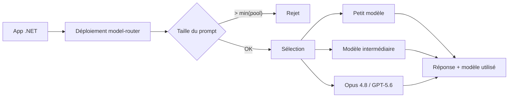

# CSharp — Détail du mardi 1er septembre 2026

## 1. EF Core 11 — `IsConstrained(false)` : une relation dans le modèle, pas dans le schéma

**Source :** dotnet/core — https://github.com/dotnet/core/blob/main/release-notes/11.0/preview/preview6/efcore.md
**Date :** 11 août 2026 (fonctionnalité livrée en Preview 6)

### Contexte

EF Core part du principe qu'une relation de navigation correspond à une contrainte de clé étrangère en base. C'est vrai la plupart du temps, et c'est une bonne chose : l'intégrité référentielle est le meilleur filet de sécurité que PostgreSQL te donne gratuitement.

Sauf que la réalité produit des exceptions. Une table partitionnée par mois n'accepte pas de FK entrante sur toutes les partitions. Une table d'archives référence des lignes que la table vivante a déjà purgées. Un service référence l'identifiant d'une entité qui vit dans la base d'un autre service — là, aucune contrainte n'est possible. Jusqu'ici, tu contournais en supprimant la navigation du modèle (et tu perdais le typage et le chargement), ou en éditant la migration à la main après chaque `dotnet ef migrations add`. Les deux options sont mauvaises.

### Comment ça marche

`IsConstrained(bool)` sépare deux notions qu'EF confondait : **la relation logique** et **la contrainte physique**.

Quand tu poses `IsConstrained(false)` sur une clé étrangère, trois choses changent, dans cet ordre.

**1. Les migrations.** Le générateur relationnel saute purement l'instruction `AddForeignKey`. La colonne existe, l'index sur la colonne de FK est toujours créé — tu gardes donc les performances de jointure —, mais aucune contrainte n'est déclarée. Ta migration devient applicable sur une table partitionnée.

**2. Les requêtes.** C'est le point qu'on oublie. Avec une FK contrainte et une navigation obligatoire, EF génère un `INNER JOIN` : il *sait* que le principal existe, la base le lui garantit. Sans contrainte, cette garantie disparaît. EF bascule donc en `LEFT JOIN` et matérialise `null` quand la ligne principale manque. Le SQL généré est différent, et le plan d'exécution aussi.

**3. Le change tracking.** Il reste inchangé. EF continue de suivre la relation, de fixer les FK à la sauvegarde et de gérer le chargement `Include`. La seule chose que tu perds, c'est la validation par le SGBD — donc c'est à ton code de garantir la cohérence.

Le provider Cosmos applique désormais ce comportement par défaut à toutes les clés étrangères non-owned, ce qui est cohérent : Cosmos n'a jamais su faire respecter une FK entre documents.

### En pratique — exemple de code

Une commande qui référence un client vivant dans une base tenue par un autre service.

```csharp
// Avant — EF Core 10 : soit tu subis AddForeignKey dans la migration,
// soit tu supprimes la navigation et tu perds Include<T> et le typage.
modelBuilder.Entity<Order>()
    .HasOne(o => o.Customer)
    .WithMany(c => c.Orders);
// Migration générée : AddForeignKey("FK_Orders_Customers_CustomerId", ...) -> échoue
// si Customers est partitionnée ou vit dans une autre base.

// Après — EF Core 11 : la relation reste dans le modèle, la contrainte disparaît du schéma.
modelBuilder.Entity<Order>()
    .HasOne(o => o.Customer)
    .WithMany(c => c.Orders)
    .IsConstrained(false);
// Migration : pas d'AddForeignKey. L'index sur CustomerId est conservé.
// Requêtes : LEFT JOIN au lieu d'INNER JOIN, o.Customer peut être null.
```

Traite la navigation comme nullable côté C# : le compilateur t'aidera là où la base ne t'aide plus.

### Pourquoi ça compte pour toi

Sur PostgreSQL, tu as sûrement des tables partitionnées ou des tables d'audit où tu édites la migration à la main. Ce hack disparaît. En contrepartie, relis tes requêtes : le passage en `LEFT JOIN` change les plans et peut faire remonter des `null` que ton code ne gérait pas. Réserve `IsConstrained(false)` aux cas où la contrainte est réellement impossible — partout ailleurs, garde-la.

### Points de vigilance

Sans contrainte, aucun `ON DELETE` en base. Les orphelins deviennent ton problème : prévois un job de nettoyage ou une vérification applicative, sinon tu les découvriras en production, par un `null` inattendu.

---

## 2. Foundry model router — 28 régions, et une fenêtre de contexte plafonnée par le plus petit modèle

**Source :** InfoQ — https://www.infoq.com/news/2026/08/foundry-model-router-regions/
**Date :** 31 août 2026

### Contexte

Le model router d'Azure AI Foundry est un déploiement qui se présente comme un modèle unique et redirige chaque requête vers le modèle le plus adapté d'un pool. L'argument est économique : les questions simples partent sur un petit modèle, les questions complexes sur un gros, et tu ne paies pas le tarif frontier pour reformuler un e-mail.

Microsoft vient d'élargir la disponibilité de deux régions à **28** en global standard et 21 en data zone. Le pool est aussi rafraîchi : Claude Opus 4.8 et GPT-5.6 entrent, quatre modèles dépréciés sortent. Pour une équipe .NET soumise à des contraintes de résidence des données, ce passage à l'échelle géographique est ce qui rend l'option utilisable en Europe.

### Comment ça marche

Le routeur s'intercale entre ton client et les modèles. Tu appelles un nom de déploiement unique ; il évalue la requête, choisit une cible, et te renvoie la réponse en indiquant quel modèle a servi. Ta facturation suit le modèle réellement utilisé, pas un tarif moyen.

Deux règles de gestion du pool méritent d'être comprises avant la mise en production.

**La première concerne les mises à jour.** Un déploiement laissé en configuration par défaut reçoit automatiquement les changements de pool : nouveaux modèles ajoutés, modèles dépréciés retirés. Un déploiement où tu as explicitement listé un sous-ensemble de modèles n'intègre **pas** les nouveaux venus tant que tu ne les ajoutes pas. C'est le compromis habituel entre stabilité et fraîcheur : le contrôle explicite fige aussi tes gains de qualité.

**La seconde est un plafond, et c'est le vrai piège.** La fenêtre de contexte effective du routeur est celle du **plus petit** modèle du pool. Logique : le routeur doit pouvoir envoyer n'importe quelle requête à n'importe quelle cible, donc il refuse tout ce qui dépasse la plus petite capacité. Si ton pool mélange un modèle à 1 M de tokens et un modèle à 128 k, tu es limité à 128 k — même pour une requête que le routeur aurait envoyée au gros modèle.



### En pratique — exemple de code

Le routeur s'utilise comme n'importe quel déploiement : tu ne changes que le nom.

```csharp
using Azure.AI.OpenAI;
using Azure.Identity;
using Microsoft.Extensions.AI;

// Le nom de déploiement pointe le routeur, pas un modèle précis.
var azure = new AzureOpenAIClient(
    new Uri("https://mon-projet.openai.azure.com/"),
    new DefaultAzureCredential());

IChatClient chat = azure
    .GetChatClient("model-router")   // <- un seul endpoint pour tout le pool
    .AsIChatClient()
    .AsBuilder()
    .UseLogging()                    // trace le modèle réellement sélectionné
    .Build();

var reponse = await chat.GetResponseAsync("Résume ce ticket en trois puces : ...");

// La réponse porte le modèle qui a servi -> journalise-le, c'est ta clé d'analyse de coût.
Console.WriteLine($"Servi par : {reponse.ModelId}");
```

Journalise systématiquement `ModelId` : sans ça, tu ne sauras pas expliquer une facture ni une régression de qualité.

### Pourquoi ça compte pour toi

Si tu envisages le routeur pour réduire une facture d'inférence, calcule d'abord la fenêtre de contexte minimale de ton pool et compare-la à ton plus gros prompt. Un pipeline RAG qui pousse 300 k tokens sera rejeté si un modèle à 128 k traîne dans le pool. Choisis ensuite ton camp : pool par défaut pour suivre les nouveaux modèles, sous-ensemble explicite pour figer le comportement — mais alors, planifie les revues.

### Limites

Le routage est une heuristique côté fournisseur : tu n'en contrôles pas la logique et elle peut évoluer sans que ton code change. Pour un traitement où la reproductibilité compte (facturation, conformité), cible un modèle explicite plutôt que le routeur.
