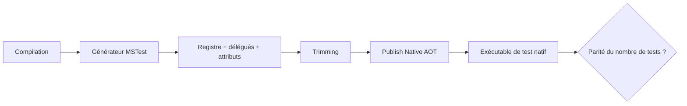
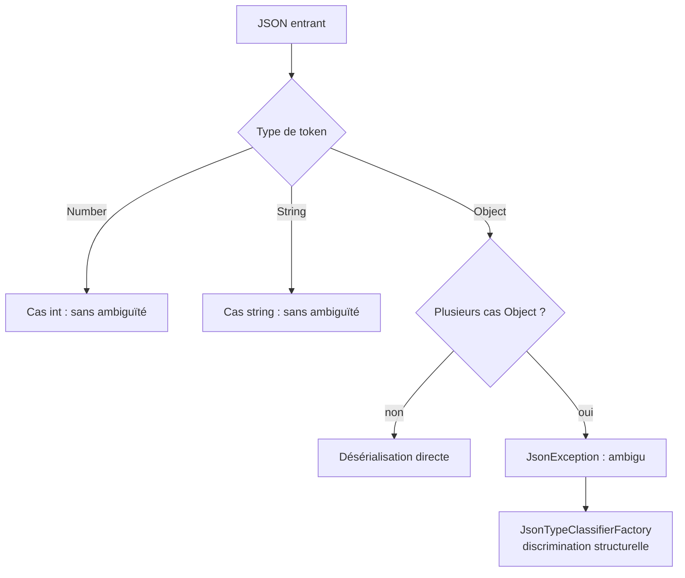

# CSharp — Détail du samedi 5 septembre 2026

## 1. MSTest 4.4 — publier et exécuter un projet de test en Native AOT

**Source :** .NET Blog — https://devblogs.microsoft.com/dotnet/mstest-source-generation/
**Date :** 3 septembre 2026

### Contexte

Quand tu publies une application en Native AOT, trois choses changent par rapport à une exécution managée : le code est compilé en amont, le code inutilisé est supprimé par le trimming, et la génération de code au runtime comme la réflexion non restreinte ne sont plus disponibles. Une suite de tests managée verte ne dit donc rien sur le binaire que tu expédies.

MSTest avait tenté une première préversion Native AOT en avril 2024, avec un moteur expérimental à la couverture limitée. Avec **MSTest 4.4**, annoncé le 3 septembre, la génération de source entre dans la chaîne officielle : un projet de test se publie et s'exécute comme exécutable natif, sans réécrire une seule classe de test.

### Comment ça marche

Le problème est le suivant : un lanceur de tests découvre habituellement les tests par réflexion, typiquement via un `Assembly.GetTypes()` suivi d'une inspection des attributs. Le trimming, lui, supprime tout ce qu'il ne voit pas référencé statiquement. Les deux mécanismes sont incompatibles : au moment où le runtime cherche les classes de test, elles ont déjà été rognées.

La génération de source inverse l'ordre. Pendant la compilation — donc **avant** le trimming — le générateur émet quatre choses : un registre des classes de test de l'assembly, les données d'attributs des membres supportés, des délégués qui construisent les classes et invoquent les méthodes, et des références qui préservent ces types face au trimmer. Le lanceur natif n'a plus qu'à lire ce registre.

Deux responsabilités restent séparées, et c'est le point important. MSTest garantit que **le test** est découvrable et exécutable après trimming. Il ne répare pas **l'application** testée : si ton code de production sérialise par réflexion, le test natif va lever `InvalidOperationException: Reflection-based serialization has been disabled for this application`. C'est le but — l'échec révèle un défaut de déploiement, pas un défaut du framework de test.

Le mode par défaut s'appelle `ReflectionFree`. Il n'élimine pas toute réflexion : certaines opérations gardent un repli réflexif. Un mode `Rooting` existe pour les investigations de compatibilité — il préserve les membres découverts mais exécute par réflexion.



### En pratique — exemple de code

Le test qui passe en managé et casse en natif, puis la correction — côté application, pas côté test :

```csharp
// Avant — sérialisation par réflexion : verte en managé, rouge en AOT
[TestClass]
public class ReceiptFormatterTests
{
    [TestMethod]
    public void ReceiptIsSerialized()
    {
        var json = JsonSerializer.Serialize(new Receipt(42));
        StringAssert.Contains(json, "\"Total\":42");
    }
}

// Après — métadonnées JSON générées dans le code de production
[JsonSerializable(typeof(Receipt))]
internal partial class AppJsonContext : JsonSerializerContext { }

var json = JsonSerializer.Serialize(new Receipt(42), AppJsonContext.Default.Receipt);
```

La configuration minimale du projet de test, puis la publication :

```xml
<Project Sdk="MSTest.Sdk/4.4.0">
  <PropertyGroup>
    <TargetFramework>net10.0</TargetFramework>
    <PublishAot>true</PublishAot>          <!-- active le générateur MSTest -->
    <!-- <MSTestSourceGenMode>Rooting</MSTestSourceGenMode> --> <!-- repli réflexif -->
  </PropertyGroup>
</Project>
```

```bash
dotnet publish ./MyProject.Tests/MyProject.Tests.csproj \
  -c Release -r linux-x64 -o ./artifacts/native-tests
./artifacts/native-tests/MyProject.Tests
```

### Pourquoi ça compte pour toi

Si tu publies un service .NET en Native AOT, ta CI ment aujourd'hui : elle valide un modèle d'exécution que tu n'expédies pas. Ajoute une seule voie native, sur un projet qui touche à la sérialisation, à l'injection ou au binding de configuration. Et fais du **nombre de tests découverts** une porte de release : une classe rejetée du registre ne casse rien, elle disparaît, et le process sort en succès.

### Points de vigilance

`MSTest.Sdk` utilise Microsoft Testing Platform par défaut ; les projets encore sur VSTest doivent migrer d'abord — arguments CLI, intégration CI et entrées `.runsettings` diffèrent. Les diagnostics d'analyseurs (`MSTEST0069` pour une classe qui hérite seulement de `[TestClass]`) sont des portes de migration, pas des avertissements à supprimer. TRX et Code Coverage restent supportés ; certaines extensions MTP et reporters CI ne le sont pas.

---

## 2. System.Text.Json face aux `union` et aux hiérarchies `closed` de C# 15

**Source :** Andrew Lock (.NET Escapades) — https://andrewlock.net/exploring-the-dotnet-11-preview-7-the-pain-of-serializing-unions-and-closed-class-hierarchies-with-system-text-json/
**Date :** 1er septembre 2026

### Contexte

C# 15 apporte deux constructions proches mais distinctes. Le mot-clé `union` déclare un type qui représente exactement un cas parmi une liste fermée. Le mot-clé `closed` déclare une classe de base dont on ne peut dériver que dans le même assembly — ce qui donne au compilateur les mêmes garanties d'exhaustivité qu'une union, sans en être une.

Les deux sont conçues pour modéliser des domaines. Or un domaine, en pratique, franchit un jour une frontière réseau ou une base de données. Andrew Lock a testé l'aller-retour JSON sur ces deux constructions avec la Preview 7, et le résultat est instructif : la sérialisation demande du travail, la désérialisation en demande beaucoup plus.

### Comment ça marche

Trois comportements par défaut à connaître.

Premier : une `union IntOrString(int, string)` est sérialisée **à plat**, comme une valeur primitive — `"Value": 42`, pas `"Value": { "Value": 42 }`. C'est un choix délibéré pour interopérer avec des API TypeScript où un champ peut être un nombre ou une chaîne.

Deuxième : une hiérarchie `closed` perd ses propriétés dérivées. Sérialiser un `Labrador` dans une propriété typée `Pet` ne produit que `{"Name":"Goose"}`. L'option `InferClosedTypePolymorphism` est censée reconstruire la hiérarchie automatiquement, puisque tous les types dérivés sont connus à la compilation. En Preview 7, elle refuse dès qu'un type dérivé est moins accessible que la base (`internal` sous une base `public`), puis dès qu'il y a **deux** niveaux de hiérarchie. Un correctif est annoncé pour la GA, mais l'attribut explicite reste la voie sûre aujourd'hui.

Troisième, et c'est le vrai piège : une `union` ne se désérialise d'office que si chaque cas mappe un **type de token JSON différent**. `IntOrString` fonctionne (`Number` vs `String`). `union SupportedOS(Windows, Linux, MacOS)` échoue : les trois cas sérialisent en `Object`, donc rien ne les discrimine au retour. Il n'existe pas d'option pour forcer un discriminant `$type` sur une union. La seule prise est un `JsonTypeClassifierFactory` qui lit l'objet en mémoire et déduit le type de sa forme.



### En pratique — exemple de code

Le classifieur structurel, seule voie de sortie pour une union d'objets :

```csharp
public class SupportedOsClassifier : JsonTypeClassifierFactory<SupportedOS>
{
    public override JsonTypeClassifier CreateJsonClassifier(
        JsonTypeClassifierContext context, JsonSerializerOptions options)
        => static (ref Utf8JsonReader reader) =>
        {
            if (reader.TokenType is not JsonTokenType.StartObject) return null;
            bool sawVersion = false;

            while (reader.Read() && reader.TokenType is not JsonTokenType.EndObject)
            {
                if (reader.ValueTextEquals("Distro"u8)) return typeof(Linux);  // unique à Linux
                if (reader.ValueTextEquals("Name"u8))   return typeof(MacOS);  // unique à MacOS
                if (reader.ValueTextEquals("Version"u8)) sawVersion = true;    // partagé : ne discrimine pas

                reader.Read();  // avance sur la valeur
                reader.Skip();  // et l'ignore
            }
            return sawVersion ? typeof(Windows) : null;
        };
}

[JsonUnion(TypeClassifier = typeof(SupportedOsClassifier))]
public union SupportedOS(Windows, Linux, MacOS);
```

Côté hiérarchie `closed`, l'annotation explicite qui fonctionne dès la Preview 7 :

```csharp
// Avant — repose sur InferClosedTypePolymorphism : lève sur 2 niveaux de hiérarchie
// Après — discriminants déclarés à la main, et les dérivés peuvent rester internal
[JsonDerivedType(typeof(Labrador), typeDiscriminator: nameof(Labrador))]
[JsonDerivedType(typeof(Collie),   typeDiscriminator: nameof(Collie))]
[JsonDerivedType(typeof(Cat),      typeDiscriminator: nameof(Cat))]
public closed class Pet { public string Name { get; set; } }
```

### Pourquoi ça compte pour toi

Si tu comptais modéliser tes DTO d'API en `union`, arrête-toi une minute. Les unions de POCO ne font pas l'aller-retour sans code maison, et le classifieur structurel générique de la RC1 lit l'objet en mémoire — un coût annoncé comme non négligeable sur un chemin chaud. Garde les unions pour la logique interne et les cas primitifs ; sur le contrat public, un discriminant explicite reste plus prévisible.

### Limites

Ce test a été fait avec la Preview 7. Le comportement d'`InferClosedTypePolymorphism` sur plusieurs niveaux sera corrigé pour la GA de .NET 11 d'après l'issue ouverte par l'auteur. Le `JsonUnionTypeStructuralClassifier` de la RC1 ne gérera ni les unions imbriquées, ni les cas sans propriété unique, ni les mélanges POCO / non-POCO.
