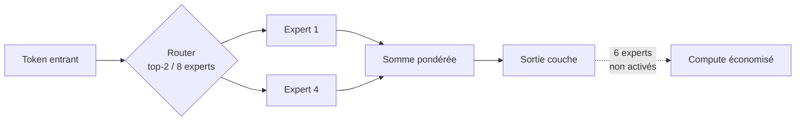
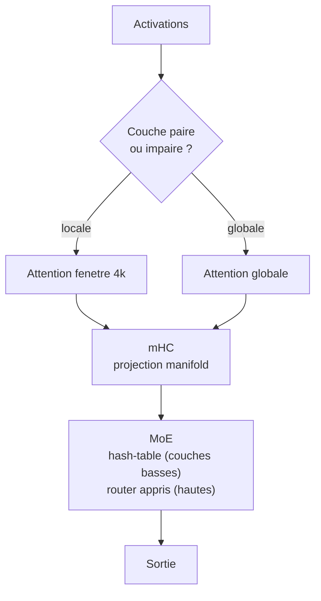
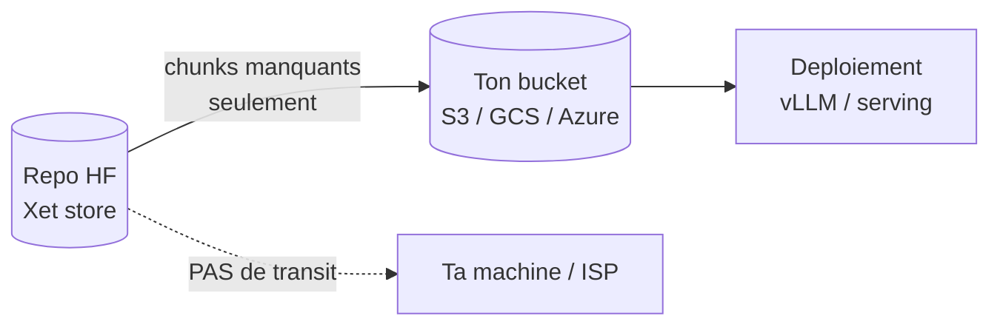

# IA Open Source — Détail du mercredi 27 mai 2026

## 1. Gemma 4 — Famille de 4 modèles open en Apache 2.0

**Source :** Google DeepMind / Hugging Face — https://huggingface.co/blog
**Date :** Mai 2026

### Contexte

Gemma est la ligne open de Google DeepMind, distincte de Gemini (closed-source). Lancée en février 2024, elle est passée par Gemma 1, 2, 3, et arrive avec Gemma 4 en mai 2026. Gemma 4 est **la première famille Gemma à proposer un modèle MoE** et la première à pousser un Dense au-delà de 27B.

La licence **Apache 2.0** est l'argument structurant. Face aux licences custom de Llama, Mistral ou Qwen — souvent assorties de restrictions sur l'usage commercial ou le nombre d'utilisateurs — Apache 2.0 lève tout frein juridique. Tu redistribues, modifies et embarques sans négociation. Pour un produit commercial, ça change le calcul de risque.

### Comment ça marche

La famille couvre quatre tailles, conçues pour des contraintes matérielles différentes. Les deux variantes « Edge » (E2B / E4B) visent l'inférence on-device : mobile, navigateur via WebGPU, embarqué. Elles arrivent avec une **quantization 4-bit native**, ce qui les rend exploitables sur un MacBook Pro M3 ou un Pixel récent.

Le cœur de la nouveauté est le **Gemma 4 26B MoE**. Un Mixture-of-Experts n'active qu'une fraction des paramètres par token. Concrètement, chaque couche route le token vers un sous-ensemble d'experts via un **router top-2 sur 8 experts**. Le modèle porte 26B de poids en mémoire mais n'en calcule qu'une fraction (probablement ~4-6B actifs) à chaque passe. Tu paies donc le coût mémoire d'un gros modèle mais la latence d'un petit. Ce ratio le classe #6 mondial open sur Arena AI.

Le **Gemma 4 31B Dense** suit l'architecture transformer décodeur classique : Grouped Query Attention (GQA), encodage positionnel RoPE, activation SwiGLU. Pas de routing, tous les paramètres calculés à chaque token. Plus exigeant en matériel, mais #3 mondial open.



Côté contexte, les Dense montent à 128k tokens, les Edge à 32k. Le tokenizer SentencePiece multilingue couvre 256k entrées de vocabulaire, avec une bonne prise en charge du français et des langues asiatiques.

### En pratique — exemple de code

Inférence avec `transformers` sur le 26B MoE. Le routing est transparent : tu charges et appelles comme un modèle dense.

```python
# Inférence Gemma 4 26B MoE — le routing top-2 est géré en interne
from transformers import AutoModelForCausalLM, AutoTokenizer
import torch

model_id = "google/gemma-4-26b-moe"
tok = AutoTokenizer.from_pretrained(model_id)
model = AutoModelForCausalLM.from_pretrained(
    model_id, torch_dtype=torch.bfloat16, device_map="auto"
)

msgs = [{"role": "user", "content": "Resume ce log en 3 points."}]
inputs = tok.apply_chat_template(msgs, add_generation_prompt=True, return_tensors="pt")
out = model.generate(inputs.to(model.device), max_new_tokens=256)
print(tok.decode(out[0], skip_special_tokens=True))
```

Tous les modèles sont sur Hugging Face (`google/gemma-4-*`), supportés par `transformers` v5.8.0, vLLM, llama.cpp (GGUF disponibles) et Ollama.

### Pourquoi ça compte pour toi

Si tu déploies des LLM en self-host, le 26B MoE est probablement le meilleur ratio coût/qualité du moment sur matériel grand public (1 GPU H100 ou 2 GPU L40S). Sa licence Apache 2.0 t'autorise un usage commercial sans renégociation. Le 31B Dense reste déployable sur 2-4 GPU. Et les E2B/E4B en 4-bit embarquent un assistant local dans une app Electron ou mobile sans serveur d'inférence.

### Pour aller plus loin | Points de vigilance

Le MoE complique le dimensionnement mémoire : prévois la VRAM pour les 26B de poids, pas seulement les paramètres actifs. La latence d'inférence, elle, suit les ~5B actifs. Avant d'industrialiser, benchmarke la qualité réelle sur tes prompts métier, le classement Arena ne reflète pas forcément ton domaine.

---

## 2. DeepSeek V4 (Pro + Flash) — Architecture hybride avec mHC

**Source :** DeepSeek / Hugging Face — https://huggingface.co/deepseek-ai/DeepSeek-V4-Pro
**Date :** Mai 2026

### Contexte

DeepSeek est devenu en 2024-2025 un des laboratoires les plus innovants en architecture LLM. DeepSeek V2 a introduit la **Multi-head Latent Attention (MLA)**, une compression du KV cache qui a apporté des gains massifs en inférence. DeepSeek V3 (décembre 2024) a popularisé le MoE à très grande échelle : 671B paramètres totaux, 37B actifs.

DeepSeek V4, sorti en mai 2026 en versions Pro et Flash, marque une **rupture architecturale** : il abandonne MLA pour un design hybride combinant attention locale et globale, des hyper-connexions contraintes et un bootstrap MoE par hash table.

### Comment ça marche

Trois innovations se cumulent. D'abord l'**attention hybride local + long-range**. La moitié des couches utilise une attention locale à fenêtre limitée (typiquement 4k tokens), l'autre moitié une attention globale. Le pattern d'alternance est appris pendant le pre-training. Résultat : le coût d'inférence sur contexte très long chute, sans perdre la capacité à raisonner sur l'ensemble.

Ensuite les **Manifold-Constrained Hyper-Connections (mHC)**. Elles remplacent les connexions résiduelles classiques `x + f(x)`. Au lieu d'une simple addition, les hyper-connexions apprennent des projections contraintes sur un manifold. Ça améliore la circulation du gradient et réduit les pathologies d'entraînement à grande profondeur, dans l'esprit des neural ODEs.

Enfin le **MoE bootstrap par hash table statique**. Les premières couches MoE n'utilisent pas un router appris mais un mapping déterministe `token-id → expert-id` via hash table. Ce câblage fixe accélère la convergence en début de training et force la diversité des experts.



### En pratique — exemple de code

V4 Flash (Dense ~32B) se charge comme un modèle standard. V4 Pro (MoE ~600B) exige un service multi-GPU type vLLM.

```python
# DeepSeek V4 Flash — variante Dense, deployable sur un GPU 24-48 Go
from transformers import AutoModelForCausalLM, AutoTokenizer
import torch

mid = "deepseek-ai/DeepSeek-V4-Flash"
tok = AutoTokenizer.from_pretrained(mid, trust_remote_code=True)
model = AutoModelForCausalLM.from_pretrained(
    mid, torch_dtype=torch.bfloat16, device_map="auto", trust_remote_code=True
)

prompt = "Ecris une fonction Python qui valide un IBAN."
ids = tok(prompt, return_tensors="pt").to(model.device)
print(tok.decode(model.generate(**ids, max_new_tokens=300)[0]))
```

Les poids sont sur Hugging Face en `safetensors`. Support : `transformers` v5.8.0, vLLM (PR en cours pour l'attention hybride), llama.cpp (quantizations 4-bit). V4 Flash affiche ~75 % MMLU, ~85 % HumanEval, ~62 % MATH ; V4 Pro est proche de GPT-4o sur la majorité des benchmarks. Licence DeepSeek License v2 (commercial autorisé, restrictions militaires/adversariales).

### Pourquoi ça compte pour toi

Si tu fais du fine-tuning ou de la recherche LLM, V4 est un cas d'étude obligatoire : c'est le modèle qui pousse le plus loin l'innovation architecturale en 2026. Pour du déploiement applicatif, V4 Flash est compétitive face à Llama 4 et Gemma 4 31B sur coding et reasoning, avec un coût d'inférence inférieur grâce à l'attention hybride. À benchmarker sur tes propres workloads avant tout choix.

---

## 3. Qwen 3.7-Max — Pricing agressif sur OpenRouter

**Source :** Alibaba (Apsara Summit) — https://llm-stats.com/llm-updates
**Date :** 20-21 mai 2026

### Contexte

La famille **Qwen** d'Alibaba s'est imposée comme une référence open / open-weight depuis Qwen 2 (2024). Qwen 3 a apporté la première version Mixture-of-Experts début 2025, puis Qwen 3.5 a poussé les performances coding au niveau de GPT-4o. Qwen 3.7-Max est annoncé le 20 mai à l'**Apsara Summit**, le grand event annuel d'Alibaba Cloud, avec un pricing public sur OpenRouter dès le lendemain.

Particularité de cette version : elle est **open-weights mais closed-source**. Contrairement aux Qwen 3.x classiques publiés sur Hugging Face, aucun poids n'est diffusé. C'est une annonce produit, sans paper technique détaillé.

### Comment ça marche

Tu consommes Qwen 3.7-Max via une API compatible OpenAI, routée par OpenRouter. Le pricing est le levier : **2,50 $ par million de tokens d'input, 7,50 $ par million d'output**. À comparer à Claude Sonnet 4 (3 $/15 $) : c'est ~25 % moins cher pour un positionnement de performance équivalent.

Le point d'attention pratique est la **latence**. Le modèle est hébergé en Asie ; depuis l'Europe, le round-trip réseau est plus élevé que Claude ou OpenAI. OpenRouter ajoute une couche de routage mais ne rapproche pas le datacenter. Sans SLA officiel, un fallback automatique est indispensable en prod.

### En pratique — exemple de code

Comme l'API est compatible OpenAI, tu pointes simplement le SDK vers OpenRouter. Un wrapper de fallback vers Claude couvre l'absence de SLA.

```python
# Appel Qwen 3.7-Max via OpenRouter (API compatible OpenAI) + fallback
from openai import OpenAI

client = OpenAI(base_url="https://openrouter.ai/api/v1", api_key="sk-or-...")

def chat(prompt, model="qwen/qwen-3.7-max"):
    try:
        r = client.chat.completions.create(
            model=model,
            messages=[{"role": "user", "content": prompt}],
            timeout=20,  # latence Asie elevee : timeout serre + fallback
        )
        return r.choices[0].message.content
    except Exception:
        return chat(prompt, model="anthropic/claude-sonnet-4")  # secours

print(chat("Genere une requete SQL de jointure 3 tables."))
```

### Pourquoi ça compte pour toi

Si tu utilises des LLM via API dans un produit, Qwen 3.7-Max est à benchmarker contre tes cas d'usage, surtout sur de gros volumes où le pricing fait une vraie différence. La lignée Qwen 3 est forte sur le code et le multilingue (excellent français, mandarin, espagnol). Bémol : latence européenne plus élevée. À tester sur tes propres workloads avant de basculer du trafic.

### Limites

**Confidentialité** — Comme tout service API d'un fournisseur cloud chinois, à évaluer pour les données sensibles ou réglementées (GDPR, données clients). OpenRouter abstrait l'accès mais ne change pas le destinataire final des prompts. **SLA** — Aucun SLA officiel via OpenRouter ; pour de la prod critique, un fallback Claude/OpenAI automatique en cas de dégradation est obligatoire.

---

## 4. Hugging Face « Copy to Bucket » — Transferts server-side via Xet

**Source :** Hugging Face blog — https://huggingface.co/blog
**Date :** Mai 2026

### Contexte

Hugging Face a migré progressivement de Git LFS vers **Xet** en 2025. C'est un protocole de stockage object-based qui remplace le tracking par fichier de Git LFS par un tracking par chunks de contenu (Content-Defined Chunking). Bénéfice principal : déduplication massive entre versions et entre repos. Cette migration débloque des features impossibles avec Git LFS, dont les transferts server-to-server sans transit par le client.

### Comment ça marche

Le bouton **« Copy to Bucket »** apparaît sur la page de tout repo (model, dataset, space). Tu fournis tes credentials cloud, choisis le bucket de destination, et le transfert s'exécute **server-side** : S3 ↔ Xet, ou GCS / Azure Blob ↔ Xet. Les octets ne passent jamais par ta machine ni par ton ISP.

La clé de la performance est le **Content-Defined Chunking** de Xet. Le contenu est découpé en chunks identifiés par hash. Lors d'une copie, seuls les chunks absents du bucket cible sont transférés ; le reste est dédupliqué. Combiné à la bande passante interne des datacenters, plusieurs téraoctets passent en quelques secondes. La granularité est fine : tu copies un repo entier ou seulement les `safetensors`, sans les fichiers d'exemple.



### En pratique — exemple de code

L'opération est aussi pilotable par API via `huggingface_hub`, pratique dans un pipeline MLOps.

```python
# Copie server-side d'un repo HF vers ton bucket S3, sans download local
from huggingface_hub import HfApi

api = HfApi()
api.copy_repo_to_bucket(
    repo_id="deepseek-ai/DeepSeek-V4-Pro",
    repo_type="model",
    bucket_uri="s3://mon-bucket-modeles/deepseek-v4-pro/",
    allow_patterns=["*.safetensors", "config.json"],  # on saute les exemples
    # credentials via role cross-account AWS configure cote HF
)
```

### Pourquoi ça compte pour toi

Si tu déploies des modèles sur ton infra cloud (Llama 4, DeepSeek V4 Pro, Gemma 4 31B), tu n'as plus à télécharger les poids localement pour les re-uploader vers ton bucket. Gain : temps (10x à 100x), bande passante (pas de tunnel par ton ISP), coût (pas d'egress côté HF si le bucket est dans le même provider). Pour des workflows MLOps qui redéploient régulièrement des modèles fine-tunés, c'est un gain net et récurrent.

### Pour aller plus loin

**Credentials** — Access key temporaire, ou cross-account role (AWS) / Workload Identity (GCP). HF documente les permissions IAM minimales. **Coûts** — Pas de facturation du transfert côté HF ; egress AWS nul si le bucket est dans la même région que la zone Xet (us-east-1 principalement). **Compatibilité** — S3, GCS, Azure Blob, et les stores S3-compatibles (MinIO, Cloudflare R2, Backblaze B2).
