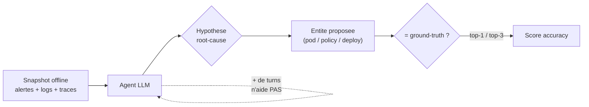
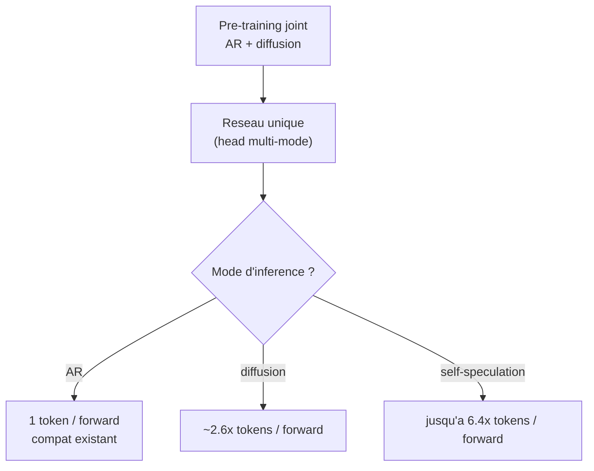
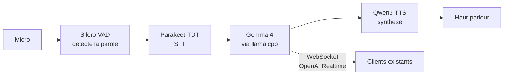
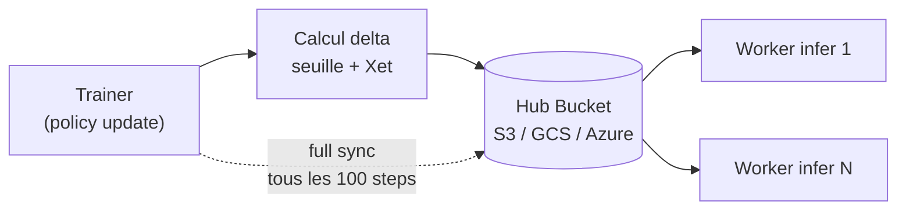

# IA Open Source — Détail du jeudi 28 mai 2026

## 1. ITBench-AA — Premier benchmark agentique enterprise IT, frontier models sous 50%

**Source :** Hugging Face / IBM Research / Artificial Analysis — https://huggingface.co/blog/ibm-research/itbench-aa
**Date :** 27 mai 2026

### Contexte

Les benchmarks d'agents IA souffrent depuis 2024 d'une saturation rapide : SWE-Bench Verified, OSWorld, GAIA tombent en quelques mois sous le seuil des 90 % pour les frontier models. **ITBench-AA**, sorti par IBM Research et Artificial Analysis, propose une approche radicalement plus difficile : faire diagnostiquer des incidents Kubernetes réels à partir de snapshots offline (alertes, logs, traces, topologie). C'est le premier benchmark où les meilleurs modèles plafonnent **sous 50 %**.

### Comment ça marche

Le benchmark contient **59 tâches SRE**. Chaque tâche fournit un snapshot d'incident Kubernetes figé : alertes Prometheus, événements du cluster, traces OpenTelemetry, topologie services/deployments/pods/namespaces. L'agent doit identifier l'**entité root-cause** — par exemple un NetworkPolicy mal configuré bloquant un service downstream, ou un OOMKilled lié à une resource request trop basse.

Les tâches sont construites à partir d'issues réelles labellées par des SRE IBM, anonymisées, puis reproduites dans un cluster sandbox. Le ground-truth est l'entité (deployment / pod / policy) effectivement responsable. La métrique est l'**accuracy d'identification top-1 et top-3**.

Les résultats sont parlants. **Claude Opus 4.7** mène à **47 %**, suivi de **GPT-5.5 à 46 %** ; tous les frontier models restent sous 50 %. Contre-intuitif : **plus de turns d'investigation ne corrèle pas avec une meilleure accuracy**. Les trajectoires longues scorent souvent plus bas, signe que le modèle se perd dans ses propres traces. Côté open-weights, **Gemma 4 31B** atteint 37 % à **0,14 $ par tâche**, contre ~5,38 $/tâche pour le frontier le plus cher — un facteur 38× sur le coût pour ~10 points d'écart.



### En pratique — exemple de code

Un agent ITBench reçoit le snapshot comme contexte structuré et doit retourner l'entité fautive. Schéma d'appel typique.

```python
# Boucle d'evaluation ITBench-AA : snapshot -> hypothese root-cause
import json
from openai import OpenAI

client = OpenAI()
snapshot = json.load(open("incident_42.json"))  # alertes, traces, topologie

prompt = f"""Diagnostique l'incident Kubernetes ci-dessous.
Reponds en JSON: {{"root_cause_entity": "<kind>/<name>", "reason": "..."}}.
Snapshot:
{json.dumps(snapshot)[:8000]}"""

r = client.chat.completions.create(
    model="claude-opus-4-7",
    messages=[{"role": "user", "content": prompt}],
)
pred = json.loads(r.choices[0].message.content)
print(pred["root_cause_entity"])  # compare au ground-truth top-1 / top-3
```

### Pourquoi ça compte pour toi

Si tu construis ou évalues des agents pour des tâches d'ops (debug Kubernetes, RCA, incident response), ITBench-AA est ta nouvelle référence. Trois leçons : les agents ne remplacent pas un SRE senior (47 % vs 75-85 % humain) ; augmenter le nombre de turns ne sauve pas, mieux vaut un prompting net et des outils découplés ; le coût-perf des open-weights ouvre un cas d'usage économique pour de l'automation au volume (suggérer une cause racine probable dans Datadog).

### Pour aller plus loin | Limites

**Métriques** — accuracy top-1 / top-3 sur l'entité root-cause ; leaderboard public sur https://artificialanalysis.ai/evaluations/itbench-aa. **Limites** — snapshots offline = pas de boucle « hypothèse → action → observation ». Une vraie astreinte permet d'invoquer `kubectl logs`, `kubectl describe` en live. Une extension online est annoncée.

---

## 2. NVIDIA Nemotron-Labs Diffusion — Diffusion + AR + self-speculation dans un seul modèle

**Source :** Hugging Face / NVIDIA — https://huggingface.co/blog/nvidia/nemotron-labs-diffusion
**Date :** 23 mai 2026

### Contexte

Les **diffusion language models (DLMs)** sont une alternative à l'autoregressif (AR) classique. Au lieu de générer un token à la fois, on raffine simultanément l'ensemble du contexte sur plusieurs steps. En théorie, les DLMs parallélisent massivement la génération et atteignent des débits inaccessibles à l'AR. En pratique, ils ont longtemps souffert d'une qualité inférieure. NVIDIA arrive avec **Nemotron-Labs Diffusion**, le premier modèle qui réunit les trois modes — AR, diffusion, self-speculation — dans une **architecture unique** et démontre des gains exploitables.

### Comment ça marche

Le réseau est un transformer décodeur classique, mais sa head de prédiction peut opérer en plusieurs régimes. En **mode AR**, elle prédit le next-token comme d'habitude, compatible avec les infrastructures existantes. En **mode diffusion**, elle denoise N tokens en parallèle sur un même forward pass, ce qui apporte **2,6× tokens par forward** vs AR à accuracy comparable. En **mode self-speculation** (linéaire ou quadratique), le gain monte jusqu'à **6,4× tokens par forward**.

La clé est le **training joint AR + diffusion** pendant le pre-training. Le même modèle apprend à opérer dans les deux régimes, donc tu choisis le mode à l'inférence selon ton besoin latence/débit, sans réentraîner. Mesuré sur SPEED-Bench avec SGLang sur GB200, Nemotron-Labs-Diffusion-8B atteint **4× le throughput de Qwen 3-8B** à accuracy comparable. La « speed-of-light analysis » (limite théorique, sampler optimal) montre jusqu'à **76,5 % de tokens/forward en plus** que la self-speculation.



### En pratique — exemple de code

Le choix du mode se fait à la génération. Mode diffusion via SGLang pour le throughput.

```python
# Nemotron-Labs Diffusion : selection du mode a l'inference
import sglang as sgl

llm = sgl.Engine(model_path="nvidia/Nemotron-Labs-Diffusion-8B")

# Mode diffusion : denoise plusieurs tokens par forward pass
out = llm.generate(
    "Resume cet article en 5 puces.",
    sampling_params={
        "max_new_tokens": 256,
        "decoding_mode": "diffusion",   # "ar" | "diffusion" | "self_spec"
        "diffusion_steps": 8,           # nb de passes de raffinement
    },
)
print(out["text"])
```

### Pourquoi ça compte pour toi

Si tu sers du LLM à fort volume (chatbot, batch summarization, code completion à grande échelle), Nemotron-Labs Diffusion mérite un benchmark sur ta stack. Le 4× throughput se traduit en coût d'infra divisé par 4 à qualité équivalente, ou en latence p95 fortement réduite. Pour un usage local (Ollama, llama.cpp), c'est moins immédiat : les optims diffusion exigent SGLang/vLLM. Mais sur un déploiement vLLM existant, l'expérimentation est à coût marginal nul.

### Pour aller plus loin

Famille 3B / 8B / 14B (base, instruct, vision-language), licence NVIDIA Open Model License (commercial OK avec restrictions), sur HF Hub. **Support** — SGLang dès le release ; vLLM PR en cours pour le mode diffusion natif ; llama.cpp ne supporte que l'AR (le mode diffusion exige des kernels custom).

---

## 3. Reachy Mini passe en full local — pipeline VAD/STT/LLM/TTS sans cloud

**Source :** Hugging Face — https://huggingface.co/blog/local-reachy-mini-conversation
**Date :** 27 mai 2026

### Contexte

**Reachy Mini** est le robot open-source de Hugging Face (avec Pollen Robotics et Seeed Studio), lancé en 2025 à partir de 299 $ (kit) ou 449 $ (wireless avec Raspberry Pi CM4 onboard). Jusqu'ici, la conversation passait par des APIs cloud. Le 27 mai, Hugging Face publie la documentation officielle pour faire tourner **l'intégralité du pipeline conversationnel en local, sans dépendance externe**.

### Comment ça marche

Le pipeline est **cascadé** : quatre modèles spécialisés s'enchaînent. Le **VAD (Voice Activity Detection)** — Silero VAD — détecte quand l'utilisateur parle et découpe le flux audio. Le **STT (Speech-to-Text)** — Parakeet-TDT de NVIDIA, open — transcrit la parole en texte. Le **LLM** — Gemma 4 via llama.cpp — produit la réponse textuelle. Le **TTS** — Qwen3-TTS — synthétise la réponse en audio.

Le point d'intégration malin : le backend expose un **WebSocket compatible OpenAI Realtime API**. Tu pointes le robot (ou n'importe quel client) vers `ws://<ton-host>/realtime` et tu retrouves la même surface d'API qu'avec OpenAI, sans refactoring côté client. Tout transite sur ton réseau ; l'audio ne sort jamais.



### En pratique — exemple de code

Comme l'endpoint est compatible Realtime API, un client browser ou Python existant fonctionne sans modification.

```python
# Connexion au pipeline local via l'endpoint compatible OpenAI Realtime
import asyncio, websockets, json

async def talk():
    uri = "ws://homelab.local:8080/realtime"  # tout reste sur le LAN
    async with websockets.connect(uri) as ws:
        await ws.send(json.dumps({
            "type": "session.update",
            "session": {"modalities": ["audio", "text"]},
        }))
        # envoi des chunks audio PCM du micro, reception de l'audio TTS
        async for msg in ws:
            evt = json.loads(msg)
            if evt["type"] == "response.audio.delta":
                play(evt["delta"])  # bytes audio a jouer

asyncio.run(talk())
```

### Pourquoi ça compte pour toi

Même sans Reachy Mini, l'archi de référence est précieuse. Pour bâtir un assistant vocal local (Home Assistant, kiosk, assistant médical embarqué), la stack Silero + Parakeet-TDT + Gemma 4 + Qwen3-TTS est documentée, performante et 100 % open. L'endpoint compatible OpenAI Realtime API te laisse réutiliser tes clients existants. Et pour des cas réglementés (santé, juridique, secret pro), c'est la preuve que la conversation vocale sans cloud tient en une journée de setup.

### Pour aller plus loin

**Latence** — sur un setup recommandé (CM4 robot + GPU 24 Go pour le LLM en LAN), le end-to-end « parole → réponse vocale » est de **~800 ms à 1,2 s**, comparable à OpenAI Realtime cloud. **Mémoire** — Gemma 4 26B MoE en Q4 : ~16 Go VRAM ; Parakeet-TDT : ~600 Mo ; Qwen3-TTS : ~1 Go. Tourne sur une RTX 4090 ou L40S. **Roadmap** — un mode « cascade-free » (speech-to-speech unique) en preview à l'été 2026.

---

## 4. TRL Delta Weight Sync — Synchronisation de modèles à 1T paramètres en RLHF

**Source :** Hugging Face — https://huggingface.co/blog/delta-weight-sync
**Date :** 27 mai 2026

### Contexte

Dans le RL post-training (PPO, GRPO), le bottleneck n'est pas le compute mais le **transfert des poids de la policy entre le trainer et les workers d'inférence** à chaque step. Pour un 70B, c'est ~140 Go à déplacer par step ; pour un 1T, ~2 To. La librairie **TRL (Transformer Reinforcement Learning)** de Hugging Face introduit un mécanisme de **delta weight sync via Hub Bucket** : on ne transmet que les deltas compressés, pas les poids complets.

### Comment ça marche

À chaque step, le trainer calcule un **delta seuillé** : `delta = poids_nouveaux - poids_anciens`, en ne retenant que les variations significatives. Ces deltas sont compressés via le protocole **Xet** du Hub, qui chunk au niveau du contenu pour maximiser la déduplication. Le trainer pousse les deltas dans un bucket S3 (ou GCS, Azure Blob) configuré comme **Hub Bucket** qui sert de broker. Les workers d'inférence pollent ce bucket et appliquent les deltas localement. La bande passante coast-to-coast entre clusters est ainsi évitée.

Le gain mesuré est net : sur du Llama 4 70B en RLHF, le temps de sync par step passe de **~90 s à ~6 s** ; sur un modèle 1T MoE, de **~25 min à ~45 s**. Le seuillage étant lossy, un sync « full » périodique (par défaut tous les 100 steps) recale les workers pour éviter la dérive.



### En pratique — exemple de code

Le delta sync s'active via la config TRL en pointant un Hub Bucket. Le reste de la boucle RL est inchangé.

```python
# TRL : activer le delta weight sync via Hub Bucket pour le RLHF
from trl import GRPOConfig, GRPOTrainer

cfg = GRPOConfig(
    output_dir="run-llama4-70b",
    weight_sync_strategy="delta",          # delta vs full
    weight_sync_backend="hub_bucket",      # broker = bucket Xet
    weight_sync_bucket="s3://mlops-rlhf/sync/",
    full_sync_every=100,                   # recalage anti-derive
    delta_threshold=1e-4,                  # seuillage (lossy)
)
trainer = GRPOTrainer(model="meta-llama/Llama-4-70B", args=cfg, ...)
trainer.train()
```

### Pourquoi ça compte pour toi

Très spécifique RLHF / large-scale RL. Si tu ne fais pas de fine-tuning à cette échelle, c'est anecdotique. Mais c'est un signal clair : l'infra MLOps autour des modèles XXL devient mature. Les obstacles ne sont plus le compute brut mais la coordination/synchronisation entre clusters. Si tu envisages du post-training en 2026-2027, TRL + Hub Bucket Xet est le pattern à adopter.

### Limites

**Couplage Hub Bucket** — il faut un bucket S3 compatible Xet ; pour de l'air-gap total, un fallback NFS partagé existe mais est moins performant. **Compression lossy** — le seuillage des deltas est lossy ; à très petits learning rates, le résidu accumulé peut diverger du training idéal, d'où le sync « full » tous les N steps (défaut 100).
