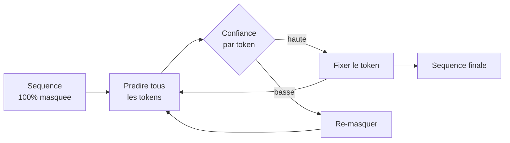
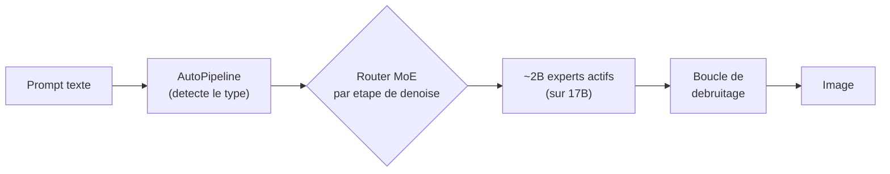

# IA — Détail du vendredi 29 mai 2026

## 1. LLaDA2 — Diffusion language models scalent à 100B, FP8 disponible

**Source :** Hugging Face — https://huggingface.co/inclusionAI/LLaDA2.0-flash
**Date :** mai 2026 (FP8 publié le 6 mai)

### Contexte

LLaDA (Large Language Diffusion Models) est la série d'**InclusionAI / Ant Group** qui parie sur la **diffusion discrète** comme alternative à la génération autoregressive token-par-token. LLaDA1 était une preuve de concept ; LLaDA2 vise la production, et le papier `2512.15745` — « LLaDA2.0: Scaling Up Diffusion Language Models to 100B » — démontre que la diffusion scale à 100B tout en restant compétitive avec un autoregressif de taille équivalente sur les benchmarks reasoning et code.

### Comment ça marche

Le principe rompt avec l'autoregressif. On démarre d'une séquence **entièrement masquée** et on démasque progressivement les tokens, **par bloc**, sur plusieurs étapes de raffinement. À chaque étape, le modèle prédit les tokens manquants et ne fixe que ceux ayant la **plus haute confiance** ; le reste repart masqué pour l'étape suivante. La fin de génération est donc « vue » dès le début, ce qui favorise la cohérence longue-portée — contrairement à l'AR qui ne connaît jamais la suite.

La **génération par blocs** donne un contrôle fin du trade-off latence/qualité : le modèle décide combien de tokens unmask en parallèle par bloc. Plus tu en démasques d'un coup, plus c'est rapide mais risqué ; moins, plus c'est sûr mais coûteux en passes.



Côté écosystème : **LLaDA2.0-flash** et **LLaDA2.0-mini** sont sur HF (plus leurs versions `preview`), **LLaDA2.0-Uni** ajoute la compréhension multimodale dans le même backbone, et des **versions FP8 quantizées** publiées le 6 mai sur HF et ModelScope tiennent sur une seule A100/H100, voire RTX 5090 selon la taille. **LLaDA2.X et LLaDA2.1** (MoE diffusion) sont annoncées.

### En pratique — exemple de code

L'inférence diffusion expose des paramètres spécifiques (nombre de steps, taille de bloc) absents des modèles AR. Via `transformers` + scripts custom.

```python
# LLaDA2.0-flash en FP8 : generation par diffusion discrete
import torch
from transformers import AutoModel, AutoTokenizer

mid = "inclusionAI/LLaDA2.0-flash"
tok = AutoTokenizer.from_pretrained(mid, trust_remote_code=True)
model = AutoModel.from_pretrained(
    mid, torch_dtype=torch.float8_e4m3fn, device_map="auto", trust_remote_code=True
)

prompt = "Genere un objet JSON {id, name, roles[]} valide."
out = model.diffusion_generate(
    tok(prompt, return_tensors="pt").input_ids.to(model.device),
    steps=64,        # nb d'etapes de raffinement (latence vs qualite)
    block_length=32, # tokens demasques par bloc
    gen_length=128,
)
print(tok.decode(out[0], skip_special_tokens=True))
```

### Pourquoi ça compte pour toi

Si tu prototypes du LLM local pour des tâches structurées (génération de code, JSON, requêtes SQL), le mode diffusion peut t'apporter une cohérence globale : la fin de la sortie est planifiée dès le départ, pas seulement en bout de séquence. Tu peux le tester en FP8 sans infrastructure dédiée. Approche encore exotique en prod, mais à mettre en watchlist sérieuse pour 2026 H2.

### Limites

L'inférence par raffinement itératif demande plusieurs passes : le gain de latence wall-clock vs autoregressif n'est garanti que sur des batches courts. L'outillage (vLLM, llama.cpp) ne supporte pas encore la diffusion nativement, tu pars de `transformers` + scripts custom.

---

## 2. diffusers — Vague de nouveaux pipelines, NucleusMoE-Image en tête

**Source :** Hugging Face Blog — https://huggingface.co/blog/NucleusAI/nucleus-image
**Date :** mai 2026

### Contexte

La librairie `diffusers` est le hub de fait pour tester des architectures de génération (image, audio, et de plus en plus texte). Quand un pipeline est mergé, ça signe que le modèle a un support stable et reproductible, pas juste un repo isolé. La release de mai pousse une vague inhabituellement large, menée par **NucleusMoE-Image**.

### Comment ça marche

Le modèle phare, **NucleusMoE-Image (NucleusAI)**, est un text-to-image **2B paramètres actifs / 17B totaux** en sparse Mixture-of-Experts. Il prouve que le sparse MoE — éprouvé sur LLM — scale aussi en image : à l'inférence, seuls ~2B de paramètres sont activés par étape de débruitage, pour un coût compute proche d'un dense 2B mais une qualité de 17B. Contrepartie : les 17B de poids doivent tenir en VRAM même si 2B calculent.

Côté API, `diffusers` standardise l'accès. `AutoPipelineForText2Image.from_pretrained()` **détecte automatiquement** le type de pipeline à charger. Et la nouvelle `AttentionInterface` permet de switcher l'implémentation d'attention (xformers, SDPA, Flash-Attn 3) sans toucher au pipeline.



La vague inclut aussi : le **pipeline LLaDA2** (diffusion LM d'InclusionAI), **ERNIE-Image** (Baidu) intégré officiellement, **LongCat-AudioDiT** (audio diffusion, suite MeiTuan / LongCat), **ACE-Step** (génération musicale long-form, désormais first-class) et un **decoder FLUX.2 + inpaint** (Black Forest Labs).

### En pratique — exemple de code

Un seul backend `diffusers` route vers le bon pipeline selon la modalité ; ici text-to-image avec backend attention configurable.

```python
# diffusers : un backend unique, detection auto du pipeline + attention switchable
import torch
from diffusers import AutoPipelineForText2Image

pipe = AutoPipelineForText2Image.from_pretrained(
    "NucleusAI/NucleusMoE-Image",     # 2B actifs / 17B totaux
    torch_dtype=torch.bfloat16,
).to("cuda")

pipe.set_attention_backend("flash_attn_3")  # via AttentionInterface

img = pipe(
    "un data center isometrique, style blueprint, fond sombre",
    num_inference_steps=28,
    guidance_scale=4.5,
).images[0]
img.save("out.png")
```

### Pourquoi ça compte pour toi

Si tu intègres de la génération multimédia dans une app Angular ou .NET, tu exposes désormais **un seul backend `diffusers`** derrière une API REST/gRPC et tu routes vers le bon pipeline selon la modalité demandée. NucleusMoE-Image vaut un POC si tu cherches à réduire ta facture GPU sur de la génération à volume : coût d'inférence proche d'un 2B dense, qualité d'un 17B.

### Détails techniques

`pip install -U diffusers` récupère la vague de pipelines. `AutoPipelineForText2Image.from_pretrained()` détecte le type à charger. Attention au budget VRAM : le sparse MoE charge 17B de poids même si 2B sont actifs en compute — dimensionne en conséquence.
