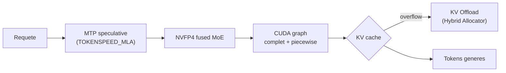
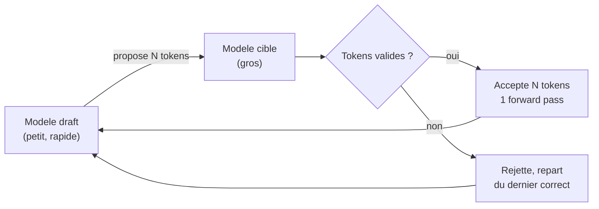

# IA — Détail du samedi 30 mai 2026

## 1. vLLM 0.21.0 — DeepSeek V4 stabilisé sur Blackwell

**Source :** vLLM Releases (GitHub) — https://github.com/vllm-project/vllm/releases
**Date :** 15 mai 2026

### Contexte

`vLLM` 0.20.0 avait introduit le support de **DeepSeek V4** (architecture MoE 1,6T multimodale). La 0.21.0 est la release de **stabilisation** qui rend ce support réellement production-grade sur le matériel NVIDIA **Blackwell**. C'est le passage du « ça tourne » au « ça tient en prod ».

### Comment ça marche

DeepSeek V4 est réorganisé dans un package dédié `vllm/models/deepseek_v4/`, ce qui isole ses optimisations spécifiques. Trois leviers techniques portent le gain. Le **NVFP4 fused MoE** fusionne les opérations de routing et de calcul des experts en kernels FP4 natifs Blackwell : moins d'allers-retours mémoire, débit MoE plus élevé. Le **CUDA graph complet + piecewise** capture le graphe d'exécution pour éliminer l'overhead de lancement de kernels à chaque token. Le **MTP speculative decoding** (multi-token prediction) génère plusieurs tokens candidats par forward, validés en un pass, via le nouveau backend `TOKENSPEED_MLA` — qui respecte désormais les budgets de raisonnement.

Le changement le plus impactant côté coût est le **KV Offload** intégré au **Hybrid Memory Allocator**. Sur les modèles hybrides qui gaspillaient jusqu'à ~80 % de la capacité KV-cache, l'allocateur récupère cet espace et décharge le KV vers la mémoire hôte quand pertinent. Le débit grimpe sans GPU supplémentaire. La story production-grade s'étend aussi à Kimi K2.6 et Cohere MoE sur Blackwell.



### En pratique — exemple de code

L'activation se fait au lancement du serveur. Les flags exposent le speculative decoding et l'offload KV.

```bash
# vLLM 0.21.0 : servir DeepSeek V4 sur Blackwell, prod-grade
pip install -U "vllm==0.21.0"

vllm serve deepseek-ai/DeepSeek-V4-Pro \
  --quantization nvfp4 \
  --speculative-config '{"method": "mtp", "num_speculative_tokens": 3}' \
  --kv-cache-dtype auto \
  --enable-kv-offload \          # Hybrid Memory Allocator
  --tensor-parallel-size 8
# Endpoint compatible OpenAI sur http://localhost:8000/v1
```

### Pourquoi ça compte pour toi

Si tu envisages d'auto-héberger un gros modèle derrière une API .NET ou Symfony, c'est la version qui rend DeepSeek V4 exploitable sans bricolage. Le KV Offload change ton calcul de coût VRAM : tu peux viser moins de GPU pour le même contexte. L'endpoint compatible OpenAI te branche sans adapter ton client. Reste sur Blackwell pour profiter du NVFP4.

### Limites

EAGLE 3.1 (long-context speculative decoding fiable) n'arrive qu'en 0.22.0 : pour du très long contexte, attends cette version avant de t'engager.

---

## 2. Runtimes locaux mai 2026 — la vague MTP (Ollama 0.24, llama.cpp, MLX, LM Studio)

**Source :** Codersera — https://codersera.com/blog/local-ai-runtimes-may-2026-update/
**Date :** mai 2026

### Contexte

Tous les runtimes locaux majeurs ont publié ce mois-ci, avec un thème commun : le **multi-token prediction (MTP)** / speculative decoding passe en stable, et le support du matériel récent (Blackwell, Apple M5) se généralise. C'est le mois où le speculative decoding cesse d'être expérimental côté local.

### Comment ça marche

Le **speculative decoding** repose sur un principe simple : un petit modèle « draft » propose plusieurs tokens d'un coup, et le gros modèle les **vérifie en un seul forward pass**. Si la proposition est bonne, tu valides N tokens pour le prix d'un ; sinon tu rejettes et repars du dernier token correct. Le gain de débit est réel dès que le draft est souvent juste, ce qui divise la latence perçue sans dégrader la qualité (la sortie reste celle du gros modèle).

Les releases du mois généralisent ce mécanisme. **Ollama** passe 0.23 → 0.24 en 11 jours : support de l'app **Codex**, **Gemma 4 MTP speculative decoding** via le runner MLX, sampler MLX retravaillé. **llama.cpp** merge le support **Qwen 3.6 MTP** et publie des prebuilts **Windows CUDA 13.1** (build b9196). **MLX** 0.31.x + macOS 26.2 débloquent les **Neural Accelerators du M5**, jusqu'à 4× plus rapide en TTFT. **LM Studio** 0.4.13 ajoute les prédictions vision parallèles, 0.4.14 promeut le MTP speculative decoding en stable.



### En pratique — exemple de code

Sur llama.cpp, le speculative decoding s'active en passant un modèle draft. Prebuilt Windows CUDA 13.1, pas de compilation.

```bash
# llama.cpp : speculative decoding avec modele draft (Windows CUDA 13.1, b9196)
./llama-server \
  -m models/qwen3.6-32b-Q4_K_M.gguf \      # modele cible
  -md models/qwen3.6-1.5b-Q4_K_M.gguf \    # modele draft
  --draft-max 5 \                          # tokens proposes par passe
  --n-gpu-layers 99 \
  --port 8080
# Verifie que le draft partage le meme tokenizer que la cible
```

### Pourquoi ça compte pour toi

Pour prototyper en local sans cloud, le MTP stable divise la latence perçue : un assistant de code local devient utilisable au quotidien. Sur Windows, les prebuilts CUDA 13.1 de llama.cpp t'évitent une compilation pénible. Choisis Ollama pour la simplicité, llama.cpp si tu veux contrôler finement le GPU. Sur Mac M5, MLX exploite désormais les Neural Accelerators pour un TTFT jusqu'à 4× meilleur.

### Points de vigilance

Le speculative decoding gagne en débit mais exige un modèle « draft » compatible — même tokenizer, même famille. Vérifie sa disponibilité avant de l'activer, sinon tu perds le bénéfice ou tu casses la génération.
