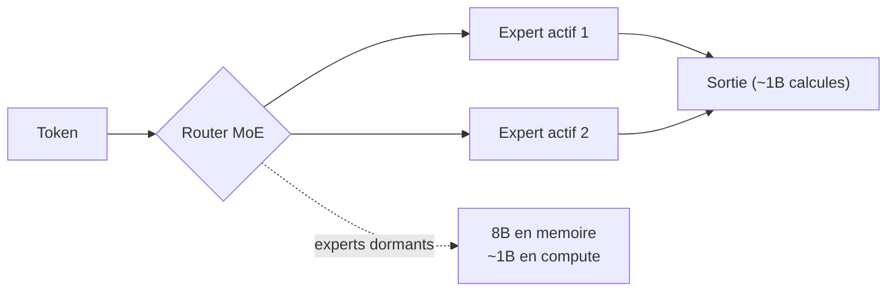
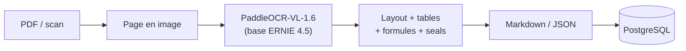
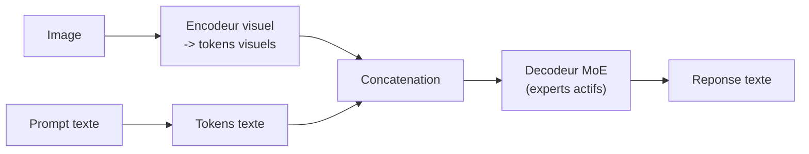

# IA — Détail du lundi 1er juin 2026

## 1. LiquidAI LFM2.5-8B-A1B — un MoE pensé pour l'edge

**Source :** Hugging Face — https://hf.co/LiquidAI/LFM2.5-8B-A1B
**Date :** 28 mai 2026

### Contexte

Liquid AI continue de pousser sa famille `LFM2`, orientée exécution locale. Le nouveau `LFM2.5-8B-A1B` est un Mixture-of-Experts : 8 milliards de paramètres au total, mais seulement ~1 milliard actifs par token, d'où le suffixe `A1B`. Une variante `GGUF` est sortie dans la foulée pour `llama.cpp`. Le positionnement est clairement « edge » : viser CPU/GPU modestes plutôt que des clusters.

### Comment ça marche

Le MoE à **activation parcimonieuse** est le cœur du modèle. Le réseau porte 8B de poids, répartis en plusieurs experts par couche. À chaque token, un router sélectionne un petit sous-ensemble d'experts ; seuls ~1B de paramètres sont effectivement calculés. Conséquence directe : tu **paies le coût mémoire d'un 8B mais la latence d'un ~1B actif**. C'est ce compromis qui rend le modèle pertinent sur un poste de dev ou un petit serveur.

Le build **GGUF officiel** disponible immédiatement évite la conversion maison. GGUF est le format de poids quantisés de l'écosystème `llama.cpp` ; il embarque les tenseurs et les métadonnées dans un seul fichier, prêt à charger sur `llama.cpp`, `Ollama` ou `LM Studio`. Le modèle est multilingue natif (en, fr, de, es, ja, ko, zh, ar…).



### En pratique — exemple de code

Comme un GGUF officiel est fourni, tu le sers directement via Ollama puis l'appelles depuis ton back .NET ou Symfony.

```bash
# Servir LFM2.5-8B-A1B en local via Ollama (GGUF officiel, aucune conversion)
ollama pull liquidai/lfm2.5-8b-a1b

# Inference HTTP locale, appelable depuis ton API .NET / Symfony
curl http://localhost:11434/api/generate -d '{
  "model": "liquidai/lfm2.5-8b-a1b",
  "prompt": "Resume ce log nginx en 3 anomalies probables.",
  "stream": false
}'
```

### Pourquoi ça compte pour toi

Si tu veux un assistant local pour scripter, résumer du log ou faire du RAG offline sans envoyer tes données dans le cloud, ce profil MoE offre un bon rapport qualité/latence. Tu le branches derrière une API `Ollama` locale et tu l'appelles depuis ton back .NET ou Symfony, sans dépendance externe ni coût par token.

### Points de vigilance

Le MoE complique le dimensionnement mémoire : prévois la RAM/VRAM pour les 8B de poids même si seul 1B s'active à chaque token. Teste la qualité réelle sur tes prompts métier avant d'industrialiser, l'activation parcimonieuse peut varier selon le domaine.

---

## 2. PaddleOCR-VL-1.6 — extraction documentaire structurée

**Source :** Hugging Face — https://hf.co/PaddlePaddle/PaddleOCR-VL-1.6
**Date :** 27 mai 2026

### Contexte

PaddleOCR passe au tout-VLM avec `PaddleOCR-VL-1.6`, un modèle vision-langage bâti sur `ERNIE 4.5`. Il ne fait pas que de l'OCR brut : il parse la **structure** d'un document — mise en page, tableaux, formules, graphiques, tampons. C'est la bascule d'un OCR « texte plat » vers une compréhension de la mise en forme.

### Comment ça marche

Le pipeline lit la **page rendue en image** et produit une sortie structurée plutôt qu'un flux de caractères. Le modèle identifie le **layout** (zones, colonnes), reconstruit les **tables**, reconnaît les **formules mathématiques**, interprète les **charts**, et fait du `seal/spotting` (détection de tampons). Le tout est exportable en **Markdown**, donc directement exploitable. La différence avec un OCR classique : un tableau désaligné ou une formule reste rattaché à sa structure, au lieu de devenir une ligne de texte à reparser.



### En pratique — exemple de code

Intégrable via la lib `PaddleOCR` ou en pipeline `transformers` (custom_code). Sortie Markdown prête à stocker.

```python
# PaddleOCR-VL-1.6 : extraction structuree d'un PDF vers Markdown
from paddleocr import PaddleOCRVL

ocr = PaddleOCRVL(model="PaddlePaddle/PaddleOCR-VL-1.6")  # safetensors

result = ocr.predict("facture_2026.png")   # page rendue en image
markdown = result.to_markdown()            # layout + tables + formules

# Stockage direct en base plutot que d'empiler des regex sur du texte OCR plat
print(markdown[:500])
# save_to_postgres(markdown)
```

### Pourquoi ça compte pour toi

Pour extraire des factures, contrats ou rapports PDF vers du structuré exploitable en base, c'est un candidat sérieux et open. Tu le fais tourner en batch côté serveur et tu stockes le Markdown/JSON directement en PostgreSQL, plutôt que d'empiler des regex fragiles sur du texte OCR plat. Tes documents restent sur ton infra.

### Limites

Les modèles ERNIE arrivent avec leurs conditions de licence : vérifie la compatibilité avec ton usage commercial avant déploiement. Le mode `custom_code` impose aussi de faire confiance au repo, audite le chargement avant la prod.

---

## 3. Step-3.7-Flash — VLM MoE sous Apache 2.0

**Source :** Hugging Face — https://hf.co/stepfun-ai/Step-3.7-Flash
**Date :** 23 mai 2026

### Contexte

StepFun publie `Step-3.7-Flash`, un modèle vision-langage Mixture-of-Experts sous licence **Apache 2.0** — une licence permissive rare sur ce type de modèle multimodal. La plupart des VLM open arrivent avec des clauses d'usage restrictives ; ici, l'usage commercial et la redistribution sont clairs.

### Comment ça marche

Le modèle est multimodal `image-text-to-text` : il raisonne sur **texte et image dans un même réseau**. L'image est encodée en tokens visuels, concaténés aux tokens texte du prompt, puis le décodeur génère la réponse en tenant compte des deux modalités. L'architecture MoE « Flash » applique le même principe d'activation parcimonieuse que les LLM MoE : un router n'active qu'une fraction des experts par token, ce qui optimise le débit et le coût d'inférence pour un VLM.



### En pratique — exemple de code

VLM standard côté `transformers` : tu passes image + question, tu récupères du texte.

```python
# Step-3.7-Flash : raisonnement image + texte (image-text-to-text)
import torch
from transformers import AutoProcessor, AutoModelForVision2Seq
from PIL import Image

mid = "stepfun-ai/Step-3.7-Flash"
proc = AutoProcessor.from_pretrained(mid, trust_remote_code=True)
model = AutoModelForVision2Seq.from_pretrained(
    mid, torch_dtype=torch.bfloat16, device_map="auto", trust_remote_code=True
)

img = Image.open("capture_ecran.png")
prompt = "Quelle erreur affiche cette stack trace ? Donne la ligne fautive."
inputs = proc(images=img, text=prompt, return_tensors="pt").to(model.device)
print(proc.decode(model.generate(**inputs, max_new_tokens=256)[0], skip_special_tokens=True))
```

### Pourquoi ça compte pour toi

Si tu construis une feature mêlant capture d'écran, photo ou document et texte (support, modération, extraction visuelle), un VLM Apache 2.0 t'évite les zones grises de licence. Tu l'auto-héberges et l'exposes en interne derrière ton API, sans renégocier des conditions d'usage à chaque montée en charge ni laisser fuir tes données.

### Points de vigilance

Le code custom (`custom_code`) impose de faire confiance au repo : audite le chargement avant de l'exécuter en prod. Benchmarke face à Qwen3.6-VL sur tes cas réels avant de figer ton choix.
