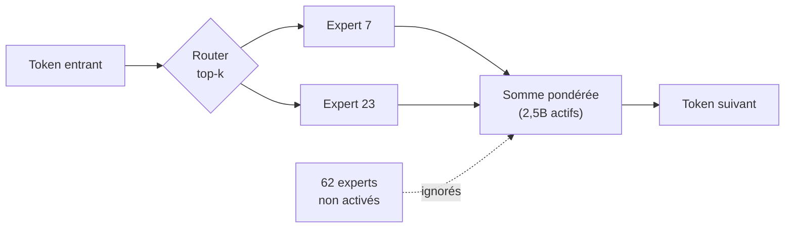
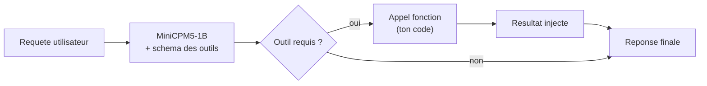
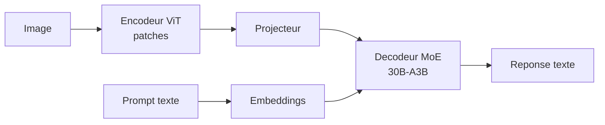

# IA — Détail du mardi 2 juin 2026

## 1. Mellum2 (JetBrains) — MoE 12B open-source pour la couche infra agentique

**Source :** JetBrains AI Blog — https://blog.jetbrains.com/ai/2026/06/mellum2-goes-open-source-a-fast-model-for-ai-workflows/
**Date :** 2 juin 2026

### Contexte

Mellum était le modèle de complétion de code 4B de JetBrains, propriétaire en 2024 puis ouvert en avril 2025. **Mellum2** lui succède et arrive open dès le premier jour. JetBrains ne vise pas le chat généraliste mais la « couche infra » des systèmes agentiques : routage, pipelines de retrieval, tâches de sous-agents et déploiement on-premise.

L'enjeu est clair. Dans un système d'agents, la majorité des appels LLM ne sont pas du raisonnement de pointe. Ce sont des tâches utilitaires répétées des milliers de fois : reformuler une requête, choisir un outil, condenser du contexte. Y coller un modèle frontière coûte cher et ralentit la boucle.

### Comment ça marche

Mellum2 repose sur une architecture **Mixture-of-Experts** (MoE). Le modèle compte **12B paramètres au total**, mais n'en active que **2,5B par token**, routés sur **64 experts**. Concrètement, une couche de routage (le *router*) lit chaque token et sélectionne un petit sous-ensemble d'experts — des réseaux feed-forward spécialisés. Seuls ces experts calculent.

Le gain est direct. Tu portes la connaissance d'un 12B en mémoire, mais le coût de calcul par token reste proche d'un 2,5B dense. L'inférence tient sur un GPU modeste. JetBrains décline trois variantes : **Base** (poids bruts, à fine-tuner), **Instruct** (suivi de consignes) et **Thinking** (chaîne de raisonnement explicite). Toutes sont sous **Apache 2.0**, publiées sur Hugging Face (`JetBrains/Mellum2-12B-A2.5B-*`).

Le schéma ci-dessous montre le flux d'un token à travers le bloc MoE.



Sous charge concurrente, JetBrains annonce **+21 % vs Qwen2.5-7B** et **+79 % vs Qwen3-8B** — chiffres constructeur, à valider sur ton propre workload. Le papier de référence est arXiv 2605.31268.

### En pratique — exemple de code

Tu déploies la variante Instruct derrière vLLM pour servir un sous-agent de compression de contexte RAG. Exemple d'appel au format OpenAI-compatible.

```python
# Sous-agent "compresseur de contexte" pour pipeline RAG, servi via vLLM
from openai import OpenAI

client = OpenAI(base_url="http://localhost:8000/v1", api_key="local")

def compress(chunks: list[str], question: str) -> str:
    joined = "\n---\n".join(chunks)
    resp = client.chat.completions.create(
        model="JetBrains/Mellum2-12B-A2.5B-Instruct",
        messages=[
            {"role": "system", "content": "Garde uniquement les passages utiles a la question. Sois bref."},
            {"role": "user", "content": f"Question: {question}\n\nPassages:\n{joined}"},
        ],
        temperature=0.0,  # deterministe pour une brique infra
        max_tokens=256,
    )
    return resp.choices[0].message.content

# Appelle ce sous-agent AVANT d'envoyer le contexte au gros modele de generation
```

Le pattern clé : Mellum2 ne génère pas la réponse finale. Il prépare le terrain — moins de tokens envoyés au modèle coûteux en aval.

### Pourquoi ça compte pour toi

Tu peux héberger Mellum2 toi-même pour des tâches de code internes — compression de contexte RAG, routage de requêtes, sous-agents — sans envoyer ton code à un cloud. La licence Apache 2.0 lève les freins juridiques en entreprise. Le MoE 2,5B actifs garde l'inférence rapide sur un GPU modeste. Idéal pour bâtir une brique privée sans dépendre d'une API externe.

---

## 2. MiniCPM5-1B (OpenBMB) — un 1B on-device avec tool-calling

**Source :** Hugging Face — https://huggingface.co/openbmb/MiniCPM5-1B
**Date :** 21 mai 2026

### Contexte

OpenBMB pousse la série MiniCPM sur le créneau edge/on-device. MiniCPM5-1B est un modèle 1B basé sur une architecture Llama, entraîné sur les jeux Ultra-FineWeb et UltraData, et taillé pour tourner localement.

Le pari est de rendre exploitable un modèle minuscule là où le cloud n'a pas sa place : latence garantie, données qui ne quittent pas l'appareil, coût d'inférence nul. Le **tool-calling** natif le sort du simple chatbot jouet.

### Comment ça marche

Le tool-calling repose sur un protocole simple. Tu fournis au modèle une description de tes fonctions (nom, paramètres, types). Quand l'utilisateur formule une demande, le modèle ne répond pas directement : il **émet un objet structuré** désignant la fonction à appeler et ses arguments. Ton code exécute la fonction, renvoie le résultat au modèle, qui produit alors la réponse finale.



À 1B paramètres, le modèle est **bilingue EN/ZH**, long-contexte, et étiqueté `on-device` / `edge-ai`. Les poids sont sous **Apache 2.0**. La communauté a déjà publié des versions abliterated/GGUF dès le 2 juin, signe d'une adoption rapide pour l'inférence quantifiée.

### En pratique — exemple de code

Définition d'un outil et boucle d'appel minimale avec `transformers`.

```python
# Tool-calling local avec MiniCPM5-1B : routage d'une demande vers une fonction
from transformers import AutoModelForCausalLM, AutoTokenizer
import json

tok = AutoTokenizer.from_pretrained("openbmb/MiniCPM5-1B", trust_remote_code=True)
model = AutoModelForCausalLM.from_pretrained("openbmb/MiniCPM5-1B", trust_remote_code=True)

tools = [{
    "type": "function",
    "function": {
        "name": "get_order_status",
        "description": "Statut d'une commande par id",
        "parameters": {"type": "object", "properties": {"order_id": {"type": "string"}}},
    },
}]

msgs = [{"role": "user", "content": "Ou en est ma commande A-4471 ?"}]
prompt = tok.apply_chat_template(msgs, tools=tools, add_generation_prompt=True, tokenize=False)
out = model.generate(**tok(prompt, return_tensors="pt"), max_new_tokens=128)
# La sortie contient un appel JSON : {"name": "get_order_status", "arguments": {"order_id": "A-4471"}}
print(tok.decode(out[0], skip_special_tokens=True))
```

### Pourquoi ça compte pour toi

Pour un assistant embarqué ou un service backend léger, un 1B avec tool-calling te permet d'appeler tes propres fonctions sans GPU coûteux ni latence cloud. Teste-le pour de la classification, du routage ou de l'extraction structurée à faible coût. À 1B, n'attends pas du raisonnement complexe : réserve-le aux tâches cadrées et déterministes.

---

## 3. Keye-VL 2.0 (Kwai) — VLM MoE 30B-A3B sous Apache 2.0

**Source :** Hugging Face — https://huggingface.co/Kwai-Keye/Keye-VL-2.0-30B-A3B
**Date :** 25 mai 2026

### Contexte

Kwai (Kuaishou) publie la version 2.0 de sa famille Keye-VL, un modèle vision-langage en architecture MoE. La sortie s'inscrit dans la salve de VLM open-weight chinois de mai (Step-3.7-Flash, PaddleOCR-VL-1.6 déjà couverts).

Un VLM (Vision-Language Model) fusionne deux modalités : il « voit » une image et « lit » du texte dans le même espace de représentation. Cela débloque l'extraction de documents, la lecture d'écrans ou le captioning, sans pipeline OCR séparé.

### Comment ça marche

Un VLM enchaîne trois étages. Un **encodeur d'images** (souvent un ViT) découpe l'image en patches et les transforme en vecteurs. Un **projecteur** aligne ces vecteurs sur l'espace d'embedding du modèle de langage. Enfin le **décodeur** — ici un MoE — traite la séquence mixte image+texte comme une suite de tokens et génère la réponse.

Keye-VL 2.0 utilise un décodeur **MoE 30B avec seulement 3B actifs** (30B-A3B). Même logique que Mellum2 : un router sélectionne les experts par token, ce qui maintient le coût d'inférence proche d'un 3B dense tout en gardant la capacité d'un 30B.



Le modèle est multimodal image+texte, conversationnel, livré au format `transformers` avec `custom_code`. La licence est **Apache 2.0** et les résultats d'éval sont publiés sur la fiche modèle.

### En pratique — exemple de code

Lecture d'une capture d'écran et extraction d'information.

```python
# Keye-VL 2.0 : decrire / extraire depuis une image, en self-hosting
from transformers import AutoModelForCausalLM, AutoProcessor
from PIL import Image
import torch

model_id = "Kwai-Keye/Keye-VL-2.0-30B-A3B"
proc = AutoProcessor.from_pretrained(model_id, trust_remote_code=True)
model = AutoModelForCausalLM.from_pretrained(
    model_id, torch_dtype=torch.bfloat16, device_map="auto", trust_remote_code=True
)

img = Image.open("dashboard.png")
question = "Quelle est la valeur du KPI 'Revenu mensuel' affichee ?"

inputs = proc(images=img, text=question, return_tensors="pt").to(model.device)
out = model.generate(**inputs, max_new_tokens=128)
print(proc.decode(out[0], skip_special_tokens=True))
# Reponse spatiale exploitable cote backend (mapping vers tes entites)
```

### Pourquoi ça compte pour toi

Si tu as un besoin vision (extraction de documents, lecture d'écrans, captioning) et que tu veux rester en self-hosting, un 30B-A3B garde un coût d'inférence raisonnable grâce au MoE. La licence Apache 2.0 autorise l'usage commercial. Compare-le à PaddleOCR-VL si ton cas d'usage est surtout documentaire avant de trancher.
