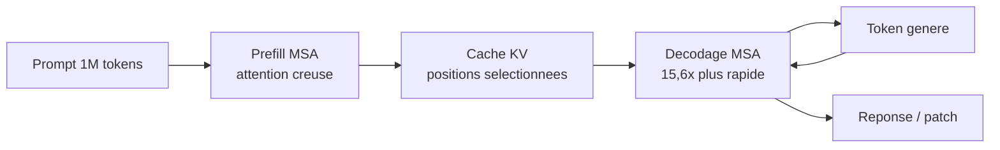

# IA — Détail du mercredi 3 juin 2026

## 1. MiniMax M3 — l'open-weight qui passe en tête sur SWE-Bench Pro (59,0%)

**Source :** MarkTechPost — https://www.marktechpost.com/2026/06/01/minimax-releases-minimax-m3-with-msa-architecture-supporting-1m-token-context-native-multimodality-and-agentic-coding/
**Date :** 1 juin 2026

### Contexte

MiniMax a publié M3 le 1er juin, présenté comme le premier modèle **open-weight** à combiner dans un seul réseau du coding de niveau frontière, un contexte d'**1 million de tokens** et une multimodalité native. Il prend la tête du classement open-weight sur SWE-Bench Pro, devant GLM-5.1 (58,4) qui détenait le record depuis avril.

SWE-Bench Pro n'est pas un quiz académique. Le benchmark demande au modèle de **résoudre de vrais tickets** de dépôts open-source : lire l'issue, naviguer le code, produire un patch qui passe les tests. Un score de 59 % sur ce terrain signale une réelle compétence agentique, pas du remplissage de prompt.

### Comment ça marche

Le verrou d'un contexte d'1M tokens, c'est l'attention. L'attention classique a un coût **quadratique** : doubler la longueur quadruple le calcul. À 1M tokens, c'est intenable. M3 introduit la **MiniMax Sparse Attention (MSA)** : au lieu que chaque token regarde tous les autres, il n'attend qu'un sous-ensemble pertinent de positions.

Le résultat est un décodage **15,6× plus rapide** et un prefill **9,7× plus rapide** que M2 sur des contextes au million de tokens. Le prefill (ingestion du prompt) et le décodage (génération) profitent tous deux de la parcimonie.



Le modèle est multimodal dès l'origine — entrées texte, image et vidéo — et score **70,06 % sur OSWorld-Verified** (computer use). Les **poids sont annoncés sous 10 jours** après le lancement ; les benchmarks restent en partie non vérifiés par des tiers.

### En pratique — exemple de code

En attendant les poids, l'API permet déjà de tester un workflow de revue de code sur un large contexte.

```python
# Revue de PR sur tout un module : tirer parti du contexte 1M tokens de M3
from openai import OpenAI
import pathlib

client = OpenAI(base_url="https://api.minimax.io/v1", api_key="...")

# Concatene un module entier (plusieurs milliers de lignes) dans un seul appel
sources = "\n\n".join(
    f"### {p}\n{p.read_text()}" for p in pathlib.Path("src/").rglob("*.cs")
)

resp = client.chat.completions.create(
    model="minimax-m3",
    messages=[
        {"role": "system", "content": "Tu es un reviewer C#. Signale bugs, fuites, anti-patterns."},
        {"role": "user", "content": f"Revois ce module et liste les problemes:\n{sources}"},
    ],
    max_tokens=2048,
)
print(resp.choices[0].message.content)
# Le contexte 1M evite de decouper le module en morceaux qui perdent le fil
```

### Pourquoi ça compte pour toi

Un modèle open-weight crédible sur l'agentique coding et le computer use, avec 1M de contexte, c'est un candidat sérieux pour self-hoster ta revue de code ou ton agent CI sans dépendre d'une API fermée. Attends la sortie effective des poids et un bench tiers avant de migrer : les scores annoncés restent ceux du constructeur. Garde GLM-5.1 comme repère comparatif.

### Points de vigilance

Benchmarks fournis par MiniMax, pas encore reproduits indépendamment. Score **59,0 %** devant GPT-5.5 (58,6) et proche de Claude Opus 4.7. L'empreinte mémoire d'un MoE 1M-contexte reste lourde : prévois du GPU avant d'envisager un déploiement local.
