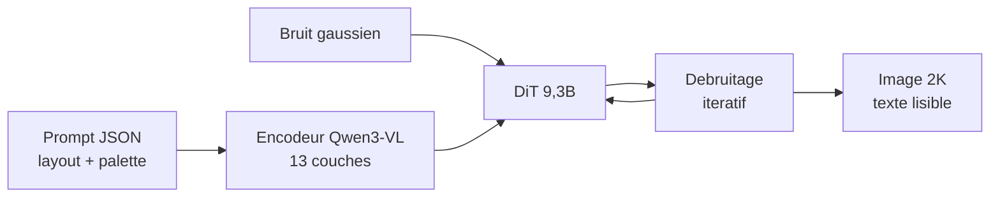
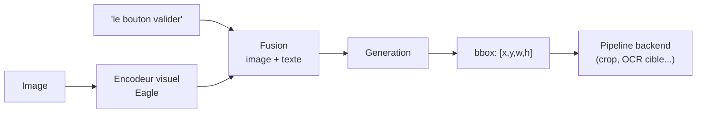
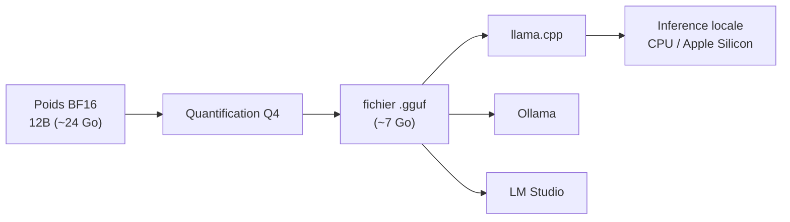

# IA — Détail du jeudi 4 juin 2026

## 1. Ideogram 4 — premier text-to-image open-weight d'Ideogram (9,3 Md, prompting JSON)

**Source :** Ideogram Blog — https://ideogram.ai/blog/ideogram-4.0/
**Date :** 3 juin 2026

### Contexte

Ideogram, jusqu'ici un service propriétaire réputé pour son rendu de texte dans les images, publie pour la première fois les **poids ouverts** de son modèle phare. C'est un signal fort : un modèle de design state-of-the-art rejoint l'écosystème self-hostable, dans la lignée des labs chinois qui ont ouvert la voie.

Le rendu de texte lisible dans une image générée est un point dur historique de la diffusion. Ideogram 4 en fait une force, et y ajoute une interface de pilotage structurée plutôt qu'un simple prompt en langage naturel.

### Comment ça marche

Ideogram 4 est un **DiT** (Diffusion Transformer) de **9,3 Md de paramètres**, entraîné from scratch — pas un fine-tune. La diffusion fonctionne à rebours : on part d'un bruit pur et le modèle le débruite étape par étape jusqu'à l'image finale, guidé par le prompt.

La qualité du guidage vient de l'**encodeur sémantique**, basé sur `Qwen3-VL-8B-Instruct`. Les hidden states de **13 couches** sont concaténés pour fournir des features multi-échelles — du sens global jusqu'aux détails fins comme la forme des lettres. Le **prompting JSON structuré** permet de placer des bounding-boxes de layout, de contrôler la palette, et de viser une résolution native 2K.



Les poids sont disponibles en `nf4` et `fp8` sur Hugging Face (https://huggingface.co/ideogram-ai/ideogram-4-fp8). Le modèle est en tête des modèles open sur Design Arena et LMArena, derrière GPT et Gemini uniquement.

### En pratique — exemple de code

Le prompt JSON rend l'intégration backend déterministe : tu construis un objet, pas une phrase.

```python
# Generation d'un visuel produit avec layout controle (prompting JSON)
from diffusers import DiffusionPipeline
import torch, json

pipe = DiffusionPipeline.from_pretrained(
    "ideogram-ai/ideogram-4-fp8", torch_dtype=torch.float8_e4m3fn
).to("cuda")

spec = {
    "prompt": "Affiche promo cafe artisanal, fond chaud minimaliste",
    "text_layout": [
        {"content": "BREW CO.", "bbox": [0.1, 0.05, 0.5, 0.18]},   # titre haut-gauche
        {"content": "-20% ce week-end", "bbox": [0.1, 0.8, 0.7, 0.92]},  # bas
    ],
    "palette": ["#3b2417", "#d9a066", "#f2e8d5"],
    "resolution": [2048, 2048],
}

image = pipe(json.dumps(spec)).images[0]
image.save("promo.png")  # Texte place precisement, palette imposee : reproductible
```

### Pourquoi ça compte pour toi

Si un de tes projets a besoin de génération d'images avec du texte lisible (visuels produit, vignettes, maquettes), tu peux désormais l'héberger toi-même au lieu d'appeler une API tierce. L'interface JSON colle bien à une intégration backend déterministe. Attention : la **licence est non-commerciale** — vérifie-la avant tout usage en prod ou client.

### Limites

- Licence Ideogram 4 Non-Commercial : pas d'usage commercial sans accord.
- Accès gated sur Hugging Face (inscription requise).
- 9,3 Md en diffusion = VRAM conséquente ; les variantes `nf4`/`fp8` aident mais visent quand même du GPU sérieux.

---

## 2. NVIDIA LocateAnything-3B — grounding visuel open en tête du trending HF

**Source :** Hugging Face — https://hf.co/nvidia/LocateAnything-3B
**Date :** trending au 4 juin 2026

### Contexte

`LocateAnything-3B` de NVIDIA domine le classement trending de Hugging Face cette semaine (≈1190 likes, 79K téléchargements). C'est un modèle **image-text-to-text** orienté grounding : tu lui décris un objet en langage naturel, il le localise dans l'image avec des bounding-boxes.

Le grounding visuel comble le fossé entre détection classique (classes fixes : « chien », « voiture ») et langage libre. Tu peux demander « le bouton de validation en bas à droite » et obtenir des coordonnées.

### Comment ça marche

Le modèle traite l'image et la requête texte dans un espace commun, puis **génère du texte qui encode des coordonnées** — typiquement des bounding-boxes sous forme de tokens numériques. La sortie n'est pas une carte de chaleur opaque : c'est une réponse structurée, parsable, rattachée à ta description.

`LocateAnything-3B` appartient à la famille **Eagle** de NVIDIA et unifie **détection d'objets, grounding et feature-extraction** dans un seul modèle 3B. Le pilotage est conversationnel : requête en texte libre, réponse spatiale structurée.



Le modèle est documenté par plusieurs papiers arXiv (réf. 2605.27365 notamment), livré au format `transformers` + `safetensors`, avec `custom_code` pour le chargement.

### En pratique — exemple de code

Localiser un élément puis recadrer la zone pour un traitement aval.

```python
# Grounding : localiser un objet decrit en langage naturel, recuperer la bbox
from transformers import AutoModelForCausalLM, AutoProcessor
from PIL import Image
import torch, re

mid = "nvidia/LocateAnything-3B"
proc = AutoProcessor.from_pretrained(mid, trust_remote_code=True)
model = AutoModelForCausalLM.from_pretrained(
    mid, torch_dtype=torch.float16, device_map="auto", trust_remote_code=True
)

img = Image.open("ticket.jpg")
prompt = "Localise le montant total TTC"
inputs = proc(images=img, text=prompt, return_tensors="pt").to(model.device)
out = model.generate(**inputs, max_new_tokens=64)
txt = proc.decode(out[0], skip_special_tokens=True)

box = [int(n) for n in re.findall(r"\d+", txt)][:4]  # [x, y, w, h]
crop = img.crop((box[0], box[1], box[0] + box[2], box[1] + box[3]))
crop.save("zone_montant.png")  # A enchainer avec un OCR cible
```

### Pourquoi ça compte pour toi

Pour un pipeline backend de traitement d'images — extraction de zones, contrôle qualité visuel, indexation — un modèle de grounding ouvert et compact (3B) est intégrable sans dépendre d'une API cloud. Tu l'appelles depuis un microservice Python, tu récupères des coordonnées exploitables côté .NET ou Symfony. Vérifie la licence exacte du repo avant un déploiement commercial.

### Détails techniques

- 3 Md de paramètres : tient sur un GPU grand public en demi-précision.
- `custom_code` : nécessite `trust_remote_code=True`, donc audite le code avant exécution.

---

## 3. Gemma 4 débarque en local — quants GGUF pour llama.cpp et Ollama

**Source :** Hugging Face — https://hf.co/unsloth/gemma-4-12b-it-GGUF
**Date :** 29 mai 2026

### Contexte

La famille **Gemma 4** de Google (sortie fin mai, Apache 2.0, modèles unifiés any-to-any) finit son atterrissage dans l'écosystème d'inférence locale. Les quants **GGUF** publiés par unsloth rendent le modèle 12B directement exécutable hors GPU datacenter.

GGUF est le format de fichier de `llama.cpp` : il embarque poids quantifiés et métadonnées dans un seul fichier, chargeable sur CPU comme sur GPU, y compris Apple Silicon.

### Comment ça marche

La **quantification** réduit la précision des poids. Un modèle entraîné en 16 bits (BF16) est converti, par exemple, en 4 bits (Q4). Chaque poids passe de 2 octets à un demi-octet : la taille mémoire est divisée par ~4, et un 12B qui réclamait un GPU datacenter tient alors dans ~10 Go de RAM/VRAM.

Le compromis est une légère perte de qualité, généralement négligeable en Q4 pour de l'usage courant. `llama.cpp`, Ollama et LM Studio chargent directement le `.gguf`.



La variante `gemma-4-12b-it-GGUF` est prête pour ces trois runtimes. L'architecture `gemma4_unified` gère l'entrée/sortie multimodale (image-text-to-text). La licence **Apache 2.0** sur les poids de base autorise l'usage commercial, contrairement à Ideogram 4.

### En pratique — exemple de code

Lancer Gemma 4 en local via Ollama, puis l'appeler depuis ton code.

```bash
# 1. Recuperer et servir le modele quantifie en local (aucun GPU datacenter requis)
ollama pull gemma-4-12b-it      # ~7 Go en Q4
ollama serve &                  # expose une API compatible OpenAI sur :11434

# 2. Appel direct : generation locale, donnees jamais envoyees a un tiers
curl http://localhost:11434/v1/chat/completions \
  -H "Content-Type: application/json" \
  -d '{
    "model": "gemma-4-12b-it",
    "messages": [{"role": "user", "content": "Resume ce log d erreur en 3 points"}]
  }'
```

### Pourquoi ça compte pour toi

Tu peux faire tourner un modèle multimodal récent sur ton poste ou un serveur modeste, sans facture d'API ni envoi de données sensibles à un tiers. C'est l'option à privilégier quand la confidentialité prime ou pour prototyper une feature IA avant de décider d'un backend cloud. La licence Apache 2.0 lève le frein commercial.

### Limites

- Le 12B en GGUF reste gourmand : compte une quantization Q4 et ≥10 Go de RAM/VRAM pour un débit confortable.
