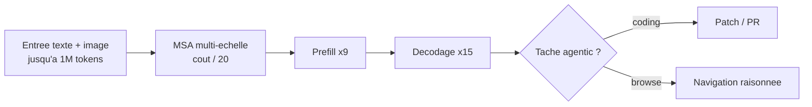

# IA — Détail du vendredi 5 juin 2026

## 1. MiniMax M3 — premier open-weight avec frontier coding + 1M tokens de contexte (SWE-Bench Pro 59%)

**Source :** MiniMax Blog — https://www.minimax.io/blog/minimax-m3
**Date :** 1 juin 2026

### Contexte

MiniMax, lab chinois connu pour ses modèles de génération vocale et vidéo, publie le 1er juin son flagship texte/code M3 en open-weight. C'est la première fois qu'un modèle open-weight combine trois caractéristiques jusqu'ici réservées aux modèles propriétaires top-tier : performance frontier sur le coding, fenêtre de contexte d'1M de tokens, et multimodalité native image+texte.

La publication s'inscrit dans une intense compétition ouverte (Kimi K2.6, GLM-5.1, MiniMax M3) qui redéfinit le plafond du possible sans API fermée. Le fait marquant ici n'est pas un score isolé mais le **cumul des trois axes** dans un seul réseau.

### Comment ça marche

Le cœur technique est l'architecture **MSA (Multi-Scale Attention)**, qui rend le contexte 1M tokens viable. L'attention dense est quadratique en longueur de séquence ; à 1M tokens elle explose. MSA traite l'attention à plusieurs échelles — résolution fine sur les positions proches, grossière sur les lointaines — pour réduire le coût de calcul à 1M tokens à **1/20** de la génération précédente.

Les gains se répartissent sur les deux phases d'inférence : **×9 sur le prefill** (ingestion du prompt) et **×15 sur le décodage** (génération token par token). La multimodalité image-texte est native, sans adaptateur tiers greffé après coup.



Côté résultats : **SWE-Bench Pro 59,0 %** (surpasse GPT-5.5 et Gemini 3.1 Pro, talonne Claude Opus 4.7) et **BrowseComp 83,5 %** (dépasse Claude Opus 4.7 à 79,3 % sur la navigation web raisonnée). L'**API est disponible** depuis le 1er juin ; les **poids ouverts** (Hugging Face + GitHub) sont attendus dans les ~10 jours suivant la release.

### En pratique — exemple de code

Le 1M de contexte permet de charger une base de code entière et de raisonner dessus en un appel.

```python
# Agent de documentation : ingerer un repo complet grace au contexte 1M tokens
from openai import OpenAI
import pathlib

client = OpenAI(base_url="https://api.minimax.io/v1", api_key="...")

# Tout le code source dans un seul prompt (impossible avec un contexte 128k classique)
repo = "\n\n".join(
    f"### {p}\n{p.read_text()}"
    for p in pathlib.Path("backend/").rglob("*.cs")
)

resp = client.chat.completions.create(
    model="minimax-m3",
    messages=[
        {"role": "system", "content": "Genere une doc d'architecture: modules, dependances, points d'entree."},
        {"role": "user", "content": repo},
    ],
    max_tokens=4096,
)
print(resp.choices[0].message.content)
# Le modele voit les liens inter-fichiers, pas des fragments isoles
```

### Pourquoi ça compte pour toi

Pour un projet backend qui génère du code ou raisonne sur de larges bases de code, M3 devient une alternative crédible aux API propriétaires — avec un contexte d'1M tokens qui couvre des projets entiers en un seul appel. Si tu évalues des modèles pour un pipeline .NET ou Symfony (génération de SQL, revue de PR, agent de documentation), M3 est maintenant dans le top 3 open-weight à benchmarker. Attends la publication des poids pour tester en self-hosted.

### Points de vigilance

- Les benchmarks émanent de MiniMax eux-mêmes — à reproduire sur tes propres jeux de données avant de conclure sur le coding .NET/Angular spécifiquement.
- **Licence non encore confirmée** au moment de la publication du 1er juin : vérifie avant tout usage commercial ou client.
- Les poids ne sont pas encore disponibles au 5 juin — plan sur 10 jours de délai avant de pouvoir tester en local ou self-hosted.
- 1M de tokens en contexte reste coûteux même avec MSA : profiler les coûts API avant de passer en production à grande échelle.
