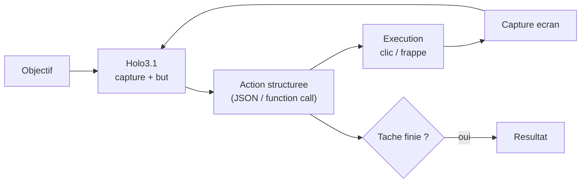
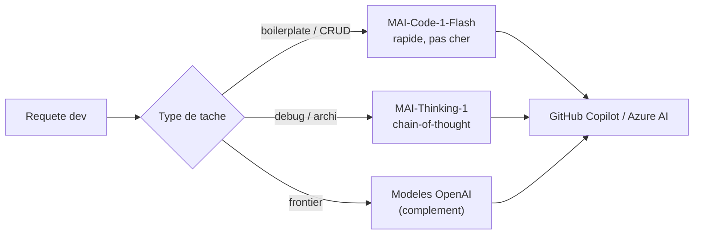
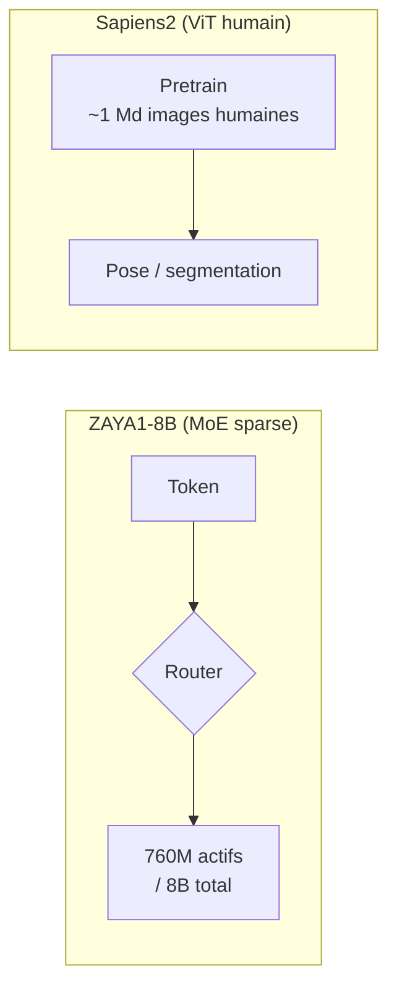

# IA — Détail du samedi 6 juin 2026

## 1. Holo3.1 — Computer use open-weight local : 4 tailles, FP8/NVFP4/GGUF, mobile 79.3%

**Source :** Hugging Face Blog (H Company) — https://huggingface.co/blog/Hcompany/holo31
**Date :** 2 juin 2026

### Contexte

H Company avait sorti Holo3 début avril 2026, un modèle de computer use cloud-first. Après adoption rapide, les retours terrain ont convergé vers trois besoins : support mobile, interopérabilité avec les frameworks d'agents tiers (function calling), et déploiement local. Holo3.1 répond aux trois d'un coup et constitue la première release de la famille à embarquer des checkpoints quantifiés pour l'inférence locale.

Le « computer use » désigne un modèle qui pilote une interface graphique : il regarde une capture d'écran, raisonne, et émet des actions (clic, frappe, défilement) pour accomplir une tâche.

### Comment ça marche

La boucle est un cycle perception-action. Le modèle reçoit une **capture d'écran** plus l'objectif. Il identifie l'élément cible et **émet une action structurée** : avec Holo3.1, soit en JSON brut, soit via **function calling** natif compatible avec les frameworks d'agents tiers. L'action est exécutée, un nouvel écran est capturé, et la boucle recommence jusqu'à la fin de la tâche.



Quatre tailles couvrent tous les budgets : **Holo3.1-0.8B** (edge), **4B** (cost-efficient), **9B** (équilibre perf/latence), **35B-A3B** (état de l'art, MoE 3B actifs). La quantification pour le local est riche : **FP8**, **NVFP4** (W4A16, optimisé DGX Spark) et **Q4 GGUF** (llama.cpp, Apple Silicon). Sur DGX Spark, NVFP4 délivre **1.74× le throughput de BF16** avec une dégradation OSWorld de seulement ~2 points.

Côté benchmarks : AndroidWorld (35B) passe de **67 % à 79.3 %** (+12.3 pts) ; les 4B et 9B montent de **58 % à 72 %**. Sur OSWorld et les benchmarks e-commerce/business, **+25 % vs Holo3** en harness function-calling, avec une perf quasi à parité entre sortie JSON et function calling.

### En pratique — exemple de code

Squelette d'une boucle agentique de computer use avec Holo3.1 en function calling.

```python
# Boucle computer-use locale : Holo3.1 pilote une UI via function calling
import pyautogui  # capture + actions OS

tools = [
    {"name": "click", "parameters": {"x": "int", "y": "int"}},
    {"name": "type_text", "parameters": {"text": "string"}},
]

def run(goal: str, holo, max_steps=20):
    for _ in range(max_steps):
        screenshot = pyautogui.screenshot()                 # etat courant de l'ecran
        action = holo.infer(image=screenshot, goal=goal, tools=tools)  # 35B-A3B en Q4 GGUF
        if action["name"] == "done":
            return action.get("result")
        if action["name"] == "click":
            pyautogui.click(action["arguments"]["x"], action["arguments"]["y"])
        elif action["name"] == "type_text":
            pyautogui.typewrite(action["arguments"]["text"])
    raise RuntimeError("budget d'etapes epuise")

# 100% local : aucune capture d'ecran n'est envoyee a une API cloud
```

### Pourquoi ça compte pour toi

Si tu construis ou évalues des agents d'automatisation (test UI, RPA, scraping applicatif), Holo3.1 ouvre une option d'exécution 100% locale sous licence open. Le Q4 GGUF sur Apple Silicon supprime la dépendance à une API cloud pour des workflows de computer use privés ou sensibles. Le 9B est probablement le sweet spot coût/perf pour des pipelines CI qui automatisent des tests de navigation.

---

## 2. Microsoft MAI-Code-1-Flash + MAI-Thinking-1 — Build 2026 : Microsoft dans le LLM propriétaire

**Source :** CNBC — https://www.cnbc.com/2026/06/02/microsoft-unveils-new-ai-models-lessen-reliance-on-openai-lower-costs.html
**Date :** 2 juin 2026

### Contexte

Microsoft a toujours été le distributeur d'OpenAI via Azure, sans jamais publier ses propres LLMs frontier. La conférence Build 2026 a marqué un tournant : Microsoft annonce **MAI-Code-1-Flash** (génération de code) et **MAI-Thinking-1** (reasoning low-cost), ses premiers modèles IA en propre. Le sous-texte stratégique est clair : diversifier la dépendance à OpenAI à mesure que la relation commerciale évolue.

### Comment ça marche

Les deux modèles incarnent une stratégie de **routage par coût/tâche**. Plutôt qu'un seul modèle cher pour tout, on dirige chaque requête vers le modèle adéquat. **MAI-Code-1-Flash** prend une description textuelle et produit du code source ; positionné rapide et économique (« Flash »), taillé pour Copilot et les pipelines CI. **MAI-Thinking-1** est un modèle de reasoning à faible coût, ciblé sur les tâches à chain-of-thought : débogage complexe, architecture, analyse de logs.



Microsoft positionne ces modèles comme **compléments** (pas remplaçants) aux modèles OpenAI dans Azure. L'objectif annoncé est de réduire le coût par token pour les cas d'usage répétitifs haute-fréquence. Distribution via **Azure AI** et **GitHub Copilot**.

### En pratique — exemple de code

Les modèles MAI sont exposés via l'endpoint Azure AI, compatible avec le SDK OpenAI.

```python
# Routage cout/tache : Flash pour le boilerplate, Thinking pour le debug
from openai import AzureOpenAI

client = AzureOpenAI(
    azure_endpoint="https://<ton-resource>.openai.azure.com",
    api_key="...", api_version="2026-05-01",
)

def generate(task: str, kind: str) -> str:
    model = "mai-code-1-flash" if kind == "code" else "mai-thinking-1"
    resp = client.chat.completions.create(
        model=model,                       # Flash = moins cher pour le repetitif
        messages=[{"role": "user", "content": task}],
        max_tokens=1024,
    )
    return resp.choices[0].message.content

# Tests unitaires / CRUD -> Flash (volume eleve, faible cout)
print(generate("Genere les tests xUnit pour OrderService.Create", kind="code"))
```

### Pourquoi ça compte pour toi

En tant que dev .NET/Angular sur Azure, tu vas potentiellement avoir accès à MAI-Code-1-Flash dans GitHub Copilot sans changer ton workflow. Le vrai enjeu est la tarification : si ces modèles sont significativement moins chers que GPT-4o pour la génération de code répétitive (tests unitaires, boilerplate CRUD), ils pourraient devenir les modèles par défaut dans les pipelines Copilot d'entreprise. À surveiller sur le pricing Azure AI Studio dans les prochaines semaines.

### Points de vigilance

- Pas de poids open-source annoncés à ce stade — c'est du propriétaire Microsoft, accessible uniquement via Azure ou GitHub Copilot.
- Les benchmarks publics sont pour l'instant limités aux annonces marketing de Build. Attends des évaluations tierces avant de prendre des décisions d'adoption.

---

## 3. Open Source IA — Panorama semaine du 1er-6 juin 2026

**Source :** LLM Stats — https://llm-stats.com/llm-updates
**Date :** semaine du 1er au 6 juin 2026

### Contexte

Au-delà des sorties individuelles déjà couvertes cette semaine (MiniMax M3 le 3 juin, Ideogram 4 le 4 juin), plusieurs modèles open-weight ou Apache 2.0 sont apparus sur le Hub Hugging Face en début juin. Deux méritent un focus : **Zyphra ZAYA1-8B** et **Sapiens2** (Meta).

### Comment ça marche

**ZAYA1-8B** pousse la logique MoE sparse à l'extrême : 8B paramètres totaux mais seulement **760M actifs** par token. Ce ratio activated/total parmi les plus bas du marché signifie qu'un router sélectionne une fraction minime des experts à chaque pas. Le coût d'inférence s'approche d'un sub-1B dense, tout en gardant la capacité d'un 8B — idéal pour du hardware léger. Licence **Apache 2.0**.

**Sapiens2** (Meta) suit une logique différente : des **vision transformers spécialisés sur l'humain**, pré-entraînés sur ~1 milliard d'images humaines. Le pré-entraînement massif sur un domaine unique fait gagner en précision sur les tâches dérivées : **+4 mAP** en pose estimation, **+24.3 mIoU** en segmentation body-part vs Sapiens v1. Quatre tailles, de 0.4B à 5B params.



### En pratique — exemple de code

ZAYA1-8B se charge comme un causal LM standard ; le MoE est transparent côté API.

```python
# ZAYA1-8B : petit modele local efficace pour du batch processing a faible cout
from transformers import AutoModelForCausalLM, AutoTokenizer
import torch

mid = "Zyphra/ZAYA1-8B"
tok = AutoTokenizer.from_pretrained(mid)
model = AutoModelForCausalLM.from_pretrained(
    mid, torch_dtype=torch.bfloat16, device_map="auto"
)  # ~760M actifs/token -> empreinte RAM bien plus legere qu'un 8B dense

prompt = "Classe ce ticket support: 'Impossible de me connecter depuis ce matin'"
out = model.generate(**tok(prompt, return_tensors="pt").to(model.device), max_new_tokens=32)
print(tok.decode(out[0], skip_special_tokens=True))
# Adapte au traitement par lot : classification, routage, extraction structuree
```

### Pourquoi ça compte pour toi

ZAYA1-8B intéresse si tu cherches un petit modèle local pour de l'inférence embarquée ou du batch processing à faible coût — la densité paramétrique active est un avantage pour les contraintes de RAM. Sapiens2 est plus niche (vision humaine) mais utile si tu travailles sur des apps d'analyse de posture, de geste ou de présence en contexte industriel ou médical.
