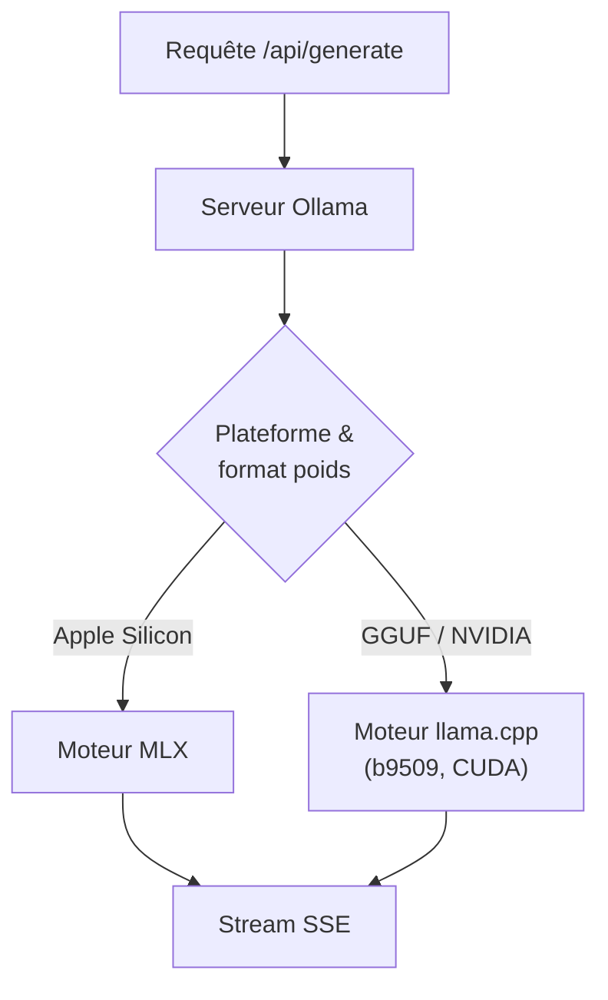
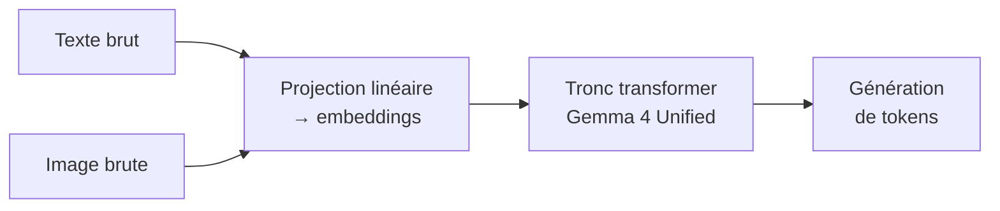

# IA — Détail du dimanche 7 juin 2026

## 1. Ollama 0.30 — le moteur llama.cpp épaule MLX, support matériel élargi

**Source :** Ollama — https://github.com/ollama/ollama/releases
**Date :** 4 juin 2026 (v0.30.5)

### Contexte

Ollama avait basculé son moteur d'inférence vers MLX sur Apple Silicon en mai. Ce choix maximisait les perfs sur Mac mais laissait une partie du parc matériel de côté, notamment les GPU NVIDIA. La série 0.30 répare cela en réintégrant `llama.cpp` en complément de MLX, sans revenir en arrière sur les gains Apple.

L'éditeur ne remplace donc pas un moteur par l'autre : il fait cohabiter deux backends et route chaque modèle vers celui qui exploite le mieux ton matériel. C'est un retour au multi-runtime, après une parenthèse mono-moteur.

### Comment ça marche

Ollama expose une API unique mais délègue l'inférence à un moteur choisi selon la plateforme et le format des poids. Sur Apple Silicon, MLX reste prioritaire pour profiter du Neural Engine et de la mémoire unifiée. Partout ailleurs — et pour les GGUF — `llama.cpp` reprend la main.

Concrètement, quand tu charges un modèle, Ollama lit son format (MLX natif ou GGUF) et la cible matérielle, puis instancie le runtime adapté. Un GGUF Hugging Face ou ton fine-tune perso passe par `llama.cpp`, ce qui débloque le support NVIDIA via CUDA. La couche serveur (API REST, gestion du cache KV, streaming SSE) reste commune aux deux moteurs.



Le patch `0.30.5` du 4 juin passe `llama.cpp` en build `b9509`, corrige les crashs multimodaux de Gemma 4 12B (x86, CUDA, Linux, Windows) et ignore les frames de commentaire vides du ping 30 s SSE qui polluaient le flux.

### En pratique — exemple de code

Charger un GGUF custom depuis Hugging Face et l'interroger en streaming, sans choisir le moteur à la main.

```bash
# Ollama 0.30.5 — exécute un GGUF Hugging Face en local (llama.cpp côté NVIDIA)
ollama pull hf.co/bartowski/gemma-4-12b-GGUF:Q4_K_M

# Inférence streamée via l'API REST (frames de ping vides désormais filtrées)
curl http://localhost:11434/api/generate -d '{
  "model": "hf.co/bartowski/gemma-4-12b-GGUF:Q4_K_M",
  "prompt": "Résume ce log applicatif en 3 puces.",
  "stream": true
}'

# Catalogue à jour : Kimi-K2.6, GLM-5.1, MiniMax, DeepSeek, gpt-oss, Qwen, Gemma
ollama list
```

Tu ne précises jamais MLX ou `llama.cpp` : le serveur route selon la plateforme et le format. Le même `Modelfile` reste valable d'un Mac à une machine NVIDIA.

### Pourquoi ça compte pour toi

Si tu fais tourner des LLM en local pour prototyper ou pour de l'inférence sur ton poste, tu récupères un support matériel cohérent sans choisir entre Apple et NVIDIA. Attends `0.30.5` minimum si tu touches à Gemma 4 12B en multimodal : les versions antérieures crashent. Pour de l'usage GGUF custom, c'est la version à adopter.

### Points de vigilance

Le routage automatique entre moteurs est pratique, mais le comportement d'inférence (tokenizer, perfs, RAM) peut différer entre MLX et `llama.cpp` pour un même modèle. Si tu compares des benchmarks d'une machine à l'autre, garde le moteur effectif à l'esprit avant de conclure.

---

## 2. Transformers v5.10.1 — Gemma 4 Unified, DeepSeek-OCR-2, Sapiens2, Mellum

**Source :** Hugging Face Transformers — https://github.com/huggingface/transformers/releases
**Date :** juin 2026

### Contexte

La bibliothèque `transformers` continue son rythme de releases serré sur la branche 5.x. La 5.10.1 ajoute le support de plusieurs architectures sorties récemment et consolide la stabilité côté parallélisme et quantization. C'est la couche de référence par laquelle un nouveau modèle devient utilisable sans patch maison.

L'enjeu pour toi : tant qu'une architecture n'est pas câblée dans `transformers`, l'intégrer demande du code de modélisation custom. Une fois supportée, elle se charge avec les classes standard `AutoModel*`.

### Comment ça marche

`transformers` mappe chaque architecture sur une classe de modélisation et une config. Quand tu appelles `from_pretrained`, la lib lit le champ `model_type` du `config.json` du dépôt, résout la classe correspondante, puis instancie les couches et charge les poids `safetensors`.

Un cas notable de la 5.10.1 : **Gemma 4 Unified** est *encoder-free*. Au lieu d'un encodeur visuel séparé, il projette les entrées brutes (texte et image) directement dans l'espace d'embedding via une projection linéaire. Le même tronc transformer traite ensuite les deux modalités, ce qui simplifie le pipeline multimodal.



La release ajoute aussi **Sapiens2**, **DeepSeek-OCR-2** et **Mellum** (JetBrains), plus des correctifs larges sur le model parallelism, la gestion du cache et la quantization. La stabilité de Gemma 4 est améliorée, en cohérence avec les correctifs côté runtimes locaux.

### En pratique — exemple de code

Charger DeepSeek-OCR-2 pour de l'extraction documentaire, depuis une couche Python appelée par ton service backend.

```python
# transformers v5.10.1 — DeepSeek-OCR-2 pour extraction documentaire
from transformers import AutoProcessor, AutoModelForVision2Seq
from PIL import Image
import torch

model_id = "deepseek-ai/DeepSeek-OCR-2"
processor = AutoProcessor.from_pretrained(model_id, trust_remote_code=True)
model = AutoModelForVision2Seq.from_pretrained(
    model_id, torch_dtype=torch.bfloat16, device_map="auto", trust_remote_code=True
)

page = Image.open("scan_page.png")
inputs = processor(images=page, text="Transcris le contenu.", return_tensors="pt")
out = model.generate(**{k: v.to(model.device) for k, v in inputs.items()}, max_new_tokens=1024)
print(processor.decode(out[0], skip_special_tokens=True))

# Épingle la version exacte côté requirements : transformers==5.10.1
```

### Pourquoi ça compte pour toi

Si tu intègres un modèle d'extraction documentaire ou multimodal dans un service .NET ou Symfony via une couche Python, `DeepSeek-OCR-2` et `Gemma 4 Unified` deviennent utilisables sans patch maison. Épingle une version exacte de `transformers` : les correctifs cache/quantization de cette branche changent parfois le comportement d'inférence entre patchs mineurs.
