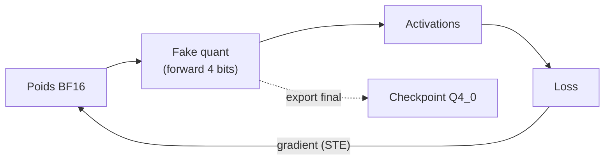
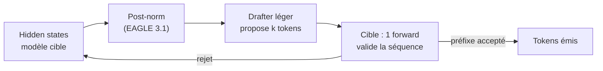
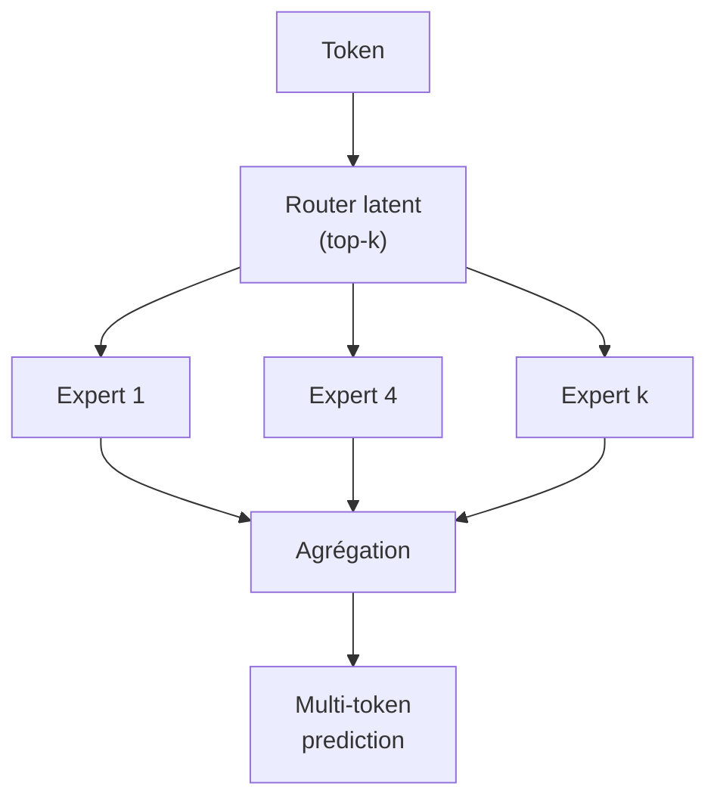

# IA — Détail du lundi 8 juin 2026

## 1. Gemma 4 QAT — VRAM réduite de ~72 %, E2B sous 1 Go

**Source :** Google Developers Blog — https://blog.google/innovation-and-ai/technology/developers-tools/quantization-aware-training-gemma-4/
**Date :** 5 juin 2026

### Contexte

La famille Gemma 4 (Apache 2.0) est sortie fin mai. Le frein à l'usage local restait la mémoire : le 12B en BF16 demande ~9,6 Go rien que pour les poids. Google publie des checkpoints entraînés en **Quantization-Aware Training** (QAT).

L'idée du QAT : simuler la quantification *pendant* l'entraînement, plutôt que de l'appliquer après coup. Le modèle apprend à rester précis malgré la perte de bits, ce qui préserve la qualité là où une quantification post-entraînement (PTQ) la dégrade.

### Comment ça marche

En BF16, chaque poids tient sur 16 bits. La quantification Q4_0 le ramène à ~4 bits, d'où la chute mémoire. Le problème : arrondir brutalement des poids déjà entraînés introduit du bruit qui fait dériver les activations, donc la qualité.

Le QAT contourne ça. Pendant l'entraînement, on insère des nœuds *fake quant* qui arrondissent les poids en avant (forward), tout en laissant passer le gradient en arrière (straight-through estimator). Le modèle « voit » donc l'erreur de quantification à chaque pas et ajuste ses poids pour la compenser. À la fin, on exporte des checkpoints Q4_0 réellement robustes à 4 bits.



Résultat annoncé : empreinte réduite d'environ **72 %** versus BF16, à qualité quasi inchangée. **E2B (texte) tient sous 1 Go de RAM** ; le 26B-A4B passe sur un laptop 16 Go. Cinq tailles couvrent le spectre : E2B, E4B, 12B, 26B-A4B, 31B. Les checkpoints sont au format Q4_0 largement supporté, plus des formats pensés pour le mobile.

### En pratique — exemple de code

Servir un Gemma 4 QAT directement depuis le GGUF Q4_0, sans étape de quantification maison.

```bash
# Gemma 4 QAT — le checkpoint Q4_0 est déjà robuste, aucun PTQ à faire
ollama pull gemma-4-12b-qat:Q4_0     # ~ -72 % de RAM vs BF16

# Avant de migrer : benchmarke QAT vs ta quant actuelle sur ta tâche réelle
ollama run gemma-4-12b-qat:Q4_0 "Classe ce ticket support : bug, feature ou question ?"

# E2B texte tient sous 1 Go — viable sur du matériel modeste / edge
ollama pull gemma-4-e2b-qat:Q4_0
```

Tu charges le GGUF Q4_0 directement dans Ollama ou `llama.cpp`. Pas d'étape de calibration ni de conversion : le QAT a déjà fait le travail à l'entraînement.

### Pourquoi ça compte pour toi

Si tu fais tourner un assistant local ou un service d'inférence on-prem, ces poids QAT te permettent de servir un Gemma 4 utile sur du matériel modeste, sans la perte de qualité d'une quantification post-entraînement. Bon réflexe avant de migrer : benchmarker QAT contre ta quant actuelle sur ta charge réelle, la qualité n'étant jamais strictement identique.

---

## 2. vLLM v0.22.0 — EAGLE 3.1 et decoding spéculatif jusqu'à 2,03×

**Source :** vLLM Blog — https://vllm.ai/blog/2026-05-26-eagle-3-1
**Date :** début juin 2026 (release v0.22.0)

### Contexte

EAGLE est une famille de méthodes de **decoding spéculatif** : un petit « drafter » propose plusieurs tokens que le modèle cible valide en un seul pass. EAGLE 3 souffrait d'une régression en long contexte (« attention drift ») qui dégradait le taux d'acceptation. EAGLE 3.1 a été annoncé le 26 mai et atterrit dans la release **v0.22.0** de vLLM.

Le decoding spéculatif attaque le goulot d'étranglement de la génération autorégressive : un gros modèle ne produit qu'un token par forward pass, coûteux. L'idée est de deviner plusieurs tokens d'un coup, puis de les faire vérifier en bloc.

### Comment ça marche

Le drafter — un réseau léger — propose une courte séquence de tokens candidats à partir des hidden states du modèle cible. Le modèle cible fait alors **un seul forward pass** sur toute la séquence proposée et accepte le plus long préfixe correct. Tout token rejeté est resynchronisé, et on recommence. Plus le taux d'acceptation est haut, plus tu génères de tokens par pass du gros modèle.

EAGLE 3.1 ajoute une **normalisation post-norm** après chaque hidden state cible. Le drafter se comporte alors comme s'il était ré-invoqué récursivement, ce qui corrige la dérive d'attention en long contexte et remonte le taux d'acceptation.



Gains mesurés : **2,03× de débit par utilisateur** à concurrence 1 ; 1,71× à C=4 ; 1,66× à C=16. L'extension est **config-driven** au-dessus d'EAGLE 3 et **rétrocompatible** avec les checkpoints EAGLE 3 existants. La v0.22.0 ajoute aussi des proposers custom et la spéculation non-MTP pour NemotronH.

### En pratique — exemple de code

Activer EAGLE 3.1 sur un serveur vLLM existant : c'est une mise à jour de config, pas un réentraînement.

```python
# vLLM v0.22.0 — EAGLE 3.1 en config sur un checkpoint EAGLE 3 existant
from vllm import LLM, SamplingParams

llm = LLM(
    model="meta-llama/Llama-3.1-70B-Instruct",
    speculative_config={
        "method": "eagle3",           # EAGLE 3.1 = extension config-driven d'EAGLE 3
        "model": "yuhuili/EAGLE3-Llama-3.1-70B",
        "num_speculative_tokens": 5,  # taille du draft proposé par pass
        "post_norm": True,            # corrige l'attention drift en long contexte
    },
)
out = llm.generate(["Explique le decoding spéculatif."], SamplingParams(max_tokens=256))
print(out[0].outputs[0].text)
# Gain ~2,03x à concurrence 1 — mesure sur TA charge avant de généraliser
```

### Pourquoi ça compte pour toi

Si tu sers des LLM maison derrière une API, EAGLE 3.1 réduit la latence perçue sans réentraîner ni changer de checkpoint : c'est une mise à jour de config sur tes drafters existants. Le gain reste réel en montée en charge, donc utile en prod. Teste sur ta charge réelle avant de généraliser : le speedup dépend du taux d'acceptation, lui-même fonction de ta distribution de prompts.

---

## 3. NVIDIA Nemotron-3 Ultra 550B-A55B — frontier open en latent-MoE

**Source :** Hugging Face — https://hf.co/nvidia/NVIDIA-Nemotron-3-Ultra-550B-A55B-BF16
**Date :** 3 juin 2026

### Contexte

NVIDIA pousse la gamme Nemotron-3 vers le très haut de spectre avec un modèle **550B de paramètres, 55B actifs** (architecture latent-MoE), publié en BF16 sur le Hub. Il s'inscrit dans la vague des grands open-weight visant le raisonnement multilingue, en concurrence directe avec les frontier propriétaires.

L'intérêt du MoE à ce gabarit : tu disposes de 550B de paramètres de capacité, mais tu n'en actives que 55B par token. Le coût de calcul par token reste proche d'un dense 55B, pas 550B.

### Comment ça marche

Dans un MoE, chaque couche feed-forward est remplacée par un ensemble d'« experts ». Un *router* léger lit la représentation du token et sélectionne un petit sous-ensemble d'experts (top-k) à activer. Seuls ces experts calculent, d'où l'écart entre paramètres totaux et actifs.

La variante *latent-MoE* route dans un espace latent compressé plutôt que sur la représentation brute, ce qui stabilise et allège le routage à grande échelle. S'y ajoute la **multi-token prediction (MTP)** : le modèle prédit plusieurs tokens futurs par pass, ce qui accélère le decoding (et alimente naturellement le spéculatif).



Le support multilingue est large (en, fr, es, it, de, pt, ja, ko, hi, ar…). Les poids ouverts en BF16 sont intégrables via `transformers`, mais ne te trompe pas de cible : 550B BF16, c'est du multi-nœuds GPU.

### En pratique — exemple de code

Charger un modèle de ce gabarit impose le sharding multi-GPU ; `device_map="auto"` répartit les couches.

```python
# Nemotron-3 Ultra 550B-A55B — chargement shardé multi-GPU (infra lourde requise)
from transformers import AutoModelForCausalLM, AutoTokenizer
import torch

model_id = "nvidia/NVIDIA-Nemotron-3-Ultra-550B-A55B-BF16"
tok = AutoTokenizer.from_pretrained(model_id)
model = AutoModelForCausalLM.from_pretrained(
    model_id,
    torch_dtype=torch.bfloat16,
    device_map="auto",        # répartit les couches sur tous les GPU visibles
)
# 55B actifs / token : le coût calcul ~ dense 55B, mais il faut loger 550B en VRAM
msgs = [{"role": "user", "content": "Explique le routage latent-MoE en français."}]
ids = tok.apply_chat_template(msgs, return_tensors="pt").to(model.device)
print(tok.decode(model.generate(ids, max_new_tokens=256)[0]))
```

### Pourquoi ça compte pour toi

C'est un modèle d'infrastructure lourde, pas pour ton laptop : il vise les déploiements GPU multi-nœuds. Garde-le en tête comme référence open quand tu compares des offres d'inférence managées ou évalues un raisonnement de pointe sans dépendre d'une API propriétaire. À ce gabarit, le coût de serving reste le vrai sujet.
