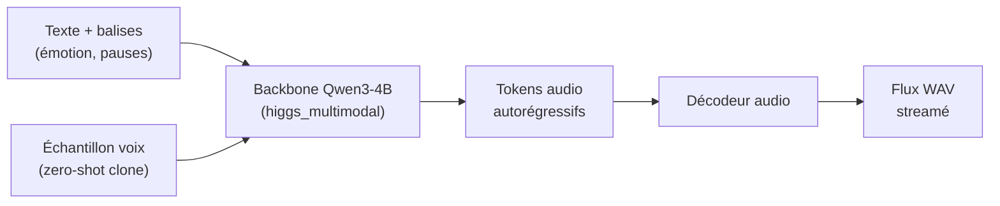
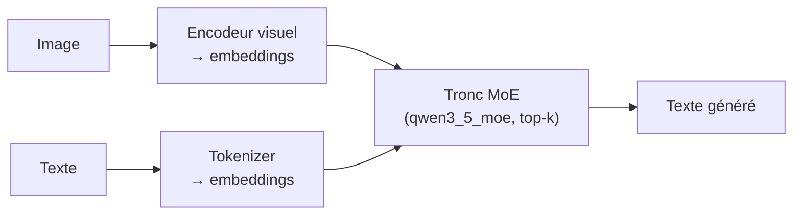

# IA — Détail du mardi 9 juin 2026

## 1. Higgs Audio v3 TTS — TTS open-weight conversationnel, 4B, 100+ langues, streaming

**Source :** Boson AI — https://www.boson.ai/blog/higgs-audio-v3-tts
**Date :** 4 juin 2026

### Contexte

Boson AI publie `higgs-audio-v3-tts-4b` sur Hugging Face : un modèle text-to-speech de 4,65 Md de paramètres bâti sur un backbone Qwen3-4B (architecture `higgs_multimodal_qwen3`). Il vise les agents vocaux, pas la simple lecture de texte. Le modèle gère plus de 100 langues, dont le français, avec un WER/CER à un chiffre annoncé.

La différence avec un TTS classique : il s'appuie sur un LLM. Le texte n'est plus juste « lu » phonétiquement ; le modèle comprend le contexte conversationnel, ce qui ouvre le contrôle fin de l'émotion, du style et de la prosodie.

### Comment ça marche

Le tronc est un transformer de type Qwen3-4B, étendu en multimodal pour produire de l'audio. Le texte (et ses balises de contrôle inline) est tokenisé, le LLM génère une séquence de *tokens audio* discrets, qu'un décodeur convertit en forme d'onde. Comme la génération est autorégressive, le **streaming est natif** : dès les premiers tokens audio émis, tu peux commencer à jouer le son sans attendre la fin de la phrase.

Le **voice cloning zero-shot** fonctionne par conditionnement : tu fournis un court échantillon de référence, le modèle en extrait l'empreinte vocale et la projette sur toute la synthèse, sans fine-tuning.



Le **contrôle inline** passe par des balises dans le texte (émotion, style, prosodie, pauses, effets sonores). Des recettes de service sont fournies pour **SGLang-Omni** (cookbook officiel), servable comme un endpoint omnimodal. La licence est `other` : usage **recherche et non-commercial** ; production ou API hébergée exigent une licence commerciale séparée.

### En pratique — exemple de code

Synthèse streamée avec contrôle inline de la prosodie et clone zero-shot, via le runtime fourni.

```python
# Higgs Audio v3 TTS — synthèse streamée, contrôle inline, clone zero-shot
from higgs_audio import HiggsTTS

tts = HiggsTTS.from_pretrained("bosonai/higgs-audio-v3-tts-4b")

# Balises de contrôle directement dans le texte (émotion, pauses)
text = "[emotion: warm] Bonjour. [pause: 300ms] Comment puis-je t'aider aujourd'hui ?"

# stream=True : l'audio sort token par token -> latence temps réel côté backend
for chunk in tts.synthesize(text, lang="fr",
                            voice_ref="echantillon_voix.wav",  # clone zero-shot
                            stream=True):
    audio_socket.send(chunk)  # ex. push vers WebSocket / pipeline SGLang-Omni

# Licence 'other' : non-commercial only -> licence séparée requise en prod payante
```

### Pourquoi ça compte pour toi

Si tu prototypes un agent vocal ou de la narration multilingue, tu as ici une brique open-weight FR-compatible servable via SGLang. Le streaming réduit la latence perçue côté backend. Attention : la licence non-commerciale bloque tout déploiement payant — vérifie-la avant d'intégrer Higgs à un produit facturé.

### Points de vigilance

Le poids de 4 Md tient sur un GPU grand public, mais le débit temps réel dépend du serveur (SGLang-Omni recommandé). La licence reste le principal frein à une mise en prod commerciale.

---

## 2. Nex-N2-Pro — gros MoE multimodal open-weight (~397B) sous Apache 2.0

**Source :** Hugging Face (nex-agi) — https://hf.co/nex-agi/Nex-N2-Pro
**Date :** mis à jour le 8 juin 2026

### Contexte

L'éditeur Nex-AGI pousse `Nex-N2-Pro`, un modèle multimodal (image-text-to-text) à architecture `qwen3_5_moe` totalisant environ 397 milliards de paramètres en mixture-of-experts. Il monte vite dans le trending Hugging Face cette semaine, porté par une licence permissive.

Le point qui le distingue du lot : sa **licence Apache 2.0**. Beaucoup de gros modèles récents sortent sous des licences restrictives ou « research only ». Ici, l'usage commercial est autorisé, ce qui le rend exploitable en entreprise sans friction juridique.

### Comment ça marche

L'architecture est un MoE dérivé de Qwen3.5, multimodal en entrée (image + texte). Côté texte, le router active un sous-ensemble d'experts par token (top-k), d'où l'écart entre les ~397B totaux et le nombre de paramètres réellement calculés par token. Côté image, un encodeur visuel projette les patches dans le même espace d'embedding que les tokens texte, qui sont ensuite traités conjointement par le tronc transformer.



Les poids sont publiés en `safetensors`, compatibles avec les endpoints standards et servables via `transformers`. Le modèle est récent : peu de retours indépendants sur les benchmarks à ce stade — à valider toi-même.

### En pratique — exemple de code

Charger le modèle pour du raisonnement image+texte ; à ~397B, prévois du sharding multi-GPU.

```python
# Nex-N2-Pro — MoE multimodal ~397B sous Apache 2.0 (usage commercial OK)
from transformers import AutoProcessor, AutoModelForVision2Seq
from PIL import Image
import torch

model_id = "nex-agi/Nex-N2-Pro"
proc = AutoProcessor.from_pretrained(model_id, trust_remote_code=True)
model = AutoModelForVision2Seq.from_pretrained(
    model_id, torch_dtype=torch.bfloat16,
    device_map="auto", trust_remote_code=True,  # shard auto sur multi-GPU
)

img = Image.open("schema_archi.png")
inputs = proc(images=img, text="Décris cette architecture.", return_tensors="pt")
out = model.generate(**{k: v.to(model.device) for k, v in inputs.items()}, max_new_tokens=512)
print(proc.decode(out[0], skip_special_tokens=True))
# ~397B : multi-GPU sérieux requis. Attends FP8/GGUF communautaire pour alléger.
```

### Pourquoi ça compte pour toi

Un MoE multimodal de cette taille sous Apache 2.0 est rare et exploitable en entreprise sans friction juridique. Si tu évalues des modèles vision-langage self-hostés, ajoute-le à ton banc d'essai. Reste prudent : à ~397B, l'inférence exige du multi-GPU sérieux, et les chiffres de perf ne sont pas encore corroborés par des tiers.

### Limites

Pas de benchmarks indépendants confirmés au moment où tu lis ceci. Empreinte mémoire massive : prévois une infra adaptée ou attends des quantizations GGUF/FP8 communautaires.
