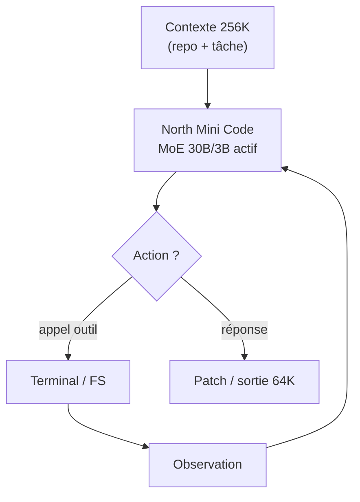
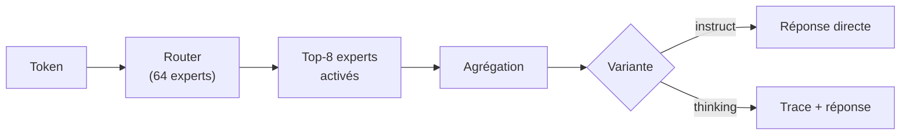

# IA — Détail du mercredi 10 juin 2026

## 1. North Mini Code 1.0 — Cohere ouvre un agent de code MoE 30B/3B

**Source :** VentureBeat — https://venturebeat.com/technology/cohere-open-sources-a-coding-agent-that-runs-on-a-single-h100
**Date :** 9 juin 2026

### Contexte

North Mini Code est le **premier modèle de la famille North** de Cohere dédiée aux agents de code. Cohere, longtemps orienté entreprise et RAG, entre ici sur le terrain des modèles de code open-weight optimisés pour le déploiement local.

Le positionnement est clair : un MoE **30B paramètres totaux / 3B actifs** par token, sous **licence Apache 2.0**, qui tient sur **un seul H100**. L'objectif n'est pas de battre les frontier, mais d'offrir un agent de code rapide et auto-hébergeable.

### Comment ça marche

Le faible nombre de paramètres actifs (3B) est ce qui rend l'inférence rapide et bon marché. Le router sélectionne par token un petit sous-ensemble d'experts ; seuls ceux-là calculent, donc le coût par token reste proche d'un dense 3B alors que la capacité totale est de 30B.

Le modèle est pensé pour l'**agentic coding** en boucle : il lit un contexte de **256K tokens** (utile pour avaler une base de code), génère jusqu'à **64K tokens** de sortie, appelle des outils (terminal, fichiers), observe le résultat et itère.



Scores Artificial Analysis : **27,6** à l'Intelligence Index, **33,4** au Coding Index — compétitif face à des modèles open-source plus gros. Les poids sont librement téléchargeables sur Hugging Face (`CohereLabs/North-Mini-Code-1.0`).

### En pratique — exemple de code

Servir le modèle en local sur un H100 avec vLLM, puis l'interroger comme un endpoint OpenAI-compatible.

```bash
# North Mini Code 1.0 — sert l'agent sur un seul H100 (vLLM, API OpenAI-compatible)
vllm serve CohereLabs/North-Mini-Code-1.0 \
  --max-model-len 262144 \
  --tensor-parallel-size 1        # 3B actifs : un seul GPU suffit

# Boucle agentique : appel outils + génération de patch
curl http://localhost:8000/v1/chat/completions -d '{
  "model": "CohereLabs/North-Mini-Code-1.0",
  "messages": [{"role":"user","content":"Génère les tests unitaires pour UserService.cs"}],
  "max_tokens": 8192
}'
# Apache 2.0 : aucun appel API externe, self-host complet OK en contexte pro
```

### Pourquoi ça compte pour toi

Avec 3B actifs, North Mini Code vise l'inférence rapide et bon marché : tu peux l'auto-héberger sur un seul GPU pour des tâches de code répétitives (revue, refactor, génération de tests) sans dépendre d'une API externe. La licence Apache 2.0 lève les freins en contexte pro. Évalue-le sur ta stack .NET/Symfony avant d'en faire un sous-agent de pipeline.

### Limites

Un MoE 3B actif ne rivalise pas avec les modèles frontier sur les tâches complexes : positionne-le sur des tâches cadrées, pas sur du raisonnement long et ambigu.

---

## 2. Mellum2 — le 12B MoE de JetBrains déferle en GGUF pour le local

**Source :** The New Stack — https://thenewstack.io/jetbrains-mellum2-open-source-coding-model/
**Date :** 2 juin 2026 (adoption GGUF en cours au 10 juin)

### Contexte

Mellum2 est le modèle de code maison de JetBrains, entraîné from scratch sur ~10,6 trillions de tokens pour les tâches de software engineering. Sorti le 2 juin, il franchit cette semaine une étape clé : sa diffusion massive en quantifications **GGUF** (nouvelles conversions datées du 10 juin), ce qui le rend trivialement exécutable en local.

Le GGUF est ce qui débloque l'adoption locale : un format de poids quantifiés lisible par `llama.cpp` et Ollama, sans dépendance Python ni GPU exotique.

### Comment ça marche

L'architecture est un MoE **12B total / 2,5B actifs**, avec **64 experts** dont 8 activés par token. Le router choisit ces 8 experts selon le token courant, ce qui maintient le coût d'inférence proche d'un petit modèle tout en gardant la capacité d'un 12B.

Deux variantes post-entraînées coexistent. La variante **instruct** répond directement. La variante **thinking** émet d'abord une trace de raisonnement explicite avant la réponse — utile sur le multi-étapes et pour auditer la décision de l'agent.



Sur **EvalPlus (HumanEval+ / MBPP+)**, la variante thinking atteint **78,4 %**, devant Qwen3.5-9B (71,8 %) et Seed-Coder-8B (73,8 %). JetBrains le positionne pour le **routing/orchestration, RAG, sous-agents** et le déploiement privé. La licence **Apache 2.0** autorise le self-hosting complet, sans appel API externe.

### En pratique — exemple de code

Lancer la variante thinking en local via Ollama, en privilégiant une quantification Q4_K_M ou supérieure.

```bash
# Mellum2 thinking — GGUF local, Q4_K_M mini pour préserver les scores EvalPlus
ollama pull hf.co/jetbrains/Mellum2-12B-thinking-GGUF:Q4_K_M

# Rôle « petit modèle rapide » dans un pipeline : routage / RAG / sous-agent
ollama run hf.co/jetbrains/Mellum2-12B-thinking-GGUF:Q4_K_M \
  "Étape par étape : ce diff introduit-il une régression de perf ? Justifie."

# 2,5B actifs : tourne sans GPU exotique, llama.cpp ou Ollama suffisent
```

La variante thinking expose sa trace de raisonnement, ce que tu peux logger pour auditer un sous-agent dans un pipeline agentic.

### Pourquoi ça compte pour toi

Mellum2 est taillé pour le rôle de « petit modèle rapide » dans un pipeline multi-modèles : routage de requêtes, étapes RAG, sous-agents spécialisés. Avec les GGUF fraîchement publiés, tu le lances en local via `llama.cpp` ou Ollama sans GPU exotique. La variante thinking est intéressante pour des tâches agentic où tu veux auditer le raisonnement. Idéal pour expérimenter du tooling de code self-hosté.

### Points de vigilance

JetBrains conçoit Mellum comme un modèle spécialisé, pas généraliste : ne l'utilise pas comme chatbot polyvalent. La qualité des GGUF tiers varie — privilégie une quantification Q4_K_M ou supérieure pour préserver les scores.
