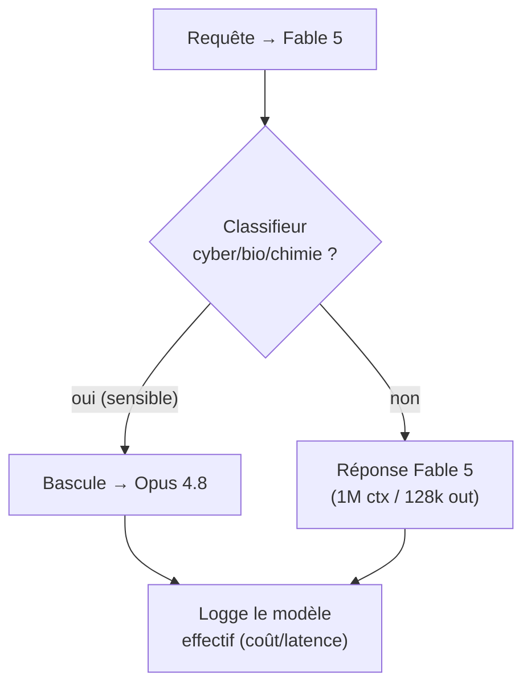
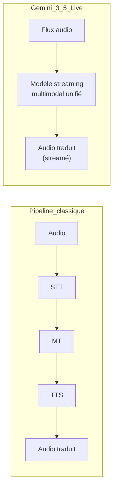

# IA — Détail du jeudi 11 juin 2026

## 1. Claude Fable 5 & Mythos 5 — frontier agentique dispo sur Bedrock, Vertex et Foundry

**Source :** Anthropic — https://www.anthropic.com/news/claude-fable-5-mythos-5
**Date :** 9 juin 2026

### Contexte

Anthropic a publié le 9 juin **Claude Fable 5**, son modèle le plus capable largement disponible, taillé pour le raisonnement exigeant et le travail agentique de longue haleine. **Claude Mythos 5** partage les mêmes specs mais reste en accès limité (programme Project Glasswing). Côté open-weights, la journée est calme : pas de release de poids ouverts notable.

L'argument central est l'échelle du contexte : **1M tokens** en entrée par défaut, jusqu'à **128k tokens de sortie** par requête. De quoi avaler une base de code entière ou de gros logs en un seul appel.

### Comment ça marche

Le point opérationnel à comprendre n'est pas l'architecture (fermée) mais le **routage de sécurité**. Fable 5 embarque des **classifieurs de sécurité** qui inspectent la requête. Sur des domaines sensibles — cyber, bio, chimie — le modèle peut refuser et **basculer automatiquement sur Claude Opus 4.8**. Mythos 5, lui, n'a pas ces classifieurs.

La conséquence concrète : le modèle qui répond *en pratique* peut changer en plein pipeline, sans que ton code l'ait décidé. Coût, latence et comportement deviennent non déterministes sur ces sujets. Tu dois donc logger le modèle effectivement utilisé, pas seulement celui que tu as demandé.



Le modèle est disponible sur **Claude API**, **AWS Bedrock**, **Google Vertex AI** et **Microsoft Foundry**. Tarif : **10 $ / M tokens d'entrée**, **50 $ / M tokens de sortie**.

### En pratique — exemple de code

Appeler Fable 5 et logger le modèle effectif renvoyé — indispensable vu le fallback automatique.

```python
# Claude Fable 5 — logger le modèle EFFECTIF (fallback Opus 4.8 possible sur sujets sensibles)
import anthropic

client = anthropic.Anthropic()

resp = client.messages.create(
    model="claude-fable-5",          # 1M ctx in / 128k out
    max_tokens=128_000,
    messages=[{"role": "user",
               "content": "Refactore ce module multi-fichiers : <... gros contexte ...>"}],
)

# resp.model = modèle qui a RÉELLEMENT répondu -> peut différer du modèle demandé
print("requested=claude-fable-5", "effective=", resp.model)
# Tarif Fable 5 : 10 $ / M in, 50 $ / M out -> surveille le coût si bascule Opus 4.8
print(resp.usage.input_tokens, resp.usage.output_tokens)
```

### Pourquoi ça compte pour toi

Pour tes agents backend, le contexte 1M + 128k de sortie change la donne sur le refactoring multi-fichiers et l'analyse de gros logs. Mais le fallback automatique vers Opus 4.8 sur sujets sensibles peut **changer le modèle qui répond** en plein pipeline : prévois de logger le modèle effectif et de gérer un comportement non déterministe côté coût et latence.

### Points de vigilance

Fable 5 et Mythos 5 sont des **Covered Models** : rétention de données à **30 jours**, **pas d'option zero-data-retention**. À vérifier si tu traites des données clients sous contrainte de confidentialité.

---

## 2. Gemini 3.5 Live Translate — traduction vocale fluide en quasi temps réel

**Source :** Google — https://blog.google/innovation-and-ai/models-and-research/gemini-models/gemini-live-3-5-translate/
**Date :** 10 juin 2026

### Contexte

Google a présenté **Gemini 3.5 Live Translate**, une brique de traduction vocale « fluide et naturelle » poussée via Gemini 3.5. L'accent est mis sur la **faible latence** et la préservation du ton conversationnel, pas seulement la justesse lexicale.

C'est avant tout un signal de maturité : le speech-to-speech streaming intégré devient une alternative crédible aux pipelines maison qui chaînent trois services distincts.

### Comment ça marche

Le pipeline classique de traduction vocale enchaîne trois étapes : **STT** (speech-to-text) transcrit l'audio, **MT** (machine translation) traduit le texte, **TTS** (text-to-speech) resynthétise la voix. Chaque étage ajoute de la latence et un point de rupture ; et la prosodie d'origine est perdue dès la première transcription.

Une approche streaming/multimodale unifiée traite le flux audio de bout en bout, en continu, sans matérialiser un texte intermédiaire figé. Le modèle commence à produire la traduction vocale avant la fin de la phrase, ce qui réduit la latence perçue et préserve mieux le ton.



Gemini 3.5 Live Translate est intégrée à l'écosystème Gemini (apps Google) et exposée via les API Gemini côté développeurs. Elle est positionnée comme démonstrateur des capacités streaming/multimodales de la famille 3.5.

### En pratique — exemple de code

Brancher un flux audio sur l'API Live de Gemini plutôt que d'orchestrer STT→MT→TTS toi-même.

```python
# Gemini 3.5 Live Translate — traduction vocale streamée (vs pipeline STT->MT->TTS maison)
from google import genai

client = genai.Client()
config = {"response_modalities": ["AUDIO"],
          "system_instruction": "Traduis l'audio FR->EN en préservant le ton."}

# Session bidirectionnelle : on pousse de l'audio, on reçoit de l'audio traduit en continu
async with client.aio.live.connect(model="gemini-3.5-live", config=config) as session:
    await session.send_realtime_input(audio=mic_chunk)        # flux entrant
    async for response in session.receive():
        if response.data:
            await speaker.play(response.data)                 # audio traduit streamé
# Évalue dépendance fournisseur + coût avant tout engagement produit
```

### Pourquoi ça compte pour toi

Modèle propriétaire et orienté produit grand public, donc impact direct limité pour un dev backend. À retenir surtout comme **signal de maturité du speech-to-speech streaming** : si un besoin de traduction temps réel apparaît dans tes produits, l'API Gemini devient une option crédible face aux pipelines STT→MT→TTS maison, plus lourds à opérer.

### Limites

Peu de détails techniques publics (architecture, latence chiffrée, langues couvertes) à ce stade. Évalue la dépendance fournisseur et le coût avant tout engagement.
