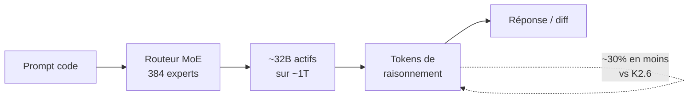
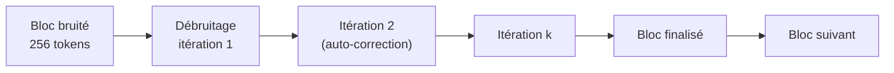
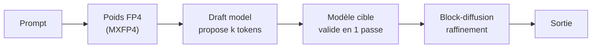

# IA — Détail du dimanche 14 juin 2026

## 1. Kimi K2.7-Code — Moonshot mise sur l'efficience plutôt que sur le score brut

**Source :** MarkTechPost — https://www.marktechpost.com/2026/06/12/moonshot-ai-releases-kimi-k2-7-code-a-coding-model-reporting-21-8-on-kimi-code-bench-v2-over-k2-6/
**Date :** 12 juin 2026

### Contexte

Moonshot AI publie `Kimi-K2.7-Code`, son modèle open-weight dédié au code. C'est un Mixture-of-Experts d'environ 1 000 milliards de paramètres (≈ 32B actifs, 384 experts), avec une fenêtre de 256K tokens et une licence Modified MIT. Les poids et une démo sont déjà sur Hugging Face.

L'angle de communication tranche avec l'habitude. Au lieu de claironner un score de capacité, Moonshot met en avant l'efficience : à qualité égale, le modèle consomme **~30 % de tokens de raisonnement en moins**. Ce déplacement du discours mérite d'être compris, car il touche directement ton coût par tâche.

### Comment ça marche

Un MoE n'active pas tous ses paramètres à chaque token. Un routeur sélectionne quelques experts parmi les 384, ici pour atteindre ~32B actifs sur ~1T au total. Tu paies le coût mémoire du modèle entier, mais le coût de calcul d'un sous-réseau.

L'autre levier est le raisonnement. Un modèle « thinking » génère une chaîne de tokens internes avant la réponse finale. Ces tokens sont facturés. Réduire leur nombre à qualité constante baisse mécaniquement la facture. Moonshot annonce ce gain via un entraînement qui rend le raisonnement plus dense.



Le routeur et la couche de raisonnement sont les deux endroits où se joue le rapport coût/qualité annoncé.

### En pratique — exemple de code

Tu peux tester K2.7-Code sans héberger le 1T, via un provider d'inférence (`novita`, `fireworks-ai`) exposant une API compatible OpenAI.

```python
# Appel de Kimi-K2.7-Code via un provider compatible OpenAI
from openai import OpenAI

client = OpenAI(
    base_url="https://api.novita.ai/v3/openai",  # ou fireworks-ai
    api_key="...",                                # ta clé provider
)

resp = client.chat.completions.create(
    model="moonshotai/kimi-k2.7-code",
    messages=[
        {"role": "system", "content": "Tu refactores du C#."},
        {"role": "user", "content": "Convertis cette boucle en LINQ: ..."},
    ],
    temperature=0.2,
)
print(resp.choices[0].message.content)
# usage.completion_tokens = ce que tu paies; compare-le à ton modèle actuel
```

Surveille `usage.completion_tokens` sur un même panel de tâches : c'est la métrique qui valide (ou non) la promesse d'efficience.

### Pourquoi ça compte pour toi

Si tu branches un agent de code sur tes projets .NET ou Angular, le coût se joue sur les tokens de raisonnement facturés. Un modèle qui coupe 30 % de ces tokens à qualité égale réduit directement ta facture par tâche. Teste-le via un provider avant de l'intégrer à un workflow CI.

### Points de vigilance

Moonshot n'a **pas publié** de scores SWE-Bench Verified/Pro face à Fable 5, GPT-5.5 ou Opus 4.7. « Kimi Code Bench v2 » est un benchmark maison. Au 12 juin, aucun chiffre tiers indépendant n'existe sur les suites publiques standard — VentureBeat relaie d'ailleurs le scepticisme de praticiens. Traite les gains annoncés comme du marketing tant qu'ils ne sont pas reproduits ([VentureBeat](https://venturebeat.com/technology/kimi-k2-7-code-cuts-thinking-tokens-30-practitioners-say-benchmarks-dont-check-out)).

---

## 2. DiffusionGemma 26B-A4B — Google ouvre un LLM par diffusion, 4× plus rapide

**Source :** Google AI for Developers — https://ai.google.dev/gemma/docs/diffusiongemma
**Date :** 10 juin 2026

### Contexte

Google DeepMind publie `DiffusionGemma`, modèle open-weights expérimental bâti sur le backbone Gemma 4 et distribué sous **Apache 2.0**. Au lieu de générer le texte token par token comme un modèle GPT, il part d'un canevas de bruit et **débruite des blocs de 256 tokens en parallèle**, en s'auto-corrigeant à chaque itération.

C'est l'architecture `diffusion_gemma` : un MoE de classe 26B (**25,2B au total, ~3,8B actifs** par étape), entrées texte/image/vidéo, sortie texte. La vitesse annoncée monte à **> 1 000 tokens/s sur un seul H100**, jusqu'à 4× un autorégressif comparable.

### Comment ça marche

Un modèle autorégressif produit le token N en conditionnant sur les N-1 précédents : strictement séquentiel. La diffusion textuelle casse cette contrainte. Elle initialise un bloc entier de positions « masquées », puis raffine toutes ces positions simultanément sur quelques itérations de débruitage.

Chaque itération révise le bloc complet. Le modèle peut donc corriger un token décidé trop tôt, ce qu'un autorégressif ne peut pas faire. Le parallélisme intra-bloc est la source du débit : tu calcules 256 positions par passe au lieu d'une.



Premier LLM par diffusion nativement supporté dans **vLLM** ; des quants GGUF (`unsloth`) sont publiées dès le 10 juin.

### En pratique — exemple de code

Tu sers DiffusionGemma derrière un endpoint vLLM, puis tu mesures le débit réel sur tes cas batch.

```bash
# Servir DiffusionGemma via vLLM (support natif diffusion)
pip install "vllm>=0.9"  # build supportant diffusion_gemma

vllm serve google/diffusiongemma-26b-a4b \
    --dtype bfloat16 \
    --max-model-len 8192

# Bench débit sur de la génération structurée (JSON/SQL en masse)
curl http://localhost:8000/v1/completions \
  -H "Content-Type: application/json" \
  -d '{"model":"google/diffusiongemma-26b-a4b",
       "prompt":"Génère 50 objets JSON utilisateur:",
       "max_tokens":2048}'
# Compare tokens/s contre ton modèle autorégressif actuel
```

### Pourquoi ça compte pour toi

Le décodage parallèle change l'économie de la latence : pour de la génération structurée (JSON, SQL, refactor de masse), tu peux viser un débit que les autorégressifs n'atteignent pas. C'est de l'expérimental — ne le mets pas en prod — mais c'est le moment de prototyper un endpoint vLLM et de mesurer le gain réel sur tes cas batch.

### Limites

L'approche diffusion reste jeune côté qualité fine et tooling. La fenêtre de débruitage par blocs de 256 tokens implique des compromis sur les sorties très longues. Vérifie la cohérence sur tes prompts réels avant tout enthousiasme ([VentureBeat](https://venturebeat.com/technology/googles-diffusiongemma-generates-256-tokens-in-parallel-and-self-corrects-as-it-goes)).

---

## 3. MiMo V2.5-Pro FP4 « DFlash » — Xiaomi croise décodage spéculatif et block-diffusion

**Source :** Hugging Face (fiche modèle Xiaomi MiMo) — https://hf.co/XiaomiMiMo/MiMo-V2.5-Pro-FP4-DFlash
**Date :** 8 juin 2026

### Contexte

L'équipe MiMo de Xiaomi a mis en ligne une variante quantifiée **FP4 « DFlash »** de MiMo V2.5 Pro. D'après la fiche du modèle, elle combine **décodage spéculatif** et **block-diffusion** pour accélérer l'inférence, sous licence MIT, avec un profil orienté agent, code et long contexte.

La quantification annoncée est **MXFP4** (4 bits) : empreinte mémoire réduite, cible matériel grand public ou datacenter récent. Des variantes 8-bit et FP8 existent pour les GPU sans support FP4.

### Comment ça marche

Trois leviers de vitesse se cumulent ici. La **quantification FP4** divise par ~4 l'empreinte des poids face au FP16 : moins de VRAM, plus de bande passante utile. Le **décodage spéculatif** fait proposer plusieurs tokens par un petit modèle « draft », que le grand modèle valide en un seul passage — accepté tant que la distribution concorde.

La **block-diffusion** ajoute le raffinement parallèle par blocs vu chez DiffusionGemma. Combinés, ces mécanismes attaquent à la fois la mémoire et la latence séquentielle.



### En pratique — exemple de code

Récupère la variante adaptée à ton GPU (FP4 si supporté, sinon FP8/8-bit) avant de la charger dans ta stack d'inférence.

```bash
# Récupérer la variante FP4 DFlash de MiMo V2.5 Pro
pip install -U "huggingface_hub[cli]"

hf download XiaomiMiMo/MiMo-V2.5-Pro-FP4-DFlash \
    --local-dir ./mimo-fp4

# GPU sans support FP4 ? Bascule sur la variante FP8
# hf download XiaomiMiMo/MiMo-V2.5-Pro-FP8 --local-dir ./mimo-fp8

# Vérifie le support FP4 de ton GPU (Blackwell requis pour MXFP4 natif)
nvidia-smi --query-gpu=name,compute_cap --format=csv
```

### Pourquoi ça compte pour toi

Deux gros acteurs (Google, Xiaomi) poussent la même semaine la diffusion comme levier de vitesse. Si tu héberges du LLM en local pour de l'outillage interne, surveille ces formats FP4/DFlash : ils visent à faire tenir un modèle « agent + code » sur moins de VRAM, sans la latence séquentielle classique. À benchmarker quand un build llama.cpp/vLLM stable arrive.

### Limites

C'est une **fiche de modèle** sans article de presse ni benchmark tiers à ce stade : prends les capacités annoncées (block-diffusion, gains FP4) comme déclaratives. La date (8 juin) en fait l'item le plus ancien de ce digest ; il complète surtout la lecture « semaine de la diffusion ».
