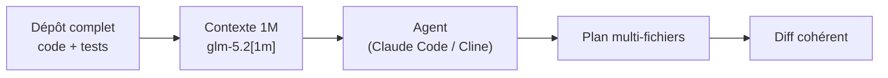
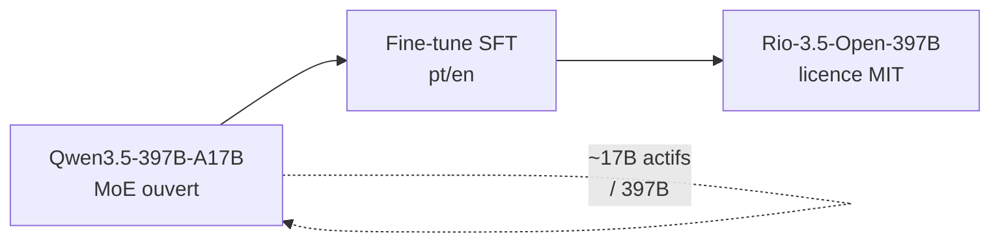
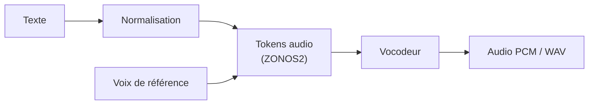

# IA — Détail du lundi 15 juin 2026

## 1. GLM-5.2 (Z.ai) — 1M de contexte, coding-first, poids MIT la semaine prochaine

**Source :** codersera — https://codersera.com/blog/glm-5-2-release-1m-context-coding-2026/
**Date :** 13 juin 2026

### Contexte

Z.ai (Zhipu AI) a lancé GLM-5.2 le 13 juin, suite directe de GLM-4.6. Positionnement assumé : modèle « coding-first » pour agents et refactors à l'échelle du dépôt. Disponible d'abord via les paliers du GLM Coding Plan (Lite/Pro/Max/Team).

La fenêtre de contexte atteint **1M tokens** (id `glm-5.2[1m]`), avec une sortie max de **131 072 tokens**. Les **poids MIT** et une API standalone sont annoncés pour la semaine suivante, pas encore publiés au lancement. Aucun benchmark n'accompagne la sortie.

### Comment ça marche

Un contexte de 1M tokens sert un usage précis : charger un dépôt entier — code, tests, docs — dans une seule requête, sans découpage RAG. L'agent voit alors les dépendances croisées d'un refactor multi-fichiers en une passe.

Le coût est quadratique en théorie sur l'attention, donc ces modèles emploient des mécanismes d'attention optimisés pour rendre le 1M soutenable. Côté intégration, GLM-5.2 parle le protocole attendu par les outils agentiques : il est compatible out-of-the-box avec **Claude Code, Cline, OpenCode, Roo Code, Goose, Kilo Code**.



### En pratique — exemple de code

Tu branches GLM-5.2 sur un client agentique via une config compatible OpenAI, en pointant la base URL vers le GLM Coding Plan.

```json
// Config type pour brancher GLM-5.2 sur un outil agentique (ex. Cline)
{
  "apiProvider": "openai-compatible",
  "baseUrl": "https://api.z.ai/api/coding/paas/v4",
  "apiKey": "${GLM_CODING_KEY}",
  "model": "glm-5.2[1m]",
  "maxTokens": 131072,
  "contextWindow": 1000000
}
// Une fois les poids MIT publiés: même config, baseUrl -> ton endpoint self-host
```

Le point clé : tant que les poids ne sont pas là, tu dépends de l'API Z.ai. La config self-host réutilisera la même interface.

### Pourquoi ça compte pour toi

Un modèle ouvert (MIT) avec 1M de contexte branchable sur Claude Code ou Cline, c'est un candidat sérieux pour tes refactors multi-fichiers .NET/Angular sans envoyer ton code à un cloud propriétaire. Attends les poids MIT et de vrais benchmarks avant d'arbitrer : sans chiffres, le 1M de contexte reste une promesse à valider sur ton propre repo.

---

## 2. Rio-3.5-Open-397B — IA souveraine sur base Qwen3.5-397B

**Source :** Hugging Face — https://hf.co/prefeitura-rio/Rio-3.5-Open-397B
**Date :** 11 juin 2026

### Contexte

La mairie de Rio de Janeiro (`prefeitura-rio`) publie Rio-3.5-Open-397B, un fine-tune bilingue portugais/anglais basé sur **Qwen3.5-397B-A17B**. C'est un exemple marquant d'« IA souveraine » : un acteur public qui ouvre un modèle à l'échelle frontier.

L'architecture est un **MoE de 397B paramètres totaux, ~17B actifs** (`qwen3_5_moe`), sous licence **MIT**. Le modèle affiche déjà ~112K téléchargements et un fort trending dès la sortie.

### Comment ça marche

L'intérêt n'est pas le fine-tune lui-même mais ce qu'il révèle : la base **Qwen3.5-397B-A17B** existe et est ouverte. Avec 397B totaux et ~17B actifs, le ratio d'activation est ~4 % — typique d'un MoE pensé pour la capacité sans exploser le coût d'inférence par token.

Le fine-tune bilingue applique un entraînement supervisé sur cette base pour spécialiser le comportement (portugais/anglais, registre administratif). La licence MIT du résultat le rend exploitable commercialement, fine-tune compris.



### En pratique — exemple de code

Tu interroges le Hub pour confirmer architecture, taille et licence avant d'envisager un déploiement — réflexe utile pour toute brique d'archi IA.

```python
# Vérifier base, taille et licence avant d'engager une archi self-host
from huggingface_hub import model_info

info = model_info("prefeitura-rio/Rio-3.5-Open-397B")
print("License :", info.cardData.get("license"))        # mit
print("Tags    :", [t for t in info.tags if "qwen" in t.lower()])
print("DL/mois :", info.downloads)

# La base réutilisable directement pour un grand modèle souverain :
base = model_info("Qwen/Qwen3.5-397B-A17B")
print("Base arch :", base.config.get("model_type"))     # qwen3_5_moe
```

### Pourquoi ça compte pour toi

Tu n'as probablement pas besoin d'un modèle lusophone, mais retiens deux signaux : un MoE 397B en MIT est exploitable commercialement, et des institutions publiques savent désormais fine-tuner du frontier ouvert. Pour tes specs d'archi IA, garde en tête que la base Qwen3.5-397B-A17B est dispo — utile si un projet exige un grand modèle auto-hébergé sans dépendance à un fournisseur fermé.

---

## 3. ZONOS2 (Zyphra) — nouvelle génération de TTS open-weight

**Source :** Hugging Face — https://hf.co/Zyphra/ZONOS2
**Date :** 11 juin 2026

### Contexte

Zyphra publie ZONOS2, la v2 de son modèle text-to-speech open-weight, sous licence **Apache 2.0**. Sortie quelques jours après Higgs Audio v3 — l'open-weight audio s'accélère nettement ce mois-ci.

C'est le successeur du Zonos original de Zyphra, orienté synthèse vocale expressive. Sous Apache 2.0, il est librement intégrable et commercialisable, ce qui le distingue des TTS sous licences restrictives.

### Comment ça marche

Un TTS moderne enchaîne deux étages. Le texte est d'abord normalisé puis converti en représentation acoustique intermédiaire (souvent des tokens audio ou un mel-spectrogramme). Un vocodeur transforme ensuite cette représentation en forme d'onde PCM.

L'« expressivité » vient du conditionnement : un échantillon de voix de référence guide le timbre et la prosodie, permettant le clonage ou le contrôle du style. Tu exposes ça derrière une file pour servir les requêtes de synthèse de façon asynchrone.



### En pratique — exemple de code

Tu génères un WAV à partir de texte, avec une voix de référence pour le style. Le service tourne sur ton infra, sans appel cloud facturé.

```python
# Synthèse vocale auto-hébergée avec ZONOS2 (Apache 2.0)
import soundfile as sf
from zonos import Zonos  # API illustrative du package open-weight

tts = Zonos.from_pretrained("Zyphra/ZONOS2", device="cuda")

ref = tts.load_speaker("voix_ref.wav")        # clonage / contrôle du timbre
wav, sr = tts.synthesize(
    text="Votre commande a bien été expédiée.",
    speaker=ref,
    language="fr",
)
sf.write("notification.wav", wav, sr)          # servir via une file async
```

### Pourquoi ça compte pour toi

Si un projet backend doit générer de la voix (notifications, accessibilité, IVR), tu as maintenant plusieurs TTS Apache 2.0 auto-hébergeables — plus de dépendance obligatoire à une API cloud facturée à la requête. Évalue ZONOS2 contre Higgs Audio v3 sur la latence et les langues supportées avant d'intégrer.
