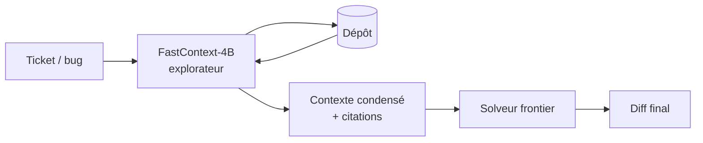

# IA — Détail du mardi 16 juin 2026

## 1. Microsoft FastContext-1.0-4B — un sous-agent d'exploration de dépôt pour les agents de code

**Source :** Hugging Face Papers — https://hf.co/papers/2606.14066
**Date :** 14 juin 2026 (papier publié le 12 juin)

### Contexte

Après deux semaines de déferlante open-weight (GLM-5.2, Kimi K2.7-Code, DiffusionGemma, Rio-3.5), le cycle des gros modèles se calme. Le signal du jour vient de **Microsoft** avec `FastContext-1.0-4B`, accompagné du papier *« FastContext: Training Efficient Repository Explorer for Coding Agents »* (`arXiv:2606.14066`, 76 upvotes sur HF).

Le constat de départ : dans un agent de code, l'**exploration du dépôt** (retrouver les bons fichiers, rassembler le contexte) consomme énormément de tokens et pollue la fenêtre de contexte du modèle « solveur ».

### Comment ça marche

FastContext **sépare l'exploration de la résolution**. Un modèle léger spécialisé (`4B`, basé sur `Qwen3-4B-Instruct-2507`, licence **MIT**) joue le rôle d'explorateur. Il navigue le dépôt — grep, lecture de fichiers, suivi de symboles — et ne renvoie au gros modèle qu'un contexte condensé avec **citations précises** (fichier + lignes).

L'entraînement combine trois ingrédients : des trajectoires issues d'un *reference model*, des récompenses **ancrées sur la tâche** (task-grounded rewards), et un schéma recherche au premier tour puis collecte d'indices multi-tours. Le solveur frontier ne voit plus le dépôt entier, juste l'extrait pertinent.



Résultat annoncé : moins de tokens consommés et de meilleurs taux de résolution, évalués sur `SWE-bench Multilingual`, `SWE-bench Pro`, `SWE-QA` et `Mini-SWE-Agent`.

### En pratique — exemple de code

Tu charges l'explorateur localement et tu l'utilises comme étage de récupération de contexte, en amont de ton modèle de résolution.

```python
# FastContext comme étage d'exploration léger, en amont du solveur frontier
from transformers import AutoModelForCausalLM, AutoTokenizer

mid = "microsoft/FastContext-1.0-4B-SFT"
tok = AutoTokenizer.from_pretrained(mid)
explorer = AutoModelForCausalLM.from_pretrained(mid, device_map="auto")

task = "Le endpoint /orders renvoie 500 quand le panier est vide."
prompt = f"Explore le dépôt et cite les fichiers/lignes pertinents.\nTâche: {task}"

ids = tok(prompt, return_tensors="pt").to(explorer.device)
out = explorer.generate(**ids, max_new_tokens=512)
context = tok.decode(out[0], skip_special_tokens=True)

# context = extrait + citations -> à passer au gros modèle pour le diff final
```

### Pourquoi ça compte pour toi

Si tu bricoles des agents de code (ou que tu en exploites un sur ton mono-repo .NET/Angular), un explorateur local `4B` qui rassemble le contexte coûte une fraction d'un modèle frontier sollicité sur tout le dépôt. Tu gardes le gros modèle pour le diff final et tu sous-traites la navigation. À tester sur tes propres tickets avant d'y croire.

### Points de vigilance

Les scores viennent des auteurs : reproduis-les sur ton code avant d'industrialiser. Un `4B` reste fragile sur les dépôts atypiques (générateurs, monorepos exotiques) — la qualité des citations conditionne tout l'étage de résolution.
