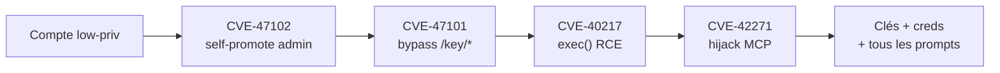
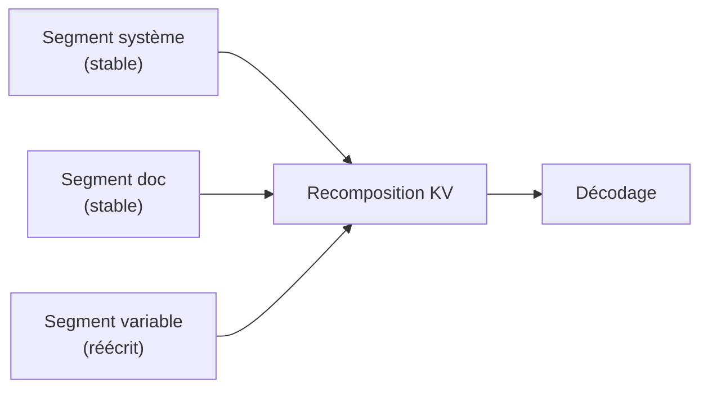
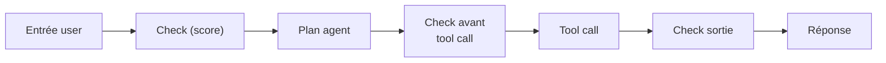
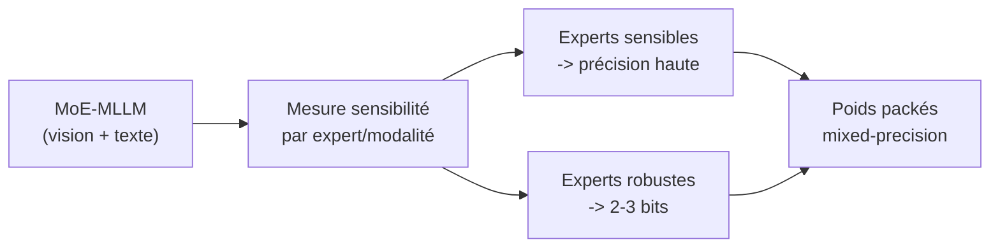

# IA — Détail du mercredi 17 juin 2026

## 1. LiteLLM — chaîne de 4 failles (CVSS 9.9) : un compte low-priv prend le serveur

**Source :** Obsidian Security — https://www.obsidiansecurity.com/blog/litellm-privilege-escalation-rce
**Date :** 15 juin 2026

### Contexte

LiteLLM est une gateway open-source très répandue : elle unifie l'accès à des dizaines de fournisseurs LLM derrière une API compatible OpenAI. Beaucoup d'équipes la placent en proxy central pour leurs agents et leurs apps. Obsidian Security a révélé le 15 juin une chaîne de quatre vulnérabilités qui transforme un simple compte utilisateur en admin avec exécution de code.

Un attaquant en fin de chaîne récupère les clés fournisseurs, les credentials déchiffrés, et chaque prompt/réponse qui transite. Les correctifs sont présents depuis `v1.83.14-stable`.

### Comment ça marche

La chaîne enchaîne quatre CVE qui s'amplifient. **CVE-2026-47102** : escalade de privilèges via autorisation manquante au niveau champ sur `/user/update` et `/user/bulk_update` — le `user_role` n'est pas protégé, l'utilisateur se promeut admin. **CVE-2026-47101** : bypass d'autorisation via `allowed_routes` non validé sur `/key/generate` et `/key/update`.

**CVE-2026-40217** : évasion du sandbox « Custom Code Guardrail » par `exec()` Python mal filtré, menant à l'exécution serveur. **CVE-2026-42271** : spawn de sous-process MCP qui détourne les réponses de Claude Code par injection de callback. Chaque maillon élargit la surface ouverte par le précédent.



### En pratique — exemple de code

La priorité est le patch, puis le durcissement. Vérifie ta version et audite les accès aux routes sensibles.

```bash
# 1. Patcher immédiatement
pip install -U "litellm>=1.83.14"            # ou bump l'image Docker stable

# 2. Vérifier qu'aucun user_role n'est modifiable côté client
curl -s -X POST "$PROXY/user/update" \
  -H "Authorization: Bearer $LOW_PRIV_KEY" \
  -d '{"user_id":"me","user_role":"proxy_admin"}'
# Réponse attendue après patch: 403 / champ ignoré, PAS 200

# 3. Auditer les accès historiques aux routes sensibles
grep -E '/(user|key)/(update|bulk_update|generate)' access.log
```

### Pourquoi ça compte pour toi

Si tu exposes une gateway LLM (LiteLLM ou proxy maison) devant tes apps .NET ou Symfony, traite-la comme un secret-store : mets à jour vers `v1.83.14`+, désactive les comptes par défaut, et vérifie que le rôle utilisateur n'est jamais modifiable côté client. Le risque réel, c'est la fuite de toutes tes clés API.

### Points de vigilance

Le patch date du 2 mai mais la divulgation publique du 15 juin relance l'exploitation. Audite les logs d'accès à `/user/*` et `/key/*`, et fais tourner le sandbox des guardrails hors du process principal.

---

## 2. « Models Take Notes at Prefill » — un cache KV éditable et composable

**Source :** arXiv (Bojie Li) — https://arxiv.org/abs/2606.17107
**Date :** 17 juin 2026

### Contexte

Le prefix caching accélère l'inférence LLM en réutilisant le calcul de prefill quand deux requêtes partagent un préfixe exact. Problème : dès qu'un seul champ change (un nom, une date dans un prompt template), tout le cache en aval est invalidé. Pour des apps à prompts structurés très répétitifs, c'est du compute gâché.

### Comment ça marche

Le cache KV stocke les clés/valeurs d'attention calculées au prefill. Le prefix caching classique est positionnel et monolithique : le segment `[système][doc][question]` n'est réutilisable que si le préfixe est identique octet pour octet. Un champ qui change au milieu invalide tout ce qui suit.

Le papier propose un cache **éditable et composable** : un assemblage de segments KV indépendants qu'on écrase localement. Changer un champ ne réécrit que son segment ; les blocs voisins restent valides et sont recombinés. D'où l'image « prendre des notes au prefill » pour rejouer ensuite les blocs utiles.



### En pratique — exemple de code

L'idée se prête à une factorisation des prompts en blocs stables vs variables, en attendant un support natif côté moteur.

```python
# Structurer les prompts en segments réutilisables (vs un préfixe monolithique)
STABLE = {
    "system": "Tu es un assistant de support. Réponds en JSON.",
    "policy": open("policy.txt").read(),   # long, identique entre requêtes
}

def build_request(ticket_id: str, user_msg: str):
    # Seul ce bloc varie -> seul son segment KV serait recalculé
    variable = f"[ticket:{ticket_id}] {user_msg}"
    return [
        {"role": "system", "content": STABLE["system"]},
        {"role": "system", "content": STABLE["policy"]},
        {"role": "user",   "content": variable},
    ]
# Avec un cache KV composable, STABLE est réutilisé entre tous les tickets
```

### Pourquoi ça compte pour toi

Si tu sers un LLM derrière une API avec des prompts templatisés (RAG, function-calling, system prompts longs), cette approche peut couper la latence et le coût GPU sur les parties variables. Surveille son intégration future dans `vLLM`/`SGLang` : c'est le genre d'optim qui devient gratuit une fois mergé en amont.

### Limites

C'est un papier de recherche, pas une implémentation prod. La composition de segments KV pose des questions de correction d'attention — à valider sur tes propres prompts avant tout pari.

---

## 3. Amazon Bedrock Guardrails — l'API InvokeGuardrailChecks pour les agents

**Source :** AWS Machine Learning Blog — https://aws.amazon.com/blogs/machine-learning/safeguard-your-agentic-ai-applications-with-the-amazon-bedrock-guardrails-invokeguardrailchecks-api/
**Date :** 16 juin 2026

### Contexte

Jusqu'ici, appliquer un guardrail Bedrock supposait de créer une ressource « guardrail » et de la coller à un appel de modèle. Pour une boucle agentique (plan → tool call → observation → …), ce modèle est rigide : tu veux des contrôles différents à chaque tour, sans multiplier les ressources.

### Comment ça marche

La nouvelle API `InvokeGuardrailChecks` invoque un **safeguard individuel à n'importe quel point** de la boucle, sans créer de ressource dédiée. Elle tourne en **detect-only** : elle ne bloque pas, elle renvoie un **score numérique** par contrôle.

C'est toi qui définis les seuils et les actions — bloquer, bypasser, retry, logger pour audit — dans ta logique applicative. Tu obtiens des building blocks de sécurité composables, facturés à l'usage, que tu poses à l'endroit exact du risque : avant un tool call sensible, après une sortie modèle.



### En pratique — exemple de code

Tu appelles le check au point voulu et tu décides selon le score, sans ressource guardrail attachée au modèle.

```python
# Check Bedrock à la carte dans une boucle agentique (detect-only + seuil maison)
import boto3
br = boto3.client("bedrock-runtime")

def safe_to_proceed(text: str, threshold: float = 0.7) -> bool:
    resp = br.invoke_guardrail_checks(
        content=[{"text": {"text": text}}],
        checks=["prompt_attack", "sensitive_information"],
    )
    scores = {c["name"]: c["score"] for c in resp["results"]}
    # À toi la décision: bloquer, logger, retry...
    return all(s < threshold for s in scores.values())

if safe_to_proceed(user_input):
    run_tool_call(user_input)
```

### Pourquoi ça compte pour toi

Si tu construis des agents (orchestration .NET ou Python sur Bedrock), tu peux désormais poser des checks ciblés à chaque étape — validation d'entrée avant un tool call sensible, scan de sortie avant renvoi — sans sur-ingénierie. Le mode score + seuils maison te laisse la décision, utile pour ne pas sur-bloquer en prod.

### Pour aller plus loin

Réduit l'overhead opérationnel quand tu passes à des centaines d'agents : un seul jeu de safeguards, invoqué à la carte plutôt qu'une ressource par étape.

---

## 4. MODE — quantification mixed-precision par expert pour MoE multimodaux

**Source :** arXiv (Yuanteng Chen et al.) — https://arxiv.org/abs/2606.17118
**Date :** 17 juin 2026

### Contexte

Les MoE multimodaux (MoE-MLLM) offrent d'excellentes perfs mais à un coût mémoire GPU prohibitif : tous les experts doivent résider en VRAM même si peu sont activés par token. La quantification agressive aide, mais dégrade vite la qualité quand on l'applique uniformément.

### Comment ça marche

MODE (Modality-Decomposed Expert-level Mixed-Precision Quantization) refuse le bit-width global. Il décompose la quantification **par modalité et par expert** : chaque expert reçoit une précision adaptée à sa sensibilité mesurée.

Un expert critique pour le raisonnement texte garde une précision élevée ; un expert vision peu sensible descend en 2-3 bits. Le budget mémoire global chute fortement, mais sans l'effondrement de qualité qu'on observe quand on quantifie tout le monde au même niveau bas.



### En pratique — exemple de code

L'idée — un bit-width par expert selon sa sensibilité — se prototype en mesurant l'erreur de quantification expert par expert.

```python
# Esquisse: assigner un bit-width par expert selon sa sensibilité (principe MODE)
import torch

def expert_sensitivity(expert, calib_batch):
    full = expert(calib_batch)
    q = fake_quantize(expert, bits=2)(calib_batch)   # impact d'une quant agressive
    return (full - q).abs().mean().item()             # erreur -> sensibilité

def assign_bits(experts, calib, hi=8, lo=2, tau=1e-2):
    plan = {}
    for name, e in experts.items():
        plan[name] = hi if expert_sensitivity(e, calib) > tau else lo
    return plan   # mixed-precision par expert, pas un bit-width global
```

### Pourquoi ça compte pour toi

Si tu envisages de self-host un MoE multimodal (vision + texte) sur un GPU unique, ce type d'approche détermine si ça tient en VRAM. Garde l'œil sur une implé `GGUF`/`AWQ` : les techniques de quant par-expert finissent souvent dans `llama.cpp`/`vLLM`, et c'est ce qui rend un 30B-A3B exploitable sur ta machine.

### Limites

Papier de recherche ; pas d'outil clé en main aujourd'hui. La quant par-expert complexifie le packaging des poids — attends une intégration mainstream avant de compter dessus.
