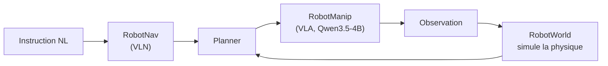
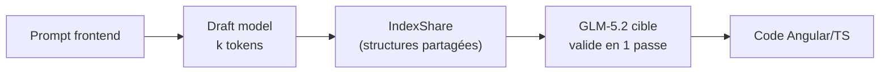

# IA — Détail du jeudi 18 juin 2026

## 1. Qwen-Robot Suite — Alibaba ouvre l'IA embarquée (Nav, Manip, World)

**Source :** Let's Data Science — https://letsdatascience.com/news/alibaba-unveils-qwen-robot-suite-for-embodied-ai-d7c90c5a
**Date :** 16 juin 2026

### Contexte

Alibaba étend la famille Qwen au-delà du texte. Le 16 juin, l'équipe a dévoilé la **Qwen-Robot Suite**, trois modèles de fondation pour l'IA « embodied » (robotique). C'est un pivot vers le contrôle physique, après une domination déjà installée sur le texte et le multimodal open-weight.

La suite couvre trois briques complémentaires : navigation, manipulation et modèle de monde. Ensemble, elles forment la pile classique de la robotique apprenante — percevoir, prédire, agir.

### Comment ça marche

**Qwen-RobotNav** est un modèle Vision-Language-Navigation : il traduit une instruction en langage naturel en navigation temps réel, avec adaptation aux obstacles et au terrain. **Qwen-RobotManip** est un Vision-Language-Action bâti sur **Qwen3.5-4B**, entraîné sur **38 000+ heures** de données ; il est en tête du track généraliste du benchmark réel **RoboChallenge**.

**Qwen-RobotWorld** est un modèle de monde vidéo : il simule la physique du réel pour la prédiction (rapport technique arXiv 2606.17030). Le pattern d'ensemble est le même que celui de l'agentique logicielle : un modèle de monde prédit, un planner décide, une politique d'action exécute, puis la boucle se referme sur l'observation.



### En pratique — exemple de code

Un VLA expose une boucle perception → action. En pseudo-API, le pattern ressemble à ceci — utile pour comprendre l'interface, même côté logiciel.

```python
# Boucle de contrôle type d'un VLA (Qwen-RobotManip) — pattern percept->action
from qwen_robot import RobotManip   # API illustrative

policy = RobotManip.from_pretrained("Qwen/Qwen-RobotManip-4B")

obs = env.reset()
goal = "Range le cube rouge dans la boîte."
done = False
while not done:
    action = policy.act(image=obs["rgb"], instruction=goal)  # VLA: image+texte->action
    obs, reward, done = env.step(action)                      # exécute, ré-observe
# Même boucle conceptuelle que plan -> tool call -> observation côté agents logiciels
```

### Pourquoi ça compte pour toi

Tu es dev backend, pas roboticien : à ranger en veille, pas en action immédiate. Mais la tendance compte. Les **VLA** passent sur des bases compactes (4B) déployables, et l'« agent » sort de l'écran pour piloter du matériel. Les patterns sous-jacents — modèle de monde + planner + action — infusent déjà l'agentique logicielle que tu croises côté outils de dev.

### Limites

Vérifie la licence avant tout usage : « ouvert » ne signifie pas poids librement réutilisables en prod. Suite très récente, peu de retours terrain hors benchmarks constructeur.

---

## 2. GLM-5.2 (Z.ai) — poids en ligne, en tête du coding frontend mondial

**Source :** Latent Space (AINews) — https://www.latent.space/p/ainews-glm-52-the-top-frontend-coding
**Date :** 16 juin 2026

### Contexte

On en parlait dans le digest du 15 juin (annonce, poids MIT « la semaine prochaine », contexte 1M, coding-first). C'est désormais concret : **GLM-5.2** de Z.ai (Zhipu) est disponible — listé sur OpenRouter le 16 juin — et grimpe en tête des modèles de **coding frontend**. Ce détail suit donc la story d'hier, côté disponibilité réelle.

Latent Space le décrit comme le **« top frontend coding model in the world »**. Les poids sont annoncés sous licence **MIT-modified**, et la même livraison introduit **IndexShare for Speculative Decoding**, une optimisation du débit d'inférence.

### Comment ça marche

Deux choses arrivent en même temps. D'abord la **disponibilité** : GLM-5.2 passe d'un accès via le Coding Plan à une exposition OpenRouter (`z-ai/glm-5.2`), donc appelable depuis n'importe quel client compatible OpenAI sans héberger le modèle.

Ensuite **IndexShare for Speculative Decoding** : une variante de décodage spéculatif où un draft propose plusieurs tokens validés en un passage par le modèle cible. Le « IndexShare » partage des structures d'index entre draft et cible pour réduire le surcoût d'acceptation, améliorant le débit sans changer la sortie.



### En pratique — exemple de code

Tu l'essaies en quelques lignes via OpenRouter, sur une vraie tâche frontend de ton repo.

```python
# Essai comparatif de GLM-5.2 via OpenRouter sur une tâche frontend réelle
from openai import OpenAI

client = OpenAI(
    base_url="https://openrouter.ai/api/v1",
    api_key="...",                     # clé OpenRouter
)

resp = client.chat.completions.create(
    model="z-ai/glm-5.2",
    messages=[{"role": "user",
               "content": "Crée un composant Angular standalone <user-card> "
                          "avec inputs typés et un test Jasmine."}],
)
print(resp.choices[0].message.content)
# Compare le diff produit à celui de ton modèle actuel sur le MÊME ticket
```

### Pourquoi ça compte pour toi

Si tu génères du front (Angular/TS) avec un LLM, GLM-5.2 mérite un essai comparatif face à ton modèle actuel — d'autant plus en self-host vu la licence permissive. Teste-le sur une vraie tâche de ton repo (composant + tests) avant de basculer : une couronne de benchmark frontend ne garantit pas la qualité sur ton code métier.

### Points de vigilance

Le « #1 » provient d'une source d'actualité, pas d'un benchmark indépendant reproductible : prends-le comme un signal, pas une preuve. Confirme avec tes propres évaluations avant tout choix d'outillage.
