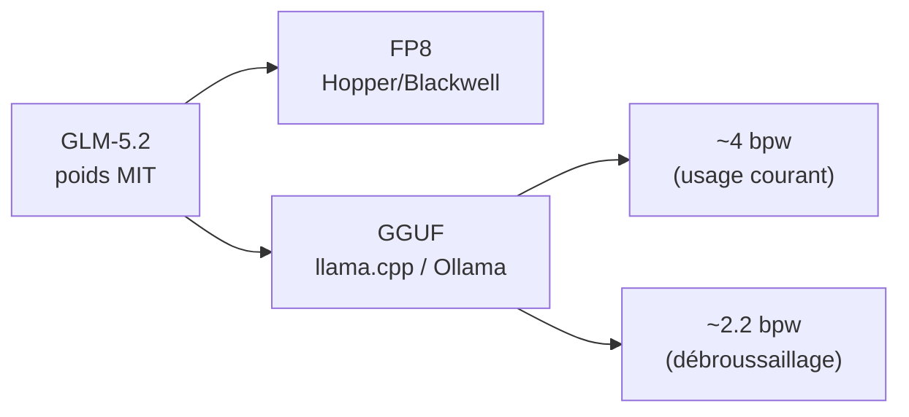
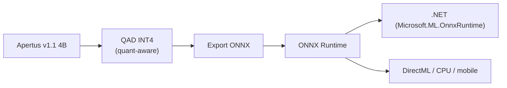
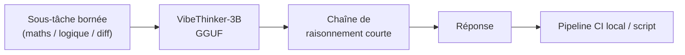

# IA — Détail du vendredi 19 juin 2026

## 1. GLM-5.2 en GGUF et FP8 — le frontier coding tourne en local

**Source :** Hugging Face — https://huggingface.co/zai-org/GLM-5.2-FP8
**Date :** 16-19 juin 2026

### Contexte

**GLM-5.2** (Z.ai) a été traité hier : poids sous licence MIT, architecture MoE `glm_moe_dsa`, contexte 1M et tête revendiquée au coding frontend. C'était l'annonce. Le développement neuf des dernières 48 h est ailleurs : l'écosystème de quantification a rattrapé la release, et le modèle est passé d'« en ligne sur OpenRouter » à « exécutable sur ta machine ».

### Comment ça marche

La quantification réduit la précision des poids — de FP16 vers FP8, INT4 ou moins — pour faire tenir le modèle dans moins de VRAM. Chaque format vise un matériel et un compromis. **FP8 officiel** (`zai-org/GLM-5.2-FP8`, 16 juin) cible les GPU récents Hopper/Blackwell avec un support natif, donc peu de perte.

Le **GGUF communautaire** (`unsloth/GLM-5.2-GGUF`, 17 juin) est le format de **llama.cpp** et **Ollama** : il tourne sur CPU et GPU grand public. Des **quants très basses** ~2,2 bpw (`sokann/GLM-5.2-GGUF-2.244bpw`, 19 juin) compriment l'empreinte au prix d'une dégradation marquée du raisonnement.



### En pratique — exemple de code

Le chemin le plus court pour un essai local : Ollama avec une quant GGUF, puis appel via l'API compatible OpenAI.

```bash
# Servir GLM-5.2 en local via Ollama (quant GGUF communautaire)
ollama pull glm-5.2:q4_k_m            # ~4 bpw, bon compromis qualité/VRAM

ollama run glm-5.2:q4_k_m "Refactore ce service C# en injectant IClock"

# Ou via l'API OpenAI-compatible exposée par Ollama
curl http://localhost:11434/v1/chat/completions \
  -H "Content-Type: application/json" \
  -d '{"model":"glm-5.2:q4_k_m",
       "messages":[{"role":"user","content":"Génère un composant Angular"}]}'
# Évite les quants <=3 bpw pour le code en prod (raisonnement dégradé)
```

### Pourquoi ça compte pour toi

Tu peux évaluer un modèle de coding frontier sur ton poste ou un serveur interne, sans envoyer ton code à une API externe. Pour un usage backend, c'est l'option « souveraine » : un essai comparatif GGUF vs ton outil actuel coûte juste un téléchargement, licence MIT à l'appui pour le commercial.

### Points de vigilance

Les quants ≤ 3 bpw dégradent nettement le raisonnement et le code : garde-les pour le débroussaillage, pas pour la prod. Vérifie la VRAM réelle (un MoE 1M de contexte reste lourd) et confirme la licence MIT-modified sur ton cas d'usage.

---

## 2. Apertus v1.1 en INT4 ONNX — un LLM ouvert et souverain dans ton appli .NET

**Source :** Hugging Face — https://huggingface.co/onnx-community/Apertus-v1.1-4B-Instruct-QAD-INT4-ONNX
**Date :** 19 juin 2026

### Contexte

**Apertus** est un modèle *entièrement* ouvert — poids, recette et données documentées — porté par l'écosystème suisse (EPFL/ETH/CSCS). Là où la plupart des « open weights » ne livrent que les poids, Apertus vise la transparence complète. La déclinaison **v1.1** existe en trois tailles compactes : 0,5B, 1,5B et 4B.

La nouveauté du jour : des quants **QAD INT4 au format ONNX** (`onnx-community`, 19 juin) pour les trois tailles. INT4 *quantization-aware* préserve mieux la précision qu'une quant post-hoc.

### Comment ça marche

La QAD (quantization-aware distillation/training) simule la précision INT4 pendant l'entraînement. Le modèle apprend à compenser l'erreur de quantification, ce qu'une quant post-hoc — appliquée après coup — ne peut pas faire. Résultat : meilleure préservation de la qualité à 4 bits.

Le format **ONNX** est la clé d'intégration. Le modèle s'exécute via **ONNX Runtime** sur CPU, DirectML (GPU Windows) ou mobile, sans stack Python. ONNX Runtime a un binding .NET de première classe (`Microsoft.ML.OnnxRuntime`), donc le modèle s'embarque directement dans un process .NET.



### En pratique — exemple de code

Tu charges le modèle ONNX dans .NET et tu génères en local, offline, sans serveur d'inférence séparé.

```csharp
// LLM ouvert embarqué dans une appli .NET via ONNX Runtime (offline)
using Microsoft.ML.OnnxRuntimeGenAI;

using var model = new Model("./Apertus-v1.1-4B-Instruct-QAD-INT4-ONNX");
using var tokenizer = new Tokenizer(model);

var prompt = "Classe ce ticket: 'Impossible de me connecter'. Catégorie ?";
using var tokens = tokenizer.Encode(prompt);

using var generator = new Generator(model, new GeneratorParams(model));
generator.AppendTokenSequences(tokens);
while (!generator.IsDone())
    generator.GenerateNextToken();   // CPU ou DirectML, pas de cloud

Console.WriteLine(tokenizer.Decode(generator.GetSequence(0)));
```

### Pourquoi ça compte pour toi

ONNX Runtime a un binding .NET de première classe (`Microsoft.ML.OnnxRuntime`). Tu peux donc embarquer un LLM ouvert et souverain **directement dans une appli .NET**, en local et offline, sans dépendance cloud ni serveur d'inférence séparé. Pour un POC « IA embarquée » côté backend ou desktop, c'est le chemin le plus court aujourd'hui.

### Limites

À 0,5-4B, vise des tâches ciblées (extraction, classification, résumé court, assistance structurée), pas un copilote généraliste. Mesure la latence CPU sur ta cible avant de t'engager ; DirectML aide si un GPU est disponible.

---

## 3. VibeThinker-3B en GGUF — le petit raisonneur passe en local

**Source :** Hugging Face — https://huggingface.co/WeiboAI/VibeThinker-3B
**Date :** 12 juin (modèle) / 19 juin 2026 (GGUF)

### Contexte

**VibeThinker** (Weibo AI) est une lignée de petits modèles de raisonnement orientés maths et code. **VibeThinker-3B** s'appuie sur `Qwen2.5-Coder-3B`, est publié sous licence **MIT** et documenté dans un rapport technique (arXiv 2606.16140). Le modèle est sorti le 12 juin ; l'étape neuve est son packaging local.

Une conversion **GGUF** est disponible (`constructai/VibeThinker-3B-GGUF`, 19 juin) pour **llama.cpp** et **Ollama**. À 3B, il tient sur CPU ou un petit GPU, sans serveur d'inférence dédié.

### Comment ça marche

VibeThinker-3B est un modèle « thinking » compact : il génère une chaîne de raisonnement courte avant la réponse, ce qui améliore la justesse sur les tâches maths/code à étapes. Sa base `Qwen2.5-Coder-3B` lui donne une compétence code native.

Le GGUF empaquette les poids quantifiés en un fichier unique que `llama.cpp` charge directement. Tu l'exploites comme un outil spécialisé dans un pipeline : tu lui poses une sous-tâche bornée — vérifier une logique, relire un diff ciblé — et tu réserves le frontier aux cas durs.



### En pratique — exemple de code

Tu l'intègres à un script local ou une étape CI via llama-cpp-python, sans coût d'API ni fuite de données.

```python
# VibeThinker-3B en local pour une revue de logique ciblée (llama.cpp)
from llama_cpp import Llama

llm = Llama.from_pretrained(
    repo_id="constructai/VibeThinker-3B-GGUF",
    filename="*Q4_K_M.gguf",          # tient sur CPU / petit GPU
    n_ctx=4096,
)

snippet = "if (x = 5) { ... }"        # bug d'assignation vs comparaison
out = llm.create_chat_completion(messages=[
    {"role": "user", "content": f"Y a-t-il un bug logique ?\n{snippet}"}
])
print(out["choices"][0]["message"]["content"])
# Réserve le frontier aux cas vraiment durs
```

### Pourquoi ça compte pour toi

Un raisonneur de 3B qui tourne sur n'importe quelle machine est un bon candidat pour des tâches locales répétitives — revue de code ciblée, vérification de logique, petit agent outillé — sans coût d'API ni fuite de données. Tu peux l'intégrer à un pipeline CI local ou un script, et garder le frontier pour les cas vraiment durs.

### Limites

3B reste un petit modèle : ne lui confie pas de raisonnement long ou de connaissances générales étendues. Traite-le comme un outil spécialisé, et compare-le à un Qwen3 ou un Gemma 4 de taille proche avant de figer ton choix.
