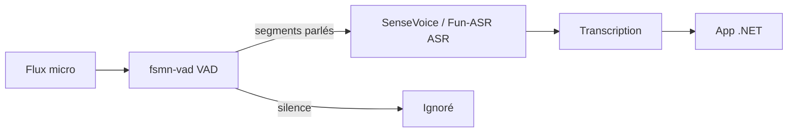

# IA — Détail du samedi 20 juin 2026

## 1. FunAudioLLM passe en GGUF — ASR et VAD on-device via llama.cpp

**Source :** Hugging Face (FunAudioLLM) — https://hf.co/FunAudioLLM/Fun-ASR-Nano-GGUF
**Date :** 20 juin 2026

### Contexte

FunAudioLLM, l'équipe audio d'Alibaba (à l'origine de SenseVoice, Paraformer et CosyVoice), a publié ce samedi une série de poids **GGUF** de sa pile de reconnaissance vocale. Jusqu'ici ces modèles ciblaient surtout PyTorch/FunASR ; le format GGUF les rend exécutables par `llama.cpp` et `ggml`, donc sur CPU et en local.

### Ce qui change concrètement

- **Modèles livrés** : `Fun-ASR-Nano-GGUF`, `SenseVoiceSmall-GGUF`, `Paraformer-GGUF` (ASR) et `fsmn-vad-GGUF` (détection d'activité vocale).
- **Cible** : exécution CPU via `llama.cpp`/`ggml`, sans GPU ni dépendance cloud.
- **Langues** : chinois et anglais annoncés.
- **Licence** : **Apache-2.0** — usage commercial sans friction.

### Pourquoi ça compte pour toi

Tu peux ajouter de la transcription ou de la détection de parole **on-device** à une appli sans appeler un service cloud. Le combo VAD (`fsmn-vad`) + ASR (`SenseVoice`/`Fun-ASR`) couvre une chaîne complète de prétraitement audio. Côté .NET, tu l'intègres via un binding `llama.cpp` ou en process séparé. Apache-2.0 lève les doutes juridiques pour un produit.

### Points de vigilance

Modèles fraîchement publiés : peu de retours terrain, pas de benchmarks tiers encore. Valide la précision sur **ton** audio (accents, bruit) avant prod, et vérifie le support GGUF de ta version de `llama.cpp`.

---

## 2. La vague de portages locaux s'accélère — MiniMax-M3 sur Apple Silicon, builds agentiques

**Source :** Hugging Face (modèles tendance) — https://hf.co/models?sort=trending
**Date :** 19-20 juin 2026

### Contexte

Le flux des nouveaux modèles HF de ce week-end n'est pas dominé par de nouveaux modèles de base, mais par des **portages locaux** de modèles frontière déjà sortis. Signal clair : l'écosystème stabilise les bases (Qwen3.5/3.6, GLM-5.2, MiniMax-M3, Gemma 4) et industrialise leur exécution sur matériel grand public.

### Ce qui change concrètement

- **MiniMax-M3 sur Apple Silicon** : un portage **MLX** quantifié (REAP-pruned, AWQ) du MoE multimodal vise les Mac — voir [OsaurusAI/MiniMax-M3-Coder-Small](https://hf.co/OsaurusAI/MiniMax-M3-Coder-Small).
- **Gemma 4 agentic en GGUF** : des builds outillés (tool-use, terminal) pour `llama.cpp`/Ollama apparaissent côté communauté.
- **Tendance de fond** : MLX (Mac) et GGUF (CPU/llama.cpp) deviennent les deux cibles par défaut des portages.

### Pourquoi ça compte pour toi

Avant d'appeler une API, regarde si le modèle qui t'intéresse existe déjà en MLX ou GGUF : tu peux prototyper en local, sans coût au token ni fuite de données. Pour un dev backend, ça veut dire un assistant de code ou d'agent **reproductible** sur ta machine, versionnable, sans dépendance réseau.

### Limites

Ce sont majoritairement des publications **communautaires** (faible historique, qualité variable). Traite-les comme du prototypage : vérifie la provenance, la licence du modèle de base et la fidélité de la quantification avant tout usage sérieux.
