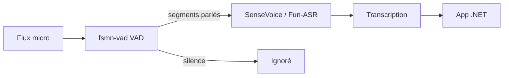
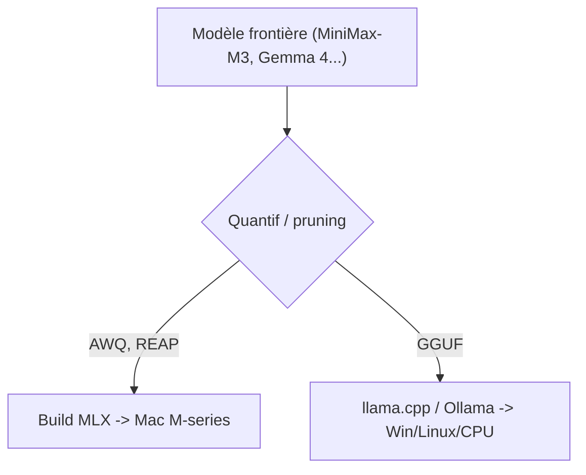

# IA — Détail du samedi 20 juin 2026

## 1. FunAudioLLM passe en GGUF — ASR et VAD on-device via llama.cpp

**Source :** Hugging Face (FunAudioLLM) — https://hf.co/FunAudioLLM/Fun-ASR-Nano-GGUF
**Date :** 20 juin 2026

### Contexte

FunAudioLLM, l'équipe audio d'Alibaba (à l'origine de SenseVoice, Paraformer et CosyVoice), a publié ce samedi une série de poids **GGUF** de sa pile de reconnaissance vocale. Jusqu'ici ces modèles ciblaient surtout PyTorch/FunASR ; le format GGUF les rend exécutables par `llama.cpp` et `ggml`, donc sur CPU et en local, sans GPU ni cloud.

### Comment ça marche

Trois briques s'enchaînent pour transcrire un flux audio — c'est cette chaîne qu'il faut comprendre.

1. **GGUF, c'est quoi ?** Un format de fichier unique qui empaquette poids + métadonnées + tokenizer, pensé pour le *memory-mapping* : `llama.cpp` mappe le fichier en mémoire et lit les tenseurs à la demande. Quantifié (Q4/Q8), un modèle de quelques centaines de Mo tient en RAM et tourne sur CPU.
2. **VAD avant ASR.** `fsmn-vad` (Voice Activity Detection) découpe le flux en segments « parole » / « silence ». On ne transcrit que les segments parlés : moins de calcul, moins d'hallucinations sur du silence.
3. **ASR.** `SenseVoice` / `Fun-ASR` prend chaque segment parlé et produit le texte. SenseVoice fait du multilingue + détection d'événements ; Fun-ASR-Nano vise la latence.



### En pratique — exemple de code

Récupérer les poids, transcrire en CLI, puis invoquer le binaire depuis ton backend :

```bash
# 1. Télécharger les GGUF (CPU, aucun GPU requis)
huggingface-cli download FunAudioLLM/Fun-ASR-Nano-GGUF \
  fun-asr-nano-q4_k_m.gguf --local-dir ./models

# 2. Transcrire un wav 16 kHz mono via le binaire ASR de llama.cpp/ggml
./llama-asr -m ./models/fun-asr-nano-q4_k_m.gguf -f sample16k.wav -l auto
```

```csharp
// Côté .NET : on lance le binaire en process séparé et on lit la transcription produite.
var psi = new ProcessStartInfo("llama-asr",
    $"-m ./models/fun-asr-nano-q4_k_m.gguf -f {wavPath} -l auto")
    { RedirectStandardOutput = true };
using var p = Process.Start(psi)!;
string transcript = await p.StandardOutput.ReadToEndAsync();
await p.WaitForExitAsync();
```

*Les flags exacts dépendent du binaire `llama.cpp` (vérifie son `--help`) ; le schéma d'intégration, lui, ne bouge pas.*

### Pourquoi ça compte pour toi

Tu ajoutes transcription et détection de parole **on-device** sans service cloud : zéro coût au token, zéro fuite de données. Le combo VAD + ASR couvre une chaîne audio complète. En .NET, tu l'intègres via un binding `llama.cpp` ou en process séparé. **Apache-2.0** lève les doutes juridiques pour un produit commercial.

### Pour aller plus loin | Limites

Modèles fraîchement publiés : peu de retours terrain, pas de benchmark tiers. Valide la précision sur **ton** audio (accents, bruit) avant prod, et confirme le support ASR de ta build `llama.cpp` (le support audio évolue vite).

---

## 2. La vague de portages locaux s'accélère — MiniMax-M3 sur Apple Silicon, builds agentiques

**Source :** Hugging Face (modèles tendance) — https://hf.co/models?sort=trending
**Date :** 19-20 juin 2026

### Contexte

Le flux HF du week-end n'est pas dominé par de nouveaux modèles de base, mais par des **portages locaux** de modèles frontière déjà sortis. Signal clair : l'écosystème stabilise les bases (Qwen3.5/3.6, GLM-5.2, MiniMax-M3, Gemma 4) et industrialise leur exécution sur matériel grand public.

### Comment ça marche

Deux cibles de runtime se sont imposées, et choisir la bonne dépend de ta machine.

- **MLX** = le framework d'Apple pour le Apple Silicon. Il exploite la **mémoire unifiée** des puces M (CPU et GPU partagent la RAM), donc un gros MoE quantifié tient et tourne vite sur un Mac.
- **GGUF + llama.cpp** = la cible portable CPU (GPU optionnel) sur Windows/Linux — le format de la news n°1.

Deux techniques de compression reviennent dans ces portages : **AWQ** (quantification 4-bit qui préserve les poids « saillants ») et **REAP-pruning** (on élague les experts peu sollicités d'un MoE pour réduire sa taille). Résultat : un modèle frontière repackagé pour tenir sur ton poste.



### En pratique — exemple de code

Faire tourner un portage selon ta plateforme :

```bash
# Apple Silicon — via MLX
pip install mlx-lm
mlx_lm.generate --model OsaurusAI/MiniMax-M3-Coder-Small \
  --prompt "Refactore cette méthode C# en LINQ" --max-tokens 512

# Windows / Linux — via Ollama (GGUF), build agentic Gemma 4
ollama run gemma4-agentic:latest "Liste les fichiers .cs modifiés cette semaine"
```

### Pourquoi ça compte pour toi

Avant d'appeler une API, regarde si le modèle existe déjà en MLX ou GGUF : tu prototypes en local, sans coût au token ni fuite de données. Pour un dev backend, c'est un assistant de code ou d'agent **reproductible** sur ta machine, versionnable, sans dépendance réseau.

### Limites

Ce sont surtout des publications **communautaires** : faible historique, qualité variable. Traite-les comme du prototypage — vérifie la provenance, la licence du modèle de base et la fidélité de la quantification avant tout usage sérieux.
